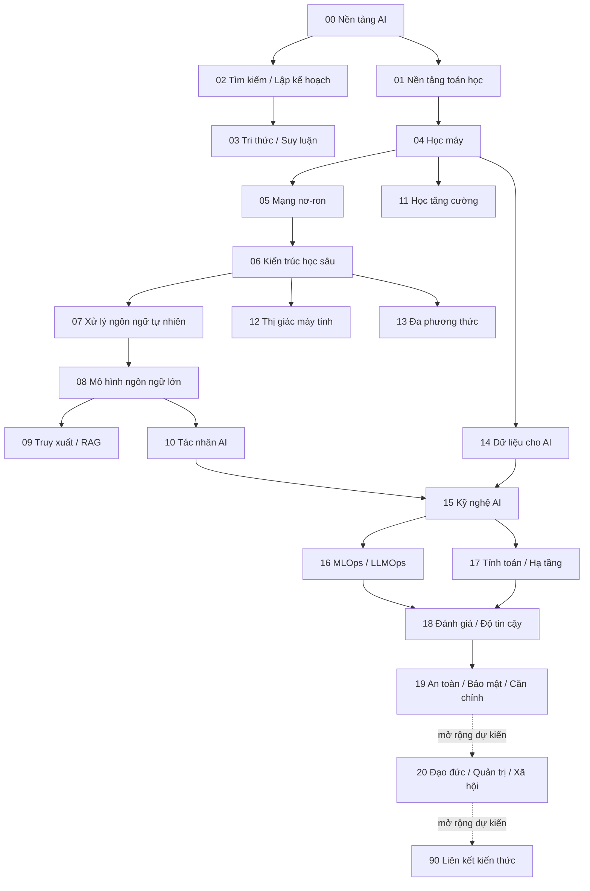

# Thư viện kiến thức Trí tuệ nhân tạo (Artificial Intelligence Knowledge Library)

> **Trí tuệ nhân tạo (Artificial Intelligence - AI / 인공지능)** là lĩnh vực nghiên cứu các hệ thống có thể biểu diễn thông tin, suy luận, học từ dữ liệu, dự đoán, lập kế hoạch, ra quyết định và hành động để đạt mục tiêu.

Thư viện này được tổ chức theo **quan hệ phụ thuộc khái niệm (conceptual dependency)**, không theo kiểu “Cơ bản → Trung cấp → Nâng cao”. Mỗi lớp kiến thức đi theo mạch: **bài toán → cơ chế → giả định → ví dụ → giới hạn → liên kết hệ thống**.

## Sơ đồ lộ trình học



`20_ethics_governance_and_society/` và `90_connections/` trong sơ đồ trên là **phần mở rộng dự kiến**, chưa tồn tại trong branch hiện tại. Tuyến production hiện được hoàn thiện và audit tới `19_ai_safety_security_alignment/`.

## Tuyến ưu tiên LLM / Agent cho hệ thống production

Tuyến dưới đây đã được ưu tiên theo dependency và được audit trước khi chuyển trọng tâm sang các nhánh khác:

```text
Transformer
→ LLM
→ Retrieval
→ Vector Search
→ RAG
→ Tool Calling
→ Agents
→ Evaluation
→ AI Engineering
→ LLMOps
→ Reliability
→ Security
```

Các điểm nối tương ứng trong repository:

```text
06_deep_learning_architectures/05_transformer.md
→ 08_large_language_models/
→ 09_retrieval_and_rag/00_information_retrieval_foundations.md
→ 09_retrieval_and_rag/03_vector_search.md
→ 09_retrieval_and_rag/05_rag_fundamentals.md
→ 10_agents_and_ai_systems/01_tools_and_function_calling.md
→ 10_agents_and_ai_systems/
→ 18_evaluation_reliability_interpretability/
→ 15_ai_engineering/
→ 16_mlops_and_llmops/
→ 18_evaluation_reliability_interpretability/07_reliability_engineering.md
→ 19_ai_safety_security_alignment/
```

Mỗi batch trên tuyến này phải kiểm tra đủ:

```text
prerequisite
mechanism
mathematical intuition nếu cần
implementation model
trade-off
failure mode
production usage
internal links
```

Nếu một file là skeleton hoặc chỉ mới có outline, file đó phải được hoàn thiện trước khi mở rộng sang domain khác. Nếu file đã đủ sâu, ưu tiên audit dependency và internal links thay vì viết lại chỉ để tạo diff.

## Cấu trúc hiện tại

```text
00_foundations/                              ✅ hoàn chỉnh
01_mathematical_foundations/                 ✅ hoàn chỉnh
02_search_reasoning_and_planning/            ✅ hoàn chỉnh
03_knowledge_and_reasoning/                  ✅ hoàn chỉnh
04_machine_learning/                         ✅ hoàn chỉnh
05_neural_networks/                          ✅ hoàn chỉnh
06_deep_learning_architectures/              ✅ hoàn chỉnh
07_natural_language_processing/              ✅ hoàn chỉnh
08_large_language_models/                    ✅ hoàn chỉnh
09_retrieval_and_rag/                        ✅ hoàn chỉnh
10_agents_and_ai_systems/                    ✅ hoàn chỉnh
11_reinforcement_learning/                   ✅ hoàn chỉnh
12_computer_vision/                          ✅ hoàn chỉnh
13_speech_audio_and_multimodal/              ✅ hoàn chỉnh
14_data_for_ai/                              ✅ hoàn chỉnh
15_ai_engineering/                           ✅ hoàn chỉnh
16_mlops_and_llmops/                         ✅ hoàn chỉnh
17_ai_compute_and_infrastructure/            ✅ hoàn chỉnh
18_evaluation_reliability_interpretability/  ✅ hoàn chỉnh
19_ai_safety_security_alignment/             ✅ hoàn chỉnh
20_ethics_governance_and_society/            ⏳ roadmap, chưa có trong branch
90_connections/                              ⏳ roadmap, chưa có trong branch
```

Tên thư mục và tên file vẫn giữ tiếng Anh để ổn định đường dẫn, liên kết và khả năng tra cứu. **Nội dung giải thích bên trong ưu tiên tiếng Việt**, còn thuật ngữ tiếng Anh được giữ trong ngoặc khi hữu ích cho việc học và tra cứu tài liệu quốc tế.

## Mô hình tư duy xuyên suốt (mental model)

```text
Môi trường
→ Dữ liệu / Quan sát
→ Biểu diễn
→ Mô hình / Tri thức
→ Suy luận / Học / Tìm kiếm
→ Quyết định / Hành động
→ Phản hồi
```

Một hệ thống AI vận hành thực tế còn thêm truy xuất, công cụ, bộ nhớ, trạng thái, xác minh, phục vụ mô hình, khả năng quan sát, quản lý vòng đời, hạ tầng, ranh giới bảo mật và quản trị xung quanh mô hình.

## Những ranh giới khái niệm quan trọng

```text
AI                         ≠ Học máy
LLM                        ≠ RAG
RAG                        ≠ Tác nhân
Tác nhân                   ≠ Luồng công việc
Bộ nhớ                     ≠ Cửa sổ ngữ cảnh
Phần thưởng                ≠ Mục tiêu thật
Tập dữ liệu                ≠ Thực tế
Lời nhắc                   ≠ Ranh giới bảo mật
Xác suất của mô hình       ≠ Xác suất một mệnh đề là sự thật
Triển khai (deployment)    ≠ Phục vụ mô hình (serving)
Trôi dữ liệu (data drift)  ≠ Mô hình chắc chắn bị lỗi
FLOPs đỉnh                 ≠ Hiệu năng thực tế
Điểm benchmark             ≠ Chất lượng production
Độ chính xác               ≠ Hiệu chuẩn (calibration)
Lời giải thích             ≠ Sự thật nhân quả
Độ bền vững                ≠ Bảo mật
An toàn                    ≠ Bảo mật
Bảo mật                    ≠ Căn chỉnh
Căn chỉnh                  ≠ Tuân lệnh tuyệt đối
Từ chối của mô hình        ≠ Phân quyền
Checkpoint                 ≠ Artifact đáng tin mặc định
HTTP 200                   ≠ Nhiệm vụ đã thành công
```

## Quy ước ngôn ngữ và thuật ngữ

Phần giải thích phải dùng tiếng Việt làm ngôn ngữ chính. Khi một thuật ngữ quan trọng xuất hiện lần đầu, ưu tiên dạng:

```text
câu hỏi (question)
mô hình (model)
biểu diễn (representation)
hàm mất mát (loss function)
khả năng khái quát hóa (generalization)
truy xuất (retrieval)
tác nhân (agent)
```

Sau khi thuật ngữ đã được giới thiệu, phần còn lại ưu tiên dùng tiếng Việt để câu văn liền mạch. Không viết cả một câu tiếng Anh rồi dịch lại nguyên câu. Với câu hoặc cụm dài, chỉ viết phiên bản tiếng Việt và giữ những từ khóa kỹ thuật thật sự cần thiết trong ngoặc.

Các tên chuẩn, chữ viết tắt, tên thuật toán, API, framework và ký hiệu toán học như `LLM`, `RAG`, `CNN`, `PPO`, `AdamW`, `LoRA`, `A*`, `BM25`, `HNSW`, `PyTorch` được giữ nguyên khi việc dịch làm giảm khả năng tra cứu hoặc gây sai nghĩa.

## Nguyên tắc học

Không học framework trước cơ chế. Framework, nhà cung cấp, họ mô hình và thế hệ phần cứng thay đổi nhanh; còn xác suất, biểu diễn, attention, truy xuất, trạng thái, truy vết nguồn gốc, giao tiếp phân tán, đánh giá, căn chỉnh, phân quyền và ranh giới bảo mật là những khái niệm bền vững hơn.

Mục tiêu của library là giúp người đọc hiểu **vì sao một cơ chế tồn tại, nó giải quyết vấn đề gì, hoạt động như thế nào, giả định điều gì và thất bại ở đâu**, thay vì chỉ ghi nhớ tên công nghệ.