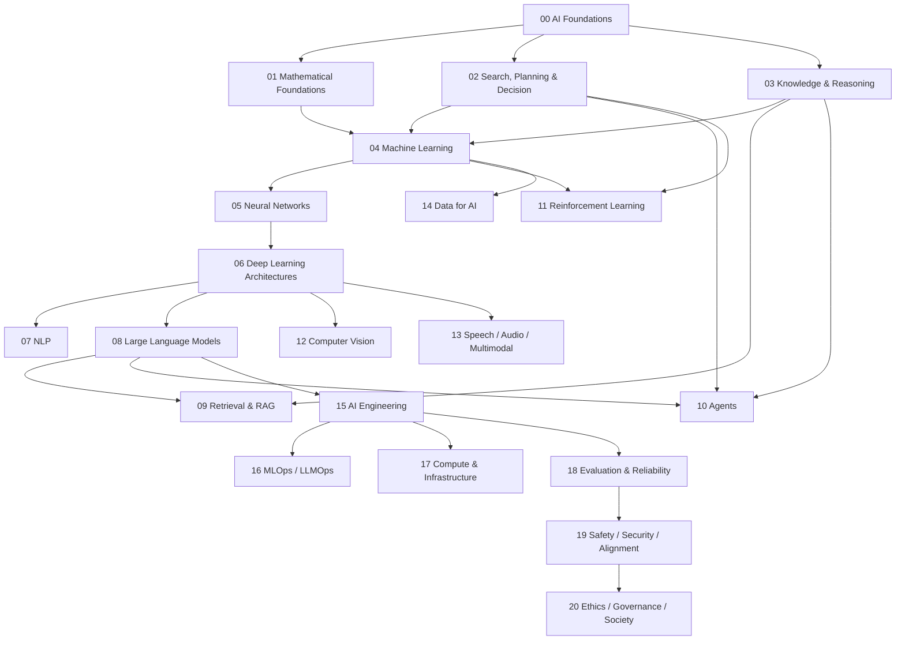

# Artificial Intelligence Knowledge Library

> **Artificial Intelligence (AI / Trí tuệ nhân tạo / 인공지능)** không chỉ là ChatGPT, Large Language Model hay Machine Learning. Đây là lĩnh vực nghiên cứu cách xây dựng những hệ thống có thể **biểu diễn thông tin, suy luận, học từ dữ liệu, dự đoán, lập kế hoạch, ra quyết định và hành động** trong một môi trường để đạt mục tiêu.

Library được tổ chức theo **conceptual dependency** thay vì Beginner → Intermediate → Advanced. Mỗi chapter giải thích từ problem/phenomenon tới mechanism, assumptions, limitations, examples và connections với Mathematics, Computer Science, Software Engineering và production AI.

## Reading graph



## Mental model xuyên suốt

```text
Environment / Problem
        ↓
Observation / Data
        ↓
Representation
        ↓
Model / Knowledge
        ↓
Inference / Learning / Search
        ↓
Decision / Prediction
        ↓
Action / Output
        ↓
Feedback
```

Không phải system nào cũng có đủ mọi bước. Mental model này giúp nối Classical AI, Machine Learning, Reinforcement Learning, LLM, RAG và Agents thành một knowledge graph thay vì collection buzzwords.

## Structure

```text
02_artificial_intelligence/
├── README.md
├── 00_foundations/
│   ├── 00_what_is_artificial_intelligence.md
│   ├── 01_history_and_ai_paradigms.md
│   ├── 02_intelligence_agents_and_environments.md
│   ├── 03_problem_representation.md
│   ├── 04_ai_system_architecture.md
│   └── 05_ai_vs_ml_vs_dl_vs_generative_ai.md
├── 01_mathematical_foundations/
│   ├── README.md
│   ├── 00_mathematics_for_ai.md
│   ├── 01_linear_algebra_for_ai.md
│   ├── 02_probability_for_ai.md
│   ├── 03_statistics_for_ai.md
│   ├── 04_calculus_for_ai.md
│   ├── 05_information_theory.md
│   ├── 06_optimization.md
│   └── 07_numerical_computation.md
├── 02_search_reasoning_and_planning/
│   ├── README.md
│   ├── 00_state_space_and_search.md
│   ├── 01_uninformed_search.md
│   ├── 02_heuristic_search.md
│   ├── 03_adversarial_search_and_games.md
│   ├── 04_constraint_satisfaction.md
│   ├── 05_planning.md
│   └── 06_decision_making_under_uncertainty.md
├── 03_knowledge_and_reasoning/
│   ├── README.md
│   ├── 00_knowledge_representation.md
│   ├── 01_propositional_logic.md
│   ├── 02_first_order_logic.md
│   ├── 03_inference_and_reasoning.md
│   ├── 04_probabilistic_reasoning.md
│   ├── 05_bayesian_networks.md
│   ├── 06_knowledge_graphs.md
│   └── 07_symbolic_neurosymbolic_ai.md
├── 04_machine_learning/                       # next
├── 05_neural_networks/                        # planned
├── 06_deep_learning_architectures/            # planned
├── 07_natural_language_processing/            # planned
├── 08_large_language_models/                  # planned
├── 09_retrieval_and_rag/                      # planned
├── 10_agents_and_ai_systems/                  # planned
├── 11_reinforcement_learning/                 # planned
├── 12_computer_vision/                        # planned
├── 13_speech_audio_and_multimodal/            # planned
├── 14_data_for_ai/                            # planned
├── 15_ai_engineering/                         # planned
├── 16_mlops_and_llmops/                       # planned
├── 17_ai_compute_and_infrastructure/          # planned
├── 18_evaluation_reliability_interpretability/ # planned
├── 19_ai_safety_security_alignment/           # planned
├── 20_ethics_governance_and_society/          # planned
└── 90_connections/                            # planned
```

## 00 — Foundations

Foundation layer xây vocabulary chung: intelligence/capabilities, historical paradigms, agents/environments, representation, AI-system architecture và taxonomy AI ↔ ML ↔ DL ↔ Generative AI.

Bắt đầu: [What is Artificial Intelligence?](./00_foundations/00_what_is_artificial_intelligence.md).

## 01 — Mathematical Foundations

Layer toán gồm Linear Algebra, Probability, Statistics, Calculus, Information Theory, Optimization và Numerical Computation. Nó nối trực tiếp tới embeddings, attention, cross-entropy, backpropagation, AdamW, LoRA, mixed precision và quantization.

Bắt đầu: [Mathematical Foundations](./01_mathematical_foundations/README.md).

## 02 — Search, Planning and Decision

Layer này đi từ state-space search tới BFS/DFS/UCS, A*, game search, CSP/SAT, formal planning và decision making under uncertainty với MDP/POMDP/bandits. Các concepts này sẽ được reuse trong modern Agents và Reinforcement Learning.

Bắt đầu: [Search, Reasoning and Planning](./02_search_reasoning_and_planning/README.md).

## 03 — Knowledge Representation and Reasoning

Layer này giải thích cách AI biểu diễn facts/relations/rules, dùng Propositional/FOL logic, suy luận deductive/inductive/abductive, reasoning dưới uncertainty bằng probability/Bayesian Networks, tổ chức tri thức bằng Knowledge Graph và kết hợp symbolic mechanisms với neural models.

Một distinction xuyên suốt:

> **Formal inference có thể đúng tuyệt đối relative to premises, trong khi premises/representation vẫn có thể sai hoặc thiếu so với real world.**

Bắt đầu: [Knowledge Representation and Reasoning](./03_knowledge_and_reasoning/README.md).

## Những câu hỏi library ưu tiên

Library không học AI như collection framework. Nó tập trung vào các questions bền vững: problem được biểu diễn thành state/vector/distribution ra sao; search space nổ như thế nào; knowledge và inference khác statistical learning ở đâu; learning có thể generalize từ finite data vì sao; loss/gradient mang ý nghĩa gì; attention hoạt động vì sao; LLM lưu statistical structure gì trong parameters; retrieval bổ sung external knowledge ra sao; agent khác workflow ở đâu; và production AI vì sao là bài toán software + data + model + infrastructure.

## Terminology convention

Thuật ngữ quan trọng giữ **English term**, giải thích bằng tiếng Việt và thêm **한국어 용어** khi hữu ích trong môi trường học tập/công việc Hàn Quốc, ví dụ `inference (추론 / suy luận)`, `training (학습 / huấn luyện)`, `heuristic (휴리스틱)`, `loss function (손실 함수)`, `embedding (임베딩)`, `knowledge graph (지식 그래프)`.

## Nguyên tắc triển khai

Không tạo hàng loạt placeholder chỉ để đủ taxonomy. Một folder chỉ được coi là bắt đầu khi có chapter có thể đọc độc lập. Connections như `attention ↔ linear algebra`, `cross-entropy ↔ information theory`, `agent ↔ planning/MDP`, `RAG ↔ information retrieval/KG`, `LLMOps ↔ distributed systems` được giải thích tại nơi chúng thật sự cần thiết.

## Trạng thái hiện tại

Đã hoàn thiện bốn layers đầu: **Foundations**, **Mathematical Foundations**, **Search/Planning/Decision**, và **Knowledge Representation/Reasoning**. Dependency tiếp theo là `04_machine_learning/`, nơi statistical learning sẽ được xây từ learning problem, inductive bias, data/splits, loss/risk và generalization trước khi đi vào từng algorithm.