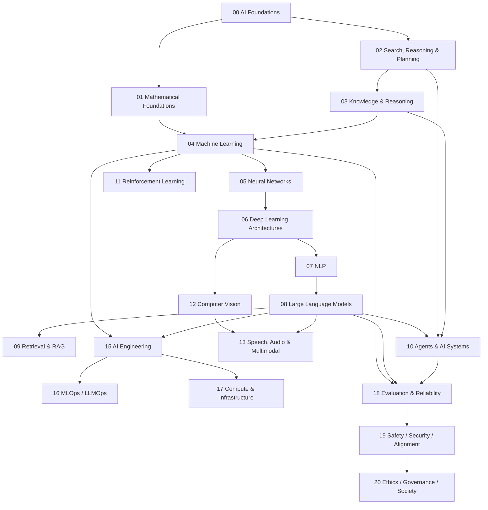

# Artificial Intelligence Knowledge Library

> **Artificial Intelligence (AI / Trí tuệ nhân tạo / 인공지능)** không chỉ là ChatGPT, Large Language Model hay Machine Learning. Đây là lĩnh vực nghiên cứu cách xây dựng những hệ thống có thể **biểu diễn thông tin, suy luận, học từ dữ liệu, dự đoán, lập kế hoạch, ra quyết định và hành động** trong một môi trường để đạt mục tiêu.

Library này được tổ chức theo **conceptual dependency** thay vì Beginner → Intermediate → Advanced. Mỗi chapter là một textbook-like topic: bắt đầu từ vấn đề khiến concept cần tồn tại, giải thích mechanism và mathematics cần thiết, sau đó nối sang những concept khác trong AI, Computer Science và production systems.

## Cách đọc library

Không cần học mọi folder theo thứ tự tuyệt đối, nhưng một số dependency là thật. Muốn hiểu Transformer sâu cần vector/matrix, probability, calculus, optimization và neural network; muốn hiểu RAG cần language model, embeddings và information retrieval; muốn hiểu Agent cần nối classical agent, planning, state, uncertainty, tool use và feedback loop.



## Mental model xuyên suốt

Một AI system có thể được nhìn như một chuỗi biến đổi:

```text
Environment / Problem
        ↓
Observation / Data
        ↓
Representation
        ↓
Model / Knowledge
        ↓
Inference / Learning / Search
        ↓
Decision / Prediction
        ↓
Action / Output
        ↓
Feedback
```

Không phải system nào cũng có đủ mọi block. Classifier có thể chỉ `input → prediction`; reinforcement-learning agent có closed feedback loop; LLM application có thể thêm retrieval, tools, memory, orchestration và validation. Mental model này giúp nối các nhánh AI tưởng như rời rạc thành một knowledge graph thống nhất.

## Structure và trạng thái

```text
02_artificial_intelligence/
├── README.md
├── 00_foundations/                          ✅ complete foundation layer
│   ├── 00_what_is_artificial_intelligence.md
│   ├── 01_history_and_ai_paradigms.md
│   ├── 02_intelligence_agents_and_environments.md
│   ├── 03_problem_representation.md
│   ├── 04_ai_system_architecture.md
│   └── 05_ai_vs_ml_vs_dl_vs_generative_ai.md
│
├── 01_mathematical_foundations/             ✅ complete
│   ├── 00_mathematics_for_ai.md
│   ├── 01_linear_algebra_for_ai.md
│   ├── 02_probability_for_ai.md
│   ├── 03_statistics_for_ai.md
│   ├── 04_calculus_for_ai.md
│   ├── 05_information_theory.md
│   ├── 06_optimization.md
│   └── 07_numerical_computation.md
│
├── 02_search_reasoning_and_planning/        ✅ complete
│   ├── 00_state_space_and_search.md
│   ├── 01_uninformed_search.md
│   ├── 02_heuristic_search.md
│   ├── 03_adversarial_search_and_games.md
│   ├── 04_constraint_satisfaction.md
│   ├── 05_planning.md
│   ├── 06_decision_making_under_uncertainty.md
│   └── README.md
│
├── 03_knowledge_and_reasoning/               ✅ complete
│   ├── 00_knowledge_representation.md
│   ├── 01_propositional_logic.md
│   ├── 02_first_order_logic.md
│   ├── 03_inference_and_reasoning.md
│   ├── 04_probabilistic_reasoning.md
│   ├── 05_bayesian_networks.md
│   ├── 06_knowledge_graphs.md
│   ├── 07_symbolic_neurosymbolic_ai.md
│   └── README.md
│
├── 04_machine_learning/                     ✅ complete
│   ├── 00_what_is_machine_learning.md
│   ├── 01_learning_problem_and_inductive_bias.md
│   ├── 02_data_features_and_labels.md
│   ├── 03_training_validation_and_testing.md
│   ├── 04_loss_objective_and_risk.md
│   ├── 05_linear_regression.md
│   ├── 06_logistic_regression.md
│   ├── 07_knn_and_distance_based_learning.md
│   ├── 08_decision_trees.md
│   ├── 09_ensemble_learning.md
│   ├── 10_support_vector_machines.md
│   ├── 11_clustering.md
│   ├── 12_dimensionality_reduction.md
│   ├── 13_anomaly_detection.md
│   ├── 14_bias_variance_and_generalization.md
│   ├── 15_model_evaluation.md
│   └── README.md
│
├── 05_neural_networks/                      ⏭ next
├── 06_deep_learning_architectures/          planned
├── 07_natural_language_processing/          planned
├── 08_large_language_models/                planned
├── 09_retrieval_and_rag/                    planned
├── 10_agents_and_ai_systems/                planned
├── 11_reinforcement_learning/               planned
├── 12_computer_vision/                      planned
├── 13_speech_audio_and_multimodal/          planned
├── 14_data_for_ai/                          planned
├── 15_ai_engineering/                       planned
├── 16_mlops_and_llmops/                     planned
├── 17_ai_compute_and_infrastructure/        planned
├── 18_evaluation_reliability_interpretability/ planned
├── 19_ai_safety_security_alignment/         planned
├── 20_ethics_governance_and_society/        planned
└── 90_connections/                          planned
```

## Reading path đã hoàn thành tới Machine Learning

Hiện có thể đọc liên tục theo flow:

```text
AI là gì
→ Agent / Environment
→ Problem Representation
→ AI System Architecture
→ Mathematics for AI
→ Search / Heuristic / Planning / MDP
→ Logic / Knowledge / Bayesian Reasoning / Knowledge Graph
→ Machine Learning problem formulation
→ Data / Labels / Leakage
→ Train / Validation / Test
→ Loss / Risk
→ Classical supervised & unsupervised model families
→ Generalization
→ Evaluation
```

Flow này cố tình đưa classical AI, probability và knowledge representation vào trước neural/LLM layer. Nhờ vậy LLM/Agent sau này không bị học như một collection API hoặc prompt tricks.

## Những câu hỏi cốt lõi library trả lời

Library tập trung vào các câu hỏi bền vững hơn framework: một problem được biến thành state/vector/distribution như thế nào; một algorithm đang search cái gì; model học từ finite data nhờ assumptions nào; loss đang encode loại error nào; probability output có nghĩa gì; representation geometry ảnh hưởng retrieval/clustering ra sao; generalization khác memorization ở đâu; evaluation nào phản ánh deployment; knowledge được lưu trong rules, graph, parameters hoặc external database khác nhau thế nào; và production AI cần những components ngoài model nào.

Khi tới Deep Learning/LLM, các câu hỏi đó tiếp tục ở scale lớn hơn chứ không bị thay thế.

## Terminology convention

Thuật ngữ quan trọng giữ English term, giải thích bằng tiếng Việt và thêm **한국어 용어** khi hữu ích trong môi trường Hàn Quốc. Ví dụ: `inference (추론 / suy luận)`, `training (학습 / huấn luyện)`, `loss function (손실 함수 / hàm mất mát)`, `embedding (임베딩 / biểu diễn vector)`, `generalization (일반화 / khái quát hóa)`.

## Nguyên tắc nội dung

Mỗi chapter ưu tiên:

```text
Problem / phenomenon
→ representation
→ mechanism
→ mathematics / algorithm
→ assumptions
→ examples
→ failure modes / limitations
→ production implications
→ connections
```

Công thức không được đưa như thứ phải học thuộc. Các model không được xếp hạng theo “mạnh/yếu” chung chung; chúng được so qua inductive bias, data regime, objective, compute và deployment constraint.

## Bước tiếp theo

Layer tiếp theo là **`05_neural_networks/`**. Nó sẽ bắt đầu từ câu hỏi vì sao composition của linear transformations cần nonlinearity, sau đó đi qua neuron/perceptron/MLP, activation, forward pass, computational graph, backpropagation, optimizers, initialization, normalization, regularization, representation learning và training dynamics. Các concept này sẽ tái sử dụng trực tiếp Calculus, Optimization và generalization đã xây ở các folder trước.