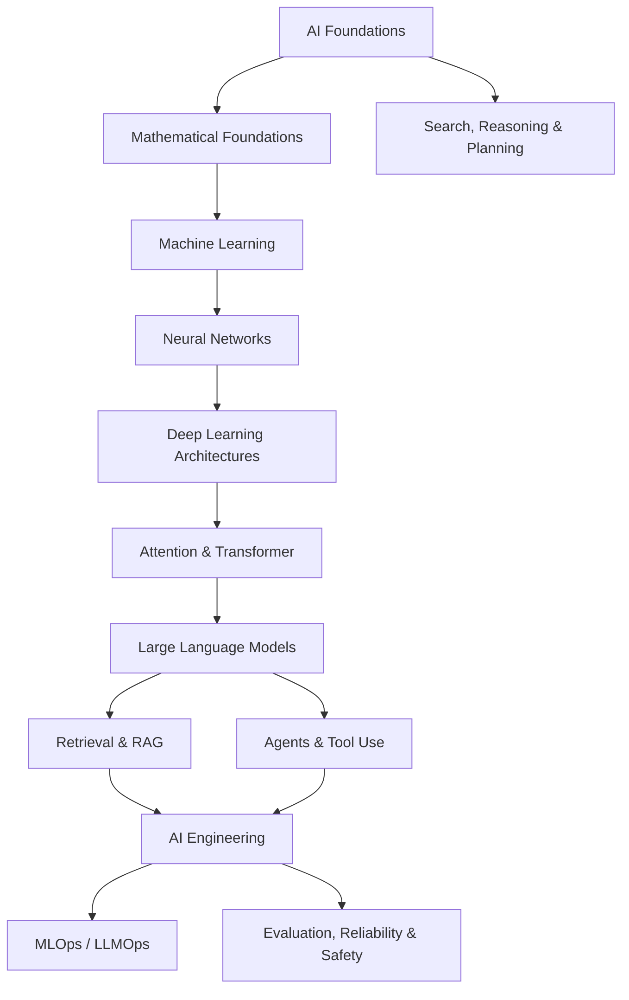

# Artificial Intelligence Knowledge Library

> **Artificial Intelligence (AI / Trí tuệ nhân tạo / 인공지능)** không chỉ là ChatGPT, Large Language Model hay Machine Learning. Đây là lĩnh vực nghiên cứu cách xây dựng những hệ thống có thể **biểu diễn thông tin, suy luận, học từ dữ liệu, dự đoán, lập kế hoạch, ra quyết định và hành động** trong một môi trường để đạt mục tiêu.

Library này được tổ chức theo **conceptual dependency** thay vì Beginner → Intermediate → Advanced. Mỗi chapter cố gắng trả lời một câu hỏi nền tảng, giải thích từ bản chất, sau đó kết nối sang Mathematics, Computer Science, Software Engineering và các hệ thống AI hiện đại.

## Cách đọc library

Không cần học mọi folder theo thứ tự tuyệt đối. Tuy nhiên, một số dependency là thật: muốn hiểu vì sao Transformer hoạt động thì cần hiểu vector, matrix, probability, optimization và neural network; muốn hiểu RAG đúng bản chất thì cần hiểu information retrieval, embedding và language model; muốn hiểu Agent thì cần nối classical agent, planning, state, tool use và feedback loop.

Một reading path trung tâm được khuyến nghị là:



## Mental model xuyên suốt

Một AI system có thể được nhìn như một chuỗi biến đổi:

```text
Environment / Problem
        ↓
Observation / Data
        ↓
Representation
        ↓
Model / Knowledge
        ↓
Inference / Learning / Search
        ↓
Decision / Prediction
        ↓
Action / Output
        ↓
Feedback
```

Không phải system nào cũng có đủ mọi bước. Một classifier có thể chỉ nhận input và trả prediction. Một reinforcement-learning agent có feedback trực tiếp từ environment. Một LLM application có thể thêm retrieval, tools, memory và orchestration. Tuy vậy mental model này giúp nối các nhánh AI tưởng như rời rạc thành một hệ thống chung.

## Structure

```text
02_artificial_intelligence/
├── README.md
├── 00_foundations/
│   ├── 00_what_is_artificial_intelligence.md
│   ├── 01_history_and_ai_paradigms.md
│   ├── 02_intelligence_agents_and_environments.md
│   ├── 03_problem_representation.md
│   ├── 04_ai_system_architecture.md
│   └── 05_ai_vs_ml_vs_dl_vs_generative_ai.md
├── 01_mathematical_foundations/
│   └── 00_mathematics_for_ai.md
├── 02_search_reasoning_and_planning/        # planned
├── 03_knowledge_and_reasoning/               # planned
├── 04_machine_learning/                      # planned
├── 05_neural_networks/                       # planned
├── 06_deep_learning_architectures/           # planned
├── 07_natural_language_processing/           # planned
├── 08_large_language_models/                 # planned
├── 09_retrieval_and_rag/                     # planned
├── 10_agents_and_ai_systems/                 # planned
├── 11_reinforcement_learning/                 # planned
├── 12_computer_vision/                        # planned
├── 13_speech_audio_and_multimodal/            # planned
├── 14_data_for_ai/                            # planned
├── 15_ai_engineering/                         # planned
├── 16_mlops_and_llmops/                       # planned
├── 17_ai_compute_and_infrastructure/          # planned
├── 18_evaluation_reliability_interpretability/ # planned
├── 19_ai_safety_security_alignment/           # planned
├── 20_ethics_governance_and_society/          # planned
└── 90_connections/                            # planned
```

## Những câu hỏi cốt lõi library sẽ trả lời

AI không nên được học như một collection framework. Library này tập trung vào các câu hỏi bền vững hơn: một problem được biểu diễn thành state, vector hay probability distribution như thế nào; tại sao learning có thể xảy ra từ finite data; loss function đang đo điều gì; gradient thực sự mang thông tin gì; representation learning khác feature engineering ra sao; attention giải quyết limitation nào của sequence models; một LLM “biết” gì trong parameters và “không biết” gì; embedding space mang nghĩa gì; retrieval bổ sung knowledge cho model ra sao; agent khác workflow ở đâu; vì sao evaluation AI khó hơn unit test truyền thống; và tại sao production AI là bài toán software + data + model + infrastructure chứ không chỉ là model.

## Terminology convention

Khi một thuật ngữ quan trọng xuất hiện lần đầu, chapter sẽ ưu tiên giữ **English term**, giải thích bằng tiếng Việt và thêm **한국어 용어** nếu thuật ngữ thường gặp trong môi trường học tập hoặc công việc tại Hàn Quốc. Ví dụ: `inference (추론 / suy luận)`, `training (학습 / huấn luyện)`, `loss function (손실 함수 / hàm mất mát)`, `embedding (임베딩 / biểu diễn vector)`.

## Trạng thái hiện tại

Foundation layer đã bắt đầu với các chapter trong `00_foundations/` và bản đồ toán học trong `01_mathematical_foundations/00_mathematics_for_ai.md`. Các folder tiếp theo sẽ được bổ sung theo dependency thay vì tạo hàng loạt file rỗng.