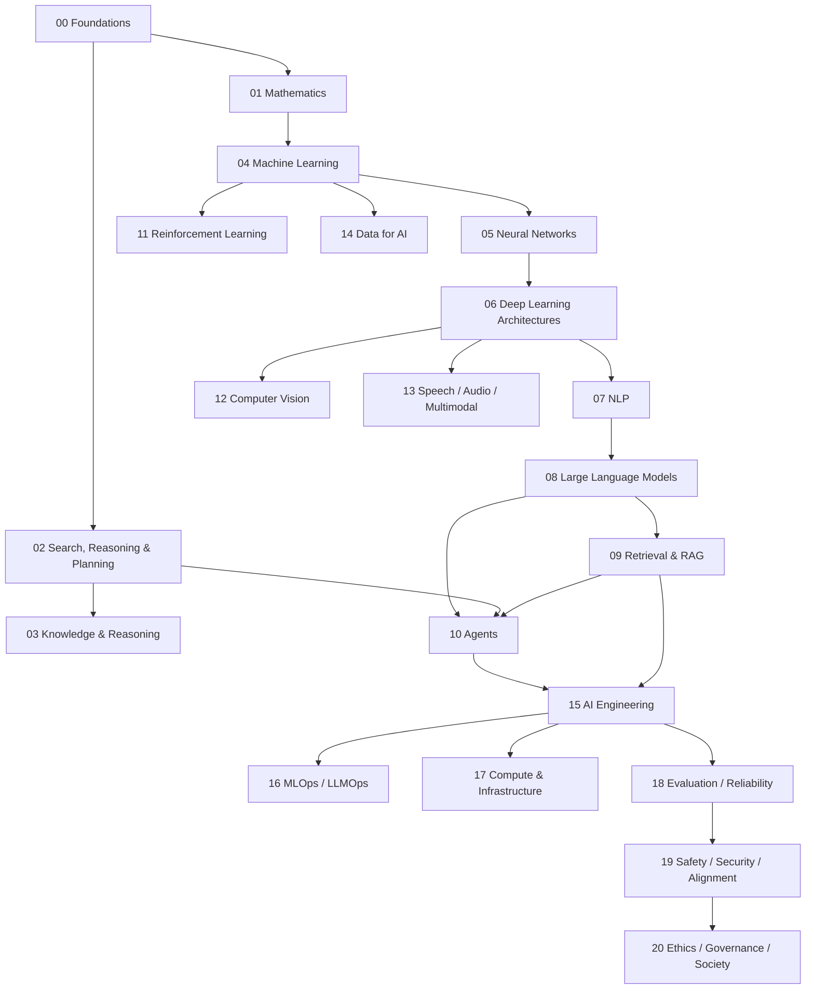

# Artificial Intelligence Knowledge Library

> **Artificial Intelligence (AI / Trí tuệ nhân tạo / 인공지능)** không chỉ là ChatGPT, Large Language Model hay Machine Learning. Đây là lĩnh vực nghiên cứu cách xây dựng những hệ thống có thể **biểu diễn thông tin, suy luận, học từ dữ liệu, dự đoán, lập kế hoạch, ra quyết định và hành động** trong một môi trường để đạt mục tiêu.

Library này được tổ chức theo **conceptual dependency** thay vì Beginner → Intermediate → Advanced. Mỗi chapter cố gắng trả lời một câu hỏi nền tảng, giải thích từ bản chất, sau đó kết nối sang Mathematics, Computer Science, Software Engineering và các hệ thống AI hiện đại.

## Reading Graph



## Mental model xuyên suốt

```text
Environment / Problem
        ↓
Observation / Data
        ↓
Representation
        ↓
Model / Knowledge
        ↓
Inference / Learning / Search
        ↓
Decision / Prediction
        ↓
Action / Output
        ↓
Feedback
```

Modern AI application thường thêm external retrieval, tools, memory, verification và observability quanh model. Vì vậy library phân biệt rõ **model** và **system**.

## Current Structure

```text
02_artificial_intelligence/
├── 00_foundations/                         ✅ complete
├── 01_mathematical_foundations/            ✅ complete
├── 02_search_reasoning_and_planning/       ✅ complete
├── 03_knowledge_and_reasoning/              ✅ complete
├── 04_machine_learning/                    ✅ complete
├── 05_neural_networks/                     ✅ complete
├── 06_deep_learning_architectures/         ✅ complete
├── 07_natural_language_processing/         ✅ complete
├── 08_large_language_models/               ✅ complete
├── 09_retrieval_and_rag/                   ✅ complete
├── 10_agents_and_ai_systems/               ✅ complete
├── 11_reinforcement_learning/              ✅ complete
├── 12_computer_vision/                     ← next
├── 13_speech_audio_and_multimodal/
├── 14_data_for_ai/
├── 15_ai_engineering/
├── 16_mlops_and_llmops/
├── 17_ai_compute_and_infrastructure/
├── 18_evaluation_reliability_interpretability/
├── 19_ai_safety_security_alignment/
├── 20_ethics_governance_and_society/
└── 90_connections/
```

## Những distinction quan trọng

```text
AI                  ≠ Machine Learning
Machine Learning    ≠ Deep Learning
LLM                 ≠ RAG
RAG                 ≠ Agent
Agent               ≠ Workflow
Tool Calling        ≠ Agent
Memory              ≠ Context Window
State               ≠ Conversation Transcript
Reward              ≠ True Goal
State               ≠ Observation
RL                  ≠ RLHF
Prompt              ≠ Security Boundary
Model Probability   ≠ Truth Probability
Vector Similarity   ≠ Semantic Truth
Fine-tuning         ≠ Knowledge Database
Long Context        ≠ Persistent Memory
Model says “done”   ≠ Verified completion
```

## Terminology convention

Thuật ngữ quan trọng giữ English term, giải thích bằng tiếng Việt và thêm 한국어 용어 khi hữu ích trong môi trường Hàn Quốc, ví dụ `inference (추론 / suy luận)`, `training (학습 / huấn luyện)`, `embedding (임베딩 / biểu diễn vector)`, `retrieval (검색 / truy xuất)`, `agent (에이전트 / tác nhân)`, `reward (보상 / phần thưởng)`.

## Learning principle

Không học framework trước mechanism. PyTorch, Hugging Face, vector databases hoặc agent frameworks có thể thay đổi nhanh; các concept như probability, representation, attention, retrieval, state, planning, evaluation và security bền vững hơn.

Mỗi layer vì vậy đi từ problem → mechanism → assumptions → examples → limitations → system connections.