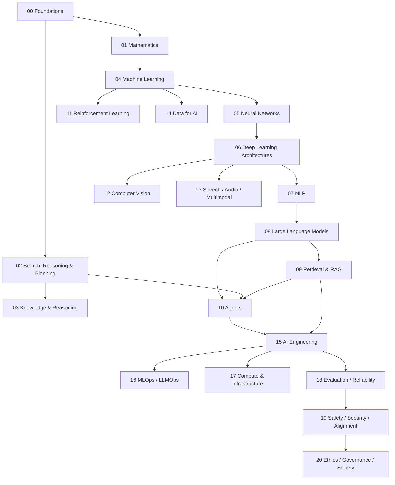

# Artificial Intelligence thư viện kiến thức (knowledge library / 지식 라이브러리)

> **Mạch đọc:** README này là owner của bản đồ AI. Hãy dùng đồ thị để thấy các prerequisite và nhánh phụ thuộc, rồi đọc mô hình tư duy để hiểu dữ liệu biến thành biểu diễn, suy luận, hành động và phản hồi như thế nào.

> **Artificial Intelligence (AI / Trí tuệ nhân tạo / 인공지능)** không chỉ là ChatGPT, Large ngôn ngữ (language / 언어) mô hình (model / 모델) hay Machine học tập (learning / 학습). Đây là lĩnh vực nghiên cứu cách xây dựng những hệ thống có thể **biểu diễn thông tin, suy luận, học từ dữ liệu, dự đoán, lập kế hoạch, ra quyết định và hành động** trong một môi trường để đạt mục tiêu.

Thư viện (library / 라이브러리) này được tổ chức theo **conceptual phụ thuộc (dependency / 의존성)** thay vì Beginner → Intermediate → Advanced. Mỗi chapter cố gắng trả lời một câu hỏi nền tảng, giải thích từ bản chất, sau đó kết nối sang Mathematics, Khoa học máy tính (computer science / 컴퓨터 과학), Kỹ nghệ phần mềm (software engineering / 소프트웨어 공학) và các hệ thống AI hiện đại.

## Reading đồ thị (graph / 그래프)


```mermaid
flowchart TD
    F[00 Foundations] --> M[01 Mathematics]
    F --> S[02 Search, Reasoning & Planning]
    S --> K[03 Knowledge & Reasoning]
    M --> ML[04 Machine Learning]
    ML --> NN[05 Neural Networks]
    NN --> DL[06 Deep Learning Architectures]
    DL --> NLP[07 NLP]
    NLP --> LLM[08 Large Language Models]
    LLM --> RAG[09 Retrieval & RAG]
    LLM --> AG[10 Agents]
    S --> AG
    RAG --> AG
    ML --> RL[11 Reinforcement Learning]
    DL --> CV[12 Computer Vision]
    DL --> MM[13 Speech / Audio / Multimodal]
    ML --> DATA[14 Data for AI]
    AG --> ENG[15 AI Engineering]
    RAG --> ENG
    ENG --> OPS[16 MLOps / LLMOps]
    ENG --> INFRA[17 Compute & Infrastructure]
    ENG --> EVAL[18 Evaluation / Reliability]
    EVAL --> SAFE[19 Safety / Security / Alignment]
    SAFE --> GOV[20 Ethics / Governance / Society]
```

> **Chuyển mạch:** Đồ thị cho biết các chapter đứng ở đâu; mô hình tư duy bên dưới giải thích điều chạy xuyên qua chúng: hệ thống nhận quan sát, tạo biểu diễn, suy luận rồi nhận phản hồi. Vì vậy, phần tiếp theo không lặp lại bản đồ mà đưa ra một cách đọc chung cho từng nhánh.

## Mô hình tư duy (mental model / 사고 모델) xuyên suốt

```text
Environment / Problem
        ↓
Observation / Data
        ↓
Representation
        ↓
Model / Knowledge
        ↓
Inference / Learning / Search
        ↓
Decision / Prediction
        ↓
Action / Output
        ↓
Feedback
```

Hiện đại (modern / 현대적) AI ứng dụng (application / 애플리케이션) thường thêm bên ngoài (external / 외부) retrieval, tools, bộ nhớ (memory / 메모리), xác minh (verification / 확인) và khả năng quan sát (observability / 관측 가능성) quanh mô hình (model / 모델). Vì vậy thư viện (library / 라이브러리) phân biệt rõ **mô hình (model / 모델)** và **hệ thống (system / 시스템)**.

> **Chuyển mạch:** Mô hình trên là tiêu chí đọc; cấu trúc thư mục tiếp theo cho biết tiêu chí đó đang được triển khai thành những owner nào trong repository.

## Hiện tại (current / 현재) cấu trúc (structure / 구조)

Các thư mục `00`–`20` hiện đều đã có nội dung canonical trong repository; không dùng marker cũ kiểu `← next` để suy ra section còn trống. Connection route xuyên các lớp AI hiện được đặt ở Computer Science Connections để tránh tạo một namespace AI thứ hai.

```text
02_artificial_intelligence/
├── 00_foundations/                         ✅ canonical
├── 01_mathematical_foundations/            ✅ canonical
├── 02_search_reasoning_and_planning/       ✅ canonical
├── 03_knowledge_and_reasoning/              ✅ canonical
├── 04_machine_learning/                    ✅ canonical
├── 05_neural_networks/                     ✅ canonical
├── 06_deep_learning_architectures/         ✅ canonical
├── 07_natural_language_processing/         ✅ canonical
├── 08_large_language_models/               ✅ canonical
├── 09_retrieval_and_rag/                   ✅ canonical
├── 10_agents_and_ai_systems/               ✅ canonical
├── 11_reinforcement_learning/              ✅ canonical
├── 12_computer_vision/                     ✅ canonical
├── 13_speech_audio_and_multimodal/         ✅ canonical
├── 14_data_for_ai/                         ✅ canonical
├── 15_ai_engineering/                      ✅ canonical
├── 16_mlops_and_llmops/                    ✅ canonical
├── 17_ai_compute_and_infrastructure/       ✅ canonical
├── 18_evaluation_reliability_interpretability/ ✅ canonical
├── 19_ai_safety_security_alignment/        ✅ canonical
└── 20_ethics_governance_and_society/       ✅ canonical
```

Tuyến xuyên tầng mới: [AI data → evaluation → provenance → production evidence](../90_connections/07_ai_data_evaluation_provenance_and_production_evidence.md). Route này nối Data for AI, MLOps/LLMOps, Evaluation/Reliability, Research Methods và production observability thành một evidence lifecycle duy nhất.

> **Chuyển mạch:** Cây thư mục cho biết nơi tìm nội dung, nhưng chưa cho biết các khái niệm dễ bị nhập làm một. Phần tiếp theo đặt các cặp đó cạnh nhau để người đọc biết ranh giới cần giữ.

## Những distinction quan trọng

```text
AI                  ≠ Machine Learning
Machine Learning    ≠ Deep Learning
LLM                 ≠ RAG
RAG                 ≠ Agent
Agent               ≠ Workflow
Tool Calling        ≠ Agent
Memory              ≠ Context Window
State               ≠ Conversation Transcript
Reward              ≠ True Goal
State               ≠ Observation
RL                  ≠ RLHF
Dataset             ≠ Reality
Label               ≠ Ground Truth by Definition
Available in DB     ≠ Available at Prediction Time
Synthetic Data      ≠ Privacy Guarantee
Classification      ≠ Detection
Detection           ≠ Segmentation
Image               ≠ Physical World
Speech              ≠ Text In Audio Form
Shared Embedding    ≠ Perfect Grounding
More Modalities     ≠ Better Answer
Prompt              ≠ Security Boundary
Model Probability   ≠ Truth Probability
Vector Similarity   ≠ Semantic Truth
Fine-tuning         ≠ Knowledge Database
Long Context        ≠ Persistent Memory
Model says “done”   ≠ Verified completion
Offline score       ≠ Production utility
Model version       ≠ Full AI system version
```

> **Chuyển mạch:** Sau khi phân biệt các cặp khái niệm, quy ước thuật ngữ giúp giữ cùng một nghĩa khi chúng xuất hiện ở nhiều chapter và nhiều ngôn ngữ.

## Terminology convention

Thuật ngữ quan trọng giữ English term, giải thích bằng tiếng Việt và thêm 한국어 용어 khi hữu ích trong môi trường Hàn Quốc, ví dụ `inference (추론 / suy luận)`, `training (학습 / huấn luyện)`, `embedding (임베딩 / biểu diễn vector)`, `retrieval (검색 / truy xuất)`, `agent (에이전트 / tác nhân)`, `reward (보상 / phần thưởng)`, `data leakage (데이터 누수 / rò rỉ dữ liệu)`, `data governance (데이터 거버넌스 / quản trị dữ liệu)`.

> **Chuyển mạch:** Quy ước tên gọi chỉ giải quyết khả năng tra cứu; nguyên tắc học tập tiếp theo nói rõ cách dùng bản đồ, prerequisite và ví dụ để hình thành hiểu biết thay vì chỉ ghi nhớ nhãn.

## Học tập (learning / 학습) principle

Không học khung phần mềm (framework / 프레임워크) trước cơ chế (mechanism / 메커니즘). PyTorch, Hugging Face, véc-tơ (vector / 벡터) databases hoặc tác nhân (agent / 에이전트) frameworks có thể thay đổi nhanh; các concept như xác suất (probability / 확률), biểu diễn (representation / 표현), attention, retrieval, trạng thái (state / 상태), planning, dữ liệu (data / 데이터) lineage, evaluation và bảo mật (security / 보안) bền vững hơn.

Mỗi tầng (layer / 계층) vì vậy đi từ bài toán (problem / 문제) → cơ chế (mechanism / 메커니즘) → các giả định (assumptions / 가정들) → examples → limitations → hệ thống (system / 시스템) connections.

> **Bàn giao:** Sau **học tập (learning / 학습) principle**, nếu đã học từng module riêng lẻ nhưng chưa thấy cách chúng nối thành release evidence, đọc [AI data → evaluation → provenance → production evidence](../90_connections/07_ai_data_evaluation_provenance_and_production_evidence.md).
