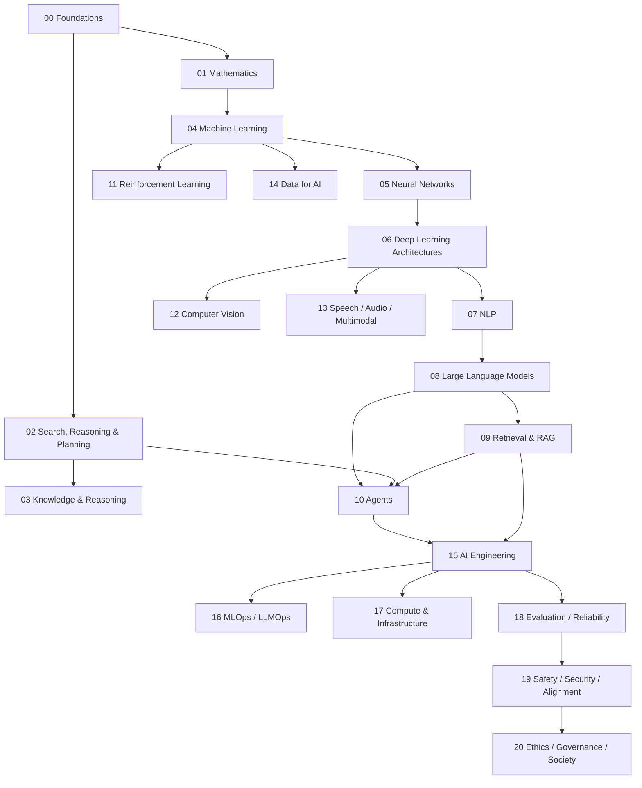

# Artificial Intelligence thư viện kiến thức (knowledge library / 지식 라이브러리)

> **Mạch đọc:** [README](./README.md) là bản đồ owner của **Artificial Intelligence thư viện kiến thức (knowledge library / 지식 라이브러리)**; nhìn vào vị trí đó trước để biết file này đang phục vụ nhánh kiến thức nào. **Reading đồ thị (graph / 그래프)** mở đối tượng chính của file và câu hỏi cần theo dõi; sau đó sang **Mô hình tư duy (mental model / 사고 모델) xuyên suốt** để rút ra mô hình chung và giới hạn. Mạch này dùng README làm bản đồ owner của toàn thư viện AI, rồi nối math, ML, language, knowledge, agents và systems.

> **Artificial Intelligence (AI / Trí tuệ nhân tạo / 인공지능)** không chỉ là ChatGPT, Large ngôn ngữ (language / 언어) mô hình (model / 모델) hay Machine học tập (learning / 학습). Đây là lĩnh vực nghiên cứu cách xây dựng những hệ thống có thể **biểu diễn thông tin, suy luận, học từ dữ liệu, dự đoán, lập kế hoạch, ra quyết định và hành động** trong một môi trường để đạt mục tiêu.

Thư viện (library / 라이브러리) này được tổ chức theo **conceptual phụ thuộc (dependency / 의존성)** thay vì Beginner → Intermediate → Advanced. Mỗi chapter cố gắng trả lời một câu hỏi nền tảng, giải thích từ bản chất, sau đó kết nối sang Mathematics, Khoa học máy tính (computer science / 컴퓨터 과학), Kỹ nghệ phần mềm (software engineering / 소프트웨어 공학) và các hệ thống AI hiện đại.

## Reading đồ thị (graph / 그래프)

Đồ thị đọc này cho biết AI đi từ biểu diễn và tối ưu tới mô hình, dữ liệu, hệ thống và an toàn. Hãy dùng nó để nhận ra chapter hiện tại đang dựa trên lớp nào và kết quả của nó được dùng ở đâu.


```mermaid
flowchart TD
    F[00 Foundations] --> M[01 Mathematics]
    F --> S[02 Search, Reasoning & Planning]
    S --> K[03 Knowledge & Reasoning]
    M --> ML[04 Machine Learning]
    ML --> NN[05 Neural Networks]
    NN --> DL[06 Deep Learning Architectures]
    DL --> NLP[07 NLP]
    NLP --> LLM[08 Large Language Models]
    LLM --> RAG[09 Retrieval & RAG]
    LLM --> AG[10 Agents]
    S --> AG
    RAG --> AG
    ML --> RL[11 Reinforcement Learning]
    DL --> CV[12 Computer Vision]
    DL --> MM[13 Speech / Audio / Multimodal]
    ML --> DATA[14 Data for AI]
    AG --> ENG[15 AI Engineering]
    RAG --> ENG
    ENG --> OPS[16 MLOps / LLMOps]
    ENG --> INFRA[17 Compute & Infrastructure]
    ENG --> EVAL[18 Evaluation / Reliability]
    EVAL --> SAFE[19 Safety / Security / Alignment]
    SAFE --> GOV[20 Ethics / Governance / Society]
```

> **Chuyển mạch:** Trong **Artificial Intelligence thư viện kiến thức (knowledge library / 지식 라이브러리)**, **Mô hình tư duy (mental model / 사고 모델) xuyên suốt** gom các mảnh từ **Reading đồ thị (graph / 그래프)** thành một kết luận có thể mang sang phần kế tiếp. Từ đây, **Hiện tại (current / 현재) cấu trúc (structure / 구조)** sẽ cho biết hệ quả hoặc giới hạn ấy hiện ra ở đâu.

## Mô hình tư duy (mental model / 사고 모델) xuyên suốt

Sau bản đồ dependency, phần này nén toàn bộ layer thành một chuỗi suy luận. Mục tiêu là nối dữ liệu, objective, model, evaluation và deployment thành một vòng lặp thay vì học từng thuật toán riêng lẻ.

```text
Environment / Problem
        ↓
Observation / Data
        ↓
Representation
        ↓
Model / Knowledge
        ↓
Inference / Learning / Search
        ↓
Decision / Prediction
        ↓
Action / Output
        ↓
Feedback
```

Hiện đại (modern / 현대적) AI ứng dụng (application / 애플리케이션) thường thêm bên ngoài (external / 외부) retrieval, tools, bộ nhớ (memory / 메모리), xác minh (verification / 확인) và khả năng quan sát (observability / 관측 가능성) quanh mô hình (model / 모델). Vì vậy thư viện (library / 라이브러리) phân biệt rõ **mô hình (model / 모델)** và **hệ thống (system / 시스템)**.

> **Chuyển mạch:** Ở chặng này của **Artificial Intelligence thư viện kiến thức (knowledge library / 지식 라이브러리)**, **Hiện tại (current / 현재) cấu trúc (structure / 구조)** gom các mảnh từ **Mô hình tư duy (mental model / 사고 모델) xuyên suốt** thành một kết luận có thể mang sang phần kế tiếp. Từ đây, **Những distinction quan trọng** sẽ cho biết hệ quả hoặc giới hạn ấy hiện ra ở đâu.

## Hiện tại (current / 현재) cấu trúc (structure / 구조)

Cấu trúc hiện tại đi từ foundations và mathematics tới model, retrieval, agents, engineering, operations và safety. Mỗi layer kế thừa assumption của layer trước, nên hãy kiểm tra dependency trước khi nhảy vào một công cụ cụ thể.

```text
02_artificial_intelligence/
├── 00_foundations/                         ✅ complete
├── 01_mathematical_foundations/            ✅ complete
├── 02_search_reasoning_and_planning/       ✅ complete
├── 03_knowledge_and_reasoning/              ✅ complete
├── 04_machine_learning/                    ✅ complete
├── 05_neural_networks/                     ✅ complete
├── 06_deep_learning_architectures/         ✅ complete
├── 07_natural_language_processing/         ✅ complete
├── 08_large_language_models/               ✅ complete
├── 09_retrieval_and_rag/                   ✅ complete
├── 10_agents_and_ai_systems/               ✅ complete
├── 11_reinforcement_learning/              ✅ complete
├── 12_computer_vision/                     ✅ complete
├── 13_speech_audio_and_multimodal/         ✅ complete
├── 14_data_for_ai/                         ✅ complete
├── 15_ai_engineering/                      ← next
├── 16_mlops_and_llmops/
├── 17_ai_compute_and_infrastructure/
├── 18_evaluation_reliability_interpretability/
├── 19_ai_safety_security_alignment/
├── 20_ethics_governance_and_society/
└── 90_connections/
```

> **Chuyển mạch:** **Hiện tại cấu trúc** cho biết các domain AI đang đứng ở đâu; **Những distinction quan trọng** tách khái niệm dễ lẫn trước khi **Terminology convention** khóa cách gọi dùng chung.

## Những distinction quan trọng

Các phân biệt dưới đây ngăn những từ gần nhau bị dùng lẫn: model với system, retrieval với reasoning, automation với agency và benchmark với reliability. Đọc từng cặp như một ranh giới thiết kế có hệ quả thực tế.

```text
AI                  ≠ Machine Learning
Machine Learning    ≠ Deep Learning
LLM                 ≠ RAG
RAG                 ≠ Agent
Agent               ≠ Workflow
Tool Calling        ≠ Agent
Memory              ≠ Context Window
State               ≠ Conversation Transcript
Reward              ≠ True Goal
State               ≠ Observation
RL                  ≠ RLHF
Dataset             ≠ Reality
Label               ≠ Ground Truth by Definition
Available in DB     ≠ Available at Prediction Time
Synthetic Data      ≠ Privacy Guarantee
Classification      ≠ Detection
Detection           ≠ Segmentation
Image               ≠ Physical World
Speech              ≠ Text In Audio Form
Shared Embedding    ≠ Perfect Grounding
More Modalities     ≠ Better Answer
Prompt              ≠ Security Boundary
Model Probability   ≠ Truth Probability
Vector Similarity   ≠ Semantic Truth
Fine-tuning         ≠ Knowledge Database
Long Context        ≠ Persistent Memory
Model says “done”   ≠ Verified completion
```

> **Chuyển mạch:** **Terminology convention** đóng vai trò vocabulary contract; từ đây người học quay về README của từng domain để đọc đúng owner và phạm vi.

## Terminology convention

Thuật ngữ quan trọng giữ English term, giải thích bằng tiếng Việt và thêm 한국어 용어 khi hữu ích trong môi trường Hàn Quốc, ví dụ `inference (추론 / suy luận)`, `training (학습 / huấn luyện)`, `embedding (임베딩 / biểu diễn vector)`, `retrieval (검색 / truy xuất)`, `agent (에이전트 / tác nhân)`, `reward (보상 / phần thưởng)`, `data leakage (데이터 누수 / rò rỉ dữ liệu)`, `data governance (데이터 거버넌스 / quản trị dữ liệu)`.

Mỗi layer vì vậy đi từ problem → mechanism → assumptions → examples → limitations → system connections.

> **Bàn giao:** Sau **Terminology convention**, hãy giữ lại kết luận và ranh giới của mục này; quay về [README](./README.md) khi cần định vị owner hoặc chọn nhánh học tiếp theo.
