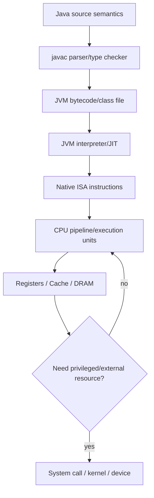

# Knowledge Connection — Từ source code đến CPU

Một trong những mental models quan trọng nhất của Computer Science là nhìn một dòng source code xuyên qua toàn bộ stack. Khi developer viết:

```java
long total = price * quantity;
```

không có một “Java machine” vật lý đọc dòng này. Có chuỗi transformations và abstractions nối semantic meaning ở source tới bit transitions trong CPU.

## Source-level semantics

Ở tầng Java, compiler/type system xác định `price`, `quantity`, `total` là `long`, multiplication theo signed 64-bit two's-complement semantics, overflow wrap theo Java rules. Đây là contract language-level.

Nếu dùng `BigDecimal`, operation không còn map một machine multiply instruction đơn giản; nó gọi library algorithms trên object representation arbitrary-precision decimal.

Ngay từ source type, ta đã chọn representation/cost model khác.

## Parsing và bytecode

`javac` tokenize/parse source thành AST, resolve names/types, rồi emit JVM bytecode. Bytecode instruction có thể là `lmul` cho long multiply sau values loaded.

Class file chứa constant pool, method bytecode và metadata. JVM verifier kiểm tra constraints trước execution.

## Class loading và runtime

JVM class loader load/resolve/link classes. Interpreter có thể execute bytecode ban đầu; JIT compiler quan sát hot methods rồi compile optimized native machine code cho current ISA.

JIT có thể inline getter, eliminate object allocation, hoist checks hoặc constant-fold nếu assumptions/profile permit. Source line và final instructions không 1:1.

## Native instructions

Suppose final target x86-64/ARM64. Compiler/JIT allocates values to registers; nếu registers không đủ, spills to stack/memory. Multiply uses machine instruction or sequence appropriate.

Instruction bytes are fetched through I-cache, decoded, renamed/scheduled in modern microarchitecture, operands read from registers, execution unit computes result. CPU may overlap this with other independent instructions.

## Memory and cache

Nếu `price` nằm trong object/array, CPU needs load. Virtual address translated via TLB/page table. Data request checks L1, then lower caches, possibly DRAM. A cache miss may cost far more cycles than multiply itself.

Thus a source line that “does one multiplication” can be dominated by memory access.

## OS involvement — often none on hot path

Ordinary arithmetic does not require syscall. User process runs instructions directly in user mode. OS becomes involved on events like page fault, scheduling preemption or system call.

This distinction explains why CPU-bound loop stays user-space while file/network access crosses kernel boundary.

## If result is stored to database

Now line's value crosses more layers: object serialization → JDBC driver → socket → TCP/IP → DB parser → transaction → buffer pool → WAL → filesystem/device. The arithmetic itself is tiny portion of latency.

## Error propagation across layers

Overflow may happen at language arithmetic layer; `NullPointerException` before multiply; page fault transparent at OS; hardware machine check rare; DB constraint error later. “The line failed” is not one failure domain.

## End-to-end diagram



## Why this connection matters

High-level developer does not need assembly every day, but knowing the chain changes diagnosis. CPU high + few cache misses suggests compute; high LLC misses suggests layout; syscall-heavy profile suggests I/O boundary; GC pauses suggest runtime allocation; page faults suggest working-set/memory pressure.

Optimization becomes evidence-driven instead of “rewrite loop syntax”.

## Mental Model

> Source code is a **semantic description** transformed through compiler/runtime/ISA into machine state transitions. Each layer preserves a contract while introducing its own costs and failure modes.

## Cross-references

- [Language semantics](../04_programming_languages/00_language_semantics_and_execution_models.md)
- [Compiler, VM và JIT](../04_programming_languages/03_compilers_interpreters_vm_and_jit.md)
- [CPU/ISA](../02_computer_architecture/01_cpu_isa_and_instruction_cycle.md)
- [Memory hierarchy/cache](../02_computer_architecture/02_memory_hierarchy_and_cache.md)
- [Kernel/syscalls](../03_operating_systems/00_kernel_syscalls_and_os_abstractions.md)
