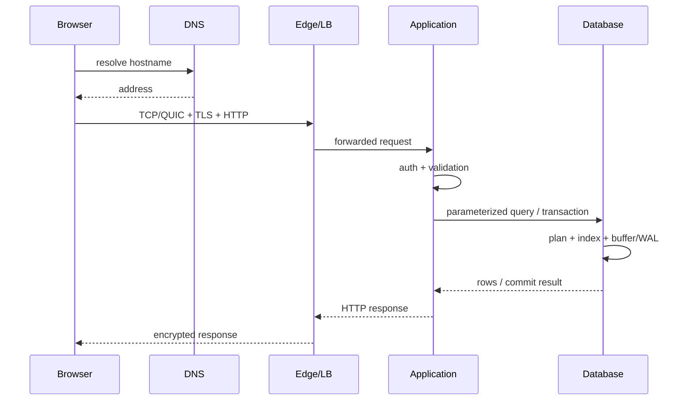

# Knowledge Connection — Từ browser request đến database và quay về

Một click “Đăng nhập” hoặc “Xem đơn hàng” có thể chạm gần như toàn bộ nền tảng Computer Science. Chapter này nối browser, DNS, transport, TLS, server scheduling, runtime, database transaction và response thành một causal chain.

## 1. Browser biến intent thành HTTP request

JavaScript/UI code tạo request theo URL/method/headers/body. Object phải serialize, thường JSON hoặc form encoding. Unicode text trở thành UTF-8 bytes theo HTTP/content conventions.

Cookie/session/token được attach theo browser policies; SameSite/Secure/domain/path affect behavior. Đây đã là security boundary trước khi packet rời máy.

## 2. Name resolution

Browser/OS resolver tìm cached DNS entry hoặc query recursive resolver để map hostname tới A/AAAA records. Cache TTL có thể khiến two clients thấy different addresses during rollout.

DNS trả address, chưa tạo connection.

## 3. Local network và routing

Host quyết định destination local subnet hay via default gateway. ARP/Neighbor Discovery resolves next-hop link address. NIC sends frames; routers repeatedly longest-prefix route IP packets across networks.

NAT/firewall/load balancer may transform/filter path.

## 4. Transport và TLS

TCP establishes ordered byte stream (or QUIC for HTTP/3). Congestion/flow control limit in-flight data. TLS authenticates server certificate and establishes encryption keys.

A 50 ms RTT path means each handshake round trip is expensive relative to nanosecond CPU operations. Connection reuse therefore matters.

## 5. Edge/proxy/server receives request

CDN/reverse proxy may terminate TLS, serve cache, enforce rate limit, or forward to application. Load balancer chooses instance.

Kernel NIC driver receives packets via DMA, network stack reconstructs socket bytes, scheduler wakes event-loop/thread/task. Runtime parses HTTP and dispatches route.

## 6. Authentication và authorization

Application verifies session/token, then checks permission for requested resource. Authentication success is not enough; `GET /orders/123` must verify user may read order 123.

Input is validated before query/business operation.

## 7. Database path

Connection pool provides DB connection or request waits. Driver serializes SQL/parameters. DB parses/optimizes query, chooses index/scan/join plan.

Index lookup traverses B+ tree pages likely in buffer pool. Missing page triggers storage read. Transaction isolation determines visible row versions/locks.

For write, DB updates memory pages/version structures, appends WAL; commit waits durability policy. Replica acknowledgment may be involved depending system.

## 8. Response path

Application maps domain result → DTO → JSON bytes, may compress, returns status/headers. Reverse proxy may cache; TLS encrypts records; TCP/QUIC transports; browser decrypts/parses.

Browser updates state/rendering. If response arrives after user navigated away, frontend must handle stale/cancelled request — distributed time at small scale.

## Failure can happen at every boundary

DNS timeout, TCP reset, TLS certificate failure, proxy 502, thread-pool saturation, pool exhaustion, deadlock victim, DB timeout, serialization error, client disconnect. A single “500 error” without trace context hides which stage failed.

Distributed tracing propagates correlation context across boundaries to reconstruct path.

## Latency decomposition

End-to-end latency roughly sums/overlaps:

```text
DNS + connect/TLS + queueing + app CPU
+ downstream network + DB queue/query/I/O/commit
+ serialization + response transfer + browser processing
```

Optimize measured dominant terms. Reducing Java loop from 50 µs to 25 µs is irrelevant if DB wait is 200 ms.

## Security composition

TLS protects channel, WAF may filter patterns, app authenticates/authorizes, parameterized query prevents injection, DB account least-privilege, audit logs record action. No single layer substitutes all others.

## Mermaid sequence



## Mental Model

> A web request is a **pipeline of queues, state machines and trust boundaries**. “Backend latency” là tổng của nhiều mechanisms; debugging tốt xác định stage và invariant bị phá.

## Cross-references

- [DNS/HTTP/TLS](../06_networks_distributed_systems/03_dns_http_tls_and_web_request.md)
- [Processes/threads/scheduling](../03_operating_systems/01_processes_threads_and_scheduling.md)
- [Transactions](../05_data_databases/02_transactions_acid_and_concurrency_control.md)
- [Indexes/query execution](../05_data_databases/03_indexes_and_query_execution.md)
- [Identity/authorization](../07_security_reliability/02_identity_authentication_and_authorization.md)
- [Observability/reliability](../07_security_reliability/05_fault_tolerance_observability_and_reliability.md)
