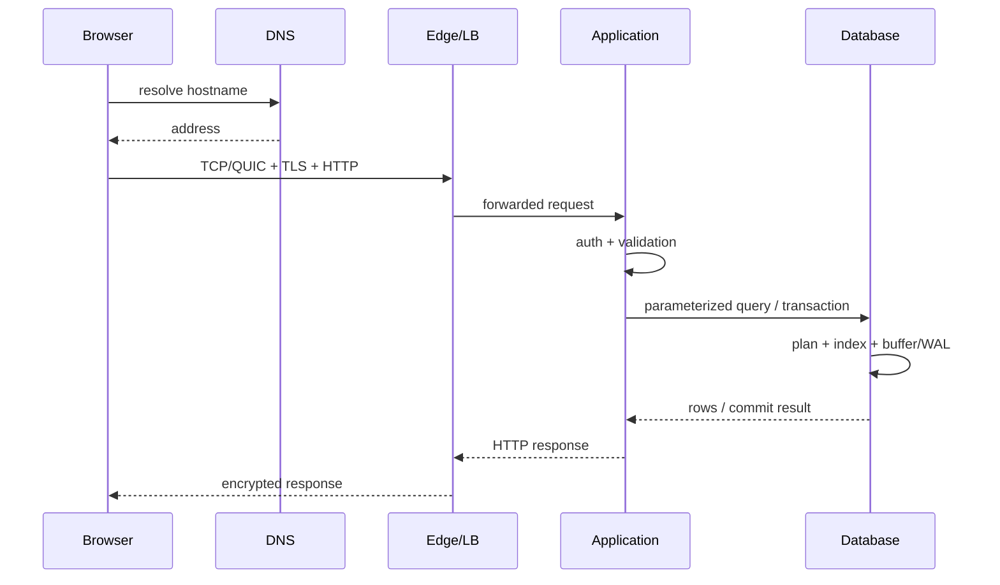

# Liên kết kiến thức (knowledge connection / 지식 연결) — Từ trình duyệt (browser / 브라우저) yêu cầu (request / 요청) đến cơ sở dữ liệu (database / 데이터베이스) và quay về

> **Mạch đọc:** Đặt **liên kết kiến thức (knowledge connection / 지식 연결) — Từ trình duyệt (browser / 브라우저) yêu cầu (request / 요청) đến cơ sở dữ liệu (database / 데이터베이스) và quay về** trong bản đồ [README](./README.md) để thấy đơn vị sở hữu (owner / 오너) và vị trí của nó. Nội dung đi từ **1. trình duyệt (browser / 브라우저) biến intent thành HTTP yêu cầu (request / 요청)** sang **2. Name resolution**; điểm nối này chuẩn bị câu hỏi cho các mục sau thay vì dừng ở định nghĩa đầu tiên.


Một click “Đăng nhập” hoặc “Xem đơn hàng” có thể chạm gần như toàn bộ nền tảng Khoa học máy tính (computer science / 컴퓨터 과학). Chapter này nối trình duyệt (browser / 브라우저), DNS, vận chuyển (transport / 전송), TLS, máy chủ (server / 서버) scheduling, thời gian chạy (runtime / 런타임), cơ sở dữ liệu (database / 데이터베이스) giao dịch (transaction / 트랜잭션) và phản hồi (response / 응답) thành một chuỗi nhân quả (causal chain / 인과 사슬).

## 1. trình duyệt (browser / 브라우저) biến intent thành HTTP yêu cầu (request / 요청)

JavaScript/UI mã (code / 코드) tạo yêu cầu (request / 요청) theo URL/phương thức (method / 메서드)/headers/body. đối tượng (object / 객체) phải serialize, thường JSON hoặc form encoding. Unicode văn bản (text / 텍스트) trở thành UTF-8 bytes theo HTTP/content conventions.

Cookie/session/đơn vị từ (token / 토큰) được attach theo trình duyệt (browser / 브라우저) policies; SameSite/Secure/lĩnh vực (domain / 도메인)/đường dẫn (path / 경로) affect hành vi (behavior / 동작). Đây đã là ranh giới bảo mật (security boundary / 보안 경계) trước khi packet rời máy.

## 2. Name resolution

Trình duyệt (browser / 브라우저)/OS resolver tìm cached DNS entry hoặc truy vấn (query / 쿼리) recursive resolver để map hostname tới A/AAAA records. bộ nhớ đệm (cache / 캐시) TTL có thể khiến two clients thấy different addresses during rollout.

DNS trả address, chưa tạo liên kết (connection / 연결).

## 3. cục bộ (local / 로컬) mạng (network / 네트워크) và routing

Host quyết định destination cục bộ (local / 로컬) subnet hay via default gateway. ARP/Neighbor Discovery resolves next-hop link address. NIC sends frames; routers repeatedly longest-prefix tuyến (route / 경로) IP packets across networks.

NAT/firewall/bộ cân bằng tải (load balancer / 로드 밸런서) may transform/filter đường dẫn (path / 경로).

## 4. vận chuyển (transport / 전송) và TLS

TCP establishes ordered byte stream (or QUIC for HTTP/3). Congestion/luồng (flow / 흐름) điều khiển (control / 제어) limit in-flight dữ liệu (data / 데이터). TLS authenticates máy chủ (server / 서버) certificate and establishes encryption keys.

A 50 ms RTT đường dẫn (path / 경로) means each handshake round trip is expensive relative to nanosecond CPU operations. liên kết (connection / 연결) reuse therefore matters.

## 5. Edge/proxy/máy chủ (server / 서버) receives yêu cầu (request / 요청)

CDN/reverse proxy may terminate TLS, serve bộ nhớ đệm (cache / 캐시), enforce tỷ lệ (rate / 비율) limit, or forward to ứng dụng (application / 애플리케이션). bộ cân bằng tải (load balancer / 로드 밸런서) chooses instance.

Kernel NIC driver receives packets via DMA, mạng (network / 네트워크) ngăn xếp (stack / 스택) reconstructs socket bytes, scheduler wakes event-loop/luồng thực thi (thread / 스레드)/tác vụ (task / 작업). thời gian chạy (runtime / 런타임) parses HTTP and dispatches tuyến (route / 경로).

## 6. Authentication và authorization

Ứng dụng (application / 애플리케이션) verifies session/đơn vị từ (token / 토큰), then checks permission for requested tài nguyên (resource / 자원). Authentication success is not enough; `GET /orders/123` must verify người dùng (user / 사용자) may read thứ tự (order / 순서) 123.

Đầu vào (input / 입력) is validated before truy vấn (query / 쿼리)/nghiệp vụ (business / 비즈니스) thao tác (operation / 연산).

## 7. cơ sở dữ liệu (database / 데이터베이스) đường dẫn (path / 경로)

Liên kết (connection / 연결) pool provides DB liên kết (connection / 연결) or yêu cầu (request / 요청) waits. Driver serializes SQL/parameters. DB parses/optimizes truy vấn (query / 쿼리), chooses chỉ mục (index / 인덱스)/scan/phép nối (join / 조인) plan.

Chỉ mục (index / 인덱스) lookup traverses B+ cây (tree / 트리) pages likely in buffer pool. Missing page triggers lưu trữ (storage / 저장소) read. giao dịch (transaction / 트랜잭션) isolation determines visible row versions/locks.

For ghi (write / 쓰기), DB updates bộ nhớ (memory / 메모리) pages/phiên bản (version / 버전) structures, appends WAL; lần ghi nhận (commit / 커밋) waits durability chính sách (policy / 정책). Replica acknowledgment may be involved depending hệ thống (system / 시스템).

## 8. phản hồi (response / 응답) đường dẫn (path / 경로)

Ứng dụng (application / 애플리케이션) maps lĩnh vực (domain / 도메인) kết quả (result / 결과) → DTO → JSON bytes, may compress, returns status/headers. Reverse proxy may bộ nhớ đệm (cache / 캐시); TLS encrypts records; TCP/QUIC transports; trình duyệt (browser / 브라우저) decrypts/parses.

Trình duyệt (browser / 브라우저) updates trạng thái (state / 상태)/rendering. If phản hồi (response / 응답) arrives after người dùng (user / 사용자) navigated away, frontend must handle stale/cancelled yêu cầu (request / 요청) — phân tán (distributed / 분산) thời gian (time / 시간) at small quy mô (scale / 규모).

## Thất bại (failure / 실패) can happen at every ranh giới (boundary / 경계)

DNS hết thời gian chờ (timeout / 타임아웃), TCP reset, TLS certificate thất bại (failure / 실패), proxy 502, thread-pool saturation, pool exhaustion, deadlock victim, DB hết thời gian chờ (timeout / 타임아웃), serialization lỗi (error / 오류), máy khách (client / 클라이언트) disconnect. A single “500 lỗi (error / 오류)” without ngữ cảnh dấu vết (trace context / 추적 컨텍스트) hides which stage failed.

Phân tán (distributed / 분산) tracing propagates correlation ngữ cảnh (context / 맥락) across boundaries to reconstruct đường dẫn (path / 경로).

## Độ trễ (latency / 지연 시간) decomposition

End-to-end độ trễ (latency / 지연 시간) roughly sums/overlaps:

```text
DNS + connect/TLS + queueing + app CPU
+ downstream network + DB queue/query/I/O/commit
+ serialization + response transfer + browser processing
```

Optimize measured dominant terms. Reducing Java vòng lặp (loop / 루프) from 50 µs to 25 µs is irrelevant if DB wait is 200 ms.

## Bảo mật (security / 보안) composition

TLS protects channel, WAF may filter patterns, app authenticates/authorizes, parameterized truy vấn (query / 쿼리) prevents injection, DB account least-privilege, kiểm tra (audit / 감사) logs bản ghi (record / 레코드) hành động (action / 동작). No single tầng (layer / 계층) substitutes all others.

## Mermaid chuỗi (sequence / 시퀀스)


```mermaid
sequenceDiagram
    participant B as Browser
    participant D as DNS
    participant E as Edge/LB
    participant A as Application
    participant DB as Database
    B->>D: resolve hostname
    D-->>B: address
    B->>E: TCP/QUIC + TLS + HTTP
    E->>A: forwarded request
    A->>A: auth + validation
    A->>DB: parameterized query / transaction
    DB->>DB: plan + index + buffer/WAL
    DB-->>A: rows / commit result
    A-->>E: HTTP response
    E-->>B: encrypted response
```

## Mô hình tư duy (mental model / 사고 모델)

> A web yêu cầu (request / 요청) is a **chuỗi xử lý (pipeline / 파이프라인) of queues, trạng thái (state / 상태) machines and trust boundaries**. “Backend độ trễ (latency / 지연 시간)” là tổng của nhiều mechanisms; debugging tốt xác định stage và bất biến (invariant / 불변식) bị phá.

## Cross-references

- [DNS/HTTP/TLS](../06_networks_distributed_systems/03_dns_http_tls_and_web_request.md)
- [Processes/threads/scheduling](../03_operating_systems/01_processes_threads_and_scheduling.md)
- [Transactions](../05_data_databases/02_transactions_acid_and_concurrency_control.md)
- [Indexes/query execution](../05_data_databases/03_indexes_and_query_execution.md)
- [Identity/authorization](../07_security_reliability/02_identity_authentication_and_authorization.md)
- [Observability/reliability](../07_security_reliability/05_fault_tolerance_observability_and_reliability.md)

> **Bàn giao:** Sau **Cross-references**, hãy chốt bất biến (invariant / 불변식) và giới hạn của mục này trước khi nối sang kiến thức kế tiếp. Có thể đọc tiếp [00 source code to cpu](./00_source_code_to_cpu.md) để đối chiếu ranh giới (boundary / 경계) gần nhất.
