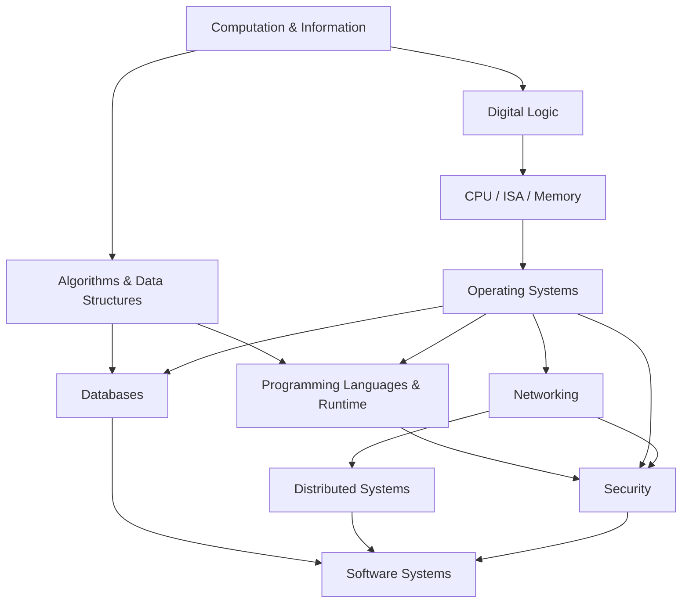

# Computer Science Foundations — Knowledge Library

Computer Science (khoa học máy tính / 컴퓨터 과학, 전산학) không chỉ là học cách viết chương trình. Câu hỏi cốt lõi của lĩnh vực này là: **thông tin được biểu diễn thế nào, một quá trình tính toán là gì, máy tính biến các quy tắc trừu tượng thành chuyển động điện tử ra sao, và làm thế nào xây dựng hệ thống đúng, nhanh, an toàn, có thể mở rộng và chịu lỗi**.

Thư viện này được tổ chức theo **conceptual dependency**, không theo Beginner → Intermediate → Advanced. Mỗi file là một chapter độc lập, nhưng các chapter liên kết thành knowledge graph từ bit và computation tới algorithm, CPU, operating system, runtime, database, network, distributed system, security và software system.

Triết lý xuyên suốt là **Understanding > Memorization**, **Reasoning > Rule**, **Mental Model > Definition**, **Connection > Isolated Fact**. Thuật ngữ chuẩn quốc tế được giữ bằng English, kèm tiếng Việt và Korean terminology khi hữu ích trong 교과서, 기사 시험, 회사 문서 hoặc technical documentation.

## Cấu trúc thư viện

```text
computer_science/
├── 00_computation_information/
├── 01_algorithms_data_structures/
├── 02_computer_architecture/
├── 03_operating_systems/
├── 04_programming_languages/
├── 05_data_databases/
├── 06_networks_distributed_systems/
├── 07_security_reliability/
├── 08_software_systems/
├── 90_connections/
├── 99_glossary.md
└── COVERAGE_AUDIT.md
```

## Reading path

Một đường đọc nền tảng hợp lý là:



Đây không phải một đường duy nhất. Có thể học Algorithms song song với Architecture; có thể học Database sau khi đã hiểu data structures và persistence; có thể học Network trước Distributed Systems nhưng không cần biết toàn bộ OS. Khi một dependency quan trọng xuất hiện, chapter hiện tại sẽ giải thích context tối thiểu và link sang chapter chuyên sâu.

## 00 — Computation & Information

- [Computer Science thực sự nghiên cứu gì?](./00_computation_information/00_what_computer_science_studies.md)
- [Information, bit, encoding và representation](./00_computation_information/01_information_bits_and_encoding.md)
- [Hệ số, integer, floating point và dữ liệu trong bộ nhớ](./00_computation_information/02_numbers_and_machine_representation.md)
- [Logic, state, abstraction và invariants](./00_computation_information/03_logic_state_abstraction_and_invariants.md)
- [Computability và giới hạn của tính toán](./00_computation_information/04_computability_and_limits.md)

## 01 — Algorithms & Data Structures

- [Algorithmic thinking, specification và correctness](./01_algorithms_data_structures/00_algorithmic_thinking_and_correctness.md)
- [Time/space complexity và asymptotic analysis](./01_algorithms_data_structures/01_complexity_and_asymptotic_analysis.md)
- [Memory model, locality và data layout](./01_algorithms_data_structures/02_memory_models_and_data_layout.md)
- [Array, linked list, stack, queue và deque](./01_algorithms_data_structures/03_linear_data_structures.md)
- [Hashing và hash table](./01_algorithms_data_structures/04_hashing_and_hash_tables.md)
- [Tree, heap và ordered search structures](./01_algorithms_data_structures/05_trees_heaps_and_search_structures.md)
- [Graph và graph algorithms](./01_algorithms_data_structures/06_graphs_and_graph_algorithms.md)
- [Sorting, searching và selection](./01_algorithms_data_structures/07_sorting_searching_and_selection.md)
- [Recursion, divide-and-conquer, greedy và dynamic programming](./01_algorithms_data_structures/08_algorithmic_strategies.md)

## 02 — Computer Architecture

- [Digital logic, gates và sequential circuits](./02_computer_architecture/00_digital_logic_and_circuits.md)
- [CPU, ISA và instruction cycle](./02_computer_architecture/01_cpu_isa_and_instruction_cycle.md)
- [Memory hierarchy, cache và locality](./02_computer_architecture/02_memory_hierarchy_and_cache.md)
- [I/O, interrupt, DMA và devices](./02_computer_architecture/03_io_interrupts_dma_and_devices.md)
- [Machine code, assembly, ABI và calling convention](./02_computer_architecture/04_machine_code_assembly_and_abi.md)
- [Pipelining, multicore, SIMD và GPU](./02_computer_architecture/05_parallel_computer_architecture.md)

## 03 — Operating Systems

- [Kernel, system call và OS abstractions](./03_operating_systems/00_kernel_syscalls_and_os_abstractions.md)
- [Process, thread và scheduling](./03_operating_systems/01_processes_threads_and_scheduling.md)
- [Concurrency, synchronization và deadlock](./03_operating_systems/02_concurrency_synchronization_and_deadlock.md)
- [Virtual memory và address spaces](./03_operating_systems/03_virtual_memory_and_address_spaces.md)
- [Filesystem, storage và buffered I/O](./03_operating_systems/04_filesystems_storage_and_io.md)
- [Privilege, isolation, containers và virtualization](./03_operating_systems/05_privilege_isolation_and_virtualization.md)

## 04 — Programming Languages & Runtime

- [Programming language semantics và execution models](./04_programming_languages/00_language_semantics_and_execution_models.md)
- [Types, values, references và memory management](./04_programming_languages/01_types_values_references_and_memory.md)
- [Scope, closures, functions và control flow](./04_programming_languages/02_scope_closures_functions_and_control_flow.md)
- [Compiler, interpreter, VM và JIT](./04_programming_languages/03_compilers_interpreters_vm_and_jit.md)
- [Imperative, OOP, functional và declarative paradigms](./04_programming_languages/04_programming_paradigms.md)
- [Errors, exceptions, resources và runtime safety](./04_programming_languages/05_errors_resources_and_runtime_safety.md)

## 05 — Data & Databases

- [Data model và database systems](./05_data_databases/00_data_models_and_database_systems.md)
- [Relational model, keys và normalization](./05_data_databases/01_relational_model_keys_and_normalization.md)
- [Transactions, ACID và concurrency control](./05_data_databases/02_transactions_acid_and_concurrency_control.md)
- [Index, B-tree, hashing và query execution](./05_data_databases/03_indexes_and_query_execution.md)
- [Storage engine, WAL, recovery và durability](./05_data_databases/04_storage_logs_recovery_and_durability.md)

## 06 — Networks & Distributed Systems

- [Network layers, packets và encapsulation](./06_networks_distributed_systems/00_network_layers_packets_and_encapsulation.md)
- [Ethernet, IP, subnetting và routing](./06_networks_distributed_systems/01_ethernet_ip_subnetting_and_routing.md)
- [TCP, UDP, flow control và congestion control](./06_networks_distributed_systems/02_transport_tcp_udp_and_congestion.md)
- [DNS, HTTP, TLS và một web request end-to-end](./06_networks_distributed_systems/03_dns_http_tls_and_web_request.md)
- [Time, failure và consistency trong distributed systems](./06_networks_distributed_systems/04_distributed_systems_time_failure_and_consistency.md)
- [Replication, partitioning và consensus](./06_networks_distributed_systems/05_replication_partitioning_and_consensus.md)

## 07 — Security & Reliability

- [Threat model và security principles](./07_security_reliability/00_threat_models_and_security_principles.md)
- [Hash, MAC, symmetric và public-key cryptography](./07_security_reliability/01_cryptography_foundations.md)
- [Identity, authentication và authorization](./07_security_reliability/02_identity_authentication_and_authorization.md)
- [Memory, web và injection vulnerabilities](./07_security_reliability/03_software_vulnerabilities.md)
- [Testing, verification và debugging](./07_security_reliability/04_testing_verification_and_debugging.md)
- [Fault tolerance, observability và reliability](./07_security_reliability/05_fault_tolerance_observability_and_reliability.md)

## 08 — Software Systems

- [Abstraction, modularity, interface và API contracts](./08_software_systems/00_abstraction_modularity_interfaces_and_apis.md)
- [Version control, build, linking và package dependency](./08_software_systems/01_version_control_build_link_and_packages.md)
- [Latency, throughput, capacity và scalability](./08_software_systems/02_performance_capacity_and_scalability.md)
- [State, queues, backpressure và system boundaries](./08_software_systems/03_state_queues_backpressure_and_boundaries.md)
- [Time, clocks, serialization và idempotency](./08_software_systems/04_time_serialization_and_idempotency.md)

## 90 — Knowledge Connections

- [Từ source code đến CPU](./90_connections/00_source_code_to_cpu.md)
- [Từ browser request đến database và quay về](./90_connections/01_browser_to_database_request.md)
- [Vòng đời dữ liệu: register → RAM → disk → network](./90_connections/02_data_lifecycle_memory_disk_network.md)
- [Trade-off xuyên CS: time, space, consistency, availability và complexity](./90_connections/03_cross_cutting_tradeoffs.md)
- [Abstraction layers và leaky abstractions](./90_connections/04_abstraction_layers_and_leaky_abstractions.md)

## Liên kết sang các Knowledge Library khác

Computer Science dựa mạnh vào discrete mathematics, logic, probability và information theory. Các phần toán học chi tiết đã có trong [Mathematics Knowledge Library](../mathematics/README.md), đặc biệt [Logic & Proof](../mathematics/00_foundations/01_logic_and_proof.md), [Graph Theory](../mathematics/07_discrete_cs/00_graph_theory.md), [Algorithms & Complexity](../mathematics/07_discrete_cs/01_algorithms_complexity_and_logarithms.md), [Boolean Algebra](../mathematics/07_discrete_cs/03_boolean_algebra_and_digital_logic.md) và [Information Theory](../mathematics/07_discrete_cs/06_information_theory_and_coding.md).

Các chapter Java, Spring, React, JavaScript, Swift, Kotlin... trong repo nên được đọc như **implementation-specific knowledge**. Thư viện này giải thích các cơ chế nền khiến những API và framework đó hoạt động.
