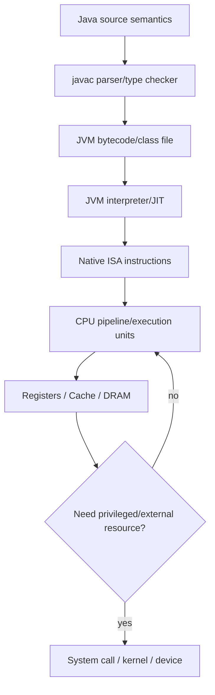

# Liên kết kiến thức (knowledge connection / 지식 연결) — Từ mã nguồn (source code / 소스 코드) đến CPU

> **Mạch đọc:** [README](../README.md) là bản đồ owner của **Liên kết kiến thức (knowledge connection / 지식 연결) — Từ mã nguồn (source code / 소스 코드) đến CPU**; nhìn vào vị trí đó trước để biết file này đang phục vụ nhánh kiến thức nào. **Tầng mã nguồn (source-level / 소스 수준) ngữ nghĩa (semantics / 의미론)** gom dữ liệu hoặc nguồn để kiểm tra một nhận định cụ thể; sau đó sang **Parsing và bytecode** để mở rộng đối tượng sang phạm vi kế cận. Cách đi này giữ lại điểm tựa của section đầu và cho biết kết luận sẽ được dùng ở đâu, thay vì dừng ở định nghĩa đầu tiên.

Một trong những mô hình tư duy (mental models / 사고 모델들) quan trọng nhất của Khoa học máy tính (computer science / 컴퓨터 과학) là nhìn một dòng mã nguồn (source code / 소스 코드) xuyên qua toàn bộ ngăn xếp (stack / 스택). Khi nhà phát triển (developer / 개발자) viết:

```java
long total = price * quantity;
```

không có một “Java machine” vật lý đọc dòng này. Có chuỗi transformations và abstractions nối ý nghĩa (semantic meaning / 의미적 뜻) ở nguồn (source / 소스) tới bit transitions trong CPU.

## Tầng mã nguồn (source-level / 소스 수준) ngữ nghĩa (semantics / 의미론)

Ở tầng Java, trình biên dịch (compiler / 컴파일러)/hệ kiểu (type system / 타입 시스템) xác định `price`, `quantity`, `total` là `long`, multiplication theo signed 64-bit two's-complement ngữ nghĩa (semantics / 의미론), overflow wrap theo Java rules. Đây là đặc tả hợp đồng (contract / 계약) language-level.

Nếu dùng `BigDecimal`, thao tác (operation / 연산) không còn map một lệnh nhân của máy (machine multiply instruction / 기계 곱셈 명령어) đơn giản; nó gọi thuật toán thư viện (library algorithms / 라이브러리 알고리즘) trên biểu diễn đối tượng (object representation / 객체 표현) arbitrary-precision decimal.

Ngay từ kiểu ở mã nguồn (source type / 소스 타입), ta đã chọn biểu diễn (representation / 표현)/chi phí (cost / 비용) mô hình (model / 모델) khác.

> **Chuyển mạch:** Trong **Liên kết kiến thức (knowledge connection / 지식 연결) — Từ mã nguồn (source code / 소스 코드) đến CPU**, **Tầng mã nguồn (source-level / 소스 수준) ngữ nghĩa (semantics / 의미론)** nêu điều cần giải thích; **Parsing và bytecode** đối chiếu nó với bằng chứng hoặc nguồn kiểm chứng. Từ đây, **Nạp lớp (class loading / 클래스 로딩) và thời gian chạy (runtime / 런타임)** sẽ cho biết hệ quả hoặc giới hạn ấy hiện ra ở đâu.

## Parsing và bytecode

`javac` tokenize/parse nguồn (source / 소스) thành AST, resolve names/types, rồi emit JVM bytecode. Lệnh bytecode (bytecode instruction / 바이트코드 명령어) có thể là `lmul` cho long multiply sau values loaded.

Tệp lớp (class file / 클래스 파일) chứa constant pool, phương thức (method / 메서드) bytecode và siêu dữ liệu (metadata / 메타데이터). JVM verifier kiểm tra các ràng buộc (constraints / 제약조건들) trước thực thi (execution / 실행).

> **Chuyển mạch:** Ở chặng này của **Liên kết kiến thức (knowledge connection / 지식 연결) — Từ mã nguồn (source code / 소스 코드) đến CPU**, **Nạp lớp (class loading / 클래스 로딩) và thời gian chạy (runtime / 런타임)** tiếp nhận điểm tựa từ **Parsing và bytecode** nhưng đổi góc nhìn sang câu hỏi của chính nó; đọc liền hai mục để thấy mối quan hệ đó. Từ đây, **Lệnh máy bản địa (native instructions / 네이티브 명령어)** sẽ cho biết hệ quả hoặc giới hạn ấy hiện ra ở đâu.

## Nạp lớp (class loading / 클래스 로딩) và thời gian chạy (runtime / 런타임)

Bộ nạp lớp JVM (JVM class loader / JVM 클래스 로더) tải (load / 로드)/resolve/link classes. trình thông dịch (interpreter / 인터프리터) có thể execute bytecode ban đầu; Trình biên dịch JIT (JIT compiler / JIT 컴파일러) quan sát hot methods rồi compile optimized mã máy bản địa (native machine code / 네이티브 기계어) cho ISA hiện tại (current ISA / 현재 ISA).

JIT có thể inline getter, eliminate đối tượng (object / 객체) allocation, hoist checks hoặc constant-fold nếu các giả định (assumptions / 가정들)/profile permit. dòng mã nguồn (source line / 소스 코드 줄) và các lệnh cuối (final instructions / 최종 명령어) không 1:1.

> **Chuyển mạch:** Đặt trong câu hỏi lớn của **Liên kết kiến thức (knowledge connection / 지식 연결) — Từ mã nguồn (source code / 소스 코드) đến CPU**, **Lệnh máy bản địa (native instructions / 네이티브 명령어)** tiếp nhận điểm tựa từ **Nạp lớp (class loading / 클래스 로딩) và thời gian chạy (runtime / 런타임)** nhưng đổi góc nhìn sang câu hỏi của chính nó; đọc liền hai mục để thấy mối quan hệ đó. Từ đây, **Bộ nhớ và bộ nhớ đệm (memory and cache / 메모리와 캐시)** sẽ cho biết hệ quả hoặc giới hạn ấy hiện ra ở đâu.

## Lệnh máy bản địa (native instructions / 네이티브 명령어)

Suppose final mục tiêu (target / 대상) x86-64/ARM64. trình biên dịch (compiler / 컴파일러)/JIT allocates values to registers; nếu registers không đủ, spills to ngăn xếp (stack / 스택)/bộ nhớ (memory / 메모리). Multiply uses lệnh máy (machine instruction / 기계 명령어) or chuỗi (sequence / 시퀀스) appropriate.

Instruction bytes are fetched through I-cache, decoded, renamed/scheduled in hiện đại (modern / 현대적) microarchitecture, operands read from registers, đơn vị thực thi (execution unit / 실행 유닛) computes kết quả (result / 결과). CPU may overlap this with other independent instructions.

> **Chuyển mạch:** Trong **Liên kết kiến thức (knowledge connection / 지식 연결) — Từ mã nguồn (source code / 소스 코드) đến CPU**, **Bộ nhớ và bộ nhớ đệm (memory and cache / 메모리와 캐시)** tiếp nhận điểm tựa từ **Lệnh máy bản địa (native instructions / 네이티브 명령어)** nhưng đổi góc nhìn sang câu hỏi của chính nó; đọc liền hai mục để thấy mối quan hệ đó. Từ đây, **OS involvement — often none on đường xử lý nóng (hot path / 핫 패스)** sẽ cho biết hệ quả hoặc giới hạn ấy hiện ra ở đâu.

## Bộ nhớ và bộ nhớ đệm (memory and cache / 메모리와 캐시)

Nếu `price` nằm trong đối tượng (object / 객체)/array, CPU needs tải (load / 로드). Virtual address translated via TLB/bảng trang (page table / 페이지 테이블). yêu cầu dữ liệu (data request / 데이터 요청) checks L1, then lower caches, possibly DRAM. A trượt bộ nhớ đệm (cache miss / 캐시 미스) may chi phí (cost / 비용) far more cycles than multiply itself.

Thus a dòng mã nguồn (source line / 소스 코드 줄) that “does one multiplication” can be dominated by bộ nhớ (memory / 메모리) truy cập (access / 접근).

> **Chuyển mạch:** Ở chặng này của **Liên kết kiến thức (knowledge connection / 지식 연결) — Từ mã nguồn (source code / 소스 코드) đến CPU**, **Bộ nhớ và bộ nhớ đệm (memory and cache / 메모리와 캐시)** xác định đầu vào; **OS involvement — often none on đường xử lý nóng (hot path / 핫 패스)** giải thích bước vận hành tạo ra kết quả kế tiếp. Từ đây, **If kết quả (result / 결과) is stored to cơ sở dữ liệu (database / 데이터베이스)** sẽ cho biết hệ quả hoặc giới hạn ấy hiện ra ở đâu.

## OS involvement — often none on đường xử lý nóng (hot path / 핫 패스)

Ordinary arithmetic does not require syscall. tiến trình người dùng (user process / 사용자 프로세스) runs instructions directly in chế độ người dùng (user mode / 사용자 모드). OS becomes involved on events like page fault, scheduling preemption or lời gọi hệ thống (system call / 시스템 호출).

This distinction explains why Vòng lặp giới hạn bởi CPU (CPU-bound loop / CPU 바운드 루프) stays user-space while tệp (file / 파일)/truy cập mạng (network access / 네트워크 접근) crosses ranh giới nhân hệ điều hành (kernel boundary / 커널 경계).

> **Chuyển mạch:** Đặt trong câu hỏi lớn của **Liên kết kiến thức (knowledge connection / 지식 연결) — Từ mã nguồn (source code / 소스 코드) đến CPU**, **OS involvement — often none on đường xử lý nóng (hot path / 핫 패스)** nêu điều cần giải thích; **If kết quả (result / 결과) is stored to cơ sở dữ liệu (database / 데이터베이스)** đối chiếu nó với bằng chứng hoặc nguồn kiểm chứng. Từ đây, **Lan truyền lỗi (error propagation / 오류 전파) across layers** sẽ cho biết hệ quả hoặc giới hạn ấy hiện ra ở đâu.

## If kết quả (result / 결과) is stored to cơ sở dữ liệu (database / 데이터베이스)

Now line's giá trị (value / 값) crosses more layers: đối tượng (object / 객체) serialization → JDBC driver → socket → TCP/IP → DB parser → giao dịch (transaction / 트랜잭션) → buffer pool → WAL → filesystem/thiết bị (device / 장치). The arithmetic itself is tiny portion of độ trễ (latency / 지연 시간).

> **Chuyển mạch:** Trong **Liên kết kiến thức (knowledge connection / 지식 연결) — Từ mã nguồn (source code / 소스 코드) đến CPU**, **If kết quả (result / 결과) is stored to cơ sở dữ liệu (database / 데이터베이스)** nêu điều cần giải thích; **Lan truyền lỗi (error propagation / 오류 전파) across layers** đối chiếu nó với bằng chứng hoặc nguồn kiểm chứng. Từ đây, **Sơ đồ đầu-cuối (end-to-end diagram / 엔드투엔드 다이어그램)** sẽ cho biết hệ quả hoặc giới hạn ấy hiện ra ở đâu.

## Lan truyền lỗi (error propagation / 오류 전파) across layers

Overflow may happen at tầng số học của ngôn ngữ (language arithmetic layer / 언어 산술 계층); `NullPointerException` before multiply; page fault transparent at OS; hardware machine check rare; Lỗi ràng buộc cơ sở dữ liệu (DB constraint error / DB 제약조건 오류) later. “The line failed” is not one miền lỗi (failure domain / 장애 도메인).

> **Chuyển mạch:** Ở chặng này của **Liên kết kiến thức (knowledge connection / 지식 연결) — Từ mã nguồn (source code / 소스 코드) đến CPU**, **Sơ đồ đầu-cuối (end-to-end diagram / 엔드투엔드 다이어그램)** tiếp nhận điểm tựa từ **Lan truyền lỗi (error propagation / 오류 전파) across layers** nhưng đổi góc nhìn sang câu hỏi của chính nó; đọc liền hai mục để thấy mối quan hệ đó. Từ đây, **Why this liên kết (connection / 연결) matters** sẽ cho biết hệ quả hoặc giới hạn ấy hiện ra ở đâu.

## Sơ đồ đầu-cuối (end-to-end diagram / 엔드투엔드 다이어그램)

Sơ đồ hoặc danh sách này mô tả thứ tự phụ thuộc của các khái niệm. Hãy đọc theo mũi tên để biết phần nào là prerequisite, phần nào là ứng dụng và khi nào cần quay lại nền tảng.



> **Chuyển mạch:** Đặt trong câu hỏi lớn của **Liên kết kiến thức (knowledge connection / 지식 연결) — Từ mã nguồn (source code / 소스 코드) đến CPU**, **Why this liên kết (connection / 연결) matters** tiếp nhận điểm tựa từ **Sơ đồ đầu-cuối (end-to-end diagram / 엔드투엔드 다이어그램)** nhưng đổi góc nhìn sang câu hỏi của chính nó; đọc liền hai mục để thấy mối quan hệ đó. Từ đây, **Mô hình tư duy (mental model / 사고 모델)** sẽ cho biết hệ quả hoặc giới hạn ấy hiện ra ở đâu.

## Why this liên kết (connection / 연결) matters

Nhà phát triển cấp cao (high-level developer / 고수준 개발자) does not need assembly every day, but knowing the chuỗi (chain / 사슬) changes diagnosis. CPU high + few bộ nhớ đệm (cache / 캐시) misses suggests compute; high LLC misses suggests bố cục (layout / 레이아웃); syscall-heavy profile suggests I/O ranh giới (boundary / 경계); GC pauses suggest thời gian chạy (runtime / 런타임) allocation; page faults suggest working-set/bộ nhớ (memory / 메모리) pressure.

Tối ưu hóa (optimization / 최적화) becomes evidence-driven instead of “rewrite vòng lặp (loop / 루프) cú pháp (syntax / 문법)”.

> **Chuyển mạch:** Trong **Liên kết kiến thức (knowledge connection / 지식 연결) — Từ mã nguồn (source code / 소스 코드) đến CPU**, **Mô hình tư duy (mental model / 사고 모델)** gom các mảnh từ **Why this liên kết (connection / 연결) matters** thành một kết luận có thể mang sang phần kế tiếp. Từ đây, **Cross-references** sẽ cho biết hệ quả hoặc giới hạn ấy hiện ra ở đâu.

## Mô hình tư duy (mental model / 사고 모델)

> mã nguồn (source code / 소스 코드) is a **ngữ nghĩa (semantic / 의미적) description** transformed through trình biên dịch (compiler / 컴파일러)/thời gian chạy (runtime / 런타임)/ISA into machine trạng thái (state / 상태) transitions. Each tầng (layer / 계층) preserves a đặc tả hợp đồng (contract / 계약) while introducing its own costs and thất bại (failure / 실패) modes.

> **Chuyển mạch:** Ở chặng này của **Liên kết kiến thức (knowledge connection / 지식 연결) — Từ mã nguồn (source code / 소스 코드) đến CPU**, **Cross-references** gom các mảnh từ **Mô hình tư duy (mental model / 사고 모델)** thành một kết luận có thể mang sang phần kế tiếp. Phần còn lại của file dùng kết quả này để khép lại mạch giải thích.

## Cross-references

Mục này bàn giao kiến thức sang các domain liên quan. Hãy theo từng liên kết để biết prerequisite nào đang được dùng, ứng dụng nào được mở rộng và ranh giới nào vẫn cần giữ.

- [Language semantics](../04_programming_languages/00_language_semantics_and_execution_models.md)
- [Compiler, VM và JIT](../04_programming_languages/03_compilers_interpreters_vm_and_jit.md)
- [CPU/ISA](../02_computer_architecture/01_cpu_isa_and_instruction_cycle.md)
- [Memory hierarchy/cache](../02_computer_architecture/02_memory_hierarchy_and_cache.md)
- [Kernel/syscalls](../03_operating_systems/00_kernel_syscalls_and_os_abstractions.md)

> **Bàn giao:** Sau **Cross-references**, hãy giữ lại kết luận và ranh giới của mục này; quay về [README](../README.md) khi cần định vị owner hoặc chọn nhánh học tiếp theo.
