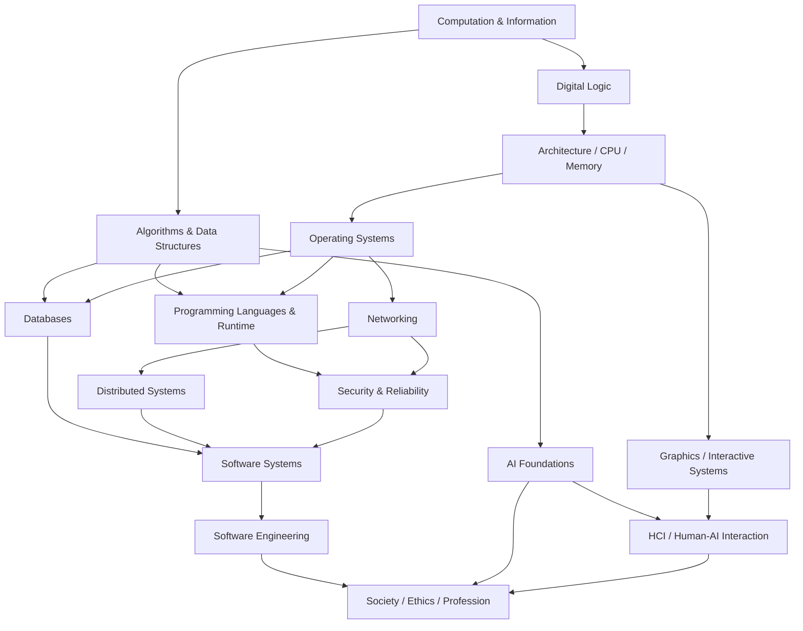

# Khoa học máy tính nền tảng — Thư viện kiến thức toàn diện

Đây là phần **kiến thức nền tảng (foundation / 기초)** của Thư viện Khoa học máy tính (Computer Science Knowledge Library). Mục tiêu là xây dựng mô hình tư duy (mental model) xuyên suốt từ thông tin và tính toán đến phần cứng, hệ điều hành, ngôn ngữ lập trình, cơ sở dữ liệu, mạng, hệ thống phân tán, bảo mật, kỹ nghệ phần mềm, trí tuệ nhân tạo, tương tác người–máy, đồ họa và tác động xã hội của công nghệ tính toán.

Thư viện được tổ chức theo **quan hệ phụ thuộc khái niệm (conceptual dependency)**, không theo Beginner → Intermediate → Advanced. “Nền tảng” không có nghĩa là sơ sài; đây là lớp kiến thức tiên quyết mà các thư viện chuyên sâu có thể dựa vào. Vì vậy mỗi chương vẫn giải thích cơ chế (mechanism), giả định (assumption), sự đánh đổi (trade-off), kiểu lỗi (failure mode) và mối liên hệ ở mức đủ sâu để sử dụng lâu dài.

Triết lý xuyên suốt là **Hiểu > Ghi nhớ**, **Suy luận > Học quy tắc**, **Mô hình tư duy > Định nghĩa**, **Liên kết > Sự kiện rời rạc**. Thuật ngữ tiếng Anh được giữ trong ngoặc khi cần để người đọc nhận diện từ khóa chuẩn quốc tế; thuật ngữ tiếng Hàn chỉ được ghi chú khi hữu ích trong giáo trình, kỳ thi hoặc giao tiếp kỹ thuật.

## Cấu trúc thư viện

```text
computer_science/
└── basic/
    ├── 00_computation_information/
    ├── 01_algorithms_data_structures/
    ├── 02_computer_architecture/
    ├── 03_operating_systems/
    ├── 04_programming_languages/
    ├── 05_data_databases/
    ├── 06_networks_distributed_systems/
    ├── 07_security_reliability/
    ├── 08_software_systems/
    ├── 09_software_engineering/
    ├── 10_ai_foundations/
    ├── 11_hci_graphics/
    ├── 12_society_ethics_profession/
    ├── 90_connections/
    ├── 99_glossary.md
    └── COVERAGE_AUDIT.md
```

## Quan hệ phụ thuộc và lộ trình đọc

Không tồn tại một đường đọc duy nhất. Một lộ trình nền tảng hợp lý là:



Nếu mục tiêu là kỹ thuật backend hoặc hệ thống, có thể ưu tiên `00 → 01 → 02 → 03 → 05 → 06 → 07 → 08 → 09`. Nếu mục tiêu là ngôn ngữ lập trình và môi trường thực thi (runtime), đi `00 → 01 → 02 → 03 → 04`. Nếu mục tiêu là AI, cần `00 → 01`, sau đó nối sang Toán học về đại số tuyến tính, xác suất, giải tích và tối ưu hóa rồi vào `10_ai_foundations`. Nếu mục tiêu là đồ họa hoặc HCI, kiến trúc máy tính cùng hình học/đại số tuyến tính hỗ trợ phần đồ họa, còn HCI có thể học khá độc lập sau khi hiểu hệ thống phần mềm cơ bản.

---

## 00 — Tính toán và thông tin

- [Khoa học máy tính thực sự nghiên cứu gì?](./00_computation_information/00_what_computer_science_studies.md)
- [Thông tin, bit, mã hóa và biểu diễn](./00_computation_information/01_information_bits_and_encoding.md)
- [Hệ số, số nguyên, số dấu phẩy động và dữ liệu trong bộ nhớ](./00_computation_information/02_numbers_and_machine_representation.md)
- [Logic, trạng thái, trừu tượng hóa và bất biến](./00_computation_information/03_logic_state_abstraction_and_invariants.md)
- [Khả năng tính toán và giới hạn của tính toán](./00_computation_information/04_computability_and_limits.md)

## 01 — Thuật toán và cấu trúc dữ liệu

Nhóm này giữ phần DSA cần thiết làm nền cho toàn bộ Khoa học máy tính. Các cấu trúc và thuật toán chuyên sâu hơn nằm trong thư viện DSA nâng cao.

- [Tư duy thuật toán, đặc tả và tính đúng đắn](./01_algorithms_data_structures/00_algorithmic_thinking_and_correctness.md)
- [Độ phức tạp thời gian/không gian và phân tích tiệm cận](./01_algorithms_data_structures/01_complexity_and_asymptotic_analysis.md)
- [Mô hình bộ nhớ, tính cục bộ và bố trí dữ liệu](./01_algorithms_data_structures/02_memory_models_and_data_layout.md)
- [Mảng, danh sách liên kết, ngăn xếp, hàng đợi và hàng đợi hai đầu](./01_algorithms_data_structures/03_linear_data_structures.md)
- [Băm và bảng băm](./01_algorithms_data_structures/04_hashing_and_hash_tables.md)
- [Cây, heap và cấu trúc tìm kiếm có thứ tự](./01_algorithms_data_structures/05_trees_heaps_and_search_structures.md)
- [Đồ thị và thuật toán đồ thị](./01_algorithms_data_structures/06_graphs_and_graph_algorithms.md)
- [Sắp xếp, tìm kiếm và lựa chọn](./01_algorithms_data_structures/07_sorting_searching_and_selection.md)
- [Đệ quy, chia để trị, tham lam, quay lui và quy hoạch động](./01_algorithms_data_structures/08_algorithmic_strategies.md)
- [Thuật toán chuỗi và lập chỉ mục văn bản](./01_algorithms_data_structures/09_string_algorithms_and_text_indexing.md)
- [Thuật toán ngẫu nhiên, xấp xỉ và trực tuyến](./01_algorithms_data_structures/10_randomized_approximation_and_online_algorithms.md)
- [Độ phức tạp, phép quy giảm, P/NP và cận dưới](./01_algorithms_data_structures/11_complexity_reductions_and_np.md)

## 02 — Kiến trúc máy tính

- [Logic số, cổng logic và mạch tuần tự](./02_computer_architecture/00_digital_logic_and_circuits.md)
- [CPU, ISA và chu kỳ lệnh](./02_computer_architecture/01_cpu_isa_and_instruction_cycle.md)
- [Phân cấp bộ nhớ, bộ nhớ đệm và tính cục bộ](./02_computer_architecture/02_memory_hierarchy_and_cache.md)
- [I/O, ngắt, DMA và thiết bị](./02_computer_architecture/03_io_interrupts_dma_and_devices.md)
- [Mã máy, hợp ngữ, ABI và quy ước gọi hàm](./02_computer_architecture/04_machine_code_assembly_and_abi.md)
- [Đường ống lệnh, đa lõi, SIMD, GPU và NUMA](./02_computer_architecture/05_parallel_computer_architecture.md)
- [Phần cứng lưu trữ: SSD, đĩa và tính bền vững dữ liệu](./02_computer_architecture/06_storage_hardware_ssd_disks_and_persistence.md)
- [Hiệu năng, năng lượng và đo lường phần cứng](./02_computer_architecture/07_performance_power_and_hardware_measurement.md)

## 03 — Hệ điều hành

- [Nhân hệ điều hành, lời gọi hệ thống và các lớp trừu tượng OS](./03_operating_systems/00_kernel_syscalls_and_os_abstractions.md)
- [Tiến trình, luồng và lập lịch](./03_operating_systems/01_processes_threads_and_scheduling.md)
- [Đồng thời, đồng bộ hóa và bế tắc](./03_operating_systems/02_concurrency_synchronization_and_deadlock.md)
- [Bộ nhớ ảo và không gian địa chỉ](./03_operating_systems/03_virtual_memory_and_address_spaces.md)
- [Hệ thống tệp, lưu trữ và I/O có bộ đệm](./03_operating_systems/04_filesystems_storage_and_io.md)
- [Đặc quyền, cô lập, container và ảo hóa](./03_operating_systems/05_privilege_isolation_and_virtualization.md)
- [IPC: signal, pipe, socket và bộ nhớ chia sẻ](./03_operating_systems/06_ipc_signals_pipes_and_shared_memory.md)
- [Khởi động, trình điều khiển thiết bị và I/O bất đồng bộ](./03_operating_systems/07_boot_device_drivers_and_async_io.md)

## 04 — Ngôn ngữ lập trình và môi trường thực thi

- [Ngữ nghĩa ngôn ngữ lập trình và mô hình thực thi](./04_programming_languages/00_language_semantics_and_execution_models.md)
- [Kiểu, giá trị, tham chiếu và quản lý bộ nhớ](./04_programming_languages/01_types_values_references_and_memory.md)
- [Phạm vi, closure, hàm và luồng điều khiển](./04_programming_languages/02_scope_closures_functions_and_control_flow.md)
- [Trình biên dịch, trình thông dịch, máy ảo và JIT](./04_programming_languages/03_compilers_interpreters_vm_and_jit.md)
- [Các mô hình lập trình mệnh lệnh, hướng đối tượng, hàm và khai báo](./04_programming_languages/04_programming_paradigms.md)
- [Lỗi, ngoại lệ, tài nguyên và an toàn khi thực thi](./04_programming_languages/05_errors_resources_and_runtime_safety.md)
- [Hệ kiểu, kiểu tổng quát và đa hình](./04_programming_languages/06_type_systems_generics_and_polymorphism.md)
- [Phân tích cú pháp, AST và phần đầu của ngôn ngữ](./04_programming_languages/07_parsing_ast_and_language_frontends.md)
- [Mô hình đồng thời và an toàn bộ nhớ](./04_programming_languages/08_concurrency_models_and_memory_safety.md)

## 05 — Dữ liệu và cơ sở dữ liệu

- [Mô hình dữ liệu và hệ quản trị cơ sở dữ liệu](./05_data_databases/00_data_models_and_database_systems.md)
- [Mô hình quan hệ, khóa và chuẩn hóa](./05_data_databases/01_relational_model_keys_and_normalization.md)
- [Giao dịch, ACID và điều khiển đồng thời](./05_data_databases/02_transactions_acid_and_concurrency_control.md)
- [Chỉ mục, B-tree, băm và thực thi truy vấn](./05_data_databases/03_indexes_and_query_execution.md)
- [Bộ máy lưu trữ, WAL, phục hồi và độ bền dữ liệu](./05_data_databases/04_storage_logs_recovery_and_durability.md)
- [Đại số quan hệ và ngữ nghĩa SQL](./05_data_databases/05_relational_algebra_and_sql_semantics.md)
- [Tối ưu hóa truy vấn và kế hoạch thực thi](./05_data_databases/06_query_optimization_and_execution_plans.md)
- [NoSQL, cơ sở dữ liệu phân tán và phân tích](./05_data_databases/07_nosql_distributed_and_analytical_databases.md)

## 06 — Mạng và hệ thống phân tán

- [Các tầng mạng, gói tin và đóng gói](./06_networks_distributed_systems/00_network_layers_packets_and_encapsulation.md)
- [Ethernet, IP, chia subnet và định tuyến](./06_networks_distributed_systems/01_ethernet_ip_subnetting_and_routing.md)
- [TCP, UDP, điều khiển luồng và điều khiển tắc nghẽn](./06_networks_distributed_systems/02_transport_tcp_udp_and_congestion.md)
- [DNS, HTTP, TLS và một yêu cầu web từ đầu đến cuối](./06_networks_distributed_systems/03_dns_http_tls_and_web_request.md)
- [Thời gian, lỗi và tính nhất quán trong hệ thống phân tán](./06_networks_distributed_systems/04_distributed_systems_time_failure_and_consistency.md)
- [Sao chép, phân vùng và đồng thuận](./06_networks_distributed_systems/05_replication_partitioning_and_consensus.md)
- [Socket, IPv6, NAT, tường lửa và VPN](./06_networks_distributed_systems/06_sockets_ipv6_nat_firewalls_and_vpn.md)
- [Giao thức định tuyến, BGP và Internet](./06_networks_distributed_systems/07_routing_protocols_and_the_internet.md)
- [HTTP/2, HTTP/3, QUIC và vận chuyển mạng hiện đại](./06_networks_distributed_systems/08_http2_http3_quic_and_modern_transport.md)

## 07 — Bảo mật và độ tin cậy

- [Mô hình đe dọa và nguyên tắc bảo mật](./07_security_reliability/00_threat_models_and_security_principles.md)
- [Hàm băm, MAC, mật mã đối xứng và khóa công khai](./07_security_reliability/01_cryptography_foundations.md)
- [Danh tính, xác thực và phân quyền](./07_security_reliability/02_identity_authentication_and_authorization.md)
- [Lỗ hổng bộ nhớ, web và injection](./07_security_reliability/03_software_vulnerabilities.md)
- [Kiểm thử, kiểm chứng và gỡ lỗi](./07_security_reliability/04_testing_verification_and_debugging.md)
- [Khả năng chịu lỗi, quan sát và độ tin cậy](./07_security_reliability/05_fault_tolerance_observability_and_reliability.md)
- [Bảo mật ứng dụng web](./07_security_reliability/06_web_application_security.md)
- [Khóa, bí mật, chứng chỉ và vận hành an toàn](./07_security_reliability/07_keys_secrets_certificates_and_secure_operations.md)
- [Chuỗi cung ứng phần mềm và vòng đời phát triển an toàn](./07_security_reliability/08_supply_chain_and_secure_software_lifecycle.md)

## 08 — Hệ thống phần mềm

- [Trừu tượng hóa, mô-đun, giao diện và hợp đồng API](./08_software_systems/00_abstraction_modularity_interfaces_and_apis.md)
- [Quản lý phiên bản, xây dựng, liên kết và phụ thuộc gói](./08_software_systems/01_version_control_build_link_and_packages.md)
- [Độ trễ, thông lượng, dung lượng và khả năng mở rộng](./08_software_systems/02_performance_capacity_and_scalability.md)
- [Trạng thái, hàng đợi, áp lực ngược và ranh giới hệ thống](./08_software_systems/03_state_queues_backpressure_and_boundaries.md)
- [Thời gian, đồng hồ, tuần tự hóa và tính lũy đẳng](./08_software_systems/04_time_serialization_and_idempotency.md)
- [Bộ nhớ đệm, cân bằng tải và CDN](./08_software_systems/05_caching_load_balancing_and_cdns.md)
- [Hệ thống hướng sự kiện và xử lý luồng](./08_software_systems/06_event_driven_and_stream_processing.md)
- [Phân rã hệ thống, dịch vụ và ranh giới](./08_software_systems/07_system_decomposition_services_and_boundaries.md)

## 09 — Kỹ nghệ phần mềm

- [Yêu cầu, đặc tả và quy trình kỹ nghệ](./09_software_engineering/00_requirements_specification_and_engineering_process.md)
- [Kiến trúc phần mềm và suy luận thiết kế](./09_software_engineering/01_software_architecture_and_design_reasoning.md)
- [Kiểm thử, chất lượng và chiến lược kiểm chứng](./09_software_engineering/02_testing_quality_and_verification_strategy.md)
- [Phân phối, cấu hình và vận hành](./09_software_engineering/03_delivery_configuration_and_operations.md)
- [Bảo trì, tiến hóa và nợ kỹ thuật](./09_software_engineering/04_maintenance_evolution_and_technical_debt.md)

## 10 — Nền tảng trí tuệ nhân tạo

- [Mô hình hóa bài toán AI, tìm kiếm và tác tử](./10_ai_foundations/00_ai_problem_formulation_search_and_agents.md)
- [Biểu diễn tri thức, suy luận và suy luận xác suất](./10_ai_foundations/01_knowledge_reasoning_and_probabilistic_inference.md)
- [Nền tảng học máy](./10_ai_foundations/02_machine_learning_foundations.md)
- [Mạng nơ-ron và học biểu diễn](./10_ai_foundations/03_neural_networks_and_representation_learning.md)
- [Đánh giá AI, dữ liệu và trách nhiệm](./10_ai_foundations/04_ai_evaluation_data_and_responsibility.md)

## 11 — Tương tác người–máy và đồ họa máy tính

- [HCI, yếu tố con người và mô hình tương tác](./11_hci_graphics/00_hci_human_factors_and_interaction_models.md)
- [Thiết kế giao diện, khả năng tiếp cận và tính dễ sử dụng](./11_hci_graphics/01_interface_design_accessibility_and_usability.md)
- [Đường ống đồ họa máy tính và hình học](./11_hci_graphics/02_computer_graphics_pipeline_and_geometry.md)
- [Ảnh, màu sắc, raster hóa và kết xuất](./11_hci_graphics/03_images_color_rasterization_and_rendering.md)
- [Đa phương tiện, hoạt ảnh và hệ thống tương tác](./11_hci_graphics/04_multimedia_animation_and_interactive_systems.md)

## 12 — Công nghệ tính toán, xã hội, đạo đức và nghề nghiệp

- [Đạo đức công nghệ, quyền riêng tư và trách nhiệm nghề nghiệp](./12_society_ethics_profession/00_computing_ethics_privacy_and_professional_responsibility.md)
- [Quản trị dữ liệu, thiên lệch và tác động thuật toán](./12_society_ethics_profession/01_data_governance_bias_and_algorithmic_impact.md)
- [Luật phần mềm, giấy phép và sở hữu trí tuệ](./12_society_ethics_profession/02_software_law_licenses_and_intellectual_property.md)
- [Tính bền vững, khả năng tiếp cận và hạ tầng xã hội số](./12_society_ethics_profession/03_sustainability_accessibility_and_social_infrastructure.md)

## 90 — Kết nối kiến thức

- [Từ mã nguồn đến CPU](./90_connections/00_source_code_to_cpu.md)
- [Từ yêu cầu trình duyệt đến cơ sở dữ liệu và quay về](./90_connections/01_browser_to_database_request.md)
- [Vòng đời dữ liệu: thanh ghi → RAM → đĩa → mạng](./90_connections/02_data_lifecycle_memory_disk_network.md)
- [Các đánh đổi xuyên Khoa học máy tính: thời gian, không gian, nhất quán, sẵn sàng và độ phức tạp](./90_connections/03_cross_cutting_tradeoffs.md)
- [Các tầng trừu tượng và sự rò rỉ trừu tượng](./90_connections/04_abstraction_layers_and_leaky_abstractions.md)

## Tài liệu tham chiếu

- [Bảng thuật ngữ Việt / Anh / Hàn](./99_glossary.md)
- [Kiểm tra phạm vi kiến thức](./COVERAGE_AUDIT.md)

## Liên kết sang các Thư viện kiến thức khác

Khoa học máy tính dựa mạnh vào toán rời rạc, logic, xác suất, thống kê, đại số tuyến tính, giải tích, tối ưu hóa và lý thuyết thông tin. Các phần toán chi tiết nằm trong [Thư viện kiến thức Toán học](../../mathematics/README.md), đặc biệt [Logic và chứng minh](../../mathematics/00_foundations/01_logic_and_proof.md), [Lý thuyết đồ thị](../../mathematics/07_discrete_cs/00_graph_theory.md), [Thuật toán và độ phức tạp](../../mathematics/07_discrete_cs/01_algorithms_complexity_and_logarithms.md), [Automata và ngôn ngữ hình thức](../../mathematics/07_discrete_cs/07_automata_formal_languages_and_computability.md), [Lý thuyết thông tin](../../mathematics/07_discrete_cs/06_information_theory_and_coding.md), [Đại số tuyến tính](../../mathematics/04_vectors_linear_algebra/01_matrices_and_linear_systems.md), [Xác suất](../../mathematics/06_probability_statistics/01_probability_foundations.md) và [Tối ưu hóa](../../mathematics/08_optimization_numerical/00_optimization.md).

Các thư viện Java, Spring, React, JavaScript, Swift, Kotlin... trong repository nên được đọc như kiến thức phụ thuộc vào công nghệ triển khai cụ thể. `computer_science/basic/` giải thích các nguyên lý nền, vì sao API hoặc framework có hành vi như vậy và những đánh đổi nằm phía dưới lớp trừu tượng.

## Ranh giới phạm vi

“Nền tảng toàn diện” nghĩa là bao phủ các mô hình tư duy nền tảng lớn của Khoa học máy tính, không phải nhồi mọi chuyên ngành vào `basic/`. Cấu trúc dữ liệu và thuật toán chuyên sâu, robotics, thị giác máy tính/NLP chuyên sâu, tối ưu backend của compiler, phát triển kernel, kiểm chứng hình thức chuyên sâu, chứng minh giao thức mật mã, kiến trúc phụ thuộc nhà cung cấp cloud, triển khai game engine, điện toán lượng tử và tính toán khoa học nên trở thành các thư viện nâng cao hoặc chuyên biệt dựa trên nền tảng này.