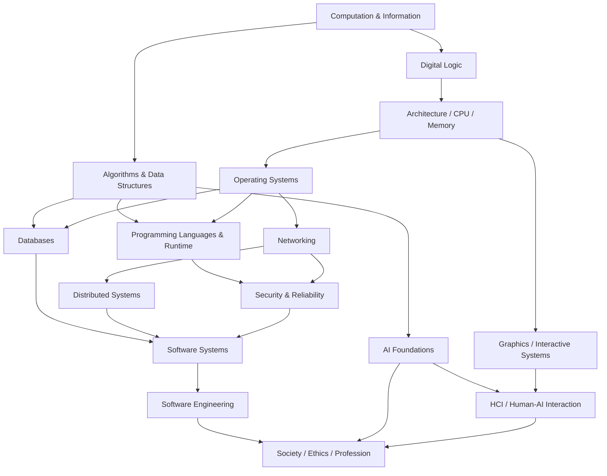

# Computer Science Basic — Comprehensive Foundations Knowledge Library

Đây là phần **kiến thức nền tảng (Basic / 기초)** của Computer Science Knowledge Library. Mục tiêu của folder này là xây mental model xuyên suốt từ information và computation đến hardware, operating systems, programming languages, databases, networks, distributed systems, security, software engineering, AI foundations, HCI/graphics và tác động xã hội của computing.

Library được tổ chức theo **conceptual dependency**, không theo Beginner → Intermediate → Advanced. “Basic” ở đây không có nghĩa nội dung sơ sài; nó có nghĩa đây là **foundation layer** mà các library chuyên sâu có thể dựa vào. Vì vậy các chapter vẫn giải thích mechanism, assumptions, trade-offs, failure modes và connection ở mức đủ sâu để sử dụng lâu dài.

Triết lý xuyên suốt là **Understanding > Memorization**, **Reasoning > Rule**, **Mental Model > Definition**, **Connection > Isolated Fact**. English terminology được giữ vì là terminology chuẩn quốc tế; Korean terminology được note khi hữu ích trong 교과서, 기사 시험, 회사 문서 hoặc technical communication.

## Cấu trúc thư viện

```text
computer_science/
└── basic/
    ├── 00_computation_information/
    ├── 01_algorithms_data_structures/
    ├── 02_computer_architecture/
    ├── 03_operating_systems/
    ├── 04_programming_languages/
    ├── 05_data_databases/
    ├── 06_networks_distributed_systems/
    ├── 07_security_reliability/
    ├── 08_software_systems/
    ├── 09_software_engineering/
    ├── 10_ai_foundations/
    ├── 11_hci_graphics/
    ├── 12_society_ethics_profession/
    ├── 90_connections/
    ├── 99_glossary.md
    └── COVERAGE_AUDIT.md
```

## Dependency và reading path

Không tồn tại một đường đọc duy nhất. Một đường foundation hợp lý là:



Nếu mục tiêu là backend/system engineering, có thể ưu tiên `00 → 01 → 02 → 03 → 05 → 06 → 07 → 08 → 09`. Nếu mục tiêu là language/runtime, đi `00 → 01 → 02 → 03 → 04`. Nếu mục tiêu AI, cần `00 → 01`, sau đó nối sang Mathematics về linear algebra, probability, calculus/optimization rồi vào `10_ai_foundations`. Nếu mục tiêu graphics/HCI, `02` và Mathematics geometry/linear algebra giúp phần graphics, còn HCI có thể học khá độc lập sau khi hiểu software system cơ bản.

---

## 00 — Computation & Information

- [Computer Science thực sự nghiên cứu gì?](./00_computation_information/00_what_computer_science_studies.md)
- [Information, bit, encoding và representation](./00_computation_information/01_information_bits_and_encoding.md)
- [Hệ số, integer, floating point và dữ liệu trong bộ nhớ](./00_computation_information/02_numbers_and_machine_representation.md)
- [Logic, state, abstraction và invariants](./00_computation_information/03_logic_state_abstraction_and_invariants.md)
- [Computability và giới hạn của tính toán](./00_computation_information/04_computability_and_limits.md)

## 01 — Algorithms & Data Structures

Nhóm này chỉ giữ phần DSA cần thiết như **foundation** cho toàn bộ Computer Science. Các cấu trúc/thuật toán chuyên sâu hơn nên nằm trong library Data Structures & Algorithms advanced riêng.

- [Algorithmic thinking, specification và correctness](./01_algorithms_data_structures/00_algorithmic_thinking_and_correctness.md)
- [Time/space complexity và asymptotic analysis](./01_algorithms_data_structures/01_complexity_and_asymptotic_analysis.md)
- [Memory model, locality và data layout](./01_algorithms_data_structures/02_memory_models_and_data_layout.md)
- [Array, linked list, stack, queue và deque](./01_algorithms_data_structures/03_linear_data_structures.md)
- [Hashing và hash table](./01_algorithms_data_structures/04_hashing_and_hash_tables.md)
- [Tree, heap và ordered search structures](./01_algorithms_data_structures/05_trees_heaps_and_search_structures.md)
- [Graph và graph algorithms](./01_algorithms_data_structures/06_graphs_and_graph_algorithms.md)
- [Sorting, searching và selection](./01_algorithms_data_structures/07_sorting_searching_and_selection.md)
- [Recursion, divide-and-conquer, greedy, backtracking và dynamic programming](./01_algorithms_data_structures/08_algorithmic_strategies.md)
- [String algorithms và text indexing](./01_algorithms_data_structures/09_string_algorithms_and_text_indexing.md)
- [Randomized, approximation và online algorithms](./01_algorithms_data_structures/10_randomized_approximation_and_online_algorithms.md)
- [Complexity, reductions, P/NP và lower bounds](./01_algorithms_data_structures/11_complexity_reductions_and_np.md)

## 02 — Computer Architecture

- [Digital logic, gates và sequential circuits](./02_computer_architecture/00_digital_logic_and_circuits.md)
- [CPU, ISA và instruction cycle](./02_computer_architecture/01_cpu_isa_and_instruction_cycle.md)
- [Memory hierarchy, cache và locality](./02_computer_architecture/02_memory_hierarchy_and_cache.md)
- [I/O, interrupt, DMA và devices](./02_computer_architecture/03_io_interrupts_dma_and_devices.md)
- [Machine code, assembly, ABI và calling convention](./02_computer_architecture/04_machine_code_assembly_and_abi.md)
- [Pipelining, multicore, SIMD, GPU và NUMA](./02_computer_architecture/05_parallel_computer_architecture.md)
- [Storage hardware: SSD, disks và persistence](./02_computer_architecture/06_storage_hardware_ssd_disks_and_persistence.md)
- [Performance, power và hardware measurement](./02_computer_architecture/07_performance_power_and_hardware_measurement.md)

## 03 — Operating Systems

- [Kernel, system call và OS abstractions](./03_operating_systems/00_kernel_syscalls_and_os_abstractions.md)
- [Process, thread và scheduling](./03_operating_systems/01_processes_threads_and_scheduling.md)
- [Concurrency, synchronization và deadlock](./03_operating_systems/02_concurrency_synchronization_and_deadlock.md)
- [Virtual memory và address spaces](./03_operating_systems/03_virtual_memory_and_address_spaces.md)
- [Filesystem, storage và buffered I/O](./03_operating_systems/04_filesystems_storage_and_io.md)
- [Privilege, isolation, containers và virtualization](./03_operating_systems/05_privilege_isolation_and_virtualization.md)
- [IPC: signals, pipes, sockets và shared memory](./03_operating_systems/06_ipc_signals_pipes_and_shared_memory.md)
- [Boot, device drivers và asynchronous I/O](./03_operating_systems/07_boot_device_drivers_and_async_io.md)

## 04 — Programming Languages & Runtime

- [Programming language semantics và execution models](./04_programming_languages/00_language_semantics_and_execution_models.md)
- [Types, values, references và memory management](./04_programming_languages/01_types_values_references_and_memory.md)
- [Scope, closures, functions và control flow](./04_programming_languages/02_scope_closures_functions_and_control_flow.md)
- [Compiler, interpreter, VM và JIT](./04_programming_languages/03_compilers_interpreters_vm_and_jit.md)
- [Imperative, OOP, functional và declarative paradigms](./04_programming_languages/04_programming_paradigms.md)
- [Errors, exceptions, resources và runtime safety](./04_programming_languages/05_errors_resources_and_runtime_safety.md)
- [Type systems, generics và polymorphism](./04_programming_languages/06_type_systems_generics_and_polymorphism.md)
- [Parsing, AST và language front-end](./04_programming_languages/07_parsing_ast_and_language_frontends.md)
- [Concurrency models và memory safety](./04_programming_languages/08_concurrency_models_and_memory_safety.md)

## 05 — Data & Databases

- [Data model và database systems](./05_data_databases/00_data_models_and_database_systems.md)
- [Relational model, keys và normalization](./05_data_databases/01_relational_model_keys_and_normalization.md)
- [Transactions, ACID và concurrency control](./05_data_databases/02_transactions_acid_and_concurrency_control.md)
- [Index, B-tree, hashing và query execution](./05_data_databases/03_indexes_and_query_execution.md)
- [Storage engine, WAL, recovery và durability](./05_data_databases/04_storage_logs_recovery_and_durability.md)
- [Relational algebra và SQL semantics](./05_data_databases/05_relational_algebra_and_sql_semantics.md)
- [Query optimization và execution plans](./05_data_databases/06_query_optimization_and_execution_plans.md)
- [NoSQL, distributed và analytical databases](./05_data_databases/07_nosql_distributed_and_analytical_databases.md)

## 06 — Networks & Distributed Systems

- [Network layers, packets và encapsulation](./06_networks_distributed_systems/00_network_layers_packets_and_encapsulation.md)
- [Ethernet, IP, subnetting và routing](./06_networks_distributed_systems/01_ethernet_ip_subnetting_and_routing.md)
- [TCP, UDP, flow control và congestion control](./06_networks_distributed_systems/02_transport_tcp_udp_and_congestion.md)
- [DNS, HTTP, TLS và một web request end-to-end](./06_networks_distributed_systems/03_dns_http_tls_and_web_request.md)
- [Time, failure và consistency trong distributed systems](./06_networks_distributed_systems/04_distributed_systems_time_failure_and_consistency.md)
- [Replication, partitioning và consensus](./06_networks_distributed_systems/05_replication_partitioning_and_consensus.md)
- [Sockets, IPv6, NAT, firewalls và VPN](./06_networks_distributed_systems/06_sockets_ipv6_nat_firewalls_and_vpn.md)
- [Routing protocols, BGP và Internet](./06_networks_distributed_systems/07_routing_protocols_and_the_internet.md)
- [HTTP/2, HTTP/3, QUIC và modern transport](./06_networks_distributed_systems/08_http2_http3_quic_and_modern_transport.md)

## 07 — Security & Reliability

- [Threat model và security principles](./07_security_reliability/00_threat_models_and_security_principles.md)
- [Hash, MAC, symmetric và public-key cryptography](./07_security_reliability/01_cryptography_foundations.md)
- [Identity, authentication và authorization](./07_security_reliability/02_identity_authentication_and_authorization.md)
- [Memory, web và injection vulnerabilities](./07_security_reliability/03_software_vulnerabilities.md)
- [Testing, verification và debugging](./07_security_reliability/04_testing_verification_and_debugging.md)
- [Fault tolerance, observability và reliability](./07_security_reliability/05_fault_tolerance_observability_and_reliability.md)
- [Web application security](./07_security_reliability/06_web_application_security.md)
- [Keys, secrets, certificates và secure operations](./07_security_reliability/07_keys_secrets_certificates_and_secure_operations.md)
- [Software supply chain và secure software lifecycle](./07_security_reliability/08_supply_chain_and_secure_software_lifecycle.md)

## 08 — Software Systems

- [Abstraction, modularity, interface và API contracts](./08_software_systems/00_abstraction_modularity_interfaces_and_apis.md)
- [Version control, build, linking và package dependency](./08_software_systems/01_version_control_build_link_and_packages.md)
- [Latency, throughput, capacity và scalability](./08_software_systems/02_performance_capacity_and_scalability.md)
- [State, queues, backpressure và system boundaries](./08_software_systems/03_state_queues_backpressure_and_boundaries.md)
- [Time, clocks, serialization và idempotency](./08_software_systems/04_time_serialization_and_idempotency.md)
- [Caching, load balancing và CDNs](./08_software_systems/05_caching_load_balancing_and_cdns.md)
- [Event-driven systems và stream processing](./08_software_systems/06_event_driven_and_stream_processing.md)
- [System decomposition, services và boundaries](./08_software_systems/07_system_decomposition_services_and_boundaries.md)

## 09 — Software Engineering

- [Requirements, specification và engineering process](./09_software_engineering/00_requirements_specification_and_engineering_process.md)
- [Software architecture và design reasoning](./09_software_engineering/01_software_architecture_and_design_reasoning.md)
- [Testing, quality và verification strategy](./09_software_engineering/02_testing_quality_and_verification_strategy.md)
- [Delivery, configuration và operations](./09_software_engineering/03_delivery_configuration_and_operations.md)
- [Maintenance, evolution và technical debt](./09_software_engineering/04_maintenance_evolution_and_technical_debt.md)

## 10 — AI Foundations

- [AI problem formulation, search và agents](./10_ai_foundations/00_ai_problem_formulation_search_and_agents.md)
- [Knowledge representation, reasoning và probabilistic inference](./10_ai_foundations/01_knowledge_reasoning_and_probabilistic_inference.md)
- [Machine Learning foundations](./10_ai_foundations/02_machine_learning_foundations.md)
- [Neural networks và representation learning](./10_ai_foundations/03_neural_networks_and_representation_learning.md)
- [AI evaluation, data và responsibility](./10_ai_foundations/04_ai_evaluation_data_and_responsibility.md)

## 11 — HCI & Computer Graphics

- [HCI, human factors và interaction models](./11_hci_graphics/00_hci_human_factors_and_interaction_models.md)
- [Interface design, accessibility và usability](./11_hci_graphics/01_interface_design_accessibility_and_usability.md)
- [Computer graphics pipeline và geometry](./11_hci_graphics/02_computer_graphics_pipeline_and_geometry.md)
- [Images, color, rasterization và rendering](./11_hci_graphics/03_images_color_rasterization_and_rendering.md)
- [Multimedia, animation và interactive systems](./11_hci_graphics/04_multimedia_animation_and_interactive_systems.md)

## 12 — Computing, Society, Ethics & Profession

- [Computing ethics, privacy và professional responsibility](./12_society_ethics_profession/00_computing_ethics_privacy_and_professional_responsibility.md)
- [Data governance, bias và algorithmic impact](./12_society_ethics_profession/01_data_governance_bias_and_algorithmic_impact.md)
- [Software law, licenses và intellectual property](./12_society_ethics_profession/02_software_law_licenses_and_intellectual_property.md)
- [Sustainability, accessibility và computing as social infrastructure](./12_society_ethics_profession/03_sustainability_accessibility_and_social_infrastructure.md)

## 90 — Knowledge Connections

- [Từ source code đến CPU](./90_connections/00_source_code_to_cpu.md)
- [Từ browser request đến database và quay về](./90_connections/01_browser_to_database_request.md)
- [Vòng đời dữ liệu: register → RAM → disk → network](./90_connections/02_data_lifecycle_memory_disk_network.md)
- [Trade-off xuyên CS: time, space, consistency, availability và complexity](./90_connections/03_cross_cutting_tradeoffs.md)
- [Abstraction layers và leaky abstractions](./90_connections/04_abstraction_layers_and_leaky_abstractions.md)

## Reference

- [Glossary Việt / English / 한국어](./99_glossary.md)
- [Coverage Audit](./COVERAGE_AUDIT.md)

## Liên kết sang các Knowledge Library khác

Computer Science dựa mạnh vào discrete mathematics, logic, probability, statistics, linear algebra, calculus, optimization và information theory. Các phần toán chi tiết đã có trong [Mathematics Knowledge Library](../../mathematics/README.md), đặc biệt [Logic & Proof](../../mathematics/00_foundations/01_logic_and_proof.md), [Graph Theory](../../mathematics/07_discrete_cs/00_graph_theory.md), [Algorithms & Complexity](../../mathematics/07_discrete_cs/01_algorithms_complexity_and_logarithms.md), [Automata/Formal Languages](../../mathematics/07_discrete_cs/07_automata_formal_languages_and_computability.md), [Information Theory](../../mathematics/07_discrete_cs/06_information_theory_and_coding.md), [Linear Algebra](../../mathematics/04_vectors_linear_algebra/01_matrices_and_linear_systems.md), [Probability](../../mathematics/06_probability_statistics/01_probability_foundations.md) và [Optimization](../../mathematics/08_optimization_numerical/00_optimization.md).

Các libraries Java, Spring, React, JavaScript, Swift, Kotlin... trong repo nên được đọc như **implementation-specific knowledge**. `computer_science/basic/` giải thích principles làm nền cho những APIs/frameworks đó, vì sao behavior tồn tại và trade-offs phía dưới abstraction.

## Scope boundary

“Comprehensive foundation” ở đây nghĩa **cover toàn bộ các foundational mental models lớn của Computer Science**, không có nghĩa nhồi mọi specialization vào `basic/`. Data Structures & Algorithms chuyên sâu, robotics, computer vision/NLP chuyên sâu, compiler backend optimization chuyên sâu, kernel development, formal verification chuyên sâu, cryptographic protocol proofs, cloud-provider-specific architecture, game-engine implementation, quantum computing và scientific computing nên trở thành các library advanced/specialized riêng dựa trên foundation này.
