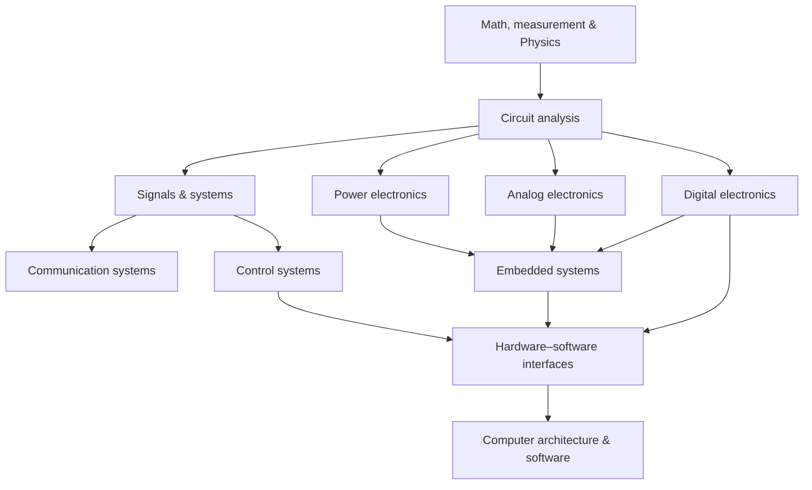

# Electrical Engineering Knowledge Library

Thư viện Kỹ thuật Điện (Electrical Engineering / 전기공학) mở rộng knowledge library từ **mô hình vật lý** sang **thiết kế, đo lường và vận hành hệ thống điện–điện tử**. Physics trả lời “tự nhiên hoạt động thế nào”; Electrical Engineering thêm các câu hỏi “chọn topology nào, đặt giới hạn nào, đo ra sao, bảo vệ thế nào và hệ thống fail như thế nào”.

Đây là một domain P3 được thêm để tạo cầu nối có chủ đích:

```text
Physics
→ Electronics
→ Digital logic
→ Computer Architecture
→ Embedded
→ Software
```

Physics hiện đã có Maxwell, circuits, transmission line, semiconductor, MOSFET và signal/noise. Thư viện này không lặp lại các chapter đó; nó dùng chúng làm prerequisite rồi đi tiếp vào engineering abstractions, trade-off và interface.

## Phạm vi canonical

```text
electrical_engineering/
├── README.md
├── COVERAGE_AUDIT.md
├── circuits/
├── analog_electronics/
├── digital_electronics/
├── signals_and_systems/
├── communication_systems/
├── control_systems/
├── embedded_systems/
├── power_electronics/
├── hardware_software_interfaces/
└── 90_connections/
```

## Dependency graph



Dependency này là learning route, không phải taxonomy cứng. Ví dụ một người làm firmware có thể vào `embedded_systems` trước rồi quay lại `digital_electronics` và `hardware_software_interfaces` khi gặp boundary cụ thể.

## Lộ trình đọc mặc định

1. **Circuits** — charge, voltage, current, impedance, Kirchhoff, transient, frequency response, grounding và measurement.
2. **Analog electronics** — diode, transistor, op-amp, biasing, feedback, noise, stability và ADC/DAC front-end.
3. **Digital electronics** — Boolean logic, combinational/sequential circuits, timing, metastability, memory, buses và HDL/FPGA boundary.
4. **Signals and systems** — LTI systems, convolution, Fourier/Laplace/Z transform, sampling, filtering và estimation.
5. **Communication systems** — baseband/passband, modulation, channel, noise, coding, synchronization, link budget và protocol layering.
6. **Control systems** — plant/sensor/actuator, state-space, stability, feedback, PID, observers, digital control và safety limits.
7. **Embedded systems** — MCU/SoC, interrupts, timers, DMA, RTOS, real-time scheduling, power/thermal budget, board bring-up và verification.
8. **Power electronics** — switches, converters, magnetics, PWM, control loop, EMI/EMC, batteries, thermal design và protection.
9. **Hardware–software interfaces** — registers, memory-mapped I/O, buses, drivers, boot, firmware contracts, timing, faults, update và observability.

## Ranh giới giữa các library

| Câu hỏi | Nơi đặt chính |
|---|---|
| Maxwell, trường, semiconductor và giới hạn vật lý | [Physics](../physics/README.md) |
| Mạch như một mô hình và hệ thống cần thiết kế/đo/verify | [Electrical Engineering](README.md) |
| CPU, ISA, memory hierarchy và OS abstraction | [Computer Science](../computer_science/README.md) |
| Firmware, board bring-up và peripheral contract | `embedded_systems/` và `hardware_software_interfaces/` |
| Driver/API, concurrency và production software | [Computer Science](../computer_science/README.md) và các library software tương ứng |

## Chuẩn của một chapter

Mỗi chapter hoàn chỉnh nên đi theo:

```text
physical law / requirement
→ circuit or system model
→ topology and component roles
→ quantitative reasoning
→ design trade-offs
→ measurement and verification
→ failure modes and protection
→ hardware/software boundary
→ bridge sang chapter kế tiếp
```

Không coi một datasheet, waveform hoặc schematic là bằng chứng tự đủ. Cần phân biệt model lý tưởng với parasitic, tolerance, temperature, noise, timing, loading và safety margin trong hệ thật.

## Trạng thái

Đây là **canonical P3 library** trên `main`: taxonomy, dependency map và các core chapters cho mỗi nhánh đã có; nội dung chuyên sâu sẽ được mở rộng theo từng nhánh mà không tạo bản sao của Physics hoặc Computer Science. Tiêu chí hoàn thiện và các khoảng trống hiện tại nằm ở [Coverage Audit](COVERAGE_AUDIT.md).

## Navigation

- [Circuits](circuits/README.md)
- [Analog electronics](analog_electronics/README.md)
- [Digital electronics](digital_electronics/README.md)
- [Signals and systems](signals_and_systems/README.md)
- [Communication systems](communication_systems/README.md)
- [Control systems](control_systems/README.md)
- [Embedded systems](embedded_systems/README.md)
- [Power electronics](power_electronics/README.md)
- [Hardware–software interfaces](hardware_software_interfaces/README.md)
- [End-to-end instrumentation/control case](90_connections/00_end_to_end_temperature_control_case.md)
- [Glossary Việt–Anh–Hàn](90_connections/01_glossary_vi_en_ko.md)
- [Lab and measurement checklist](90_connections/02_lab_and_measurement_checklist.md)
- [Coverage Audit](COVERAGE_AUDIT.md)
