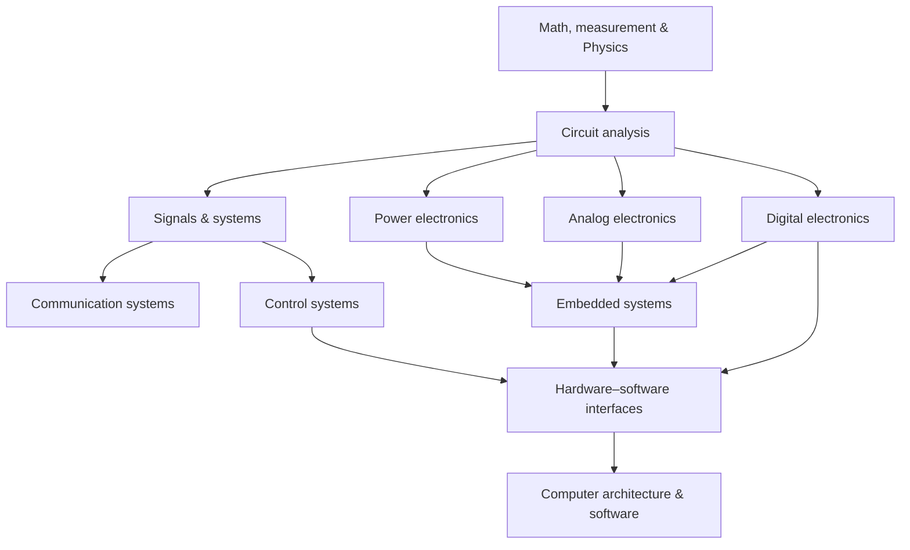

# Electrical kỹ thuật (engineering / 엔지니어링) thư viện kiến thức (knowledge library / 지식 라이브러리)

> **Mạch đọc:** README này là owner của **Electrical kỹ thuật (engineering / 엔지니어링) thư viện kiến thức (knowledge library / 지식 라이브러리)**. Route đi từ mô hình vật lý → circuits, electronics, signals và control → embedded/hardware interfaces → communication, power và measurement → reliability/safety, để mỗi nhánh thiết kế quay lại cơ chế nền và giới hạn vận hành.

Thư viện Kỹ thuật Điện (Electrical Engineering / 전기공학) mở rộng thư viện kiến thức (knowledge library / 지식 라이브러리) từ **mô hình vật lý** sang **thiết kế, đo lường và vận hành hệ thống điện–điện tử**. Physics trả lời “tự nhiên hoạt động thế nào”; Electrical kỹ thuật (engineering / 엔지니어링) thêm các câu hỏi “chọn topology nào, đặt giới hạn nào, đo ra sao, bảo vệ thế nào và hệ thống thất bại (fail / 실패) như thế nào”.

Đây là một lĩnh vực (domain / 도메인) P3 được thêm để tạo cầu nối có chủ đích:

```text
Physics
→ Electronics
→ Digital logic
→ Computer Architecture
→ Embedded
→ Software
```

Physics hiện đã có Maxwell, circuits, transmission line, semiconductor, MOSFET và tín hiệu (signal / 신호)/noise. Thư viện này không lặp lại các chapter đó; nó dùng chúng làm prerequisite rồi đi tiếp vào kỹ thuật (engineering / 엔지니어링) abstractions, sự đánh đổi (trade-off / 트레이드오프) và giao diện (interface / 인터페이스).

## Phạm vi chuẩn gốc (canonical / 정본)

```text
electrical_engineering/
├── README.md
├── COVERAGE_AUDIT.md
├── circuits/
├── analog_electronics/
├── digital_electronics/
├── signals_and_systems/
├── communication_systems/
├── control_systems/
├── embedded_systems/
├── power_electronics/
├── hardware_software_interfaces/
└── 90_connections/
```

> **Chuyển mạch:** **Phạm vi chuẩn gốc** xác định owner và ranh giới; **dependency graph** nối các prerequisite, rồi **Lộ trình đọc mặc định** biến đồ thị thành thứ tự học có thể kiểm tra.

## Phụ thuộc (dependency / 의존성) đồ thị (graph / 그래프)


```mermaid
flowchart TD
    M[Math, measurement & Physics]
    M --> C[Circuit analysis]
    C --> A[Analog electronics]
    C --> D[Digital electronics]
    C --> SS[Signals & systems]
    SS --> COM[Communication systems]
    SS --> CTRL[Control systems]
    D --> EMB[Embedded systems]
    A --> EMB
    C --> PE[Power electronics]
    PE --> EMB
    D --> HSI[Hardware–software interfaces]
    EMB --> HSI
    CTRL --> HSI
    HSI --> CS[Computer architecture & software]
```

Phụ thuộc (dependency / 의존성) này là học tập (learning / 학습) tuyến (route / 경로), không phải taxonomy cứng. Ví dụ một người làm firmware có thể vào `embedded_systems` trước rồi quay lại `digital_electronics` và `hardware_software_interfaces` khi gặp ranh giới (boundary / 경계) cụ thể.

> **Chuyển mạch:** **Lộ trình đọc mặc định** sắp xếp tín hiệu, mạch, điều khiển và embedded theo tiền đề; **Ranh giới giữa các thư viện** chỉ lúc nào cần chuyển owner sang domain khác.

## Lộ trình đọc mặc định

1. **Circuits** — charge, voltage, hiện tại (current / 현재), impedance, Kirchhoff, transient, frequency phản hồi (response / 응답), grounding và đo lường (measurement / 측정).
2. **Analog electronics** — diode, transistor, op-amp, biasing, phản hồi (feedback / 피드백), noise, stability và ADC/DAC front-end.
3. **Digital electronics** — Boolean lô-gic (logic / 논리), combinational/sequential circuits, timing, metastability, bộ nhớ (memory / 메모리), buses và HDL/FPGA ranh giới (boundary / 경계).
4. **Signals and các hệ thống (systems / 시스템들)** — LTI các hệ thống (systems / 시스템들), convolution, Fourier/Laplace/Z transform, sampling, filtering và estimation.
5. **Communication các hệ thống (systems / 시스템들)** — baseband/passband, modulation, channel, noise, coding, synchronization, link ngân sách (budget / 예산) và giao thức (protocol / 프로토콜) layering.
6. **điều khiển (control / 제어) các hệ thống (systems / 시스템들)** — plant/sensor/actuator, state-space, stability, phản hồi (feedback / 피드백), PID, observers, digital điều khiển (control / 제어) và an toàn (safety / 안전) limits.
7. **Embedded các hệ thống (systems / 시스템들)** — MCU/SoC, interrupts, timers, DMA, RTOS, real-time scheduling, power/thermal ngân sách (budget / 예산), board bring-up và xác minh (verification / 확인).
8. **Power electronics** — switches, converters, magnetics, PWM, vòng điều khiển (control loop / 제어 루프), EMI/EMC, batteries, thermal thiết kế (design / 설계) và protection.
9. **Hardware–software interfaces** — registers, memory-mapped I/O, buses, drivers, boot, firmware contracts, timing, faults, cập nhật (update / 업데이트) và khả năng quan sát (observability / 관측 가능성).

> **Chuyển mạch:** Sau khi biết biên owner, **Chuẩn của một chapter** nêu bằng chứng, ví dụ và verification tối thiểu để một bài không chỉ có công thức.

## Ranh giới giữa các thư viện (library / 라이브러리)

| Câu hỏi | Nơi đặt chính |
|---|---|
| Maxwell, trường, semiconductor và giới hạn vật lý | [Physics](../physics/README.md) |
| Mạch như một mô hình và hệ thống cần thiết kế/đo/verify | [Electrical Engineering](README.md) |
| CPU, ISA, bộ nhớ (memory / 메모리) hierarchy và OS lớp trừu tượng (abstraction / 추상화) | [Computer Science](../computer_science/README.md) |
| Firmware, board bring-up và peripheral đặc tả hợp đồng (contract / 계약) | `embedded_systems/` và `hardware_software_interfaces/` |
| Driver/API, tính đồng thời (concurrency / 동시성) và môi trường vận hành (production / 운영 환경) software | [Computer Science](../computer_science/README.md) và các thư viện (library / 라이브러리) software tương ứng |

> **Chuyển mạch:** **Chuẩn của một chapter** đưa ranh giới thành tiêu chí pass; **Trạng thái** ghi lại mức hoàn thiện và gap cần tiếp tục.

## Chuẩn của một chapter

Mỗi chapter hoàn chỉnh nên đi theo:

```text
physical law / requirement
→ circuit or system model
→ topology and component roles
→ quantitative reasoning
→ design trade-offs
→ measurement and verification
→ failure modes and protection
→ hardware/software boundary
→ bridge sang chapter kế tiếp
```

Không coi một datasheet, waveform hoặc schematic là bằng chứng tự đủ. Cần phân biệt mô hình (model / 모델) lý tưởng với parasitic, tolerance, temperature, noise, timing, loading và an toàn (safety / 안전) margin trong hệ thật.

> **Chuyển mạch:** Khi trạng thái đã được ghi, **Điều hướng** chỉ file kế tiếp, prerequisite và bằng chứng cần mở để đóng gap.

## Trạng thái

Đây là **chuẩn gốc (canonical / 정본) P3 thư viện (library / 라이브러리)** trên `main`: taxonomy, phụ thuộc (dependency / 의존성) map và các cốt lõi (core / 핵심) chapters cho mỗi nhánh đã có; nội dung chuyên sâu sẽ được mở rộng theo từng nhánh mà không tạo bản sao của Physics hoặc Khoa học máy tính (computer science / 컴퓨터 과학). Tiêu chí hoàn thiện và các khoảng trống hiện tại nằm ở [Coverage Audit](COVERAGE_AUDIT.md).

> **Chuyển mạch:** **Điều hướng** khép README bằng vòng lặp owner → route → kiểm chứng → cập nhật trạng thái, để người học không bị bỏ lại ở một danh sách chapter.

## Điều hướng (navigation / 내비게이션)

- [Circuits](circuits/README.md)
- [Analog electronics](analog_electronics/README.md)
- [Digital electronics](digital_electronics/README.md)
- [Signals and systems](signals_and_systems/README.md)
- [Communication systems](communication_systems/README.md)
- [Control systems](control_systems/README.md)
- [Embedded systems](embedded_systems/README.md)
- [Power electronics](power_electronics/README.md)
- [Hardware–software interfaces](hardware_software_interfaces/README.md)
- [End-to-end instrumentation/control case](90_connections/00_end_to_end_temperature_control_case.md)
- [Glossary Việt–Anh–Hàn](90_connections/01_glossary_vi_en_ko.md)
- [Lab and measurement checklist](90_connections/02_lab_and_measurement_checklist.md)
- [Coverage Audit](COVERAGE_AUDIT.md)

> **Bàn giao:** Sau **Điều hướng (navigation / 내비게이션)**, hãy giữ lại kết luận và ranh giới của mục này; quay về [README](./README.md) khi cần định vị owner hoặc chọn nhánh học tiếp theo.
