# Từ lịch sử đến mô hình kinh tế thị trường Hàn Quốc hiện nay (Economic Model & Historical Bridge / 한국 경제 발전과 현재 구조)

File này là **cầu nối** giữa cụm lịch sử `00_history/` và phần phân tích kinh tế–doanh nghiệp hiện tại. Nếu chưa đọc historical arc, nên đi từ [`00_history/00_legacy_before_1945.md`](./00_history/00_legacy_before_1945.md) đến [`00_history/08_company_genealogies.md`](./00_history/08_company_genealogies.md) trước.

Mục tiêu ở đây không phải kể lại chronology. Câu hỏi trung tâm là: **những cơ chế nào hình thành trong lịch sử vẫn đang quyết định cách Korean economy vận hành hôm nay?**

Hàn Quốc hiện nay không thể hiểu bằng một nhãn duy nhất như “export economy”, “chaebol economy”, “high-tech economy” hay “state-led capitalism”. Nó là một hệ thống nhiều lớp hình thành theo thời gian, trong đó manufacturing, services, households, finance, business groups, SMEs, state institutions và global markets cùng tương tác.

## Một nền kinh tế là path-dependent system

**Path dependence / 경로의존성** nghĩa là choice và capability tích lũy trong quá khứ làm một số con đường hiện tại rẻ hơn, nhanh hơn hoặc khả thi hơn những con đường khác.

Có thể hình dung historical layers như sau:

```mermaid
graph LR
    A[Pre-1945 market/industrial legacy] --> B[1945-61 reconstruction, land reform, aid]
    B --> C[1960s export industrialization]
    C --> D[1970s heavy & chemical industries]
    D --> E[1980s stabilization & liberalization]
    E --> F[1990s globalization]
    F --> G[1997 crisis & restructuring]
    G --> H[2000s broadband, global brands, China integration]
    H --> I[2010s advanced manufacturing & platforms]
    I --> J[2020s AI, economic security, aging, slow-growth transition]
```



Mỗi phase không xóa phase trước. Semiconductor Korea hôm nay phụ thuộc engineering capability tích lũy từ electronics/industrial policy trước đó. Hyundai Motor Group hiện nay vẫn mang dấu vết của supplier ecosystem và scale logic hình thành trong industrialization. Financial disclosure và market discipline hiện nay lại mang dấu vết của reforms sau 1997.

Vì vậy “current structure” là **history compressed into institutions and capabilities**.

## Từ thiếu productive capacity tới economy có capability sâu

Sau chiến tranh, Korea không chỉ thiếu money. Nó thiếu cả một network complements: electricity, ports, roads, machinery, factories, engineers, management systems, finance và export channels.

**Productive capacity / 생산능력** không phải tổng số machines. Một steel mill chỉ có value nếu có ore/energy, port, downstream demand, maintenance, engineers và finance. Automobile plant cần steel, components, logistics, dealers và consumer finance. Semiconductor fab cần ultrapure chemicals, equipment, power, process engineers và global customers.

Industrialization vì vậy là process xây **systems of complements**.

Mental model:

```text
Infrastructure
   +
Capital
   +
Technology
   +
Skills
   +
Organization
   +
Demand
   ↓
Productive capability
```

Đây là lý do một country không thể copy Korean growth bằng cách chỉ subsidize một factory.

## Vì sao export trở thành growth engine?

Korea early-development period có domestic market nhỏ và thiếu natural resources. Import machinery, oil và industrial inputs cần foreign currency.

Export giải hai constraints cùng lúc:

1. tạo foreign exchange để finance imports;
2. mở market lớn hơn domestic demand.

Nhưng export còn tạo một cơ chế quan trọng hơn: **export discipline / 수출규율**.

Foreign buyer không có nghĩa vụ mua hàng Korean. Firm phải cạnh tranh về price, quality, delivery và technical standard. Government có thể hỗ trợ credit/infrastructure, nhưng không thể ép global customer chấp nhận product tệ.

Điều này tạo feedback loop:

```text
Policy support
   ↓
Firm investment
   ↓
Export performance
   ↓
Foreign currency + learning
   ↓
More capability
   ↓
More sophisticated exports
```

Export-led growth vì vậy vừa là demand strategy vừa là **learning mechanism**.

## Comparative advantage của Korea không phải thứ bất biến

Trong textbook, comparative advantage thường được hiểu như lợi thế sẵn có. Nhưng Korean history cho thấy advantage có thể được **constructed**.

Korea ban đầu không có natural comparative advantage rõ trong shipbuilding, cars, semiconductors hay batteries. Advantage được tạo qua capital investment, imported technology, learning-by-doing, supplier networks và human capital.

Có thể tách hai loại:

**Static comparative advantage**: dựa vào resource/endowment hiện tại.

**Dynamic comparative advantage / 동태적 비교우위**: capability có thể được tạo qua investment và learning.

Industrial policy của Korea historically tập trung mạnh vào loại thứ hai—but với risk lớn vì state/firms có thể chọn sai sector hoặc overinvest.

## Vì sao chaebol trở thành core của industrialization?

Heavy industry có high fixed cost và long payback. Khi capital market còn shallow, large projects cần organizations có khả năng mobilize finance, engineers và management nhanh.

Một firm làm project thành công có track record tốt hơn, access credit tốt hơn và managerial depth lớn hơn. Success tạo cumulative advantage.

Đây là một mechanism hình thành **chaebol / 재벌** và large business groups.

Nhưng chaebol không phải toàn economy. Group lớn đứng trên một network gồm SMEs, banks, workers, logistics, universities và public infrastructure.

Scale tạo advantages:

- large capex;
- R&D portfolio;
- global distribution;
- risk diversification;
- internal capital/talent markets.

Nhưng same scale tạo risks:

- control–ownership gap;
- minority-shareholder conflicts;
- related-party transactions;
- supplier bargaining asymmetry;
- resource concentration.

Vì vậy Korea hiện tại vừa dựa vào global champions vừa regulation business-group behavior.

Đọc [`04_chaebol_and_large_business_groups.md`](./04_chaebol_and_large_business_groups.md), [`05_group_structure_affiliates_holding_companies.md`](./05_group_structure_affiliates_holding_companies.md) và [`06_sme_mid_sized_and_subcontracting_ecosystem.md`](./06_sme_mid_sized_and_subcontracting_ecosystem.md).

## SME ecosystem là phần còn lại của production system, không phải “economy nhỏ” tách biệt

SMEs chiếm gần như toàn bộ firm count và phần lớn employment. Trong manufacturing, nhiều SMEs nằm trong supplier tiers của large exporters; trong services, hàng triệu firms phục vụ domestic consumers.

Đây là lý do productivity gap giữa large firms và SMEs có macro consequence. Nếu global champion tăng productivity rất nhanh nhưng 80% workers ở firms productivity thấp hơn nhiều, aggregate wage/productivity diffusion bị hạn chế.

Một vấn đề central của Korea hiện đại là làm sao chuyển:

```text
Supplier dependence
   ↓
Capability accumulation
   ↓
Independent technology/brand
   ↓
Customer/export diversification
   ↓
Scale-up
```

Nếu chain dừng ở “dependence”, dualism kéo dài.

## 1997 thay đổi luật chơi corporate Korea

Asian Financial Crisis cho thấy scale không thay được balance-sheet discipline.

Pre-crisis system có high leverage, maturity/currency mismatch và weak monitoring ở nhiều parts. Khi foreign rollover dừng, liquidity crisis truyền sang currency, banks và corporations.

Sau 1997, Korea cải cách mạnh financial supervision, disclosure, corporate governance, debt structure và restructuring mechanisms.

Current Korean company vì thế phải được đọc ở hai layers:

```text
Historical group logic
→ affiliates, control, industrial capability

Post-1997 market logic
→ cash flow, leverage, ROIC, disclosure, minority shareholders
```

Nếu chỉ biết chaebol history, ta dễ bỏ qua balance-sheet risk. Nếu chỉ đọc ratios, ta dễ không hiểu why ownership graph exists.

Đọc [`00_history/05_1990s_globalization_and_1997_crisis.md`](./00_history/05_1990s_globalization_and_1997_crisis.md).

## Market economy không có nghĩa state biến mất

Korea hiện nay là **market economy / 시장경제**: private firms, contracts, prices và capital markets quyết định phần lớn resource allocation.

Nhưng market không tồn tại ngoài institutions. Government ảnh hưởng incentives qua:

- taxes;
- R&D grants;
- competition rules;
- financial regulation;
- policy finance;
- trade agreements;
- energy policy;
- land/infrastructure;
- public procurement.

State role hiện nay khác 1970s. Directed credit trực tiếp ít central hơn; policy thường tác động qua **relative cost, return và risk**.

Do đó modern semiconductor/battery policy không phải bản copy đơn giản của HCI drive.

Xem [`26_economic_institutions_and_policy_making.md`](./26_economic_institutions_and_policy_making.md).

## Korea hiện đại có thể đọc như năm balance sheets chồng lên nhau

Một mental model rất hữu ích là nhìn economy qua năm balance-sheet systems.

### 1. Household balance sheet

Income, housing, deposits, mortgages và consumer credit quyết định domestic consumption và financial stability.

### 2. Corporate balance sheet

Cash, debt, capex, working capital và profitability quyết định investment/hiring.

### 3. Financial-sector balance sheet

Banks, insurers và securities firms connect household savings với corporate/property credit.

### 4. Government/public-sector balance sheet

Fiscal spending, public enterprises, policy banks và pensions absorb/redistribute risk.

### 5. External balance sheet

FX reserves, foreign assets/liabilities, trade/current account và cross-border investments connect Korea với world finance.

Shock thường truyền từ một balance sheet sang balance sheet khác. Housing decline có thể hit household collateral, bank credit và construction company cash flow. Semiconductor boom có thể nâng exports, corporate profit, fiscal revenue và investment.

## Global manufacturing và domestic services: hai cycles chồng lên nhau

Một cách nhìn hữu ích là tách **globally exposed manufacturing** khỏi **domestic-demand services**.

Global layer gồm semiconductors, autos, batteries, shipbuilding, chemicals, machinery. Nó nhạy với global capex, commodity/technology cycles, FX và geopolitics.

Domestic layer gồm retail, restaurants, housing, healthcare, education, local finance và many SMEs. Nó nhạy với household income, debt service, demographics và domestic regulation.

Hai cycles có thể diverge.

HBM exports có thể booming khi restaurants/retail yếu. Housing recovery có thể diễn ra khi memory prices vẫn low.

Vì vậy headline GDP không đủ để hiểu firm.

## Manufacturing strength nhưng service productivity là structural bottleneck

Korea giữ manufacturing capability cao so với many advanced economies. Manufacturing tạo exports, R&D spillovers và high-productivity jobs.

Nhưng employment concentrated nhiều ở services/SMEs có productivity thấp hơn frontier manufacturing.

Trong mature economy, growth identity ngày càng là:

\[
GDP\ Growth \approx Labor\ Growth + Capital\ Deepening + TFP\ Growth
\]

Khi labor growth âm và capital deepening chậm lại, **TFP/productivity** phải đóng vai trò lớn hơn.

Đây là reason service reform, digitalization, AI, management quality và resource reallocation trở thành central.

Đọc [`28_productivity_services_and_economic_dualism.md`](./28_productivity_services_and_economic_dualism.md).

## Demographic transition thay đổi constraint của economy

High-growth Korea từng có young labor force và urbanization. Current Korea đối mặt rapid aging và shrinking working-age population.

Nếu workers giảm, growth phải bù bằng participation, immigration và productivity.

Demographics còn thay consumption mix: healthcare/senior services tăng relative importance; education/child-related markets co lại; regional depopulation ảnh hưởng infrastructure economics.

Vì vậy demographics không phải macro background; nó đi thẳng vào HR, store location, housing và product strategy.

Xem [`27_demographics_households_and_consumption.md`](./27_demographics_households_and_consumption.md).

## Household debt và housing tạo một monetary-policy trade-off riêng

Housing chiếm phần lớn assets của many households và debt thường liên kết với property.

Khi rates tăng:

```text
Debt service ↑
→ disposable income ↓
→ consumption pressure
```

Nhưng khi rates giảm quá mạnh, housing/leverage có thể tăng.

Do đó BOK và financial regulators phải balance price/growth objectives với financial stability.

Korea hiện đại không thể hiểu chỉ bằng corporate exports; household balance sheet là một macro engine riêng.

## Global Value Chains: nationality và production location không còn trùng nhau

Korean firms ngày càng là multinational production systems.

Hyundai can sell cars produced abroad; battery plants may be in US/Europe; electronics assembled across Asia; content distributed by global platforms.

“Made in Korea” vì vậy không phải boundary của Korean corporate value creation.

Cần hỏi company control phần nào của chain:

- technology;
- design;
- brand;
- manufacturing process;
- distribution;
- IP;
- customer relationship.

Gross export data chỉ đo cross-border shipment, không đo toàn bộ value captured by Korean firms.

Xem [`02_trade_export_and_global_value_chains.md`](./02_trade_export_and_global_value_chains.md).

## Geopolitics trở thành input của corporate finance

US–China rivalry, export controls, sanctions, local-content requirements và critical-mineral rules khiến supply-chain choice không còn pure cost optimization.

Một firm có thể chọn plant location có operating cost cao hơn nhưng nhận subsidy, market access và lower geopolitical risk.

Do đó NPV của project hiện đại có thêm **policy/geopolitical state variables**.

```text
Old optimization
Cost + Quality + Logistics

New optimization
Cost + Quality + Logistics + Subsidy + Resilience + Political Risk
```

Semiconductor, battery, defense và critical materials chịu effect rõ nhất.

## Energy là hidden constraint của advanced industry

Semiconductor fabs, steel, chemicals, batteries và AI data centers đều cần large, reliable energy supply.

Korea phụ thuộc nhiều vào imported energy và có geographically isolated electricity system. Vì vậy power generation mix, grid expansion, nuclear/LNG/renewables và tariff policy ảnh hưởng industrial competitiveness.

Cheap electricity hỗ trợ manufacturer nhưng nếu tariff không phản ánh cost, public utility balance sheet có thể chịu pressure.

Đọc [`30_energy_security_power_market_and_transition.md`](./30_energy_security_power_market_and_transition.md).

## Innovation stage: từ technology absorption tới frontier creation

Catching-up economy có thể tăng productivity bằng imported machinery và licensing.

Frontier economy phải tự tạo invention, process improvement, software, standard, brand và organizational capability.

Đây là lý do R&D spending của Korea cao nhưng quantity spending không đủ. Challenge là **commercialization và diffusion**: innovation của Samsung/Hyundai/SK có lan sang SMEs/services không?

Xem [`29_innovation_rnd_education_and_human_capital.md`](./29_innovation_rnd_education_and_human_capital.md).

## Digital economy: software trở thành layer của mọi industry

Digital Korea không chỉ là Naver/Kakao/Toss.

Banking có core systems và fintech; manufacturing có MES/ERP/AI inspection; logistics có tracking; public sector có e-government; retailers có e-commerce.

Do đó software productivity ảnh hưởng cả non-software firms.

AI tiếp tục trend này: model access có thể commoditize, nhưng data/process integration và human judgment quyết định firm-level productivity gain.

Xem [`34_digital_fintech_cloud_and_it_services.md`](./34_digital_fintech_cloud_and_it_services.md).

## Korea hiện tại có ba growth questions khác nhau

### Cyclical growth

Economy đang ở phase nào của semiconductor, global trade, rates và housing cycle?

### Potential growth

Labor, capital và productivity có thể tạo trend growth bao nhiêu trong nhiều năm?

### Structural transformation

Resources có đang chuyển sang higher-productivity firms/sectors nhanh đủ không?

Ba questions này không được trộn.

Một semiconductor boom có thể nâng cyclical GDP 2026 nhưng không tự xóa aging. Structural reform có thể làm potential growth tốt hơn nhưng gây transition pain ngắn hạn.

## Current 2026 snapshot: mạnh theo cycle nhưng vẫn có structural constraints

Bank of Korea outlook tháng 8/2026 dự báo real GDP growth **3,3% năm 2026** và **2,9% năm 2027**, với semiconductor/AI-related demand là một driver quan trọng. Đây là forecast tại thời điểm tháng 8/2026, không phải final realized outcome.

Cùng lúc, BOK research về potential growth nhấn mạnh working-age decline, slower capital accumulation và productivity diffusion yếu hơn.

Hai câu này có thể đúng cùng lúc:

```text
2026 cyclical/technology strength
≠
long-run structural problem solved
```

Đây là distinction phải giữ khi đọc news.

## Korea hiện nay cần giải bài toán gì?

High-growth catch-up model đã hoàn thành phần lớn nhiệm vụ ban đầu. Constraints hiện nay khác:

- aging và shrinking labor force;
- service/SME productivity gap;
- scale-up bottleneck của smaller firms;
- household/housing leverage;
- frontier technology competition;
- energy/import dependency;
- geopolitical fragmentation;
- governance/capital allocation;
- regional concentration;
- need to convert R&D into commercial productivity.

Đây không phải list “điểm yếu của Korea”. Nó là definition của **next-stage development problem**.

## Từ macro shock tới company cash flow

Khi có news, đừng dừng ở macro label. Trace transmission:

```text
Global / domestic shock
        ↓
FX / rate / demand / input cost / regulation
        ↓
Industry structure
        ↓
Company revenue & cost
        ↓
Working capital / debt / cash flow
        ↓
Capex / hiring / payout
```

Ví dụ KRW depreciation có thể tốt cho exporter có USD revenue và KRW cost, nhưng xấu cho importer có USD debt. Rate hike có thể xấu cho levered construction nhưng tốt cho bank margin trong một số phase—trừ khi credit losses tăng.

Framework chi tiết ở [`21_economy_to_company_transmission.md`](./21_economy_to_company_transmission.md).

## Mental Model

> Korean economy hiện nay là **một network của historical capabilities và modern constraints**. Manufacturing strength, chaebol scale, SME supplier networks, post-1997 finance, broadband/digital infrastructure, household housing system và industrial policy đều là layers của cùng một system.

Một map nén:

```text
History
  ↓
Institutions + Capabilities
  ↓
Households + Firms + Finance
  ↓
Trade + Technology + Energy
  ↓
Productivity + Capital Allocation
  ↓
Growth and Living Standards
```

## Common misconceptions

**“Korea = chaebol economy.”** Sai. SMEs/services chiếm phần lớn firms/employment.

**“Korea = export economy nên domestic housing không quan trọng.”** Sai. Household/property cycle ảnh hưởng consumption, banks và construction.

**“State-led history nghĩa current economy không phải market economy.”** Sai. Market allocation là central nhưng institutions/policy vẫn thay incentives.

**“Manufacturing mạnh nghĩa productivity problem đã giải quyết.”** Sai. Diffusion sang services/SMEs là challenge riêng.

**“GDP tăng nhanh năm nay nghĩa potential growth đã tăng.”** Sai. Cyclical và structural growth khác nhau.

**“Geopolitics chỉ là political news.”** Sai với semiconductor/battery/defense: nó đi trực tiếp vào capex, sourcing và market access.

## Lộ trình đọc từ đây

Sau historical bridge này, nên đọc theo sequence:

```text
01 Macro economy
   ↓
02 Trade & Global Value Chains
   ↓
03 Company forms
   ↓
04–08 Groups / SMEs / Startups / Governance
   ↓
09–11 Disclosure / Capital markets / Funding
   ↓
12–18 Labor / Culture / Industries
   ↓
19–25 Case studies / Analysis / Regulation / Geography
   ↓
26–34 Institutions / Demographics / Productivity / Innovation / New industries
```

### Nguồn nền

- KDI historical-development studies on Korean growth, industrial policy, business groups and post-1997 restructuring.
- Bank of Korea macro research, Economic Outlook and studies on potential growth/productivity.
- Korea Fair Trade Commission materials on business groups/competition.
- FSS/DART and KRX for company/capital-market structure.
- Statistics Korea for demographics/household structure.

Current numbers/forecasts trong chapter luôn được ghi mốc thời gian; historical mechanisms và mental models được tách khỏi short-term snapshots để library không nhanh lỗi thời.
