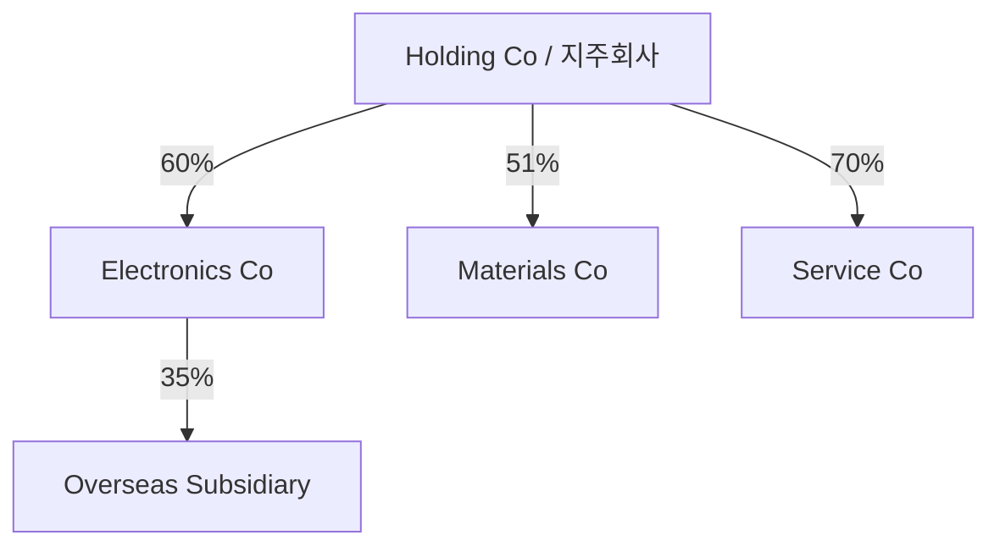

# Cấu trúc tập đoàn, affiliate và holding company (Group Structure / 지주회사·계열회사 구조)

Khi nhìn sơ đồ tập đoàn Hàn Quốc, người mới thường thấy một mạng lưới mũi tên phức tạp và cố ghi nhớ từng công ty. Cách hiệu quả hơn là hiểu các “primitive” của cấu trúc: parent, subsidiary, affiliate, holding company, ownership percentage, voting rights và control.

## Parent, subsidiary, affiliate

**Công ty mẹ (Parent Company / 모회사)** là công ty kiểm soát một công ty khác. **Công ty con (Subsidiary / 자회사)** nằm dưới control của parent. Trong thực tế accounting, control thường liên quan voting rights và ability to direct relevant activities, không chỉ một threshold máy móc.

**Công ty liên kết/affiliate (Affiliate / 계열회사·관계기업)** là từ rộng hơn. Trong ngữ cảnh chaebol, `계열사` thường chỉ các công ty cùng business group. Trong kế toán, `관계기업` có technical meaning gần associate nơi investor có significant influence nhưng không control hoàn toàn.

Do đó khi dịch “affiliate” sang tiếng Hàn phải nhìn context, không map cứng một-một.

## Holding company

**Công ty holding (Holding Company / 지주회사)** sở hữu cổ phần các công ty khác để kiểm soát chúng. Nó khác operating company vì core purpose của holding company là ownership/control thay vì trực tiếp sản xuất sản phẩm chính.

Sơ đồ đơn giản:

Lợi ích là control chain dễ nhìn hơn và separation giữa businesses rõ hơn. Nhưng economic exposure của shareholder holding company không đơn giản bằng cộng market cap các subsidiaries. Có net debt ở holding, tax leakage, unlisted assets và **holding company discount / 지주회사 할인**.

## Consolidated vs separate financial statements

Đây là distinction cực quan trọng. **Báo cáo tài chính riêng (separate financial statements / 별도재무제표)** nhìn một legal entity. **Báo cáo hợp nhất (consolidated financial statements / 연결재무제표)** coi parent + subsidiaries được control như một economic group cho mục đích accounting.

Nếu Parent bán hàng cho Subsidiary, consolidated revenue không thể đơn giản cộng cả hai bên vì giao dịch nội bộ phải eliminated. Nếu không hiểu consolidation, người đọc dễ double count.

## Minority interest

Parent không cần sở hữu 100% subsidiary. Nếu sở hữu 60%, consolidated statements có thể bao gồm 100% assets/revenue của subsidiary vì parent controls nó, sau đó phần lợi ích thuộc cổ đông bên ngoài được thể hiện qua **non-controlling interests (NCI / 비지배지분)**.

Đây là lý do consolidated net income và “net income attributable to owners of parent” có thể khác nhau.

## Circular ownership và pyramids

Ownership chain kiểu `A → B → C` cho phép control mở rộng theo hình pyramid. Trong một số cấu trúc lịch sử, circular shareholding có thể làm control network phức tạp hơn. Hàn Quốc có regulation nhằm hạn chế cross-shareholding/circular arrangements trong các large business groups nhất định.

Điểm cần giữ lại không phải sơ đồ lịch sử cụ thể mà là nguyên tắc: **economic control can travel through a chain**. Vì vậy cần nhân ownership percentages để ước lượng indirect economic interest nhưng phải phân tích voting/control riêng.

Ví dụ, nếu A sở hữu 40% B và B sở hữu 30% C, indirect economic stake của A trong C qua chain này gần:

\[
0.40 \times 0.30 = 0.12 = 12\%
\]

Nhưng 12% economic interest không tự động nghĩa chỉ có 12% control nếu B đã control C và A control B.

## Related-party transactions

Giao dịch với bên liên quan (Related-party Transaction / 특수관계자 거래) là nơi structure biến thành economics thực tế: group company mua dịch vụ từ một affiliate, cho vay, bảo lãnh, bán tài sản hoặc phân bổ business. Không phải mọi related-party transaction đều xấu; trong integrated group chúng có thể hợp lý. Câu hỏi là pricing, necessity, governance và lợi ích cho từng entity.

## Vì sao group cần nhiều pháp nhân?

Tách business thành separate corporations giúp ring-fence liability, raise capital riêng, bring strategic partner vào một unit và đo performance theo business. Một battery subsidiary có capex/risk khác consumer-electronics parent; một finance company còn chịu regulatory capital riêng.

Nhưng càng nhiều legal entities, group càng khó đọc. Economic reality và legal boundary không luôn trùng nhau.

## Holding company architecture

Pure holding company chủ yếu sở hữu stakes; operating holding company vừa hold stakes vừa có own operations. Korean holding-company regulation đặt conditions riêng, nên conversion thường là cả governance lẫn regulatory decision.

Mental model là tách **control layer** khỏi **operating layer**. Holding layer allocate capital và appoint boards; operating subsidiaries sell products/services.

## Consolidation boundary

Accounting consolidation không dựa duy nhất >50% shares. Control có thể tồn tại nếu entity có power over relevant activities, exposure to variable returns và ability use power to affect returns. Vì vậy analyst phải đọc accounting policy, not infer from stake alone.

Associate thường dùng equity method khi có significant influence nhưng không control. Joint venture lại có joint control. Ba classification này làm revenue/profit presentation khác mạnh.

## Minority interest / non-controlling interest

Nếu parent owns 70% subsidiary và consolidates 100% revenue/profit, 30% profit attributable to outsiders phải tách thành non-controlling interests (비지배지분). Vì vậy consolidated net income không luôn equal income attributable to parent shareholders.

Khi valuation, analyst cần tránh dùng 100% subsidiary EBITDA nhưng ignore value của minority holders.

## Cross-shareholding và circularity

Circular ownership A→B→C→A có thể amplify control và làm unwind khó. Korea đã restrict nhiều forms của circular shareholding, nhưng historical ownership chains vẫn quan trọng để hiểu groups.

Even without circle, pyramidal structure có thể create control leverage. Vẽ graph với percentages giúp thấy điều mà org chart marketing che mất.

## Related-party economics

Affiliate transaction có thể efficient: logistics affiliate phục vụ toàn group tạo scale; IT affiliate standardize systems. Nhưng price phải gần arm's-length và procurement không nên khóa competitor bất hợp lý.

DART disclosures về 특수관계자 거래, guarantees và intra-group balances là nơi analyst kiểm tra claim “synergy” có biến thành value transfer không.

## Spin-off: 인적분할 và 물적분할

Korean corporate news thường dùng `인적분할` (spin-off where existing shareholders generally receive shares in separated company proportionally) và `물적분할` (parent retains shares of newly separated subsidiary). Economic consequence khác nhau, đặc biệt nếu subsidiary sau đó IPO.

Minority shareholders quan tâm whether growth business bị moved into subsidiary and whether parent shareholders receive direct ownership. Đây là reason restructuring announcements có thể gây valuation reaction lớn.

## Mental Model

> Đọc group structure như đọc graph trong Computer Science: **node = legal entity, edge = ownership/control/transaction relationship**. Muốn hiểu group, đừng chỉ nhìn node nổi tiếng; hãy xác định edge nào mang quyền kiểm soát và edge nào mang dòng tiền.

## Connections

[08_corporate_governance_ownership_and_control](./08_corporate_governance_ownership_and_control.md) đi sâu agency problem; [09_disclosure_accounting_dart_kind](./09_disclosure_accounting_dart_kind.md) chỉ nơi tìm ownership và related-party data; [19_major_groups_case_studies](./19_major_groups_case_studies.md) áp dụng mental model vào các group cụ thể.
