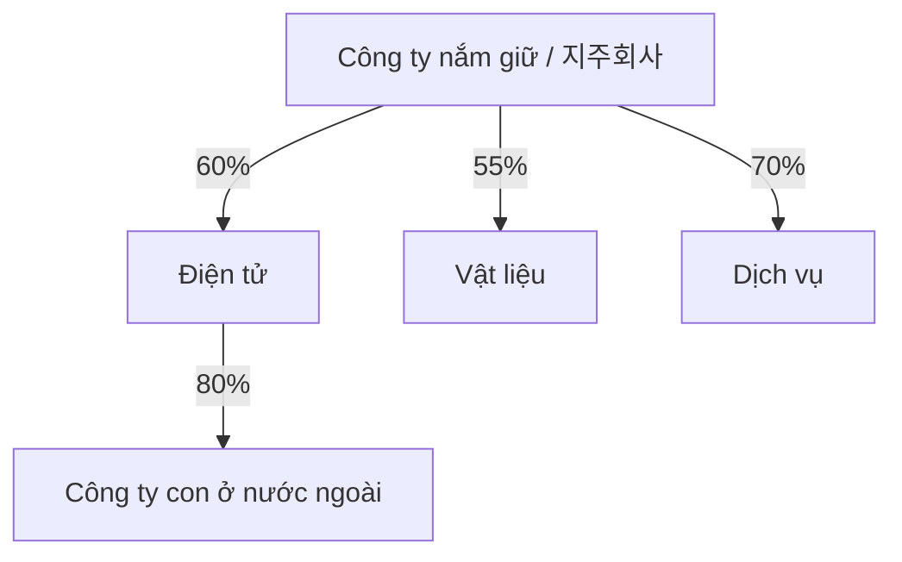

# Cấu trúc tập đoàn, công ty thành viên và công ty nắm giữ tại Hàn Quốc (Group Structure / 지주회사·계열회사 구조)

Khi nhìn sơ đồ một tập đoàn Hàn Quốc, người mới thường thấy hàng chục pháp nhân rồi cố ghi nhớ tên từng công ty. Cách hiệu quả hơn là coi cả tập đoàn như một **đồ thị (graph)**: mỗi nút là một pháp nhân, còn mỗi cạnh thể hiện quan hệ sở hữu, kiểm soát, giao dịch, khoản vay hoặc bảo lãnh.

Mục tiêu không phải nhớ mọi công ty con. Mục tiêu là hiểu **quyền kiểm soát đi qua đâu, tiền mặt nằm ở đâu, nợ nằm ở đâu và nhóm cổ đông nào thật sự nhận hoặc gánh kết quả kinh tế**.

## Thương hiệu tập đoàn khác với pháp nhân

“Samsung”, “Hyundai” hay “SK” là tên tập đoàn hoặc thương hiệu chung. Samsung Electronics, Samsung C&T và Samsung Life lại là các **pháp nhân riêng biệt (separate legal entities)**.

Mỗi pháp nhân có hội đồng quản trị, cổ đông, tài sản–nợ phải trả, hợp đồng, nghĩa vụ thuế, chủ nợ và báo cáo tài chính riêng. Vì vậy câu chuyện ở cấp tập đoàn không thể thay thế phân tích ở cấp pháp nhân.

## Parent, subsidiary, affiliate và associate khác nhau thế nào?

**Công ty mẹ (parent / 모회사)** là pháp nhân kiểm soát một công ty khác. **Công ty con (subsidiary / 자회사)** là pháp nhân bị công ty mẹ kiểm soát.

Trong bối cảnh chaebol hoặc tập đoàn doanh nghiệp, **công ty thành viên (affiliate / 계열회사)** thường chỉ các công ty cùng nằm trong một nhóm kiểm soát. Nhưng trong kế toán, **công ty liên kết (associate / 관계기업)** thường mang nghĩa kỹ thuật: nhà đầu tư có ảnh hưởng đáng kể nhưng không kiểm soát.

Vì vậy một từ tiếng Anh như `affiliate` có thể mang nghĩa khác tùy ngữ cảnh; không nên dịch máy móc.

## Tỷ lệ sở hữu và quyền kiểm soát không phải cùng một biến

Tỷ lệ sở hữu cho biết phần lợi ích kinh tế. Quyền kiểm soát cho biết khả năng quyết định hoạt động quan trọng.

Giả sử A sở hữu 40% B, trong khi 60% còn lại được chia cho nhiều cổ đông nhỏ. A vẫn có thể kiểm soát B trên thực tế. Nếu B tiếp tục nắm 35% C và kiểm soát C, quyền kiểm soát có thể truyền từ A sang C dù phần sở hữu kinh tế gián tiếp của A tại C chỉ khoảng 14%.

Vì vậy không được suy ra quyền kiểm soát chỉ bằng cách nhân các tỷ lệ sở hữu.

## Quyền kiểm soát trong kế toán

Khi xác định có phải hợp nhất một công ty hay không, kế toán thường xem nhà đầu tư có: quyền lực đối với các hoạt động quan trọng, quyền hưởng hoặc chịu biến động lợi ích kinh tế, và khả năng dùng quyền lực đó để ảnh hưởng tới lợi ích hay không.

Sở hữu trên 50% quyền biểu quyết là dấu hiệu phổ biến nhưng không phải tiêu chí duy nhất. Khi ranh giới kiểm soát không rõ, phải đọc chính sách kế toán và thuyết minh báo cáo tài chính.

## Báo cáo riêng và báo cáo hợp nhất

**Báo cáo tài chính riêng (separate financial statements / 별도재무제표)** phản ánh pháp nhân công ty mẹ. **Báo cáo tài chính hợp nhất (consolidated financial statements / 연결재무제표)** trình bày công ty mẹ và các công ty con do nó kiểm soát như một đơn vị kinh tế kế toán.

Các giao dịch nội bộ giữa các đơn vị trong phạm vi hợp nhất được loại trừ để tránh tính hai lần. Nếu công ty mẹ bán hàng trị giá 100 cho công ty con, tập đoàn hợp nhất chưa thể coi 100 đó là doanh thu từ bên ngoài cho tới khi hàng hóa hoặc dịch vụ rời phạm vi hợp nhất.

Đây là một trong những khái niệm quan trọng nhất khi đọc tập đoàn.

## Nhóm hợp nhất không đồng nghĩa với toàn bộ chaebol

Một tập đoàn doanh nghiệp có thể chứa nhiều công ty không nằm dưới quyền kiểm soát của cùng một công ty mẹ niêm yết. Báo cáo hợp nhất của một công ty thành viên chỉ bao gồm các công ty con do chính pháp nhân đó kiểm soát, không bao gồm mọi công ty mang cùng thương hiệu tập đoàn.

Vì vậy không thể lấy báo cáo hợp nhất của Samsung Electronics rồi coi đó là “doanh thu của toàn Samsung Group”.

## Lợi ích cổ đông không kiểm soát (NCI / 비지배지분)

Công ty mẹ có thể kiểm soát một công ty con mà không sở hữu 100%. Nếu công ty mẹ nắm 70%, báo cáo hợp nhất vẫn ghi nhận 100% tài sản, doanh thu và lợi nhuận của công ty con vì quyền kiểm soát tồn tại. Nhưng 30% lợi ích kinh tế còn lại thuộc cổ đông bên ngoài và được trình bày dưới dạng **lợi ích cổ đông không kiểm soát (Non-Controlling Interests / 비지배지분)**.

Vì thế cần phân biệt **lợi nhuận ròng hợp nhất** với **lợi nhuận thuộc về cổ đông của công ty mẹ**.

## Bẫy NCI khi định giá bằng EBITDA

Nếu nhà phân tích dùng 100% **EBITDA hợp nhất** nhưng lại định giá như thể toàn bộ giá trị đó thuộc cổ đông công ty mẹ, kết quả có thể bị phóng đại. Khi NCI đáng kể, phần quyền lợi của cổ đông thiểu số phải được xử lý nhất quán trong giá trị doanh nghiệp.

Nguyên tắc tương tự áp dụng khi tập đoàn sở hữu các công ty con đã niêm yết riêng.

## Công ty nắm giữ (Holding Company / 지주회사)

**Công ty nắm giữ (holding company / 지주회사)** chủ yếu sở hữu cổ phần tại các công ty hoạt động.



Tầng công ty nắm giữ tập trung vào sở hữu và phân bổ vốn; các công ty hoạt động trực tiếp bán hàng hóa hoặc dịch vụ.

**Công ty nắm giữ thuần túy (pure holding company)** chủ yếu nắm cổ phần đầu tư. **Công ty nắm giữ có hoạt động (operating holding company)** vừa sở hữu công ty con vừa có hoạt động kinh doanh riêng đáng kể. Phân biệt này quan trọng vì nguồn doanh thu và tiền mặt ở công ty mẹ sẽ khác nhau.

## Chiết khấu công ty nắm giữ (Holding Company Discount)

Giá trị thị trường của công ty nắm giữ thường thấp hơn tổng giá trị lý thuyết của các khoản đầu tư mà nó sở hữu. Những lý do thường gặp gồm nợ ở công ty mẹ, thất thoát thuế, bất định trong phân bổ vốn, rủi ro quản trị, tài sản chưa niêm yết khó định giá, chi phí quản lý hai tầng và hạn chế trong việc chuyển tiền mặt từ công ty con lên công ty mẹ.

Một cách tính khái quát:

\[
Giá\ trị\ vốn\ chủ\ công\ ty\ nắm\ giữ
\approx
Tổng\ giá\ trị\ các\ khoản\ sở\ hữu
- Nợ\ ròng
- Nghĩa\ vụ\ khác
\pm Điều\ chỉnh
\]

Thị trường sau đó có thể áp dụng mức chiết khấu hoặc phần bù dựa trên chất lượng kiểm soát và phân bổ vốn. Không nên mặc định chiết khấu này là “cơ hội chênh lệch giá miễn phí”; nó có thể phản ánh những ma sát kinh tế thật.

## Vị trí của tiền mặt quan trọng

Con số “tiền mặt của tập đoàn” có thể gây hiểu lầm. Tiền có thể nằm tại công ty tài chính chịu giới hạn vốn pháp định, công ty ở nước ngoài, liên doanh hoặc công ty con niêm yết có cổ đông thiểu số.

Công ty mẹ không nhất thiết được sử dụng toàn bộ số tiền đó tự do. Khi phân tích thanh khoản, luôn hỏi: **tiền đang nằm ở pháp nhân nào?**

## Vị trí của nợ cũng quan trọng không kém

Nợ của công ty con về nguyên tắc là nghĩa vụ pháp lý của công ty con, trừ khi có bảo lãnh hoặc cơ chế hỗ trợ khác. Tuy nhiên, báo cáo hợp nhất có thể trình bày nợ ở cấp nhóm kế toán.

Do đó cần phân biệt **đòn bẩy hợp nhất**, **đòn bẩy riêng của công ty mẹ**, **đòn bẩy của từng công ty con** và **nợ có hoặc không có bảo lãnh**.

Một công ty nắm giữ có ít dòng tiền hoạt động nhưng nhiều nợ ở chính công ty mẹ có thể rất mong manh dù các công ty con đang có lãi.

## Dòng cổ tức từ công ty con lên công ty mẹ

Công ty mẹ hoặc công ty nắm giữ thường nhận tiền thông qua cổ tức, phí quản lý–dịch vụ, bán tài sản hoặc các khoản vay nội bộ khi pháp luật cho phép.

Nếu công ty con đang cần đầu tư vốn lớn, khả năng trả cổ tức có thể giảm. Vì vậy giá trị của công ty mẹ không chỉ phụ thuộc lợi nhuận kế toán của công ty con mà còn phụ thuộc **khả năng chuyển tiền mặt lên trên (cash upstreamability)**.

## Thị trường vốn nội bộ

Tập đoàn có thể phân bổ tiền giữa các công ty thành viên thông qua đầu tư vốn, cổ tức, khoản vay và giao dịch nội bộ. Cơ chế này giúp giảm ma sát tài chính bên ngoài và tài trợ nhanh cho ngành mới.

Nhưng nó cũng tạo **rủi ro đại diện (agency risk)** nếu tiền từ một công ty niêm yết có lợi suất cao bị chuyển sang dự án lợi suất thấp của tập đoàn trái với lợi ích của cổ đông thiểu số. Thị trường vốn nội bộ không tự thân tốt hay xấu; chất lượng phân bổ vốn mới là vấn đề cốt lõi.

## Giao dịch với bên liên quan (Related-Party Transactions / 특수관계자 거래)

Các bên liên quan có thể mua bán hàng hóa–dịch vụ, cho vay, bảo lãnh nợ hoặc chuyển nhượng tài sản. Những giao dịch này có thể hiệu quả nhờ quy mô và phối hợp, nhưng cũng có thể chuyển giá trị giữa các pháp nhân.

Khi đọc giao dịch bên liên quan, cần hỏi: giao dịch có thực sự cần thiết không; mức giá có gần điều kiện giao dịch độc lập không; ai hưởng lợi; ai chịu rủi ro; và liệu một nhà cung cấp hoặc khách hàng bên ngoài có thể đưa ra điều kiện tốt hơn không.

DART là nguồn đặc biệt quan trọng để kiểm tra các quan hệ này.

## Kinh doanh nội bộ tập đoàn: ổn định nhu cầu nhưng chưa chắc chứng minh sức cạnh tranh

Một công ty IT, logistics hoặc quảng cáo thuộc tập đoàn có thể nhận phần lớn doanh thu từ các công ty chị em. **Nhu cầu nội bộ (captive demand)** giúp doanh nghiệp có quy mô và doanh thu ổn định.

Tuy nhiên, nhà phân tích phải tách phần doanh thu dựa vào quan hệ tập đoàn khỏi phần doanh thu thắng được trên thị trường bên ngoài. Nếu tỷ trọng khách hàng ngoài tập đoàn tăng cùng với biên lợi nhuận tốt, đó là dấu hiệu năng lực cạnh tranh bên ngoài đang mạnh lên. Nếu gần như toàn bộ doanh thu đến từ nội bộ, tăng trưởng sẽ phụ thuộc nhiều vào quyết định phân bổ đơn hàng của tập đoàn.

## Cấu trúc sở hữu hình tháp

Trong **sở hữu hình tháp (pyramidal ownership)**, A kiểm soát B, B kiểm soát C và C kiểm soát D. Người kiểm soát ở tầng trên có thể tác động tới tài sản ở tầng dưới với phần sở hữu kinh tế trực tiếp tương đối nhỏ. Đây là một dạng **đòn bẩy kiểm soát (control leverage)**.

Cấu trúc càng sâu, xung đột giữa người kiểm soát và cổ đông thiểu số càng cần được chú ý.

## Sở hữu chéo và sở hữu vòng tròn

Một số tập đoàn trong lịch sử từng có cấu trúc kiểu:

```text
A → B → C → A
```

Sở hữu vòng tròn có thể củng cố quyền kiểm soát và khiến việc tháo gỡ cấu trúc trở nên phức tạp. Hàn Quốc hiện hạn chế nhiều hình thức sở hữu vòng tròn và sở hữu chéo trong các tập đoàn lớn, nhưng lịch sử của những cấu trúc này vẫn hữu ích để hiểu kiến trúc kiểm soát hiện tại.

Bài học chính: quan hệ giữa các nút quan trọng hơn sơ đồ hộp tổ chức.

## Cổ phiếu quỹ và quyền kiểm soát

**Cổ phiếu quỹ (treasury shares)** thường không có quyền biểu quyết khi được chính công ty nắm giữ. Tuy nhiên, việc hủy, bán hoặc sử dụng chúng trong tái cấu trúc có thể thay đổi tỷ lệ sở hữu và động lực kiểm soát. Vì vậy lượng cổ phiếu quỹ lớn là một biến quan trọng trong phân tích quản trị.

## Chia tách công ty: `인적분할` và `물적분할`

Hai khái niệm này xuất hiện thường xuyên trong tin tức doanh nghiệp Hàn Quốc.

**Chia tách theo tỷ lệ cho cổ đông hiện hữu (인적분할)** thường khiến cổ đông hiện tại nhận cổ phần của công ty được tách theo tỷ lệ, tùy cấu trúc cụ thể.

**Chia tách thành công ty con (물적분할)** tạo ra một công ty con mới mà công ty mẹ tiếp tục sở hữu. Cổ đông hiện hữu của công ty mẹ chỉ sở hữu mảng kinh doanh mới một cách gián tiếp thông qua công ty mẹ.

Nếu công ty con tăng trưởng sau đó IPO, cổ đông công ty mẹ có thể lo ngại về pha loãng hoặc phân phối giá trị. Vì vậy loại chia tách có hệ quả quản trị và định giá thật sự.

Các lý do hợp lý để chia tách gồm tách rủi ro, thu hút nhà đầu tư chiến lược, huy động vốn, làm rõ trọng tâm kinh doanh, chuẩn bị IPO/M&A hoặc tái tổ chức quyền kiểm soát. Một thông cáo chỉ nói “tăng tập trung” hoặc “tạo hiệp lực” là chưa đủ; phải lập sơ đồ sở hữu và dòng tiền trước–sau giao dịch.

## Kinh tế của sáp nhập

Sáp nhập có thể tạo hiệu quả vận hành nhưng **tỷ lệ hoán đổi (exchange ratio)** quyết định cách giá trị được chia giữa các nhóm cổ đông.

Cần tách hai câu hỏi: giao dịch có tạo thêm tổng giá trị hay không; và tổng giá trị đó có được phân phối công bằng giữa các cổ đông hay không. Một thương vụ có thể tạo hiệp lực tích cực nhưng vẫn gây tranh cãi về tỷ lệ hoán đổi.

## Liên doanh (Joint Venture / 합작회사)

**Liên doanh (JV / 합작회사)** cho phép nhiều đối tác chia sẻ vốn, công nghệ và khả năng tiếp cận thị trường. Tuy nhiên, quản trị liên doanh đòi hỏi thỏa thuận rõ về hội đồng quản trị, quyền kiểm soát, nghĩa vụ tài trợ, sở hữu trí tuệ, cơ chế thoái vốn và xử lý bế tắc.

Liên doanh có thể không được hợp nhất toàn bộ nếu quyền kiểm soát được chia sẻ. Ngành pin sử dụng JV rất nhiều, nên mức tiếp xúc kinh tế thực và con số “công suất” trên truyền thông có thể khác với phạm vi kế toán hợp nhất.

## Công ty liên kết và phương pháp vốn chủ sở hữu

Khi nhà đầu tư có ảnh hưởng đáng kể nhưng không kiểm soát, khoản đầu tư có thể được hạch toán theo **phương pháp vốn chủ sở hữu (equity method / 지분법)**. Nhà đầu tư ghi nhận phần lợi nhuận tương ứng của công ty liên kết thay vì hợp nhất 100% doanh thu và tài sản.

Vì vậy một doanh nghiệp có thể ghi nhận lợi nhuận đáng kể từ công ty liên kết nhưng không có mức doanh thu hợp nhất tương ứng.

## Bảo lãnh làm yếu sự tách biệt giữa các pháp nhân

Nếu công ty mẹ hoặc công ty thành viên bảo lãnh nợ cho công ty con, mức độ “cách ly” nghĩa vụ pháp lý giảm đi. Vì vậy sơ đồ tập đoàn phải bao gồm không chỉ cạnh sở hữu mà cả **cạnh tín dụng**.

Một bản đồ đầy đủ có thể gồm:

```text
Cạnh sở hữu
Cạnh kiểm soát
Cạnh khoản vay
Cạnh bảo lãnh
Cạnh mua/bán hàng hóa dịch vụ
Cạnh nhân sự/quản lý
```

## Công ty tài chính cần được đọc riêng

Ngân hàng, bảo hiểm và công ty chứng khoán chịu yêu cầu vốn pháp định và nhiều hạn chế riêng. Tiền mặt hoặc vốn chủ sở hữu của chúng không thể được chuyển tự do như ở công ty công nghiệp thông thường.

Nếu trộn công ty tài chính và công ty công nghiệp trong một con số cấp tập đoàn, mức đòn bẩy có thể bị hiểu sai.

## ROIC cấp tập đoàn và ROIC cấp pháp nhân

Một tập đoàn có thể có một công ty tạo tiền mặt rất mạnh nhưng đồng thời sở hữu nhiều dự án có lợi suất thấp. Con số hợp nhất cho thấy kết quả tổng thể, nhưng cổ đông thiểu số của công ty tạo tiền mặt quan tâm tới cách nguồn lực tại chính pháp nhân đó được sử dụng.

Vì vậy cần phân tích đồng thời **phân bổ vốn cấp tập đoàn** và **kinh tế của cổ đông tại từng pháp nhân**.

## Quy trình đọc sơ đồ tập đoàn trong thực tế

1. Xác định chủ thể kiểm soát hoặc `동일인` khi liên quan.
2. Liệt kê các công ty niêm yết và chưa niêm yết quan trọng.
3. Vẽ tỷ lệ sở hữu.
4. Đánh dấu công ty nào được hợp nhất và công ty nào là công ty liên kết.
5. Đánh dấu nợ và bảo lãnh.
6. Đánh dấu các giao dịch mua–bán lớn với bên liên quan.
7. Xác định các nút tạo tiền mặt.
8. Xác định các nút cần chi tiêu vốn lớn.
9. Gắn các kế hoạch tái cấu trúc, chia tách hoặc IPO.
10. Tính lại quyền sở hữu kinh tế trước và sau giao dịch.

Quy trình này biến một sơ đồ phức tạp thành một hệ thống có thể phân tích.

## Mental Model — mô hình tư duy

> Hãy đọc tập đoàn Hàn Quốc như một đồ thị trong khoa học máy tính: **nút = pháp nhân; cạnh = sở hữu / kiểm soát / tiền / bảo lãnh / giao dịch**. Thực tế kinh tế nằm trong quan hệ giữa các nút chứ không nằm ở tên thương hiệu.

```text
Ai kiểm soát?
Tiền nằm ở đâu?
Nợ nằm ở đâu?
Ai nắm quyền lợi thiểu số?
Giá trị di chuyển giữa các pháp nhân thế nào?
```

## Những nhầm lẫn thường gặp

**“Công ty mẹ chỉ sở hữu 40% nên chắc chắn không kiểm soát.”** Sai. Quyền kiểm soát phụ thuộc cả cấu trúc quyền biểu quyết và mức phân tán của các cổ đông khác.

**“Báo cáo hợp nhất = toàn bộ chaebol.”** Sai.

**“Tiền mặt của tập đoàn có thể tự do chuyển về công ty mẹ.”** Sai.

**“Giao dịch bên liên quan luôn xấu.”** Sai. Cần kiểm tra lý do kinh doanh và mức giá.

**“Chia tách công ty tự động tạo hoặc phá hủy giá trị.”** Sai. Cấu trúc và các bước sau chia tách mới quyết định hệ quả.

**“Cùng tập đoàn nghĩa là nợ luôn được bảo lãnh.”** Sai. Phải đọc cam kết pháp lý cụ thể.

## Liên kết

Đọc cùng [`03_company_forms_and_size_classes.md`](./03_company_forms_and_size_classes.md), [`04_chaebol_and_large_business_groups.md`](./04_chaebol_and_large_business_groups.md), [`08_corporate_governance_ownership_and_control.md`](./08_corporate_governance_ownership_and_control.md), [`09_disclosure_accounting_dart_kind.md`](./09_disclosure_accounting_dart_kind.md), [`11_banks_finance_and_corporate_funding.md`](./11_banks_finance_and_corporate_funding.md) và [`19_major_groups_case_studies.md`](./19_major_groups_case_studies.md).
