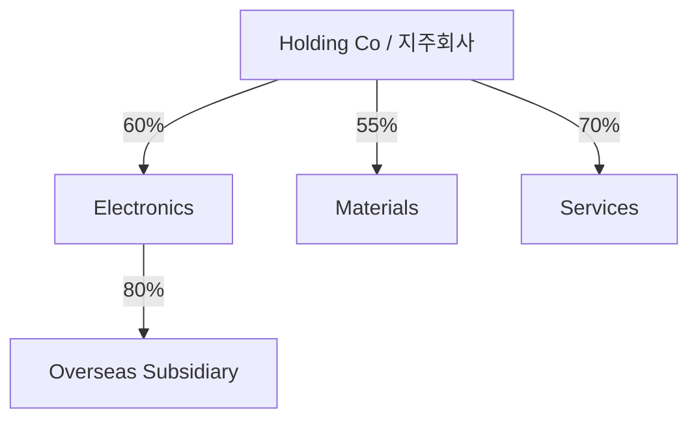

# Cấu trúc tập đoàn, affiliate và holding company tại Hàn Quốc (Group Structure / 지주회사·계열회사 구조)

Khi nhìn sơ đồ tập đoàn Hàn Quốc, người mới thường thấy hàng chục legal entities và cố ghi nhớ tên. Cách hiệu quả hơn là coi group như một **graph**: node là pháp nhân, edge là ownership/control/transaction.

Mục tiêu không phải nhớ mọi công ty con. Mục tiêu là hiểu **quyền kiểm soát đi qua đâu, cash đi qua đâu, debt nằm ở đâu và shareholders nào thực sự chịu/nhận economic outcome**.

## Brand/group khác legal entity

“Samsung”, “Hyundai”, “SK” là group identity/brand umbrella.

Samsung Electronics, Samsung C&T, Samsung Life… là separate legal entities.

Mỗi entity có:

- board;
- shareholders;
- assets/liabilities;
- contracts;
- tax/accounting;
- creditors.

Do đó group-level story không được phép thay entity-level analysis.

## Parent, subsidiary, affiliate: terminology phải theo context

### Parent / 모회사

Entity kiểm soát company khác.

### Subsidiary / 자회사

Entity bị parent control.

### Affiliate / 계열회사

Trong chaebol/business-group context, `계열사` thường nghĩa companies cùng group.

### Associate / 관계기업

Trong accounting, `관계기업` thường có technical meaning là significant influence nhưng không control.

Một English word “affiliate” có thể map khác tùy context. Không dịch máy móc.

## Ownership percentage và control không phải cùng một biến

Ownership tells economic stake.

Control tells decision power.

Suppose A owns 40% B, remaining shareholders dispersed. A may effectively control B.

B owns 35% C and controls C.

Indirect economic stake A→C via this chain:

\[
0.40\times0.35=14\%
\]

But control can still propagate through B.

Therefore never infer control only by multiplying percentages.

## Control under accounting

Consolidation generally considers whether investor has:

- power over relevant activities;
- exposure/rights to variable returns;
- ability to use power to affect returns.

Thus >50% voting rights is common but not universal criterion.

Read accounting policy and notes when boundary unclear.

## Consolidated vs separate statements

### Separate / 별도재무제표

Shows parent legal entity itself.

### Consolidated / 연결재무제표

Shows parent + controlled subsidiaries as one accounting economic unit.

Intercompany transactions are eliminated to avoid double counting.

If Parent sells 100 to Subsidiary, consolidated group cannot count that as external revenue until goods/services leave consolidated perimeter.

This is one of the most important accounting concepts in group analysis.

## Consolidated group is not necessarily entire chaebol

A business group may contain many companies not controlled by one listed parent.

A listed affiliate’s consolidated statements include only its accounting-controlled subsidiaries, not every company carrying same group brand.

This is why “Samsung Group revenue” cannot be obtained simply from one Samsung Electronics consolidated report.

## NCI / 비지배지분

Parent may control subsidiary without owning 100%.

If Parent owns 70% Subsidiary, consolidated statements include 100% subsidiary assets/revenue/profit because control exists.

But 30% economic claim belongs to outsiders and appears as **Non-Controlling Interests (NCI / 비지배지분)**.

Therefore distinguish:

```text
Consolidated net income
vs
Net income attributable to owners of parent
```

## EBITDA valuation and NCI trap

Suppose valuation uses 100% consolidated EBITDA but enterprise value ignores minority shareholders’ claim.

That overstates economics available to parent shareholders.

When material NCI exists, adjust valuation consistently.

Same principle applies to subsidiaries listed separately.

## Holding company / 지주회사

A holding company primarily owns stakes in operating companies.

Simple structure:



Holding layer handles ownership/capital allocation; operating subsidiaries sell products/services.

## Pure vs operating holding company

**Pure holding company:** mostly holds investments/stakes.

**Operating holding company:** holds subsidiaries but also has significant own operations.

This distinction matters because parent-level revenue/cash flow differs.

## Holding company discount

Market value of holding company often trades below sum-of-parts value of stakes/assets.

Potential reasons:

- parent debt;
- tax leakage;
- capital-allocation uncertainty;
- governance/control discount;
- unlisted asset uncertainty;
- double-layer overhead;
- limited ability to upstream cash.

A simple SOTP:

\[
Holding\ Equity\ Value \approx \sum Stake\ Values - Net\ Debt - Other\ Claims \pm Adjustments
\]

Then market may apply discount/premium based on control/capital allocation.

Do not assume discount is “free arbitrage”; it may reflect real frictions.

## Cash location matters

Group headline cash can be misleading.

Cash may sit in:

- regulated financial subsidiary;
- overseas unit;
- JV;
- listed subsidiary with minority shareholders.

Parent cannot necessarily use all of it freely.

Always ask **cash is at which node?**

This is critical in liquidity analysis.

## Debt location matters equally

A subsidiary’s debt is legal obligation of that subsidiary unless guarantee/support structure connects it elsewhere.

But consolidated statements may show debt at group accounting level.

Therefore distinguish:

```text
Consolidated leverage
Parent standalone leverage
Subsidiary leverage
Guaranteed / non-guaranteed debt
```

A holding company with low operating cash but high parent debt can be fragile even when subsidiaries profitable.

## Dividend upstream: how operating cash reaches parent

Holding/parent often receives cash via:

- dividends;
- management/service fees;
- asset sales;
- intra-group loans where legal/permitted.

If subsidiary needs huge capex, dividend capacity may be limited.

Thus parent valuation depends not just subsidiary profit but **cash upstreamability**.

## Internal capital market

Group can allocate cash across affiliates through investments, dividends, loans and transactions.

This can overcome external financing frictions and fund new businesses quickly.

But it also creates agency risk if cash from high-return listed affiliate is redirected toward low-return group project against minority-shareholder interest.

Internal capital market is neither inherently good nor bad; allocation quality matters.

## Related-party transactions / 특수관계자 거래

Related parties may trade goods/services, lend money, guarantee debt or transfer assets.

These transactions can be efficient because of scale/coordination.

But they can also transfer value between entities.

Key questions:

```text
Why is transaction needed?
Price arm's-length?
Who benefits?
Who bears risk?
Could external supplier/customer offer better terms?
```

DART disclosures are essential.

## Captive business: stable demand vs true competitiveness

An IT/logistics/advertising affiliate may earn large share of revenue from group companies.

Captive demand gives stability and scale.

But analyst should distinguish:

- internal guaranteed-like demand;
- external-market competitiveness.

If external share grows with healthy margins, capability may be genuinely competitive beyond group.

If almost all revenue captive, growth depends group allocation decisions.

## Pyramidal ownership

A controls B, B controls C, C controls D.

Controller can influence lower-layer assets with limited direct economic ownership.

This creates **control leverage**.

The deeper pyramid, the more important minority-shareholder conflicts can become.

## Cross-shareholding and circular ownership

Historical groups sometimes had structures like:

```text
A → B → C → A
```

Circular ownership can reinforce control and make unwinding complex.

Korea has restrictions on many forms of circular/cross-shareholding in large groups, but historical paths remain useful for understanding current control architecture.

Main lesson: graph matters more than org-chart boxes.

## Treasury shares and control

Treasury shares usually lack voting rights while held by company, but restructuring/cancellation/disposal can affect ownership percentages and control dynamics.

Therefore large treasury-share position can be relevant in governance analysis.

## Spin-offs: 인적분할 vs 물적분할

Korean corporate news frequently uses these terms.

### 인적분할

Existing shareholders generally receive shares in separated company proportionally, subject to transaction structure.

Economic ownership is split more directly among existing shareholders.

### 물적분할

Parent creates subsidiary and retains shares of new entity.

Existing parent shareholders own new business indirectly through parent.

If growth subsidiary later IPOs, parent shareholders may worry about dilution/value distribution.

Thus spin-off type has real governance/valuation implications.

## Why companies spin off?

Possible rationales:

- separate risk;
- attract strategic investor;
- raise capital;
- clarify business focus;
- facilitate IPO/M&A;
- reorganize control.

“Focus/synergy” in press release is not enough. Need map before/after ownership and cash flow.

## Merger economics

Merger can create operational synergy but exchange ratio determines how value is split among shareholder groups.

Two distinct questions:

1. Does merger create total value?
2. Is that value distributed fairly between shareholders?

A deal can have positive synergy but controversial exchange ratio.

## JV / 합작회사

Joint venture allows partners share capital, technology and market access.

But governance requires agreement on:

- board/control;
- funding obligations;
- IP;
- exit;
- deadlock.

JV may not be fully consolidated if control is joint.

Battery industry uses JVs extensively; accounting/economic exposure can therefore differ from headline “capacity”.

## Associate / equity method

If investor has significant influence but not control, investment may use **equity method / 지분법**.

Investor recognizes share of associate profit rather than consolidating 100% revenue/assets.

Thus company with large associate stakes can have material profit with no corresponding consolidated revenue.

## Guarantees connect supposedly separate entities

Legal ring-fencing weakens if parent/affiliate guarantees subsidiary debt.

Therefore group structure analysis must include **credit edges**, not only ownership edges.

Graph types:

```text
Ownership edge
Control edge
Loan edge
Guarantee edge
Sales/purchase edge
Management/personnel edge
```

A complete group map can overlay several edges.

## Financial affiliates require special caution

Bank/insurance/securities subsidiaries face regulatory capital and restrictions.

Their cash/equity is not freely transferable like ordinary industrial subsidiary.

Mixing financial and industrial entities at group level can obscure leverage.

## Group-level ROIC vs entity-level ROIC

A group may have one cash cow and several low-return projects.

Consolidated return shows aggregate, but minority shareholders of cash-cow affiliate care about their entity-specific allocation.

Thus always analyze both:

```text
Group capital allocation
and
Entity shareholder economics
```

## Practical graph-reading workflow

1. Identify controller/`동일인` if relevant.
2. List major listed/unlisted affiliates.
3. Draw ownership percentages.
4. Mark which entities are consolidated/associates.
5. Mark debt/guarantees.
6. Mark major related-party sales/purchases.
7. Identify cash-generating nodes.
8. Identify capex-hungry nodes.
9. Map restructuring/spin-off/IPO plans.
10. Recalculate economic ownership before/after transactions.

This converts a complex chart into understandable system.

## Mental Model

> Đọc Korean group như graph trong Computer Science: **node = legal entity; edge = ownership/control/cash/guarantee/transaction**. Economic reality lies in edges, not brand names.

```text
Who controls?
Where is cash?
Where is debt?
Who owns minority claims?
How does value move between nodes?
```

## Common misconceptions

**“Parent owns 40%, so cannot control.”** Not necessarily.

**“Consolidated statements = whole chaebol.”** Sai.

**“Group cash is freely available to parent.”** Sai.

**“Related-party transaction is automatically bad.”** No; test rationale/pricing.

**“Spin-off creates/destroys value automatically.”** Structure and later actions matter.

**“Same group means automatic debt guarantee.”** Sai; read legal commitment.

## Connections

Đọc cùng [`03_company_forms_and_size_classes.md`](./03_company_forms_and_size_classes.md), [`04_chaebol_and_large_business_groups.md`](./04_chaebol_and_large_business_groups.md), [`08_corporate_governance_ownership_and_control.md`](./08_corporate_governance_ownership_and_control.md), [`09_disclosure_accounting_dart_kind.md`](./09_disclosure_accounting_dart_kind.md), [`11_banks_finance_and_corporate_funding.md`](./11_banks_finance_and_corporate_funding.md) và [`19_major_groups_case_studies.md`](./19_major_groups_case_studies.md).
