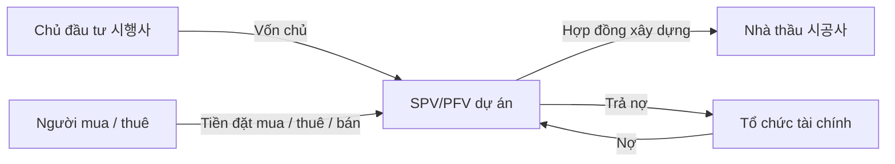

# Xây dựng, bất động sản và tài trợ dự án tại Hàn Quốc (Construction, Real Estate & PF / 건설·부동산·프로젝트 파이낸싱)

Xây dựng và bất động sản là nơi bảng cân đối của hộ gia đình, giá đất, lãi suất, vốn ngân hàng–chứng khoán và các nhà thầu lớn gặp nhau. Vì ngành dùng đòn bẩy cao và dự án kéo dài nhiều năm, một vấn đề ở một dự án có thể truyền sang chủ đầu tư, nhà thầu, bên cho vay, công ty chứng khoán, nhà cung cấp và kinh tế địa phương.

Điểm đầu tiên cần nhớ: **chủ đầu tư, nhà thầu xây dựng, bên cho vay và chủ sở hữu bất động sản không phải một**. Nhiều tin tức trở nên dễ hiểu ngay khi tách đúng vai trò.

## Lịch sử: xây dựng là hạ tầng của công nghiệp hóa

Trong giai đoạn tái thiết và công nghiệp hóa dựa vào xuất khẩu, Hàn Quốc cần đường sá, cảng, nhà ở, khu công nghiệp, nhà máy điện và nhà máy sản xuất.

Các công ty xây dựng vì vậy không chỉ xây chung cư; họ tích lũy **năng lực quản lý dự án (project-management capability)** qua hạ tầng quốc gia và công trình EPC ở nước ngoài.

Từ thập niên 1970, nhà thầu Hàn Quốc mở rộng sang Trung Đông, tạo nguồn ngoại tệ và học cách thực hiện dự án quy mô lớn. Hyundai là ví dụ nổi bật: năng lực xây dựng và triển khai dự án hình thành trước nhiều mảng công nghiệp sau này gắn với tập đoàn.

Bài học lịch sử là xây dựng vừa là một ngành kinh doanh vừa là **trường đào tạo năng lực tổ chức** cho nhiều tập đoàn Hàn Quốc.

## Ai là ai trong một dự án phát triển bất động sản?

**Chủ đầu tư phát triển (developer / 시행사)** tìm đất hoặc cơ hội, tập hợp dự án, xin phép, thu xếp vốn và chịu phần lớn rủi ro kinh doanh.

**Nhà thầu xây dựng (contractor / 시공사)** thi công theo hợp đồng và hưởng biên lợi nhuận xây dựng.

**Tổ chức tài chính (lender / 금융기관)** như ngân hàng, công ty chứng khoán, ngân hàng tiết kiệm, bảo hiểm hoặc quỹ cung cấp bridge loan hoặc vốn PF.

**Người mua hoặc người thuê** tạo dòng tiền thông qua tiền đặt mua trước, tiền bán hoặc tiền thuê.

Dự án thường được đặt trong **pháp nhân chuyên biệt (SPV/PFV)** để tách tương đối rủi ro pháp lý–tài chính.



Tuy nhiên, bảo lãnh hoặc cam kết từ nhà thầu có thể nối rủi ro dự án trở lại bảng cân đối của nhà thầu hoặc sponsor.

## “Thác” phát triển dự án: rủi ro thay đổi theo từng giai đoạn

Một dự án có thể đi qua:

```text
Mua đất
   ↓
Quy hoạch / giấy phép / thiết kế
   ↓
Bridge loan
   ↓
PF chính / 본PF
   ↓
Xây dựng
   ↓
Bán trước / cho thuê / bán
   ↓
Hoàn công
   ↓
Trả nợ / thoái vốn
```

Rủi ro cao nhất ở giai đoạn đầu vì quyền sử dụng đất, giấy phép, nguồn vốn chính và nhu cầu chưa chắc chắn. Khi dự án vượt qua từng mốc, rủi ro có thể giảm và chi phí tài trợ cũng có thể thấp hơn.

## Bridge loan: vốn ngắn hạn trước khi dự án được giảm rủi ro đầy đủ

**Bridge loan (브릿지론)** tài trợ mua đất hoặc giai đoạn đầu trước khi có đầy đủ giấy phép, presale hoặc PF chính.

Đặc điểm thường là kỳ hạn ngắn, lãi suất cao hơn, phụ thuộc mạnh vào tái cấp vốn và mức bất định dự án lớn hơn.

Rủi ro cốt lõi là **rủi ro tái cấp vốn (refinancing risk)**. Dự án có thể khả thi dài hạn nhưng vẫn thất bại nếu bridge loan đáo hạn trước khi 본PF được thu xếp.

Đây là cùng nguyên tắc chênh lệch kỳ hạn trong tài chính doanh nghiệp.

## 본PF: tài trợ dự án chính

Khi dự án có đủ đất, giấy phép, mức presale hoặc hỗ trợ từ sponsor/nhà thầu, nó có thể chuyển sang **본PF**, tức nguồn tài trợ dài hơn cho giai đoạn xây dựng chính.

Nhưng được phê duyệt 본PF không có nghĩa dự án hết rủi ro. Chi phí xây dựng, giá bán, lãi suất và chậm tiến độ vẫn có thể làm kinh tế thay đổi.

Rủi ro chỉ chuyển hình thức theo từng giai đoạn.

## Project Finance: nợ dựa vào kinh tế của chính dự án

Về khái niệm:

\[
Giá\ trị\ dự\ án
=
PV(Dòng\ tiền\ kỳ\ vọng)
- Chi\ phí\ còn\ lại
\]

Bên cho vay quan tâm nhất đến kịch bản xấu: nếu giá bán hoặc tiền thuê thấp hơn dự kiến, dự án vẫn trả được nợ không?

Thẩm định PF thường xem giá đất, chi phí xây dựng, giá bán/thuê kỳ vọng, tỷ lệ presale, LTV/LTC, hỗ trợ hoàn thành, vốn chủ sponsor và thứ tự phân phối dòng tiền.

## LTV, LTC và DSCR

**Tỷ lệ nợ trên giá trị tài sản (Loan-to-Value / LTV)**:

\[
LTV = \frac{Nợ}{Giá\ trị\ tài\ sản\ bảo\ đảm}
\]

**Tỷ lệ nợ trên tổng chi phí dự án (Loan-to-Cost / LTC)**:

\[
LTC = \frac{Nợ}{Tổng\ chi\ phí\ phát\ triển}
\]

Với tài sản cho thuê đã ổn định, **DSCR (Debt Service Coverage Ratio)**:

\[
DSCR = \frac{Dòng\ tiền\ khả\ dụng\ để\ trả\ nợ}{Gốc + Lãi\ đến\ hạn}
\]

Dự án phát triển trước hoàn thành thường chưa có dòng tiền hoạt động, nên người cho vay phải dựa nhiều hơn vào presale, tài sản bảo đảm và bảo lãnh.

## Đòn bẩy khuếch đại mọi giả định về đất và giá bán

Giả sử đất + chi phí xây dựng = 100, nợ = 80 và vốn chủ = 20. Nếu dự án hoàn thành bán được 120, vốn chủ có lợi suất rất cao. Nhưng nếu giá trị dự án giảm xuống 85, gần như toàn bộ vốn chủ có thể biến mất.

```text
Thay đổi nhỏ của giá trị tài sản
→ thay đổi lớn hơn nhiều của lợi suất vốn chủ
```

Đó là lý do chu kỳ tăng bất động sản tạo cảm giác lợi nhuận rất cao và chu kỳ giảm gây đau đớn mạnh.

## Hệ thống 분양: khách hàng cùng tham gia tài trợ xây dựng

Chung cư Hàn Quốc thường có **bán trước (presale / 분양)**, nơi người mua cam kết trước khi hoàn công và thanh toán theo nhiều mốc.

Điều này tạo hai hiệu ứng: tỷ lệ presale xác nhận nhu cầu và tiền người mua cải thiện dòng tiền dự án.

Presale mạnh có thể giảm lượng vốn sponsor phải bỏ. Presale yếu làm niềm tin bên cho vay giảm và chi phí lãi tích lũy tăng.

Vì vậy presale vừa là **chỉ số bán hàng** vừa là **chỉ số tài trợ**.

## 미분양: hàng chưa bán vừa là tín hiệu cầu vừa là vấn đề dòng tiền

**Hàng chưa bán (unsold inventory / 미분양)** cho thấy mức không khớp giữa vị trí, giá, cung và cầu.

Không phải mọi 미분양 đều nghiêm trọng như nhau. Hàng chưa bán trước hoàn công vẫn còn thời gian tiêu thụ; **đã hoàn công nhưng chưa bán (준공 후 미분양)** đáng lo hơn vì chi phí xây dựng đã phát sinh, lãi vẫn tiếp tục chạy nhưng tiền bán chưa về.

Địa điểm đặc biệt quan trọng. Tổng số toàn quốc có thể che giấu khủng hoảng ở một số địa phương.

## Bảo lãnh của nhà thầu: vì sao không sở hữu dự án vẫn có thể chịu rủi ro

Nhà thầu có thể đưa ra cam kết hoàn thành, nhận nợ, hỗ trợ thanh khoản hoặc tăng cường tín dụng.

Đây là **nghĩa vụ tiềm tàng (contingent liability / 우발채무)**.

Nợ PF có thể không hiện như khoản vay thông thường trên bảng cân đối nhà thầu, nhưng khi điều kiện bảo lãnh bị kích hoạt, nghĩa vụ kinh tế trở thành thật.

Vì vậy khi phân tích nhà thầu phải đọc thuyết minh và bảng bảo lãnh, không chỉ tỷ lệ nợ.

## Câu chữ bảo lãnh quyết định mức rủi ro

“Bảo lãnh hoàn thành” và “bảo lãnh thanh toán” không phải cùng một nghĩa vụ. Nhà thầu có thể chỉ cam kết hoàn công hoặc có thể phải nhận nợ trong một số điều kiện.

Không nên suy ra mức tiếp xúc pháp lý chỉ từ tiêu đề “công ty bảo lãnh dự án”; phải đọc cấu trúc và điều khoản cụ thể.

## Động cơ của 시행사–시공사–금융기관 có thể xung đột

Chủ đầu tư hưởng phần tăng của vốn chủ nên có thể thích dùng đòn bẩy cao hơn. Bên cho vay nhận lãi nhưng muốn bảo vệ kịch bản xấu. Nhà thầu muốn nhận biên xây dựng nhưng đôi khi chấp nhận bảo lãnh rộng để thắng dự án.

Nếu chủ đầu tư bỏ rất ít vốn nhưng nhà thầu cam kết lớn, rủi ro có thể chuyển từ chủ đầu tư sang nhà thầu.

Đây là **chuyển rủi ro (risk transfer)** chứ không phải loại bỏ rủi ro.

## Lãi suất tạo áp lực nhiều lớp

Lãi suất tăng tác động bất động sản qua nhiều kênh cùng lúc.

Khoản trả nợ mua nhà tăng làm sức mua yếu đi; chi phí lãi PF tăng; và tỷ suất vốn hóa của bất động sản cho thuê có thể tăng làm giá tài sản giảm.

Do đó cùng một cú sốc lãi suất có thể đánh đồng thời vào cầu, dòng tiền và giá trị tài sản bảo đảm.

## Cap rate và bất động sản tạo thu nhập

Với tài sản cho thuê ổn định:

\[
Giá\ trị\ bất\ động\ sản
\approx
\frac{NOI}{Cap\ Rate}
\]

Nếu NOI năm = 4 và cap rate = 4%, giá trị xấp xỉ 100. Nếu cap rate tăng lên 5%, cùng NOI chỉ tương đương giá trị khoảng 80.

Một thay đổi nhỏ của cap rate có thể tạo thay đổi giá trị rất lớn. Đó là lý do office/logistics REIT nhạy với lãi suất dù tiền thuê hiện tại tương đối ổn định.

## Bất động sản phát triển khác bất động sản cho thuê/REIT

Dự án phát triển kiếm lợi nhuận bằng cách tạo ra và bán tài sản. Bất động sản cho thuê tạo tiền từ tiền thuê định kỳ và giá trị cuối kỳ.

Nhà đầu tư REIT quan tâm occupancy, tăng tiền thuê, lịch hết hạn hợp đồng, chi phí vốn, cap rate và payout.

Không nên dùng logic dự án chung cư cho office REIT hoặc ngược lại.

## Backlog xây dựng: quy mô chưa đủ

Backlog giúp nhìn trước doanh thu nhưng chất lượng phụ thuộc tín dụng khách hàng, biên dự án, địa lý, điều khoản thanh toán, chuyển giá vật liệu, FX và bảo lãnh.

Dự án EPC ở nước ngoài có rủi ro địa chính trị, tiền tệ và thực thi khác rất xa chung cư nội địa.

Vì vậy backlog phải được phân khúc.

## Kế toán theo tỷ lệ hoàn thành

Dự án dài hạn có thể ghi nhận doanh thu theo tiến độ. Ước tính tổng chi phí quyết định biên dự án kỳ vọng.

Nếu chi phí xây dựng ước tính tăng, công ty có thể phải ghi **dự phòng lỗ công trình (공사손실충당부채)** trước khi dự án hoàn tất.

Doanh thu có thể trông ổn định nhưng lợi nhuận thay đổi mạnh chỉ vì ước tính chi phí được sửa. Đây là đặc điểm bình thường của kế toán hợp đồng dài hạn nhưng cần đọc kỹ.

## Tài sản hợp đồng và khoản phải thu

Nếu doanh thu được ghi nhận nhanh hơn thời điểm xuất hóa đơn hoặc thu tiền, tài sản hợp đồng và khoản phải thu tăng.

Nếu chúng tăng nhanh hơn doanh thu trong thời gian dài, cần kiểm tra khả năng ghi nhận tiến độ quá tích cực, khách hàng trả chậm, tranh chấp dự án hoặc căng thẳng vốn lưu động.

Dòng tiền chuyển đổi rất quan trọng.

## Giá đất và logic giá trị còn lại

Chủ đầu tư thường tính mức giá đất có thể trả từ giá trị dự án cuối trừ toàn bộ chi phí và lợi nhuận yêu cầu.

\[
Giá\ trị\ đất\ còn\ lại
=
Giá\ trị\ bán\ kỳ\ vọng
- Chi\ phí\ xây\ dựng
- Chi\ phí\ tài\ chính
- Thuế
- Lợi\ nhuận\ yêu\ cầu
\]

Khi giá căn hộ kỳ vọng tăng hoặc lãi suất giảm, giá trị đất còn lại có thể tăng rất mạnh. Đây là lý do giá đất nhạy cao với kỳ vọng nhà ở.

## Nguồn cung nhà ở có độ trễ dài

Từ mua đất tới hoàn thành chung cư có thể mất nhiều năm. Vì vậy nguồn cung phản ứng chậm với tín hiệu giá.

Giá cao kích hoạt nhiều dự án, nhưng nguồn cung chỉ đến sau — có thể vào đúng lúc nhu cầu đã đổi. Độ trễ này góp phần tạo chu kỳ bất động sản.

## Hàn Quốc không phải một thị trường nhà ở duy nhất

Seoul lõi, vùng 수도권, thành phố công nghiệp và địa phương tỉnh có việc làm, di cư, hình thành hộ gia đình, hạn chế đất, lượng 미분양 và pipeline cung khác nhau.

Giá trung bình toàn quốc có thể che giấu việc một nơi tăng nóng trong khi nơi khác căng thẳng. Danh mục dự án của công ty phải được lập bản đồ theo địa lý.

Xem [`24_regional_clusters_and_industrial_geography.md`](./24_regional_clusters_and_industrial_geography.md) và [`27_demographics_households_and_consumption.md`](./27_demographics_households_and_consumption.md).

## Bảng cân đối hộ gia đình tạo vòng phản hồi

Giá nhà ảnh hưởng tài sản bảo đảm và cảm nhận giàu có; đòn bẩy hộ gia đình ảnh hưởng tiêu dùng.

Một chu kỳ giảm có thể tạo vòng:

```text
Nhu cầu nhà ↓
→ giá / giao dịch ↓
→ presale ↓
→ căng thẳng PF ↑
→ đầu tư xây dựng ↓
→ việc làm / thu nhập địa phương ↓
→ nhu cầu nhà tiếp tục ↓
```

Chính sách có thể làm vòng này yếu đi nhưng cơ chế vẫn tồn tại.

## PF trong các tổ chức tài chính phi ngân hàng

Công ty chứng khoán, ngân hàng tiết kiệm, bảo hiểm và quỹ có thể nắm khoản vay, chứng khoán hoặc bảo lãnh liên quan PF.

Cùng một tổng quy mô PF nhưng rủi ro hệ thống có thể khác rất lớn tùy thứ tự ưu tiên, tài sản bảo đảm, địa lý và mức vốn của tổ chức nắm giữ.

Vì vậy chỉ nhìn “tổng PF” là chưa đủ.

## Thứ tự ưu tiên và waterfall

Tiền của dự án được phân phối theo thứ tự. Chủ nợ ưu tiên cao được trả trước mezzanine và vốn chủ; nguồn tài trợ lợi suất cao hơn ở tầng junior hấp thụ lỗ trước.

Hai nhà đầu tư trong cùng một dự án vì vậy có thể chịu mức rủi ro hoàn toàn khác nhau.

## Ổn định chính sách và đánh đổi moral hazard

Cơ quan quản lý có thể cung cấp thanh khoản hoặc chương trình hỗ trợ khi căng thẳng PF đe dọa ổn định tài chính rộng hơn.

Điều này có thể giảm bán tháo lây lan, nhưng cứu trợ rộng và lặp lại có thể làm kỷ luật rủi ro yếu đi.

Thiết kế chính sách phải phân biệt **vấn đề thanh khoản** với **dự án về bản chất không khả thi**. Đây là cùng phân biệt solvency/liquidity trong [`11_banks_finance_and_corporate_funding.md`](./11_banks_finance_and_corporate_funding.md).

## Cách phân tích một nhà thầu Hàn Quốc

Theo dõi backlog trong nước/nước ngoài, địa lý nhà ở, chất lượng biên đơn hàng, khoản phải thu/tài sản hợp đồng, bảo lãnh PF/nghĩa vụ tiềm tàng, nợ ròng–tiền mặt, chi phí vật liệu–lao động, mức tiếp xúc presale/미분양 và dự phòng EPC nước ngoài.

Tỷ lệ nợ thấp chưa đủ nếu sổ bảo lãnh lớn.

## Cách phân tích một dự án bất động sản

Hãy hỏi giá đất, tổng chi phí phát triển, tỷ lệ nợ/vốn chủ, kỳ hạn bridge, 본PF đã có chưa, giả định presale/cho thuê, giá bán hòa vốn, bên bảo lãnh, địa lý–nhân khẩu học và kế hoạch thoái vốn/tái cấp vốn.

Nếu nhiều câu trả lời cùng phụ thuộc vào một giả định lạc quan, rủi ro đang chồng lên nhau.

## Stress test

Có thể thử kịch bản:

```text
Giá bán -10%
Presale chậm 12 tháng
Chi phí xây dựng +10%
Lãi suất +150bp
```

Sau đó tính lại giá trị còn lại, nhu cầu vốn và khả năng bảo lãnh bị gọi.

PF thường thất bại vì **nhiều sai lệch nhỏ cộng lại**, không nhất thiết vì một biến duy nhất sụp đổ.

## Mental Model — mô hình tư duy

> PF là cỗ máy **thời điểm + đòn bẩy + tài sản bảo đảm + doanh thu tương lai**. Trong kịch bản tốt, đòn bẩy khuếch đại lợi suất vốn chủ; trong kịch bản xấu, chính đòn bẩy biến chậm tiến độ và giảm giá vừa phải thành khủng hoảng tái cấp vốn.

```text
Đất + giấy phép
   ↓
Bridge debt
   ↓
본PF
   ↓
Xây dựng
   ↓
Presale / thuê / bán
   ↓
Trả nợ
```

Ở mỗi mũi tên hãy hỏi: điều gì xảy ra nếu giai đoạn tiếp theo bị chậm?

## Những nhầm lẫn thường gặp

**“Nhà thầu lớn thì dự án không thể vỡ nợ.”** Sai. Điều khoản bảo lãnh và nghĩa vụ sponsor mới quyết định mức bảo vệ.

**“Nợ PF không nằm trên bảng cân đối nhà thầu thì không có rủi ro.”** Sai. Nghĩa vụ tiềm tàng có thể bị kích hoạt.

**“Giá nhà giảm nghĩa mọi PF đều mất khả năng thanh toán.”** Sai. LTV, vốn chủ, presale và vị trí tạo vùng đệm khác nhau.

**“Backlog lớn nghĩa công ty xây dựng an toàn.”** Sai nếu backlog biên thấp hoặc thu tiền yếu.

**“Bất động sản Hàn Quốc là một thị trường duy nhất.”** Sai. Chênh lệch vùng rất lớn.

**“Lãi suất thấp hơn sẽ cứu mọi dự án.”** Sai. Giá đất quá cao hoặc cầu yếu về cấu trúc không thể giải quyết chỉ bằng vốn rẻ hơn.

## Liên kết

Đọc cùng [`01_macro_economy_and_business_cycle.md`](./01_macro_economy_and_business_cycle.md), [`09_disclosure_accounting_dart_kind.md`](./09_disclosure_accounting_dart_kind.md), [`11_banks_finance_and_corporate_funding.md`](./11_banks_finance_and_corporate_funding.md), [`21_economy_to_company_transmission.md`](./21_economy_to_company_transmission.md), [`24_regional_clusters_and_industrial_geography.md`](./24_regional_clusters_and_industrial_geography.md) và [`27_demographics_households_and_consumption.md`](./27_demographics_households_and_consumption.md).
