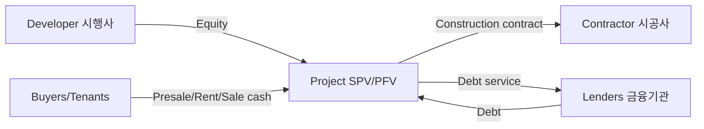

# Xây dựng, bất động sản và Project Finance tại Hàn Quốc (Construction, Real Estate & PF / 건설·부동산·프로젝트 파이낸싱)

Construction và real estate là nơi household balance sheet, land price, interest rate, bank/securities funding và large contractors gặp nhau. Vì sector dùng leverage cao và project kéo dài nhiều năm, một problem tại một development có thể truyền sang developer, contractor, lender, securities firm, supplier và local economy.

Điểm đầu tiên phải nhớ: **developer, contractor, lender và property owner không phải một**. Nhiều news trở nên dễ hiểu ngay khi tách đúng roles.

## Lịch sử: construction là infrastructure của industrialization

Trong reconstruction và export-industrialization era, Korea cần roads, ports, housing, industrial complexes, power plants và factories.

Construction companies vì vậy không chỉ xây apartments; họ tích lũy project-management capability từ national infrastructure và overseas EPC work.

Từ thập niên 1970, Korean contractors mở rộng sang Middle East, tạo foreign-currency earnings và học large-project execution.

Hyundai là example nổi bật: construction/project execution capability hình thành trước nhiều industrial businesses later associated with group.

Historical lesson: construction was both an industry and an **organizational training ground** for Korean conglomerates.

## Ai là ai trong một development project?

### Developer / 시행사

Developer tìm land/opportunity, assemble project, arrange permits/finance và chịu business risk lớn nhất.

### Contractor / 시공사

Contractor xây project theo construction contract và earns construction margin.

### Lenders / 금융기관

Banks, securities firms, savings banks, insurers or funds provide bridge/PF financing.

### Buyers / tenants

Presale payments, sale proceeds or rent generate project cash inflow.

### SPV/PFV

Special-purpose entity isolates project legally/financially to varying degree.

Một simplified structure:



But guarantees can reconnect project risk back to contractor/sponsor.

## Development waterfall: risk thay đổi theo stage

A real-estate project may move through:

```text
Land acquisition
   ↓
Permits / zoning / design
   ↓
Bridge financing
   ↓
Main PF / 본PF
   ↓
Construction
   ↓
Presales / leasing / sales
   ↓
Completion
   ↓
Debt repayment / exit
```

Early-stage uncertainty is highest because land/permits/main financing/demand are not secured.

As project clears milestones, risk may fall and financing can become cheaper.

## Bridge loan: short-term financing before project fully de-risked

**Bridge Loan / 브릿지론** finances land or early development before full permits/presales/main PF.

Characteristics often include:

- shorter maturity;
- higher interest;
- greater reliance on future refinancing;
- higher project uncertainty.

The key risk is **refinancing**.

Project may be viable long-term but fail if bridge loan matures before main PF can be arranged.

This is same maturity-mismatch principle from corporate finance.

## 본PF: main project financing

Once project has sufficient permits, land control, presale visibility or sponsor/contractor support, it may refinance into longer-term **본PF**.

But “main PF approved” does not make project risk-free. Construction cost, sales price, rate and delays still matter.

PF risk simply changes form as project progresses.

## Project Finance: debt depends on project economics

Conceptually:

\[
Project\ Value = PV(Expected\ Project\ Cash\ Flows) - Remaining\ Costs
\]

Lender cares about downside: if sales/rent disappoint, can project still repay debt?

PF underwriting therefore looks at:

- land value;
- construction cost;
- expected sale/rent;
- presale rate;
- LTV/LTC;
- completion support;
- sponsor equity;
- cash-flow waterfall.

## LTV, LTC và DSCR

**Loan-to-Value / LTV**:

\[
LTV = \frac{Debt}{Collateral\ Value}
\]

**Loan-to-Cost / LTC**:

\[
LTC = \frac{Debt}{Total\ Development\ Cost}
\]

For income-producing assets, **DSCR**:

\[
DSCR = \frac{Cash\ Flow\ Available\ for\ Debt\ Service}{Principal + Interest\ Due}
\]

Development project before completion may have little operating cash flow, so lenders rely more on presales, collateral and guarantees.

## Leverage magnifies land/project assumptions

Suppose land + construction cost = 100, debt = 80, equity = 20.

If completed project sells for 120 before interest/tax, equity has large upside.

But if project value falls to 85, almost all equity value disappears.

This is leverage:

```text
Small asset-value change
→ much larger equity-return change
```

Therefore real-estate boom feels highly profitable and downturn highly painful.

## Presale / 분양 system: customer helps finance construction

Korean apartments often use presale structure where buyers commit before completion and pay milestones.

This creates two effects:

1. presale rate validates demand;
2. buyer payments improve project financing/cash flow.

Strong presales can reduce sponsor equity need.

Weak presales do the opposite: lender confidence falls and interest carrying cost increases.

Thus presale is both **sales metric and financing metric**.

## 미분양: unsold units as signal and cash-flow problem

**Unsold inventory / 미분양** indicates mismatch among location, price, supply and demand.

Not all unsold units are equally severe.

Pre-completion unsold may still have time to sell.

**Completed-but-unsold / 준공 후 미분양** is more concerning because construction cost is already sunk while interest continues and expected cash did not arrive.

Location matters enormously. National totals can hide local crises.

## Contractor guarantee: why a construction company can be exposed without owning project

Contractor may provide:

- completion guarantee;
- debt assumption commitment;
- liquidity support;
- credit enhancement.

These are **contingent liabilities / 우발채무**.

PF debt may not appear as ordinary borrowing on contractor balance sheet, but if guarantee crystallizes, economic liability becomes real.

Therefore contractor analysis must read footnotes/guarantee schedule, not just debt ratio.

## Guarantee wording matters

“Completion guarantee” and “payment guarantee” are not same.

A contractor may only promise construction completion, or it may have obligation to assume debt under conditions.

Never infer legal exposure from headline “company guaranteed project” without reading structure.

## 시행사–시공사–금융기관 incentives can conflict

Developer earns upside on equity and may prefer higher leverage.

Lender earns interest but wants downside protection.

Contractor wants construction margin but may accept guarantees to win project.

If developer has thin equity but contractor gives broad guarantee, risk can migrate from developer to contractor.

This is **risk transfer**, not risk elimination.

## Interest rate creates double or triple pressure

Rate rise affects real estate through multiple channels.

### Buyer affordability

Mortgage/payment burden rises → housing demand can weaken.

### PF financing cost

Project interest expense rises.

### Valuation discount rate

Income-producing property cap rates may rise, reducing asset value.

Thus same rate shock can hit demand, cash flow and collateral simultaneously.

## Cap rate and income-producing property

For stabilized rental asset:

\[
Property\ Value \approx \frac{NOI}{Cap\ Rate}
\]

If annual NOI = 4 and cap rate = 4%, value ≈100.

If cap rate rises to 5%, same NOI implies value ≈80.

Small cap-rate move can create large valuation move.

This is why office/logistics REITs are rate-sensitive even with stable rent.

## Development real estate vs rental/REIT economics

Development earns return by creating/selling asset.

Rental asset earns recurring rent and terminal value.

REIT investor therefore focuses on:

- occupancy;
- rent growth;
- lease expiry;
- financing cost;
- cap rate;
- payout.

Do not use apartment-development logic for office REIT or vice versa.

## Construction backlog: size alone is insufficient

Contractor backlog provides future revenue visibility, but quality depends on:

- client credit;
- project margin;
- geography;
- payment terms;
- material cost pass-through;
- FX;
- guarantee exposure.

Overseas EPC project can have geopolitical/currency/execution risk unlike domestic apartment construction.

Therefore backlog should be segmented.

## Percentage-of-completion accounting

Long projects may recognize revenue over progress.

Estimate of total project cost determines expected margin.

If construction cost estimate rises, company can record **loss provision / 공사손실충당부채** before project completion.

Revenue can look stable while profitability suddenly changes due estimate revision.

This is normal feature of long-contract accounting, not necessarily manipulation—but requires careful reading.

## Contract assets and receivables

If revenue recognized faster than billing/cash collection, contract assets/receivables rise.

Persistent increase faster than revenue can signal:

- aggressive progress recognition;
- client/payment delay;
- project disputes;
- working-capital stress.

Cash conversion matters.

## Land price: residual-value logic

Developer often estimates land affordability from expected final project value minus all future costs/required return.

Simplified:

\[
Residual\ Land\ Value = Expected\ Sales\ Value - Construction - Finance - Tax - Required\ Profit
\]

When expected apartment price rises or rates fall, residual land value can jump.

This explains why land prices can be highly leveraged to housing expectations.

## Housing supply has long lag

From land purchase to completed apartment can take years.

Therefore supply reacts slowly to price signals.

High prices trigger more projects, but supply arrives later—possibly when demand has changed.

This lag contributes to cycles.

## Regional divergence: Korea is not one housing market

Seoul core, wider 수도권, industrial cities and provincial regions have different:

- jobs;
- migration;
- household formation;
- land constraints;
- unsold inventory;
- supply pipeline.

National apartment-price average can hide boom and stress simultaneously.

Company project book must be mapped by geography.

Xem [`24_regional_clusters_and_industrial_geography.md`](./24_regional_clusters_and_industrial_geography.md) và [`27_demographics_households_and_consumption.md`](./27_demographics_households_and_consumption.md).

## Household balance sheet creates feedback

Housing price affects collateral/wealth. Household leverage affects consumption.

A downturn can create loop:

```text
Housing demand ↓
→ prices/transactions ↓
→ presales ↓
→ PF stress ↑
→ construction investment ↓
→ local employment/income ↓
→ housing demand ↓
```

Policy response may interrupt loop, but mechanism exists.

## PF exposure in non-bank financial institutions

Securities firms, savings banks, insurers and funds can hold PF-related loans/securities/guarantees.

Risk distribution matters: same total PF amount can have different systemic risk depending on seniority, collateral, geography and institution capital.

Therefore “PF size” alone is insufficient.

## Seniority and waterfall

Project cash is paid according to priority.

Senior lender gets paid before mezzanine/equity.

Higher-yield junior financing absorbs first losses.

Thus two investors in same project can have very different risk.

## Policy stabilization and moral hazard trade-off

Authorities may provide liquidity/support measures when PF stress threatens broader financial stability.

Such measures can reduce fire-sale contagion, but repeated broad rescue can weaken risk discipline.

Policy design must distinguish **liquidity problem** from fundamentally unviable project.

This is the same solvency/liquidity distinction from [`11_banks_finance_and_corporate_funding.md`](./11_banks_finance_and_corporate_funding.md).

## How to analyze a Korean contractor

Monitor:

```text
Domestic vs overseas backlog
Housing geography
Order margin quality
Receivables / contract assets
PF guarantees / contingent liabilities
Net debt / cash
Material/labor costs
Presale / unsold exposure
Overseas EPC provisions
```

A low debt ratio is not enough if guarantee book large.

## How to analyze a real-estate project

Ask:

1. Land cost?
2. Total construction/development cost?
3. Debt/equity mix?
4. Bridge maturity?
5. Main PF secured?
6. Presale/lease assumptions?
7. Break-even sales price?
8. Guarantee provider?
9. Geography/demographics?
10. Exit/refinance plan?

If one answer depends on another optimistic assumption, risk stacks.

## Stress-test example

Scenario:

```text
Sales price -10%
Presale slower by 12 months
Construction cost +10%
Interest rate +150bp
```

Then recompute residual value, funding need and guarantee call risk.

PF often fails through **combined small misses**, not one dramatic variable.

## Mental Model

> PF is a **timing + leverage + collateral + future-sales** machine. In good scenarios leverage magnifies equity return; in weak scenarios same leverage turns delay and modest price decline into refinancing crisis.

A compact flow:

```text
Land + Permit
   ↓
Bridge debt
   ↓
Main PF
   ↓
Construction
   ↓
Presale / Rent / Sale
   ↓
Debt repayment
```

At every arrow ask: what if next stage is delayed?

## Common misconceptions

**“Large contractor means project cannot default.”** Sai. Guarantee terms and sponsor obligation matter.

**“PF debt not on contractor balance sheet means no risk.”** Sai. Contingent liability can crystallize.

**“Housing price down means every PF insolvent.”** Sai. LTV/equity/presale/location determine buffer.

**“Backlog large means construction company safe.”** Not if backlog low-margin or cash collection weak.

**“Real estate is one Korea-wide market.”** Sai. Regional divergence is large.

**“Lower rate fixes every project.”** No. Fundamentally bad land cost/demand cannot be solved solely by cheaper funding.

## Connections

Đọc cùng [`01_macro_economy_and_business_cycle.md`](./01_macro_economy_and_business_cycle.md), [`09_disclosure_accounting_dart_kind.md`](./09_disclosure_accounting_dart_kind.md), [`11_banks_finance_and_corporate_funding.md`](./11_banks_finance_and_corporate_funding.md), [`21_economy_to_company_transmission.md`](./21_economy_to_company_transmission.md), [`24_regional_clusters_and_industrial_geography.md`](./24_regional_clusters_and_industrial_geography.md) và [`27_demographics_households_and_consumption.md`](./27_demographics_households_and_consumption.md).
