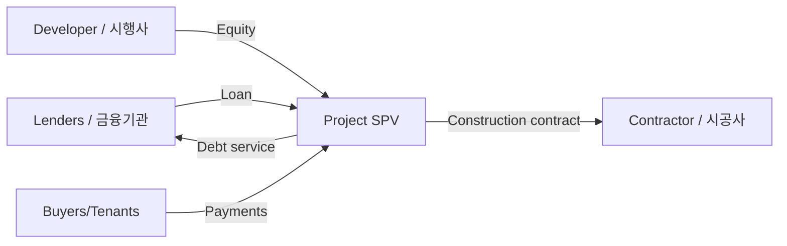

# Xây dựng, bất động sản và Project Finance tại Hàn Quốc (건설·부동산·PF)

Construction và real estate kết nối land price, household demand, interest rate, bank/securities funding và large contractors. Đây là nơi leverage khiến một project riêng có thể truyền risk vào nhiều tổ chức tài chính.

## Developer, contractor và owner không phải một

**Developer / 시행사** phát triển project và chịu business risk chính; **contractor / 시공사** thi công; financial institutions tài trợ; buyers/tenants tạo cash inflow. Một large construction company có thể vừa thi công vừa tham gia guarantee nhưng không nhất thiết own project.

Phân biệt vai trò này là bước đầu để hiểu news về PF.

## Project finance

Project Finance (프로젝트 파이낸싱) dùng expected project cash flow làm nền cho financing. Thường có SPV/PFV tách project khỏi sponsor ở mức độ nhất định.

Một simplified structure:

## Bridge loan và 본PF

Early-stage land acquisition có thể dùng **bridge loan / 브릿지론** trước khi permits, presales hoặc main financing hoàn tất. Khi project đủ điều kiện, chuyển sang **본PF**. Failure to refinance bridge loan là risk lớn vì rate thường cao và maturity ngắn.

## Presales

Korean housing development thường có **분양** model. Presale success giúp chứng minh demand và cash visibility. Nếu presale yếu, lender concern tăng và developer cần thêm capital/guarantee.

## Contractor guarantee

Construction company có thể cung cấp credit enhancement hoặc guarantee. Vì vậy nhìn standalone project debt không đủ; cần đọc contingent liabilities và PF guarantees trong notes.

## Interest rate transmission

Rate tăng tác động cả hai phía: buyer mortgage affordability giảm, đồng thời project financing cost tăng. Đây là double pressure lên feasibility.

\[
Project\ Value \approx PV(Expected\ Cash\ Flows) - Construction/Financing\ Costs
\]

Rate cao vừa tăng discount rate vừa tăng financing cost, nên land/project valuation có thể điều chỉnh mạnh.

## Real estate và macro

Housing price ảnh hưởng household wealth và collateral. Construction investment cũng là GDP component. Vì vậy real-estate cycle không chỉ là chuyện apartment price; nó truyền vào banks, securities firms, construction, materials và local economy.

## Construction trong lịch sử phát triển Hàn Quốc

Construction là một trong những ngành giúp hình thành capability của các group lớn từ thời reconstruction. Roads, ports, housing và industrial complexes là physical platform cho export industrialization. Hyundai là ví dụ nổi bật: project-execution capability trong construction đi trước automobile và shipbuilding.

Từ 1970s, Korean contractors còn đi overseas, đặc biệt Middle East, để kiếm foreign currency và tích lũy project-management experience. Vì vậy construction không chỉ là domestic housing business.

## PF structure: ai chịu risk trước?

Real-estate PF tách project thành special-purpose entity và dùng future project cash flow làm nguồn trả nợ. Nhưng lender thường yêu cầu credit enhancement vì land purchase và construction xảy ra trước presales/lease income.

Bridge loan tài trợ phase sớm có risk cao hơn vì permits, land assembly và financing chưa chắc. Khi project đủ điều kiện, nó chuyển sang 본PF với structure dài hạn hơn. Nếu transition thất bại, bridge lender và guarantor có thể chịu stress.

## Presale system và cash conversion

Korea sử dụng apartment presales rộng rãi. Buyer payment theo milestones giúp developer/contractor finance construction, giảm lượng equity cần upfront. Nhưng model phụ thuộc confidence rằng project sẽ hoàn thành và housing demand đủ mạnh.

Nếu presale rate thấp, project cash inflow yếu và refinancing khó. Vì vậy presale ratio là operational variable quan trọng chứ không chỉ marketing statistic.

## Guarantee biến off-balance-sheet thành real risk

Construction company có thể không ghi toàn bộ PF debt như own borrowing, nhưng nếu cung cấp completion guarantee, debt assumption hoặc liquidity support, economic exposure vẫn tồn tại. Khi project fail, contingent liability chuyển thành cash obligation.

Đây là lý do đọc note disclosures và guarantee schedule quan trọng hơn chỉ nhìn headline debt ratio.

## Interest rate transmission

Rate tăng ảnh hưởng sector qua ít nhất ba channel: mortgage affordability của buyer giảm, PF financing cost tăng và capitalization rate của income property tăng. Ba channel cùng lúc có thể làm land/project value giảm nhanh.

Nếu asset value giảm dưới debt, refinancing becomes the central problem. Construction downturn vì vậy có thể lan sang securities firms, savings banks và insurers tùy ai cung cấp PF credit.

## Regional divergence

Housing market Korea không phải một market duy nhất. Seoul core, 수도권 outskirts và provincial cities có population trend, job base và supply khác nhau. Một national average có thể che oversupply ở region A và scarcity ở region B.

Khi phân tích contractor, phải xem project book theo geography và product type, không chỉ total backlog.

## Mental Model

> PF là bài toán **timing + leverage + collateral + future sales**. Khi mọi assumption cùng thuận lợi, leverage làm return rất cao; khi delay hoặc sales hụt, cùng leverage khuếch đại loss và refinancing risk.

## Common misconceptions

“Project có large constructor thì không thể default” là sai. Phải xem guarantee form và sponsor obligation cụ thể.

Property price giảm không tự động làm mọi PF insolvent; buffer phụ thuộc LTV, presale, land cost và seniority của debt.

## Connections

Xem [11_banks_finance_and_corporate_funding](./11_banks_finance_and_corporate_funding.md), [01_macro_economy_and_business_cycle](./01_macro_economy_and_business_cycle.md) và [09_disclosure_accounting_dart_kind](./09_disclosure_accounting_dart_kind.md).

## Real-estate development waterfall

Một project đi từ land acquisition → permits → bridge financing → construction financing/PF → presales/lease → completion → repayment. Risk không giống nhau ở mỗi stage.

Early stage có entitlement/land risk cao nên bridge rate thường cao hơn. Khi permits/presales reduce uncertainty, project có thể refinance vào cheaper 본PF.

## LTV, LTC và DSCR

Loan-to-Value (LTV) so debt với collateral value. Loan-to-Cost (LTC) so debt với development cost. Debt Service Coverage Ratio (DSCR) so cash flow available với debt service.

\[
DSCR = \frac{Cash\ Flow\ Available\ for\ Debt\ Service}{Principal+Interest\ Due}
\]

Development project chưa tạo operating cash flow nên lender dựa nhiều vào presales, guarantees và completion value.

## 시행사–시공사–금융기관 incentives

Developer (시행사) kiếm return trên equity/project upside. Contractor (시공사) kiếm construction margin nhưng có thể cung cấp guarantee. Lender kiếm interest nhưng muốn downside protection.

Nếu contractor guarantee quá rộng, project risk chuyển từ thinly capitalized developer sang contractor balance sheet. Đây là reason contingent liabilities quan trọng.

## Unsold inventory

미분양 tăng là signal demand/price mismatch. Nhưng risk khác theo location và construction stage. Unsold after completion thường more severe vì capital đã sunk và interest continues.

Regional divergence rất lớn; national apartment price average có thể hide local stress.

## REITs và rental assets

Không phải toàn real estate là development. REIT/office/logistics assets tạo recurring rent. Valuation gần bond/equity hybrid, nhạy cap rate và interest rate.

\[
Property\ Value \approx \frac{NOI}{Cap\ Rate}
\]

Cap rate tăng từ 4% lên 5% có thể giảm value mạnh ngay cả NOI unchanged.

## Construction order quality

Order backlog chỉ useful khi biết project margin, client quality, payment terms và geographic exposure. Overseas EPC có FX/geopolitical risk khác domestic apartment construction.
