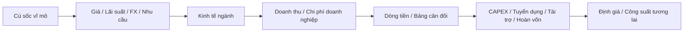

# Từ kinh tế vĩ mô đến công ty: cơ chế truyền dẫn (Macro-to-Company Transmission / 거시경제의 기업 전이)

Một trong những kỹ năng quan trọng nhất khi đọc kinh tế là không dừng ở tiêu đề. “Lãi suất tăng”, “KRW yếu”, “Trung Quốc giảm tốc” hay “CAPEX AI tăng” chỉ trở thành hiểu biết hữu ích khi ta mô tả được **cú sốc đi qua giá, sản lượng, chi phí, bảng cân đối và hành vi doanh nghiệp như thế nào**.

Vĩ mô không tác động mọi công ty cùng dấu. Cùng một lần KRW mất giá có thể có lợi cho nhà xuất khẩu, bất lợi cho nhà nhập khẩu và tác động hỗn hợp với công ty có doanh thu USD nhưng cũng vay USD. Vì vậy phân tích phải đi qua **cơ chế truyền dẫn (transmission mechanism)** thay vì dùng khẩu hiệu.

## Khung cơ bản: một cú sốc phải đi qua nhiều tầng



Mỗi mũi tên cần có giải thích nhân quả. Nếu không giải thích được một mũi tên, kết luận vẫn chỉ là câu chuyện.

## Bước 1 — Xác định loại cú sốc

Tin vĩ mô có thể phân thành một số nhóm:

```text
Cú sốc giá
→ dầu, kim loại, ASP bộ nhớ, cước vận tải

Cú sốc nhu cầu
→ Trung Quốc giảm tốc, đầu tư AI tăng, tiêu dùng nội địa phục hồi

Cú sốc tài chính
→ lãi suất BOK, biên tín dụng, KRW, thanh khoản

Cú sốc chính sách
→ ưu đãi thuế, thuế quan, kiểm soát xuất khẩu, quy định cho vay

Cú sốc nguồn cung
→ gián đoạn nhà máy, chiến tranh, tắc nghẽn logistics
```

Phân loại giúp tìm đúng kênh truyền dẫn.

## Bước 2 — Xác định mức tiếp xúc của doanh nghiệp

Một cú sốc chỉ quan trọng khi doanh nghiệp thật sự tiếp xúc với nó. Mức tiếp xúc có thể nằm ở doanh thu, chi phí đầu vào, nợ, tài sản, khách hàng, nhà cung cấp, quy định hoặc tỷ lệ chiết khấu khi định giá.

Ví dụ KRW/USD chỉ thực sự quan trọng khi công ty có **mức tiếp xúc ngoại tệ ròng (net FX exposure)** đáng kể.

## Ví dụ 1 — KRW mất giá

Khi `KRW/USD` tăng, KRW yếu hơn.

Các kênh có thể gồm:

```text
Doanh thu USD → doanh thu quy đổi KRW ↑
Nguyên liệu / thiết bị nhập khẩu → chi phí KRW ↑
Nợ USD → nghĩa vụ quy đổi KRW ↑
Tỷ giá đối thủ → vị thế giá tương đối thay đổi
Phòng hộ → tác động bị trì hoãn hoặc đổi dấu theo kỳ hạn
```

Kết luận đúng không phải “KRW yếu tốt cho nhà xuất khẩu”, mà phải ước tính mức tiếp xúc ngoại tệ ròng.

Một khung tư duy đơn giản:

\[
Mức\ tiếp\ xúc\ FX\ ròng
\approx
Doanh\ thu\ ngoại\ tệ
- Chi\ phí\ ngoại\ tệ
- Dịch\ vụ\ nợ\ ngoại\ tệ
\pm Phòng\ hộ
\]

Đây không phải công thức kế toán chính thức; mục tiêu là buộc người phân tích lập bản đồ mức tiếp xúc.

## Tác động quy đổi khác tác động kinh tế

Lợi nhuận của công ty con ở nước ngoài khi đổi về KRW có thể tăng chỉ vì tỷ giá; đó là **tác động quy đổi (translation effect)**.

Nếu KRW yếu làm hàng sản xuất tại Hàn Quốc rẻ hơn tương đối so với đối thủ, thị phần hoặc giá bán có thể thay đổi; đó là **tác động kinh tế (economic effect)**.

Hai tác động này không nên bị trộn với nhau.

## Ví dụ 2 — BOK tăng lãi suất chính sách

Chuỗi bậc một:

```text
Lãi suất cơ bản ↑
→ lãi suất thị trường / ngân hàng ↑
→ chi phí vay ↑
```

Nhưng tác động khác nhau theo ngành.

- Xây dựng/PF: chi phí vốn tăng và khả năng chi trả của người mua giảm.
- Ngân hàng: lợi suất tài sản có thể tăng nhưng chi phí tiền gửi và tổn thất tín dụng cũng tăng.
- Bán lẻ: nghĩa vụ trả nợ hộ gia đình tăng, làm nhu cầu tùy ý yếu đi.
- Cổ phiếu tăng trưởng: tỷ lệ chiết khấu có thể tăng trước khi lợi nhuận thay đổi.
- Công ty nhiều tiền mặt: thu nhập lãi có thể tăng.

Cùng một cú sốc nhưng dấu tác động có thể khác nhau.

## Độ trễ điều chỉnh lãi suất

Khoản vay thả nổi có thể điều chỉnh sau 3 tháng; trái phiếu lãi cố định giữ coupon tới đáo hạn.

Vì vậy phải lập **lịch điều chỉnh lãi suất (repricing schedule)**. Công ty có 80% nợ cố định 5 năm chịu cú sốc lãi suất chậm hơn công ty có nợ ngân hàng thả nổi.

Thời điểm là một phần của quan hệ nhân quả.

## Ví dụ 3 — Bùng nổ CAPEX AI toàn cầu

Khi hyperscaler tăng đầu tư AI, chuỗi có thể là:

```text
Máy chủ AI ↑
→ nhu cầu accelerator ↑
→ nhu cầu HBM ↑
→ ASP / mix / kinh tế yield của HBM tốt hơn
→ lợi nhuận và CAPEX của hãng bộ nhớ ↑
→ đơn hàng thiết bị / vật liệu ↑
→ nhu cầu điện / lưới / data center ↑
```

Không phải mọi nút hưởng lợi cùng lúc. Nhà sản xuất bộ nhớ có thể thấy lợi nhuận trước; nhà cung cấp thiết bị có thể hưởng khi CAPEX fab tăng sau; utility và lưới điện có chân trời dài hơn nữa.

Đây là **cấu trúc độ trễ (lag structure)** của chuỗi giá trị.

## Ví dụ 4 — Giá dầu tăng

Với hàng không, nhiên liệu tăng làm biên giảm nếu không chuyển được giá vé. Với hóa dầu, phải nhìn chênh lệch giá sản phẩm–nguyên liệu. Với lọc dầu, giá dầu thô riêng lẻ chưa đủ; crack spread và hiệu ứng tồn kho quan trọng. Với đóng tàu, lo ngại an ninh năng lượng hoặc LNG có thể ảnh hưởng nhu cầu tàu ở chân trời dài hơn.

Cùng một cú sốc hàng hóa, vị trí trong chuỗi giá trị quyết định dấu tác động.

## Ví dụ 5 — Trung Quốc giảm tốc

Các kênh tiêu cực có thể gồm xuất khẩu trực tiếp giảm, doanh thu công ty con tại Trung Quốc giảm, du lịch/duty-free yếu và cầu vật liệu hàng hóa thấp hơn.

Các kênh tích cực có thể gồm một số giá đầu vào giảm, cước vận tải thấp hơn hoặc doanh nghiệp Hàn Quốc mua nguyên liệu rẻ hơn.

Ngoài ra, **nhu cầu Trung Quốc yếu** và **cạnh tranh xuất khẩu từ Trung Quốc tăng** không phải cùng một khái niệm. Nhu cầu tại Trung Quốc có thể yếu trong khi doanh nghiệp Trung Quốc vẫn xuất khẩu mạnh hơn ra thế giới.

## Ví dụ 6 — Tiền lương tăng

Lương là chi phí của doanh nghiệp nhưng là thu nhập của hộ gia đình.

Với SME thâm dụng lao động:

```text
Lương ↑ → áp lực chi phí ↑
```

Với bán lẻ/dịch vụ:

```text
Thu nhập hộ gia đình ↑ → khả năng tiêu dùng ↑
```

Doanh nghiệp có quyền định giá có thể chuyển một phần chi phí; doanh nghiệp biên thấp thì khó hơn.

Một biến vĩ mô vì vậy có thể đồng thời là **cú sốc chi phí** và **hỗ trợ nhu cầu**.

## Ví dụ 7 — Giá nhà giảm

Các kênh có thể gồm:

```text
Tài sản / tài sản bảo đảm hộ gia đình ↓
→ tiêu dùng / khả năng vay ↓

Giao dịch nhà ↓
→ môi giới / chuyển nhà / nội thất ↓

Presale ↓
→ căng thẳng xây dựng / PF ↑

Chất lượng tài sản bảo đảm ↓
→ rủi ro tín dụng ngân hàng ↑
```

Người thuê hoặc người mua tương lai có thể hưởng lợi từ khả năng chi trả tốt hơn nếu thu nhập và tín dụng vẫn ổn. Phân phối lợi ích và thiệt hại rất quan trọng.

## Ví dụ 8 — Tăng ưu đãi thuế cho CAPEX chiến lược

Giả sử ưu đãi thuế bán dẫn tăng.

Tác động trực tiếp:

```text
Chi phí dự án sau thuế ↓
→ NPV ↑
```

Tác động bậc hai:

```text
CAPEX tăng
→ đơn hàng thiết bị / vật liệu ↑
→ nhu cầu điện / nước / hạ tầng ↑
→ công suất ngành tương lai ↑
→ có thể gây áp lực giá nếu đầu tư quá mức
```

Lợi ích chính sách hôm nay có thể tạo rủi ro dư cung vài năm sau. Đây là lý do cần tư duy bậc hai.

## Stock và flow: đừng trộn hai loại dữ liệu

**Stock** đo tại một thời điểm: nợ, tồn kho, tiền mặt, backlog, công suất lắp đặt.

**Flow** đo trong một khoảng thời gian: doanh thu, chi phí lãi, đơn hàng mới, CAPEX, dòng tiền.

Bán hàng yếu là cú sốc flow; qua nhiều quý nó có thể làm stock tồn kho tăng. Đơn hàng mới là flow đi vào backlog; doanh thu ghi nhận là flow đi ra backlog.

Rất nhiều lỗi phân tích đến từ trộn stock và flow.

## Động lực backlog

Với đóng tàu, xây dựng và quốc phòng:

\[
Backlog\ cuối\ kỳ
=
Backlog\ đầu\ kỳ
+ Đơn\ hàng\ mới
- Doanh\ thu\ ghi\ nhận / Hủy
\]

Backlog lớn chưa đủ; biên lợi nhuận nằm trong backlog và tốc độ chuyển backlog thành doanh thu mới quan trọng. Đơn hàng biên cao hôm nay có thể chỉ đi vào lợi nhuận vài năm sau.

## Tác động bậc một, bậc hai và phản hồi

- **Bậc một:** dầu tăng → chi phí nhiên liệu hàng không tăng.
- **Bậc hai:** hãng tăng giá vé → cầu giảm.
- **Phản hồi:** nhiều hãng cắt công suất → giá vé có thể tăng trở lại.

Phân tích chuyên nghiệp cần tư duy bậc hai nhưng không nên kéo chuỗi quá dài khi thiếu bằng chứng.

Một nguyên tắc thực dụng: **mỗi mũi tên thêm vào cần một lý do kinh tế hoặc bằng chứng kinh doanh rõ ràng**.

## Độ co giãn: tác động thường không tuyến tính

Nhu cầu giảm 5% không có nghĩa lợi nhuận giảm 5%.

Doanh nghiệp chi phí cố định cao có **đòn bẩy hoạt động (operating leverage)**:

\[
\%\Delta EBIT > \%\Delta Doanh\ thu
\]

khi hoạt động quanh vùng hòa vốn.

Fab bán dẫn, hãng hàng không, nhà máy thép và hạ tầng nền tảng đều có các ngưỡng phi tuyến. Ngược lại, dịch vụ nhẹ tài sản với lao động linh hoạt có thể hấp thụ cú sốc cầu tốt hơn.

## Tỷ lệ sử dụng công suất là ngưỡng quan trọng

Kinh tế nhà máy thường thay đổi mạnh theo **utilization**. Ở mức thấp, khấu hao và chi phí cố định trên đơn vị rất cao. Khi utilization vượt vùng hòa vốn, sản lượng tăng thêm có biên đóng góp lớn.

Vì vậy nhu cầu phục hồi 10% có thể làm lợi nhuận tăng hơn 10%. Đó là lý do mô hình kịch bản cần kinh tế đơn vị chứ không chỉ tăng/giảm doanh thu tuyến tính.

## Cùng cú sốc có thể đổi dấu theo chân trời thời gian

KRW yếu trong 0–3 tháng chủ yếu thể hiện qua quy đổi và phòng hộ. Trong 1 năm, tái định giá hợp đồng, đầu vào và phản ứng nhu cầu bắt đầu xuất hiện. Trong 3–5 năm, công ty có thể thay vị trí nhà máy và nguồn cung.

Tăng lãi suất có thể tác động định giá ngay, khoản vay điều chỉnh sau vài tháng, còn CAPEX và nguồn cung nhà ở phản ứng chậm hơn.

Khi nói “tác động tích cực/tiêu cực”, luôn cần ghi rõ **chân trời thời gian (time horizon)**.

## Kỳ vọng: giá thị trường có thể phản ứng trước số kế toán

Thị trường cổ phiếu định giá dòng tiền tương lai nên tin vĩ mô có thể đi vào giá trước khi lợi nhuận báo cáo thay đổi.

Nếu tất cả đã kỳ vọng BOK giảm lãi suất, lần giảm thực tế có thể không tạo bất ngờ tích cực.

```text
Kết quả vĩ mô tốt
≠
lợi suất đầu tư tốt một cách tự động
```

Phải so kết quả thật với **kỳ vọng đã được phản ánh trong giá**.

## Phản ứng chính sách: cú sốc vĩ mô không xảy ra trong chân không

Lạm phát có thể dẫn tới tăng lãi suất; suy thoái có thể dẫn tới hỗ trợ tài khóa; căng thẳng nhà ở có thể dẫn tới chương trình ổn định PF; rủi ro chuỗi cung ứng có thể dẫn tới trợ cấp.

Phân tích doanh nghiệp không nên giữ chính sách cố định. Nhưng cũng không nên mặc định sẽ có cứu trợ. Hỗ trợ chính sách phải được nối với công cụ thật, điều kiện đủ và quy mô cụ thể.

Xem [`26_economic_institutions_and_policy_making.md`](./26_economic_institutions_and_policy_making.md).

## Phản ứng của doanh nghiệp cũng quay lại vĩ mô

Truyền dẫn là hai chiều.

```text
Bùng nổ bán dẫn
→ lợi nhuận ↑ → CAPEX ↑ → tuyển dụng ↑ → nhập thiết bị ↑

Suy giảm nhà ở
→ cắt xây dựng → thu nhập nhà cung cấp ↓ → cầu địa phương ↓
```

Khi nhiều doanh nghiệp cùng phản ứng một hướng, hành vi vi mô cộng lại thành chu kỳ vĩ mô. Nền kinh tế là hệ thống phản hồi, không phải mũi tên một chiều.

## Ma trận kịch bản thay vì một dự báo duy nhất

Ví dụ công ty bán dẫn:

| Kịch bản | Giá bộ nhớ | KRW | Nhu cầu AI | Tác động vận hành |
|---|---|---|---|---|
| AI bùng nổ | ↑ mạnh | yếu vừa | mạnh | doanh thu/biên mạnh |
| FX bù trừ | ↑ | KRW mạnh | mạnh | hoạt động tốt, lợi ích quy đổi thấp hơn |
| Chu kỳ giảm | ↓ | KRW yếu | yếu | FX hỗ trợ một phần, ASP giảm chi phối |
| Hạn chế nguồn cung | ↑ | biến động | vừa | lợi nhuận phụ thuộc yield/công suất |

Mục tiêu không phải gán xác suất giả chính xác, mà là biết **biến nào làm luận điểm đổi hướng**.

## Ma trận độ nhạy

| Cú sốc | Doanh thu | Chi phí | Bảng cân đối | Định giá |
|---|---|---|---|---|
| KRW yếu | tùy công ty | đầu vào nhập khẩu ↑ | nợ FX ↑ | hỗn hợp |
| Lãi suất tăng | cầu có thể ↓ | lãi ↑ | áp lực tái cấp vốn | tỷ lệ chiết khấu ↑ |
| Dầu tăng | tùy ngành | năng lượng/logistics ↑ | vốn lưu động ↑ | rủi ro lạm phát |
| Trung Quốc giảm tốc | xuất khẩu ↓ | một số đầu vào ↓ | rủi ro tồn kho | phần bù rủi ro có thể ↑ |

Dấu tác động không phổ quát. Bảng tồn tại để buộc người phân tích giải thích ngoại lệ.

## Xây cây truyền dẫn

Khi có một headline, viết tối đa 3–5 tầng:

```text
Cú sốc
↓
Biến trực tiếp
↓
Cơ chế ngành
↓
Khoản mục P&L / bảng cân đối
↓
Phản ứng quản lý
```

Ví dụ:

```text
BOK tăng lãi suất
↓
Lãi vay mua nhà ↑
↓
Cầu nhà ở ↓
↓
Presale / dòng tiền PF ↓
↓
Nhà thầu trì hoãn CAPEX / tăng dự trữ thanh khoản
```

Cây càng dài thì bất định tích lũy càng nhanh.

## Stress test bảng cân đối, không chỉ EPS

Cú sốc vĩ mô thường nguy hiểm nhất khi đánh đồng thời vào lợi nhuận và tài trợ.

Ví dụ suy giảm xây dựng:

```text
Doanh thu / biên ↓
+
Khoản phải thu ↑
+
Rủi ro bảo lãnh PF ↑
+
Biên tín dụng ↑
```

Mô hình EPS có thể đánh giá thấp rủi ro nếu không mô hình thanh khoản.

Đây là lý do phải đọc [`11_banks_finance_and_corporate_funding.md`](./11_banks_finance_and_corporate_funding.md) cùng với vĩ mô.

## Bản đồ truyền dẫn theo mô hình doanh nghiệp

- **Nhà sản xuất xuất khẩu:** cầu toàn cầu + FX + hàng hóa + quy tắc thương mại.
- **Nhà bán lẻ nội địa:** thu nhập thực + nợ hộ gia đình + việc làm + tiền thuê.
- **Ngân hàng:** lãi suất + cạnh tranh tiền gửi + cầu tín dụng + chất lượng tài sản + nhà ở.
- **Xây dựng:** lãi suất + nhà ở + PF + vật liệu + quy định.
- **Nền tảng:** tiêu dùng + ngân sách quảng cáo + quy định + hiệu ứng mạng.
- **IT/SI:** CAPEX doanh nghiệp/công + chi phí lao động + cloud/AI + pipeline dự án.

Loại doanh nghiệp giúp chọn biến vĩ mô cần theo dõi; không cần theo dõi mọi chỉ số.

## Mental Model — mô hình tư duy

> Tin kinh tế chỉ trở thành hiểu biết về doanh nghiệp khi viết được chuỗi **cú sốc → giá/sản lượng/chi phí → dòng tiền/bảng cân đối → phản ứng quản lý → công suất tương lai/định giá**.

Một nguyên tắc ngắn:

```text
Không có cơ chế → không có kết luận.
```

## Những nhầm lẫn thường gặp

**“Tương quan lịch sử nghĩa quan hệ nhân quả ổn định.”** Sai. Phòng hộ, cơ cấu kinh doanh và chế độ chính sách có thể thay đổi.

**“Dự báo vĩ mô đúng là đủ để đầu tư đúng.”** Sai. Kỳ vọng có thể đã được phản ánh trong giá.

**“Cú sốc tốt/xấu có cùng dấu ở mọi chân trời.”** Sai. Thời điểm rất quan trọng.

**“Độ nhạy doanh thu là đủ.”** Sai. Độ nhạy tài trợ và bảng cân đối có thể quan trọng hơn.

**“Tư duy bậc hai nghĩa chuỗi càng dài càng tốt.”** Sai. Bất định tăng theo từng mắt xích.

## Liên kết cuối

Dùng [`20_how_to_analyze_a_korean_company.md`](./20_how_to_analyze_a_korean_company.md) để biến khung truyền dẫn thành mô hình theo từng công ty. Quay lại [`01_macro_economy_and_business_cycle.md`](./01_macro_economy_and_business_cycle.md), [`02_trade_export_and_global_value_chains.md`](./02_trade_export_and_global_value_chains.md), [`11_banks_finance_and_corporate_funding.md`](./11_banks_finance_and_corporate_funding.md) và [`26_economic_institutions_and_policy_making.md`](./26_economic_institutions_and_policy_making.md) khi cần nền sâu hơn.
