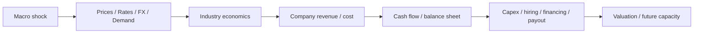

# Từ kinh tế vĩ mô đến công ty: cơ chế truyền dẫn (Macro-to-Company Transmission / 거시경제의 기업 전이)

Một trong những kỹ năng quan trọng nhất khi đọc kinh tế là không dừng ở headline. “Lãi suất tăng”, “KRW yếu”, “China slowdown” hay “AI capex tăng” chỉ trở thành insight khi ta mô tả được **shock đi qua price, volume, cost, balance sheet và behavior của company như thế nào**.

Macro không tác động mọi firm cùng dấu. Cùng một KRW depreciation có thể tốt cho exporter, xấu cho importer và mixed cho company có USD revenue nhưng cũng USD debt. Vì vậy analysis phải đi qua mechanism chứ không dùng slogan.

## Framework cơ bản: shock phải đi qua nhiều tầng



Mỗi arrow cần causal explanation. Nếu không giải thích được arrow, kết luận vẫn chỉ là story.

## Bước 1 — Xác định shock là price, quantity, financing hay rule shock

Macro news có thể phân loại sơ bộ:

```text
Price shock
→ oil, metals, memory ASP, freight

Demand shock
→ China slowdown, AI capex boom, domestic consumption recovery

Financial shock
→ BOK rate, credit spread, KRW, liquidity

Policy shock
→ tax credit, tariff, export control, lending rule

Supply shock
→ factory disruption, war, logistics bottleneck
```

Phân loại giúp tìm transmission channel đúng.

## Bước 2 — Tìm company exposure trước khi đo impact

Một shock chỉ matter nếu company exposed.

Exposure có thể nằm ở:

- revenue;
- input cost;
- debt;
- assets;
- customers;
- suppliers;
- regulation;
- valuation discount rate.

Ví dụ KRW/USD chỉ relevant mạnh nếu company có net foreign-currency exposure.

## Ví dụ 1 — KRW depreciation

Shock:

\[
KRW/USD \uparrow
\]

tức KRW yếu hơn.

Potential channels:

```text
USD revenue → reported KRW revenue ↑
Imported materials/equipment → KRW cost ↑
USD debt → KRW liability ↑
Foreign competitors' currencies → relative price effect changes
Hedges → timing/direction delayed
```

Kết luận đúng không phải “KRW yếu tốt cho exporters”, mà là estimate **net currency exposure**.

Một rough framework:

\[
Net\ FX\ Exposure \approx FX\ Revenue - FX\ Cost - FX\ Debt\ Service \pm Hedges
\]

Đây không phải accounting formula chính thức; nó ép analyst map exposure.

## Translation effect và economic effect khác nhau

Foreign subsidiary earnings khi convert về KRW có thể tăng chỉ vì FX; đó là **translation effect**.

Nhưng nếu weak KRW làm Korean-produced goods cheaper relative competitors, market share/price có thể thay; đó là **economic effect**.

Hai effects không nên trộn.

## Ví dụ 2 — BOK tăng policy rate

First-order chain:

```text
Base rate ↑
→ market/bank rates ↑
→ borrowing cost ↑
```

Nhưng company impact khác nhau.

Construction/PF: funding cost ↑ và buyer affordability ↓.

Bank: asset yield có thể ↑ nhưng deposit cost/credit loss cũng ↑.

Retail: household debt service ↑ → discretionary demand ↓.

Growth equity: discount rate ↑ trước cả khi earnings đổi.

Highly cash-rich company có thể earn more interest income.

Cùng shock, signs khác nhau.

## Repricing lag: rate shock không vào P&L ngay lập tức

Floating-rate loan có thể reset 3 tháng sau. Fixed bond có thể không đổi coupon cho tới maturity.

Do đó cần map **repricing schedule**.

Một company có 80% fixed debt 5 năm chịu policy-rate shock chậm hơn company có floating bank debt.

Timing là part của causality.

## Ví dụ 3 — Global AI capex boom

Hyperscaler AI investment tăng.

Transmission có thể là:

```text
AI servers ↑
→ accelerator demand ↑
→ HBM demand ↑
→ HBM ASP/mix/yield economics improve
→ memory supplier profits/capex ↑
→ equipment/material orders ↑
→ data-center power/grid demand ↑
```

Không phải tất cả nodes hưởng benefit cùng lúc.

Memory supplier có earnings impact sớm hơn fab-equipment vendor nếu new fab capex đến sau. Utility/grid impact có horizon dài hơn nữa.

Đây là **lag structure** trong value chain.

## Ví dụ 4 — Oil price tăng

Airline:

```text
Jet fuel cost ↑ → margin ↓ unless ticket price passes through
```

Petrochemical:

```text
Feedstock ↑ → product spread matters
```

Refiner:

```text
Crude price alone insufficient → crack spread/inventory effect matter
```

Shipbuilder:

High LNG/energy-security concerns có thể ảnh hưởng vessel demand ở horizon dài hơn.

Cùng commodity shock, value-chain position quyết định sign.

## Ví dụ 5 — China slowdown

Potential negative channels:

- direct exports giảm;
- Chinese subsidiary sales giảm;
- tourism/duty-free yếu;
- commodity/material demand giảm.

Potential positive channels:

- some input prices giảm;
- freight cost giảm;
- Korean downstream buyers có cheaper materials.

Ngoài ra Chinese slowdown và Chinese competitive expansion không phải cùng concept. Demand từ China có thể yếu trong khi Chinese exporters compete mạnh hơn globally.

## Ví dụ 6 — Wage growth

Wage là cost cho firm nhưng income cho household.

Labor-intensive SME:

```text
Wage ↑ → cost pressure ↑
```

Retail/service demand:

```text
Household income ↑ → consumption potential ↑
```

Company có pricing power có thể pass cost; weak-margin firm không.

Do đó macro variable có thể simultaneously be **cost shock và demand support**.

## Ví dụ 7 — Housing prices giảm

Channels:

```text
Homeowner wealth/collateral ↓
→ consumption / borrowing capacity ↓

Transactions ↓
→ brokerage / moving / furniture demand ↓

Presale demand ↓
→ construction/PF stress ↑

Collateral quality ↓
→ bank credit risk ↑
```

Nhưng renters/future buyers có thể benefit từ affordability nếu income/credit conditions giữ ổn.

Again, distribution matters.

## Ví dụ 8 — Government tax credit cho strategic capex

Suppose semiconductor tax credit tăng.

Direct effect:

```text
After-tax project cost ↓
→ NPV ↑
```

Second-order:

```text
More capex
→ equipment/material orders ↑
→ power/water/infrastructure demand ↑
→ possible industry capacity ↑
→ future pricing pressure if overbuilt
```

Policy benefit hôm nay có thể tạo overcapacity risk vài năm sau.

Đây là lý do second-order thinking quan trọng.

## Stock và flow: đừng trộn hai loại data

**Stock** đo tại một thời điểm:

- debt;
- inventory;
- cash;
- backlog;
- installed capacity.

**Flow** đo trong period:

- revenue;
- interest expense;
- new orders;
- capex;
- cash flow.

Weak sales là flow shock; qua nhiều quarters nó làm inventory stock tăng.

New orders là flow vào backlog stock; revenue recognition là flow ra backlog.

Nhiều lỗi analysis đến từ trộn stock và flow.

## Backlog dynamics

Với shipbuilding/construction/defense:

\[
Ending\ Backlog = Beginning\ Backlog + New\ Orders - Revenue\ Recognized/Cancelled
\]

Backlog lớn không đủ; margin của backlog và conversion speed quan trọng.

High-margin orders hôm nay có thể chỉ vào earnings vài năm sau.

## First-order, second-order và feedback effects

**First-order:** oil ↑ → airline fuel cost ↑.

**Second-order:** airline tăng ticket price → demand giảm.

**Feedback:** nhiều airlines cut capacity → ticket price có thể lại tăng.

Professional analysis cần second-order thinking nhưng không nên tạo chain quá dài không evidence.

Một rule practical: mỗi extra arrow cần empirical/business reason.

## Elasticity: impact thường không linear

Nếu demand giảm 5%, profit không nhất thiết giảm 5%.

High fixed-cost business có operating leverage:

\[
\%\Delta EBIT > \%\Delta Revenue
\]

khi margin quanh breakeven.

Semiconductor fab, airline, steel mill và platform infrastructure đều có nonlinear thresholds.

Ngược lại, asset-light service với flexible labor có thể absorb demand shock tốt hơn.

## Capacity utilization: threshold quan trọng

Factory economics thường thay mạnh theo utilization.

At low utilization, fixed depreciation/spread per unit cao. Khi utilization tăng qua breakeven zone, incremental volume có high contribution margin.

Do đó demand recovery 10% có thể làm profit tăng >10%.

Không linearity là reason scenario model cần unit economics.

## Timing: cùng shock có sign khác theo horizon

KRW depreciation:

**0–3 months:** translation/hedging effect.

**1 year:** contract repricing, input cost, demand response.

**3–5 years:** plant location/sourcing strategy có thể thay.

Rate hike:

short-term valuation effect nhanh; loan repricing vài months; capex/housing supply effect dài hơn.

Khi nói “impact positive/negative”, luôn ghi horizon.

## Expectations: market price có thể move trước accounting result

Stock market prices expected future cash flows, nên macro news có thể phản ánh vào price trước reported earnings.

Nếu everyone already expects rate cut, actual cut có thể không tạo positive surprise.

Do đó:

```text
Good macro outcome
≠
Good investment return automatically
```

Need compare outcome với **expectation already priced**.

## Policy reaction: macro shock không xảy ra trong vacuum

Inflation shock có thể dẫn rate hikes. Recession có thể dẫn fiscal support. Housing stress có thể dẫn PF stabilization. Supply-chain risk có thể dẫn subsidy.

Company analysis không nên freeze policy response.

Nhưng cũng không nên assume rescue.

Policy support phải map tới actual instrument, eligibility và magnitude.

Xem [`26_economic_institutions_and_policy_making.md`](./26_economic_institutions_and_policy_making.md).

## Company reaction cũng quay lại macro

Transmission là two-way.

Semiconductor boom:

```text
Profit ↑ → capex ↑ → hiring ↑ → equipment imports ↑
```

Housing downturn:

```text
Construction cut → supplier income ↓ → local demand ↓
```

Khi many firms phản ứng cùng direction, micro behavior aggregate thành macro cycle.

Economy là feedback system, không phải one-way arrow.

## Scenario matrix thay vì single forecast

Ví dụ semiconductor company:

| Scenario | Memory price | KRW | AI demand | Likely operating effect |
|---|---|---|---|---|
| AI boom | ↑ mạnh | yếu vừa | mạnh | revenue/margin mạnh |
| FX offset | ↑ | KRW mạnh | mạnh | operating tốt, translation cushion nhỏ hơn |
| Downcycle | ↓ | KRW yếu | yếu | FX helps partly, ASP pressure dominates |
| Supply constraint | ↑ | volatile | vừa | profit depends on yield/capacity |

Mục tiêu không phải assign false-precision probabilities. Mục tiêu là biết **which variables change thesis direction**.

## Sensitivity matrix

Một generic matrix:

| Shock | Revenue | Cost | Balance sheet | Valuation |
|---|---|---|---|---|
| KRW depreciation | company-specific | imported input ↑ | FX debt ↑ | mixed |
| Rate increase | demand may ↓ | interest ↑ | refinancing pressure | discount rate ↑ |
| Oil increase | sector-specific | energy/logistics ↑ | working capital ↑ | inflation risk |
| China slowdown | export exposure ↓ | some inputs ↓ | inventory risk | risk premium may ↑ |

Dấu không universal. Table tồn tại để force analyst explain exceptions.

## Build a transmission tree

Khi có headline, viết tối đa 3–5 levels:

```text
Shock
↓
Immediate variable
↓
Industry mechanism
↓
Company P&L/BS item
↓
Management response
```

Ví dụ:

```text
BOK hike
↓
Mortgage rate ↑
↓
Housing demand ↓
↓
Presales / PF cash flow ↓
↓
Contractor delays capex / raises liquidity buffer
```

Nếu tree quá dài, uncertainty compound nhanh.

## Stress-testing balance sheet, không chỉ EPS

Macro shock thường nguy hiểm nhất khi hit both earnings và funding.

Ví dụ construction downturn:

```text
Revenue/margin ↓
+
Receivables ↑
+
PF guarantee risk ↑
+
Credit spread ↑
```

EPS model có thể understate risk nếu không model liquidity.

Đây là reason [`11_banks_finance_and_corporate_funding.md`](./11_banks_finance_and_corporate_funding.md) cần đọc cùng macro.

## Transmission map theo business type

### Export manufacturer

Global demand + FX + commodity + trade rules.

### Domestic retailer

Real income + household debt + employment + rent.

### Bank

Rates + deposit competition + credit demand + asset quality + housing.

### Construction

Rates + housing + PF + materials + regulation.

### Platform

Consumption + ad budget + regulation + network effects.

### IT/SI

Corporate/public capex + labor cost + cloud/AI adoption + project pipeline.

Company type giúp chọn macro variables; không cần monitor mọi indicator.

## Mental Model

> Tin kinh tế chỉ trở thành company insight khi ta viết được chuỗi **shock → price/volume/cost → cash flow/balance sheet → management response → future capacity/valuation**.

Một rule đơn giản:

```text
No mechanism → no conclusion.
```

## Common misconceptions

**“Correlation lịch sử nghĩa causal relation ổn định.”** Sai. Hedge, business mix và regime thay đổi.

**“Macro forecast đúng là đủ để đầu tư đúng.”** Sai. Expectation có thể priced in.

**“Shock tốt/xấu có cùng sign ở mọi horizon.”** Sai. Timing matters.

**“Revenue sensitivity là đủ.”** Sai. Funding/balance-sheet sensitivity có thể quan trọng hơn.

**“Second-order thinking nghĩa tạo chain càng dài càng tốt.”** Sai. Uncertainty tăng theo mỗi link.

## Final connection

Dùng [`20_how_to_analyze_a_korean_company.md`](./20_how_to_analyze_a_korean_company.md) để biến transmission framework thành company-specific model. Quay lại [`01_macro_economy_and_business_cycle.md`](./01_macro_economy_and_business_cycle.md), [`02_trade_export_and_global_value_chains.md`](./02_trade_export_and_global_value_chains.md), [`11_banks_finance_and_corporate_funding.md`](./11_banks_finance_and_corporate_funding.md) và [`26_economic_institutions_and_policy_making.md`](./26_economic_institutions_and_policy_making.md) khi cần nền sâu hơn.
