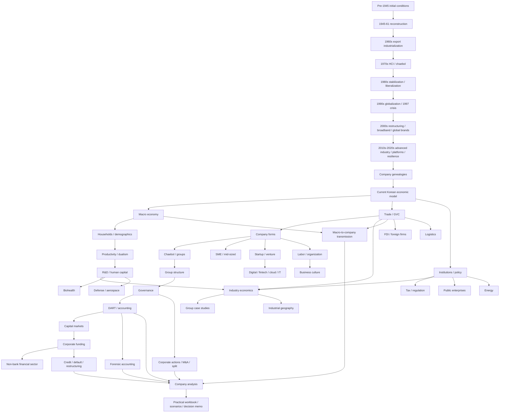

# Korea Business & Economy Knowledge Library — Doanh nghiệp, tập đoàn và kinh tế Hàn Quốc

Thư viện này được xây như một **knowledge system để hiểu nền kinh tế và doanh nghiệp Hàn Quốc từ nguyên nhân lịch sử đến cơ chế vận hành hiện tại**, không phải danh sách tập đoàn, cheat sheet đầu tư hay collection facts rời rạc.

Nguyên tắc trung tâm là: **cấu trúc doanh nghiệp Hàn Quốc hiện tại chỉ hiểu sâu khi biết nó hình thành qua lịch sử như thế nào**. Samsung, Hyundai, LG, SK, POSCO, Naver, Kakao hay Coupang không xuất hiện trong chân không. Mỗi company/group phản ánh một stage khác nhau của reconstruction, import substitution, export industrialization, heavy-industry policy, liberalization, financial crisis, broadband/platform growth và advanced-industry transition.

> **Mental model trung tâm:** nền kinh tế Hàn Quốc là một network gồm **nhà nước – thị trường – ngân hàng – thị trường vốn – business groups – SME – labor – household – technology – energy – logistics – global value chains**. Muốn hiểu một company, phải biết nó đứng ở node nào và những edge nào truyền capital, information, risk và demand tới nó.

Library hiện gồm **50 Markdown files**, trong đó có 9 chapter lịch sử trong `00_history/`, các chapter nền tảng và ngành tại root, cùng một practical layer mới về financial sector, credit/default, corporate actions, forensic accounting và company-analysis workbook.

---

# Thư viện này được viết như thế nào?

Mỗi chapter cố gắng trả lời cùng một family of questions.

**Khái niệm là gì?** Không chỉ dịch thuật ngữ mà xác định object thực sự đang nói tới.

**Tại sao nó tồn tại?** Giải thích constraint hoặc problem đã tạo ra institution/business model đó.

**Nó hoạt động như thế nào?** Đi từ causal mechanism tới cash flow, accounting, decision rights hoặc operational process.

**Trade-off ở đâu?** Scale có thể tăng productivity nhưng tăng concentration; regulation có thể giảm risk nhưng tăng entry barrier; debt có thể tăng ROE nhưng tăng refinancing risk.

**Nó liên kết với chapter nào?** Relative Markdown links được dùng để library hoạt động như knowledge graph trên GitHub/GitHub Pages.

Thuật ngữ quan trọng thường được ghi theo dạng **Tiếng Việt (English / 한국어)** để người đọc có thể nối kiến thức với tài liệu quốc tế và môi trường doanh nghiệp Hàn Quốc.

---

# Reading Order chính

## Phase A — Lịch sử kinh tế và lịch sử hình thành doanh nghiệp

Nếu học từ nền tảng, hãy đọc toàn bộ cụm lịch sử trước. Đây không phải phần “background tùy chọn”; nó giải thích vì sao Korea có export orientation, chaebol, industrial clusters, financial structure và labor system như hiện tại.

1. [Trước 1945: market, industrial legacy, property rights và division](./00_history/00_legacy_before_1945.md)
2. [1945–1961: reconstruction, land reform, aid, FX constraint và early firms](./00_history/01_1945_1961_reconstruction_land_reform_and_early_firms.md)
3. [1960s: export industrialization, Five-Year Plans và directed credit](./00_history/02_1960s_export_industrialization_and_business_formation.md)
4. [1970s: HCI Drive, vertical integration và chaebol expansion](./00_history/03_1970s_hci_and_chaebol_expansion.md)
5. [1980s: stabilization, liberalization, democratization và productivity upgrading](./00_history/04_1980s_stabilization_liberalization_and_democratization.md)
6. [1990s: globalization, leverage và Asian Financial Crisis 1997](./00_history/05_1990s_globalization_and_1997_crisis.md)
7. [2000s: restructuring, broadband, China và global brands](./00_history/06_2000s_restructuring_it_and_global_firms.md)
8. [2010s–2020s: advanced industry, platform economy, resilience và slow-growth transition](./00_history/07_2010s_2020s_platforms_advanced_industry_and_slow_growth.md)
9. [Corporate genealogies: Samsung, Hyundai, LG, SK và các lineages khác](./00_history/08_company_genealogies.md)

History được viết theo logic:

```text
Initial conditions
      ↓
Constraint của từng thời kỳ
      ↓
Institution / policy response
      ↓
Firm behavior
      ↓
Capability accumulation
      ↓
New industrial structure
      ↓
New constraint
```

Nhờ vậy chronology không trở thành danh sách sự kiện mà thành causal model.

---

## Phase B — Từ lịch sử sang nền kinh tế Hàn Quốc hiện tại

1. [Từ lịch sử đến mô hình kinh tế thị trường Hàn Quốc hiện nay](./00_economic_model_and_history.md)
2. [Kinh tế vĩ mô và chu kỳ kinh doanh Hàn Quốc](./01_macro_economy_and_business_cycle.md)
3. [Thương mại, xuất khẩu và Global Value Chains](./02_trade_export_and_global_value_chains.md)

Ba chapter này giải thích GDP/GDI, potential growth, inflation, rates, KRW, household credit, export cycles, terms of trade, domestic value added, FTA/rules of origin, supply-chain resilience và geopolitics.

---

## Phase C — Công ty Hàn Quốc được tổ chức, kiểm soát và tài trợ như thế nào?

1. [Company forms và size classes tại Hàn Quốc](./03_company_forms_and_size_classes.md)
2. [Chaebol và large business groups](./04_chaebol_and_large_business_groups.md)
3. [Group structure, affiliates và holding companies](./05_group_structure_affiliates_holding_companies.md)
4. [SME, mid-sized enterprises và subcontracting ecosystem](./06_sme_mid_sized_and_subcontracting_ecosystem.md)
5. [Startup, venture và scale-up](./07_startups_venture_and_scaleups.md)
6. [Corporate governance, ownership và control](./08_corporate_governance_ownership_and_control.md)
7. [Disclosure, accounting, DART và KIND](./09_disclosure_accounting_dart_kind.md)
8. [Capital markets: KOSPI, KOSDAQ và KONEX](./10_capital_markets_kospi_kosdaq_konex.md)
9. [Banks, corporate finance và funding](./11_banks_finance_and_corporate_funding.md)
10. [Securities, insurance, asset management và non-bank finance](./35_financial_sector_securities_insurance_asset_management.md)
11. [Credit rating, corporate bonds, default và restructuring](./36_credit_ratings_bonds_default_and_restructuring.md)
12. [Corporate actions, M&A, merger, spin-off và capital actions](./37_corporate_actions_mna_mergers_spin_offs_and_capital_actions.md)
13. [Forensic accounting, earnings quality và accounting red flags](./38_forensic_accounting_red_flags_and_earnings_quality.md)

Flow logic của cụm này:

```text
Legal entity
   ↓
Ownership / control
   ↓
Business-group relationships
   ↓
Disclosure / accounting boundary
   ↓
Equity + debt + market funding
   ↓
Credit risk / maturity / covenant
   ↓
Corporate actions / restructuring
   ↓
Capital allocation
   ↓
Shareholder / creditor outcomes
```

---

## Phase D — Con người và organizational operating system

1. [Labor, titles, compensation và workplace structure](./12_labor_titles_compensation_and_workplace.md)
2. [Business culture, decision making và communication](./13_business_culture_decision_making_and_communication.md)

Hai file đi sâu vào `직무`, `직급`, `직책`, employment types, total compensation, performance evaluation, seniority, promotion, outsourcing layers, `보고`, `결재`, hierarchy, escalation, high-context communication, SI/SM coordination và Korea–Vietnam bridge roles.

---

## Phase E — Các industry engines của nền kinh tế

1. [Semiconductors, electronics và display](./14_semiconductors_electronics_display.md)
2. [Automotive, battery và mobility](./15_automotive_battery_mobility.md)
3. [Shipbuilding, steel, chemicals và heavy industry](./16_shipbuilding_steel_chemicals_heavy_industry.md)
4. [Platforms, telecom, content, retail và services](./17_platform_telecom_content_retail_services.md)
5. [Construction, real estate và Project Finance](./18_construction_real_estate_and_project_finance.md)
6. [Energy security, electricity market và carbon transition](./30_energy_security_power_market_and_transition.md)
7. [Biohealth, pharmaceuticals, medical devices và K-Beauty](./31_biohealth_pharma_medical_devices_and_kbeauty.md)
8. [Defense, aerospace và strategic industries](./32_defense_aerospace_and_strategic_industries.md)
9. [Logistics, ports và distribution networks](./33_logistics_ports_and_distribution_networks.md)
10. [Digital economy, fintech, cloud và IT services](./34_digital_fintech_cloud_and_it_services.md)

Một useful mental model là mỗi industry phải được đọc bằng đúng economic engine:

| Industry | Variables phải hiểu trước |
|---|---|
| Semiconductor | ASP, yield, utilization, product mix, CAPEX, depreciation |
| Automotive | units, ASP/mix, incentives, utilization, warranty, captive finance |
| Battery | chemistry, GWh, utilization, raw-material pass-through, customer concentration |
| Shipbuilding | new orders, backlog, contract price, cost estimates, delivery/cash timing |
| Steel/Chemicals | spreads, utilization, energy/raw materials, regional capacity |
| Platform | users/transactions, take rate, retention, CAC/LTV, network effects |
| Retail/Logistics | inventory turns, density, fulfillment, working capital |
| Construction/PF | land → bridge → 본PF → presale → guarantees → refinancing |
| Energy | fuel/FX, generation mix, grid, tariff, reliability, carbon cost |
| Biohealth | scientific success → approval → reimbursement → adoption |
| Defense | backlog, qualification, learning curve, localization, lifecycle support |
| IT/SI/SM | utilization, scope, billing model, maintenance recurring revenue, legacy integration |
| Financials | spread/fee/underwriting, asset quality, capital adequacy, liquidity |

---

## Phase F — Áp dụng knowledge vào group/company analysis

1. [Major Korean business-group case studies](./19_major_groups_case_studies.md)
2. [Cách phân tích một Korean company từ đầu đến cuối](./20_how_to_analyze_a_korean_company.md)
3. [Macro-to-company transmission](./21_economy_to_company_transmission.md)
4. [Practical Company Analysis Workbook](./39_practical_company_analysis_workbook_and_case_patterns.md)

`20` là framework tổng quát; `39` là workbook thực hành. Khi dùng cùng nhau, process sẽ đi qua:

```text
Historical context
→ Legal entity
→ Revenue engine
→ Driver tree
→ Value chain
→ Unit economics
→ Financial statements
→ Earnings quality
→ Funding / credit
→ Governance / corporate actions
→ Macro exposure
→ Bear / Base / Bull
→ Valuation / implied expectations
→ Thesis breakers
→ Decision memo
```

---

## Phase G — Institution, regulation và structural constraints của Korea hiện đại

1. [Tax, regulation và competition policy](./22_tax_regulation_and_competition.md)
2. [Foreign-invested companies và Korea market entry](./23_foreign_invested_companies_and_korea_entry.md)
3. [Industrial geography và regional clusters](./24_regional_clusters_and_industrial_geography.md)
4. [Public enterprises và public institutions](./25_public_enterprises_and_state_owned_companies.md)
5. [Economic institutions và policy making](./26_economic_institutions_and_policy_making.md)
6. [Demographics, households và consumption](./27_demographics_households_and_consumption.md)
7. [Productivity, services và economic dualism](./28_productivity_services_and_economic_dualism.md)
8. [Innovation, R&D, education và human capital](./29_innovation_rnd_education_and_human_capital.md)

Cụm này trả lời các câu khó hơn: vì sao manufacturing mạnh nhưng service/SME productivity gap còn lớn; aging truyền vào labor, growth và demand như thế nào; regulation vừa là cost vừa là moat ra sao; capital-region concentration tự củng cố thế nào; R&D spending khác innovation output ở đâu.

---

# Knowledge Map



---

# Reading Paths theo mục tiêu

Không phải lúc nào cũng cần đọc toàn bộ 50 file theo thứ tự.

## Nếu mục tiêu là hiểu nền kinh tế Hàn Quốc từ gốc

```text
00_history/00 → 07
→ 00_economic_model_and_history
→ 01_macro
→ 02_trade
→ 26_institutions
→ 27_demographics
→ 28_productivity
→ 29_innovation
```

Sau đó chọn industry chapters.

## Nếu mục tiêu là hiểu chaebol và Korean corporations

```text
00_history/02 → 05
→ 00_history/08_genealogies
→ 03_company_forms
→ 04_chaebol
→ 05_group_structure
→ 08_governance
→ 09_DART/accounting
→ 37_corporate_actions
→ 19_case_studies
```

## Nếu mục tiêu là phân tích một cổ phiếu/công ty niêm yết Hàn Quốc

```text
03_company_forms
→ 08_governance
→ 09_DART/accounting
→ 10_capital_markets
→ 11_funding
→ 38_forensic_accounting
→ 36_credit/default
→ relevant industry chapter
→ 20_company_analysis
→ 21_macro_transmission
→ 39_practical_workbook
```

Không bắt đầu bằng chart giá. Bắt đầu bằng entity, business model và filings.

## Nếu mục tiêu là đọc DART/KIND như analyst

```text
09_DART/accounting
→ 38_forensic_accounting
→ 11_funding
→ 36_credit/default
→ 37_corporate_actions
→ 20_company_analysis
→ 39_workbook
```

Flow thực hành:

```text
Filing facts
→ accounting quality
→ hidden obligations / liquidity
→ ownership / corporate event
→ scenarios
→ thesis breakers
→ decision memo
```

## Nếu mục tiêu là hiểu financial sector Hàn Quốc

```text
01_macro
→ 10_capital_markets
→ 11_funding
→ 35_nonbank_finance
→ 36_credit/default
→ 34_fintech/cloud
→ 26_institutions
```

## Nếu mục tiêu là hiểu workplace/career tại Korean company

```text
03_company_forms
→ 06_SME/mid-sized
→ 12_labor
→ 13_business_culture
→ 19_group_cases
→ relevant industry chapter
→ 39_workbook career layer
```

Nếu làm trong SI/SM hoặc enterprise IT, thêm [Digital economy, fintech, cloud và IT services](./34_digital_fintech_cloud_and_it_services.md).

## Nếu mục tiêu là hiểu startup/tech ecosystem

```text
07_startups
→ 10_capital_markets
→ 17_platform/services
→ 29_R&D/human capital
→ 34_digital/fintech/cloud
→ 22_regulation
```

## Nếu mục tiêu là hiểu industrial policy và Korea growth model

```text
00_history/02_1960s
→ 00_history/03_1970s_HCI
→ 00_history/04_1980s
→ 00_history/05_1997
→ 26_institutions
→ 22_regulation
→ 29_R&D
→ 30_energy
→ relevant strategic-industry chapter
```

---

# Chapter Index đầy đủ

## History

| Chapter | Nội dung trung tâm |
|---|---|
| [00_history/00](./00_history/00_legacy_before_1945.md) | Commercialization, colonial industrial legacy, property rights, industrial geography |
| [00_history/01](./00_history/01_1945_1961_reconstruction_land_reform_and_early_firms.md) | Liberation, land reform, war, aid, FX constraint, import substitution |
| [00_history/02](./00_history/02_1960s_export_industrialization_and_business_formation.md) | Export discipline, Five-Year Plans, directed credit, technology absorption |
| [00_history/03](./00_history/03_1970s_hci_and_chaebol_expansion.md) | HCI, upstream industry, vertical integration, chaebol expansion |
| [00_history/04](./00_history/04_1980s_stabilization_liberalization_and_democratization.md) | Stabilization, liberalization, democratization, technology/competition upgrading |
| [00_history/05](./00_history/05_1990s_globalization_and_1997_crisis.md) | Leverage, FX/maturity mismatch, crisis and restructuring |
| [00_history/06](./00_history/06_2000s_restructuring_it_and_global_firms.md) | Post-crisis discipline, broadband, global brands, China and overseas production |
| [00_history/07](./00_history/07_2010s_2020s_platforms_advanced_industry_and_slow_growth.md) | Advanced manufacturing, platforms, COVID/resilience, AI/HBM, structural slowdown |
| [00_history/08](./00_history/08_company_genealogies.md) | Capital/capability/ownership genealogies of major firms/groups |

## Economy, companies and institutions

| Chapter | Nội dung trung tâm |
|---|---|
| [00 Economic model](./00_economic_model_and_history.md) | Historical layers embedded in Korea’s current market economy |
| [01 Macro](./01_macro_economy_and_business_cycle.md) | GDP/GDI, potential growth, inflation, rates, FX, cycles |
| [02 Trade & GVC](./02_trade_export_and_global_value_chains.md) | Value added, FTA, rules of origin, FX, China exposure, resilience |
| [03 Company forms](./03_company_forms_and_size_classes.md) | Legal entities, 주식회사, SME/mid-sized/large classifications |
| [04 Chaebol](./04_chaebol_and_large_business_groups.md) | Business-group control, concentration, internal capital markets |
| [05 Group structure](./05_group_structure_affiliates_holding_companies.md) | Parent/subsidiary/affiliate, consolidation, holding structure, spin-offs |
| [06 SME ecosystem](./06_sme_mid_sized_and_subcontracting_ecosystem.md) | Supplier tiers, bargaining power, working capital, scale-up gap |
| [07 Startup/Venture](./07_startups_venture_and_scaleups.md) | PMF, burn/runway, VC, cap tables, unit economics, scale-up |
| [08 Governance](./08_corporate_governance_ownership_and_control.md) | Type I/II agency, control graphs, boards, succession, capital allocation |
| [09 DART/Accounting](./09_disclosure_accounting_dart_kind.md) | Filings, statements, consolidation, accruals, FCF, footnotes, audit |
| [10 Capital Markets](./10_capital_markets_kospi_kosdaq_konex.md) | KOSPI/KOSDAQ/KONEX, IPO, valuation, dilution, buyback, market mechanics |
| [11 Funding](./11_banks_finance_and_corporate_funding.md) | Bank debt, bonds, working capital, leverage, maturity and refinancing |
| [12 Labor](./12_labor_titles_compensation_and_workplace.md) | 직무/직급/직책, compensation, employment types, evaluation, career capital |
| [13 Business Culture](./13_business_culture_decision_making_and_communication.md) | 보고/결재, hierarchy, escalation, high-context communication, SI/SM coordination |
| [14 Semiconductors](./14_semiconductors_electronics_display.md) | Yield, utilization, ASP/product mix, CAPEX and technology cycles |
| [15 Auto/Battery](./15_automotive_battery_mobility.md) | OEM/suppliers, auto unit economics, captive finance, battery, SDV |
| [16 Heavy Industry](./16_shipbuilding_steel_chemicals_heavy_industry.md) | Backlog, spreads, long-cycle accounting, decarbonization |
| [17 Platforms/Services](./17_platform_telecom_content_retail_services.md) | Network effects, take rate, telecom, IP, retail/logistics economics |
| [18 Construction/PF](./18_construction_real_estate_and_project_finance.md) | Developer/contractor, bridge→본PF, presales, guarantees, refinancing |
| [19 Group Cases](./19_major_groups_case_studies.md) | Samsung, Hyundai, SK, LG, Lotte, Hanwha, POSCO, platforms and others |
| [20 Company Analysis](./20_how_to_analyze_a_korean_company.md) | End-to-end practical company research framework |
| [21 Macro Transmission](./21_economy_to_company_transmission.md) | Shock → price/volume/cost → cash flow → balance sheet → valuation |
| [22 Tax/Regulation](./22_tax_regulation_and_competition.md) | Corporate tax, competition, merger control, platform/subcontracting regulation |
| [23 FDI](./23_foreign_invested_companies_and_korea_entry.md) | Subsidiary/branch/JV, transfer pricing, localization, decision rights |
| [24 Industrial Geography](./24_regional_clusters_and_industrial_geography.md) | Agglomeration, 수도권, industrial belts, utilities, location risk |
| [25 Public Enterprises](./25_public_enterprises_and_state_owned_companies.md) | Natural monopoly, tariffs, policy banks, procurement, quasi-fiscal burden |
| [26 Economic Institutions](./26_economic_institutions_and_policy_making.md) | BOK, fiscal/industrial policy, regulators, policy transmission |
| [27 Demographics/Households](./27_demographics_households_and_consumption.md) | Aging, fertility, household balance sheets, housing and consumption |
| [28 Productivity/Dualism](./28_productivity_services_and_economic_dualism.md) | Manufacturing vs service productivity, SME gap, TFP and management |
| [29 R&D/Human Capital](./29_innovation_rnd_education_and_human_capital.md) | R&D portfolio, education, IP, skills and frontier innovation |
| [30 Energy](./30_energy_security_power_market_and_transition.md) | Import dependency, power market, nuclear, LNG, renewables, grid |
| [31 Biohealth](./31_biohealth_pharma_medical_devices_and_kbeauty.md) | Drug discovery, biosimilars, CDMO, medical devices, K-Beauty |
| [32 Defense/Aerospace](./32_defense_aerospace_and_strategic_industries.md) | Backlog, procurement, learning curves, localization, lifecycle support |
| [33 Logistics](./33_logistics_ports_and_distribution_networks.md) | Ports, shipping, inventory, 3PL, customs, last-mile density |
| [34 Digital/Fintech/Cloud/IT](./34_digital_fintech_cloud_and_it_services.md) | Platforms, fintech, cloud, data centers, SI/SM, SaaS, AI and cybersecurity |
| [35 Non-bank Financial Sector](./35_financial_sector_securities_insurance_asset_management.md) | Securities firms, IB, asset management, insurance, pensions, credit ratings |
| [36 Credit/Default/Restructuring](./36_credit_ratings_bonds_default_and_restructuring.md) | Bonds, spread, rating, maturity, covenant, default, workout, recovery |
| [37 Corporate Actions](./37_corporate_actions_mna_mergers_spin_offs_and_capital_actions.md) | M&A, merger ratio, spin-off, rights issue, buyback, tender, JV |
| [38 Forensic Accounting](./38_forensic_accounting_red_flags_and_earnings_quality.md) | Earnings quality, accruals, working capital, provisions, hidden leverage, red flags |
| [39 Practical Workbook](./39_practical_company_analysis_workbook_and_case_patterns.md) | Driver trees, case patterns, scenarios, risk register, thesis breakers, decision memo |

---

# Research Discipline của library

## 1. Structural knowledge và current snapshot được tách riêng

Một concept như `foreign-exchange constraint`, `operating leverage`, `agency problem`, `credit spread` hay `earnings quality` có thể dùng lâu dài. Một forecast GDP, tax rate, regulation hoặc company structure cụ thể có thể thay đổi.

Library cố ghi rõ **year/date** khi dùng data hiện hành để người đọc không nhầm snapshot với structural truth.

## 2. Primary/official sources được ưu tiên cho rule và data hiện hành

Source hierarchy chính:

- **KDI** — historical development and structural research;
- **Bank of Korea (BOK)** — macroeconomics, monetary policy, financial stability;
- **Statistics Korea** — demographics and household/economic statistics;
- **KFTC** — competition and large-business-group framework;
- **FSS/DART** — corporate filings;
- **KRX/KIND** — listed-company/exchange disclosures;
- **Ministry of SMEs and Startups** — SME/startup policies/statistics;
- **Ministry of Employment and Labor / Minimum Wage Commission** — labor rules/data;
- **NTS** — corporate tax rules;
- **Invest KOREA/KOTRA** — FDI and foreign-business setup;
- **MSIT** — R&D/ICT policy;
- official energy/biohealth/industry institutions;
- official corporate histories/disclosures for company genealogy.

Secondary articles có thể giúp discover a question, nhưng important factual claims nên quay lại primary/official evidence khi practical.

## 3. Company narrative và evidence không được trộn

Khi phân tích company, tách:

**Fact:** filing nói CAPEX là X.

**Management claim:** management nói CAPEX sẽ tạo leadership.

**Inference:** utilization phải đạt Y để ROIC đủ hấp dẫn.

Workbook `39` khuyến nghị tag `F/M/I/E` để giữ distinction này trong research notes.

## 4. Group và legal entity luôn được tách

“Samsung”, “Hyundai”, “SK” hay “LG” là group/brand concepts. Financial statements thuộc legal entities. Không transfer group prestige, guarantees hoặc cash sang affiliate nếu legal/economic relationship chưa được chứng minh.

## 5. Historical claims được đối xử như mechanisms, không phải success mythology

Industrial policy, HCI, chaebol concentration, colonial legacy và 1997 crisis đều có academic/political debate. Library ưu tiên mechanism, incentives, trade-offs, evidence boundaries và alternative causal channels thay vì single-cause story.

## 6. Red flag không phải accusation

Receivables tăng, goodwill lớn, related-party deal hoặc rating downgrade là **signal để hỏi sâu hơn**, không phải bằng chứng fraud hay wrongdoing. Forensic analysis chỉ meaningful khi nối accounting signal với business mechanism và supporting evidence.

---

# Cách học để nhớ lâu

Đừng cố memorize 50 files. Hãy giữ một số mental models có thể tái sử dụng.

### Economy

```text
Labor + Capital + Knowledge + Institutions
               ↓
           Productivity
               ↓
            Income
```

### Industrialization

```text
FX constraint
→ Export
→ Investment
→ Learning
→ Higher productivity
→ New industries
```

### Company

```text
Customer need
→ Revenue engine
→ Cost structure
→ Cash flow
→ Balance sheet
→ Capital allocation
```

### Business group

```text
Legal entities
+ Ownership/control edges
+ Internal capital flows
+ Shared capability
```

### Macro transmission

```text
Shock
→ price / volume / cost / rate / FX
→ margin / cash flow
→ balance sheet
→ CAPEX / hiring / valuation
```

### Credit

```text
Business volatility
× leverage
× maturity concentration
× liquidity
× market access
→ default/restructuring risk
```

### Forensic accounting

```text
Reported earnings
→ balance-sheet changes
→ cash flow
→ footnotes
→ economic reality
```

### Practical analysis

```text
Entity
→ Business engine
→ Driver tree
→ Financial statements
→ Earnings quality
→ Funding
→ Governance
→ Scenario
→ Expectations
→ Decision
```

Nếu các mental models này rõ, new facts có chỗ để gắn vào thay vì trở thành dữ kiện rời.

---

# Mốc rà soát

Library đã được **deep-refactor và consistency review đến 20/09/2026**.

Pass hiện tại bổ sung practical layer từ chapter `35` tới `39`, đưa library từ mức hiểu cấu trúc kinh tế/doanh nghiệp sang mức có thể thực hành phân tích **financial institutions, credit/default, M&A/corporate actions, earnings quality và scenario-based company analysis**.

Số liệu, regulation, tax, forecasts, ratings và company structures có thể thay đổi sau mốc trên; khi dùng cho quyết định thực tế, hãy kiểm tra filing/rule/data mới nhất.