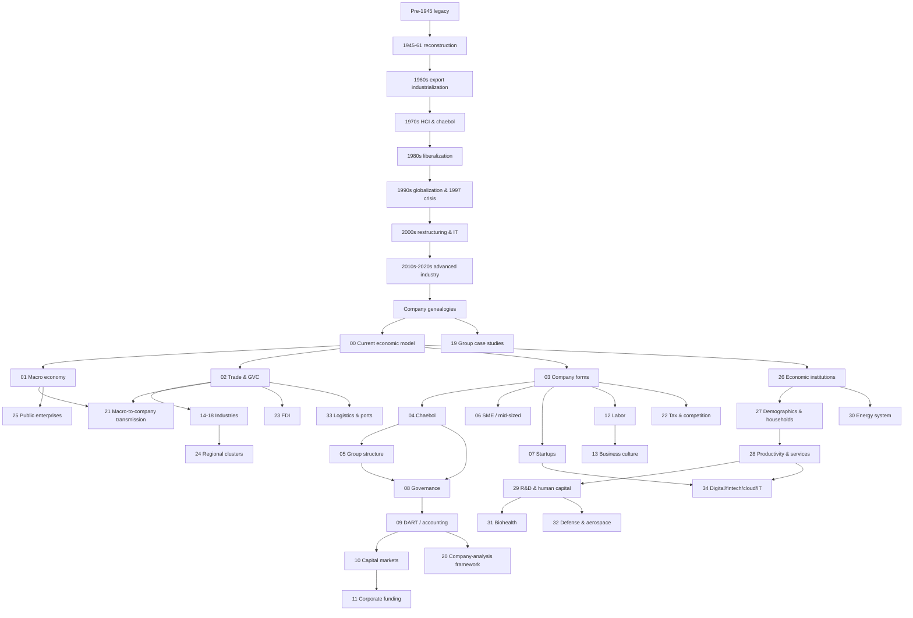

# Korea Business & Economy Knowledge Library — Doanh nghiệp, tập đoàn và kinh tế Hàn Quốc

Thư viện này được thiết kế theo một nguyên tắc: **phải hiểu lịch sử hình thành thị trường và doanh nghiệp Hàn Quốc trước, sau đó mới đọc cấu trúc kinh tế hiện tại**. Samsung, Hyundai, LG, SK hay Naver không xuất hiện trong chân không. Mỗi group là kết quả của một phase khác nhau của reconstruction, export industrialization, heavy-industry policy, liberalization, crisis, IT expansion và technology transition.

Đây không phải danh sách tập đoàn nổi tiếng và cũng không phải cheat sheet. Mỗi file là một chapter độc lập, nhưng toàn bộ library được nối thành knowledge graph.

> Mental model trung tâm: nền kinh tế Hàn Quốc là một mạng lưới lịch sử gồm **nhà nước – thị trường – ngân hàng – thị trường vốn – tập đoàn – SME – lao động – công nghệ – chuỗi cung ứng – thị trường toàn cầu**. Cấu trúc hiện tại chỉ hiểu được khi biết mạng lưới đó được hình thành theo thời gian như thế nào.

## Thứ tự đọc chính

### Phase A — Lịch sử kinh tế và lịch sử doanh nghiệp

Đọc toàn bộ thư mục `00_history/` trước nếu muốn xây mental model từ gốc:

```text
00_history/
├── 00_legacy_before_1945.md
├── 01_1945_1961_reconstruction_land_reform_and_early_firms.md
├── 02_1960s_export_industrialization_and_business_formation.md
├── 03_1970s_hci_and_chaebol_expansion.md
├── 04_1980s_stabilization_liberalization_and_democratization.md
├── 05_1990s_globalization_and_1997_crisis.md
├── 06_2000s_restructuring_it_and_global_firms.md
├── 07_2010s_2020s_platforms_advanced_industry_and_slow_growth.md
└── 08_company_genealogies.md
```

Các file này trả lời lần lượt: nền kinh tế trước 1945 có gì; chiến tranh và land reform làm gì; tại sao export trở thành engine; vì sao HCI/chaebol lớn lên; liberalization thay đổi competition thế nào; vì sao 1997 xảy ra; Samsung/Hyundai/LG/SK chuyển thành global groups ra sao; và Korea bước vào advanced-industry/slow-growth era như thế nào.

### Phase B — Từ lịch sử sang nền kinh tế thị trường hiện tại

Sau history, đọc:

`00_economic_model_and_history.md → 01_macro_economy_and_business_cycle.md → 02_trade_export_and_global_value_chains.md`.

Ba file này chuyển từ chronology sang **system hiện tại**: growth, inflation, rates, KRW, exports, global value chains, demographics và structure của market economy.

### Phase C — Doanh nghiệp, ownership và finance

Tiếp theo:

`03 → 04 → 05 → 06 → 07 → 08 → 09 → 10 → 11`.

Chuỗi này đi từ legal form và size classification đến chaebol, affiliates, SME, startups, corporate governance, DART/accounting, KOSPI/KOSDAQ và corporate finance.

### Phase D — Con người, ngành và ứng dụng phân tích

Đọc `12–18` cho labor/culture và các ngành công nghiệp truyền thống/hiện đại; `19–25` cho case studies, analysis framework, macro transmission, regulation, FDI, geography và public enterprises.

### Phase E — Các lớp cấu trúc còn thiếu của nền kinh tế hiện đại

Đọc `26–34` để mở rộng từ company analysis sang toàn hệ thống: thể chế policy, household/demographics, productivity dualism, R&D/human capital, energy, biohealth, defense/aerospace, logistics và digital/fintech/cloud/IT services.

Chuỗi gợi ý là:

`26 → 27 → 28 → 29 → 30`, sau đó chọn các industry extensions `31–34` theo nhu cầu.

## Knowledge map



## Danh sách chapter và conceptual boundary

### `00_history/`

| File | Chủ đề chính | Connection quan trọng |
|---|---|---|
| `00_legacy_before_1945.md` | Market/commercialization, colonial industrial legacy, division | 01 history |
| `01_1945_1961_reconstruction_land_reform_and_early_firms.md` | Liberation, land reform, war, aid, import substitution, early firms | 02 history, genealogy |
| `02_1960s_export_industrialization_and_business_formation.md` | FX constraint, Five-Year Plans, export discipline, directed credit | chaebol, trade |
| `03_1970s_hci_and_chaebol_expansion.md` | HCI drive, steel, shipbuilding, autos, electronics, scale | industry files 14–16 |
| `04_1980s_stabilization_liberalization_and_democratization.md` | stabilization, import/financial liberalization, labor change | labor, competition |
| `05_1990s_globalization_and_1997_crisis.md` | leverage, capital opening, Asian Financial Crisis, restructuring | governance, finance |
| `06_2000s_restructuring_it_and_global_firms.md` | global brands, broadband, China, overseas production | GVC, platforms |
| `07_2010s_2020s_platforms_advanced_industry_and_slow_growth.md` | chips, batteries, platforms, aging, geopolitics | macro, modern industries |
| `08_company_genealogies.md` | Samsung, Hyundai, LG, SK, Lotte, CJ, POSCO, Hanwha, Naver/Kakao | case studies |

### Current economy & companies

| File | Mental model chính | Dependency gần nhất |
|---|---|---|
| `00_economic_model_and_history.md` | Historical layers tạo current market economy như thế nào | `00_history/*` |
| `01_macro_economy_and_business_cycle.md` | GDP, inflation, rates, FX và cycle | 00 |
| `02_trade_export_and_global_value_chains.md` | Korea kiếm value từ world economy thế nào | 00, 01 |
| `03_company_forms_and_size_classes.md` | Legal form và company-size system | 00 |
| `04_chaebol_and_large_business_groups.md` | Chaebol là control network có historical origin | history, 03 |
| `05_group_structure_affiliates_holding_companies.md` | Parent/subsidiary/holding/consolidation | 04 |
| `06_sme_mid_sized_and_subcontracting_ecosystem.md` | Supplier economy, productivity và bargaining power | 02, 03 |
| `07_startups_venture_and_scaleups.md` | Equity-funded uncertain growth và venture ecosystem | 03, 10 |
| `08_corporate_governance_ownership_and_control.md` | Ownership ≠ control; governance đọc ở group level | 04, 05 |
| `09_disclosure_accounting_dart_kind.md` | Biến company thành verifiable data | 08 |
| `10_capital_markets_kospi_kosdaq_konex.md` | Equity market, valuation, IPO và market discipline | 09 |
| `11_banks_finance_and_corporate_funding.md` | Debt, bonds, working capital, refinancing | 01, 10 |
| `12_labor_titles_compensation_and_workplace.md` | Job/grade/role, compensation và labor-market structure | 03, history |
| `13_business_culture_decision_making_and_communication.md` | Reporting/approval/high-context culture như coordination system | 12 |
| `14_semiconductors_electronics_display.md` | Capex, yield, cycle và technology frontier | history, 02, 11 |
| `15_automotive_battery_mobility.md` | OEM/supplier, EV, battery, finance | history, 02, 06 |
| `16_shipbuilding_steel_chemicals_heavy_industry.md` | Backlog, spreads, cluster, heavy capex | history, 02, 11 |
| `17_platform_telecom_content_retail_services.md` | Network, recurring revenue, IP, retail/logistics | 07, 01 |
| `18_construction_real_estate_and_project_finance.md` | Asset-heavy projects, PF, guarantees, rate transmission | history, 11 |
| `19_major_groups_case_studies.md` | So sánh group bằng history + current economics | genealogy, 04–18 |
| `20_how_to_analyze_a_korean_company.md` | End-to-end company research framework | 09–19 |
| `21_economy_to_company_transmission.md` | Macro shock → industry → company → cash flow | 01, 02, 11 |
| `22_tax_regulation_and_competition.md` | Tax/regulation/competition là business variables | 03, 04, 08 |
| `23_foreign_invested_companies_and_korea_entry.md` | FDI, subsidiary/branch/JV và localization | 02, 03 |
| `24_regional_clusters_and_industrial_geography.md` | Agglomeration, 수도권 và industrial belts | history, 14–18 |
| `25_public_enterprises_and_state_owned_companies.md` | Public enterprise tối ưu market + policy objectives | history, 01, 22 |
| `26_economic_institutions_and_policy_making.md` | Policy được tạo và truyền vào firm qua thể chế nào | 00, 01, 22, 25 |
| `27_demographics_households_and_consumption.md` | Population, household balance sheet và domestic demand | 01, 12, 18 |
| `28_productivity_services_and_economic_dualism.md` | Manufacturing excellence vs service/SME productivity | 06, 17, 27 |
| `29_innovation_rnd_education_and_human_capital.md` | R&D, skills, IP và frontier growth | 07, 14, 28 |
| `30_energy_security_power_market_and_transition.md` | Energy imports, grid, KEPCO, nuclear, LNG, renewables | 01, 16, 25 |
| `31_biohealth_pharma_medical_devices_and_kbeauty.md` | Drug/bio/CDMO/device/cosmetics economics | 02, 29 |
| `32_defense_aerospace_and_strategic_industries.md` | Procurement, backlog, learning curve, sovereign demand | 16, 25, 29 |
| `33_logistics_ports_and_distribution_networks.md` | Ports, inventory, shipping, last mile và supply-chain cost | 02, 17, 24 |
| `34_digital_fintech_cloud_and_it_services.md` | Platform, fintech, cloud, SI/SM, enterprise software | 07, 13, 17, 29 |

## Quy ước thuật ngữ

Thuật ngữ quan trọng được ghi theo mẫu **Tiếng Việt (English / 한국어)**. Korean terminology ưu tiên cách gặp trong textbook, DART, KRX, KFTC, labor/HR documents và môi trường doanh nghiệp thực tế.

## Mốc dữ liệu và historical claims

Mental model và history được viết để dùng lâu dài. Số liệu hiện hành có thể thay đổi nên phải ghi year/reference khi quan trọng. Bản library này được rà soát và mở rộng với nguồn công khai đến **18/09/2026**. Những forecast/snapshot hiện hành được ghi mốc thời gian để không bị nhầm với structural knowledge.

History không được trình bày như một “success story” đơn tuyến. Những chủ đề có tranh luận—vai trò industrial policy, colonial legacy, HCI overinvestment, chaebol concentration, 1997 crisis—được giải thích theo mechanism và nêu trade-off thay vì gán một nguyên nhân duy nhất.

## Nguồn nền chính

Historical backbone ưu tiên nghiên cứu của **Korea Development Institute (KDI)**, đặc biệt các công trình về six decades of growth, export expansion, HCI, liberalization và post-1997 restructuring. Current macro dùng **Bank of Korea**; business-group/competition dùng **KFTC**; filings dùng **FSS/DART** và **KRX/KIND**; SME dùng **Ministry of SMEs and Startups**; labor dùng **Ministry of Employment and Labor**; FDI dùng **Invest KOREA/KOTRA**. Company genealogy được cross-check với corporate history/disclosures chính thức của từng group.