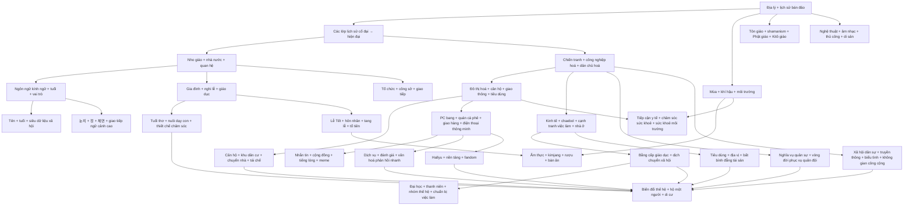

# Master Knowledge Book — Văn hoá Hàn Quốc

> Phạm vi của bộ sách là văn hoá Hàn Quốc với trọng tâm là **Đại Hàn Dân Quốc (대한민국 / Republic of Korea)** đương đại, nhưng luôn quay về lịch sử của bán đảo Triều Tiên khi một tập quán hiện nay chỉ có thể hiểu đúng bằng nguồn gốc lịch sử của nó. “Văn hoá Hàn Quốc” ở đây không được hiểu như một danh sách món ăn, lễ hội hay quy tắc phép lịch sự, mà như một **hệ thống văn hoá (문화 체계 / cultural system)**: tập hợp các ý nghĩa, chuẩn mực, thiết chế, ký ức, môi trường vật chất, **động lực (incentive)** và công nghệ khiến một số cách diễn giải hay hành động trở nên có xác suất cao hơn trong những bối cảnh nhất định.

## Cách đọc bộ sách

Văn hoá không hoạt động như một chương trình máy tính trong đó mọi người nhận cùng **đầu vào (input)** rồi trả về cùng **đầu ra (output)**. Một người Hàn sinh năm 1950 ở vùng nông thôn Jeolla, một nhân viên văn phòng sinh năm 1985 tại Seoul và một sinh viên sinh năm 2005 có thể cùng nói tiếng Hàn nhưng mang những trải nghiệm xã hội rất khác nhau. Vì vậy, mỗi chương cố gắng phân biệt **cấu trúc lịch sử**, **thiết chế**, **chuẩn mực quan hệ**, **điều kiện vật chất–kinh tế**, **công nghệ** và **mức độ biến thiên trong thực tế**.

Một cách hữu ích là coi văn hoá như một hệ thống xác suất thay vì một tập luật tuyệt đối. Nếu ký hiệu hành vi của một cá nhân là `B`, tình huống là `S`, thế hệ là `G`, môi trường tổ chức là `O`, **ràng buộc vật chất (material constraint)** là `M` và tập các chuẩn mực văn hoá là `C`, ta có thể hình dung:

```math
P(B\mid S,G,O,M,C)
```

Biểu thức này không phải công thức xã hội học dùng để “tính người Hàn”, mà là một **mô hình tư duy (mental model)**. Văn hoá thay đổi **xác suất** của hành vi trong một bối cảnh; nó không quyết định tuyệt đối hành vi ấy. Cách nghĩ này giúp tránh **định kiến khái quát (stereotype)** và giúp người đọc cập nhật mô hình khi gặp dữ liệu mới.

## Quan hệ phụ thuộc giữa các nhóm kiến thức (knowledge dependency)



Sơ đồ phụ thuộc này thể hiện logic hiểu biết, không phải thứ tự “dễ → khó”. Chẳng hạn, muốn hiểu vì sao một nhân viên trẻ vẫn dùng `존댓말` với đồng nghiệp lớn tuổi dù công ty quảng bá văn hoá phẳng, ta cần đồng thời hiểu lịch sử trật tự quan hệ, **siêu dữ liệu xã hội (social metadata)** về tuổi–vai trò, ngữ pháp kính ngữ và logic của tổ chức hiện đại. Tương tự, muốn hiểu vì sao giao hàng nhanh hoặc áp lực nuôi dạy con lại trở thành “văn hoá”, ta phải nối **hạ tầng (infrastructure)**, lao động, lịch sinh hoạt gia đình, động lực thị trường và kỳ vọng xã hội thay vì quy tất cả về tính cách dân tộc.

## Lộ trình đọc khuyến nghị

Không bắt buộc đọc theo số file. Nếu muốn xây mô hình từ nền tảng, có thể đi theo luồng sau:

```text
01 → 21 → 02 → 22 → 03
                ↓
04 → 29 → 05 → 30 → 06 → 23 → 24
                ↓
07 → 32 → 08 → 31 → 09 → 10 → 11
                ↓
12 → 33 → 27 → 13 → 18 → 19 → 20 → 26
                ↓
14 → 15 → 25 → 16 → 17 → 28
```

`16_connections_mental_models_misconceptions.md` nên đọc lại nhiều lần sau các nhóm chương lớn. Nó đóng vai trò như một **đồ thị kiến thức (knowledge graph)** bằng văn xuôi, không phải bản tóm tắt cuối sách.

## Cấu trúc thư mục

| File | Nội dung trung tâm |
|---|---|
| [`01_cultural_system_history_geography.md`](01_cultural_system_history_geography.md) | Địa lý, bán đảo, nhà nước, chiến tranh, công nghiệp hoá và cách nhìn văn hoá như một hệ thống |
| [`21_historical_layers_ancient_to_modern.md`](21_historical_layers_ancient_to_modern.md) | Các lớp lịch sử Gojoseon, Tam Quốc (Three Kingdoms), Goryeo, Joseon, thuộc địa, chiến tranh và hiện đại hoá nén (compressed modernity) |
| [`02_confucianism_relations_hierarchy.md`](02_confucianism_relations_hierarchy.md) | Nho giáo, tuổi, vai trò, thứ bậc, tính có đi có lại (reciprocity), tập thể và cá nhân |
| [`22_names_age_identity_social_metadata.md`](22_names_age_identity_social_metadata.md) | Tên, 본관, 항렬자, 만 나이, năm sinh, 동갑 và hạ tầng nhận diện xã hội |
| [`03_language_honorifics_nunchi_jeong_face.md`](03_language_honorifics_nunchi_jeong_face.md) | Kính ngữ, 눈치, 정, 체면, 한 và giao tiếp ngữ cảnh cao |
| [`04_family_kinship_gender_life_cycle.md`](04_family_kinship_gender_life_cycle.md) | Gia đình, họ tộc, hôn nhân, giới, sinh con, tang lễ và tổ tiên |
| [`29_childhood_parenting_care_institutions.md`](29_childhood_parenting_care_institutions.md) | 태교, 산후조리, 백일, 육아, chăm sóc trẻ, ông bà, cộng đồng cha mẹ và kinh tế chăm sóc (care economy) |
| [`05_education_exams_credentials.md`](05_education_exams_credentials.md) | Giáo dục, 수능, 학원, chủ nghĩa bằng cấp (credentialism), cạnh tranh và dịch chuyển xã hội |
| [`30_school_university_youth_campus_culture.md`](30_school_university_youth_campus_culture.md) | 학번, 새내기, 선후배, 동아리, MT, 휴학, 취준생 và quá trình xã hội hoá của thanh niên–đại học |
| [`06_workplace_organization_hoesik.md`](06_workplace_organization_hoesik.md) | Công sở, 직급, 보고, 결재, 회식, 회의, 조직문화 và biến đổi thế hệ |
| [`23_military_conscription_service_culture.md`](23_military_conscription_service_culture.md) | Nghĩa vụ quân sự, 입대–전역, 선임–후임, lực lượng dự bị và ảnh hưởng tới dòng thời gian dân sự |
| [`24_economy_chaebol_housing_status_mobility.md`](24_economy_chaebol_housing_status_mobility.md) | 재벌, doanh nghiệp lớn–SME, 스펙, căn hộ, 전세, 청약, nhà ở và dịch chuyển xã hội |
| [`07_food_table_fermentation_drinking.md`](07_food_table_fermentation_drinking.md) | Bữa ăn, 밥, 반찬, kimchi, lên men (fermentation), rượu và phép bàn ăn |
| [`32_seasons_climate_environment_daily_rhythm.md`](32_seasons_climate_environment_daily_rhythm.md) | 사계절, 벚꽃, 장마, 폭염, 복날, 단풍, văn hoá mùa đông, bụi mịn và thích nghi khí hậu |
| [`08_home_space_hanok_clothing_aesthetics.md`](08_home_space_hanok_clothing_aesthetics.md) | 한옥, 온돌, căn hộ, 한복, thẩm mỹ, không gian và cơ thể |
| [`31_apartment_neighborhood_moving_recycling_everyday_life.md`](31_apartment_neighborhood_moving_recycling_everyday_life.md) | 이사, 손 없는 날, 관리사무소, 층간소음, 택배, 분리수거, 주차 và khu dân cư số hoá |
| [`09_religion_ritual_worldview.md`](09_religion_ritual_worldview.md) | Shaman giáo (shamanism), Phật giáo, Nho giáo nghi lễ, Kitô giáo và thế giới quan |
| [`10_arts_music_performance_craft.md`](10_arts_music_performance_craft.md) | Pansori, Arirang, nongak, talchum, gốm, giấy và di sản sống |
| [`11_holidays_rites_games_memory.md`](11_holidays_rites_games_memory.md) | 설날, 추석, 제사, 세배, trò chơi và ký ức tập thể |
| [`12_city_consumption_digital_life.md`](12_city_consumption_digital_life.md) | Seoul, tàu điện ngầm, cửa hàng tiện lợi, quán cà phê, giao hàng, PC bang, Kakao và thanh toán số |
| [`33_service_customer_review_quick_response_culture.md`](33_service_customer_review_quick_response_culture.md) | 서비스, 고객님, 감정노동, 리뷰, 배송, 반품, 기프티콘, 팝업 và văn hoá dịch vụ phản hồi nhanh |
| [`27_internet_communities_messaging_slang_memes.md`](27_internet_communities_messaging_slang_memes.md) | Cộng đồng trực tuyến, KakaoTalk, trạng thái đã đọc, 초성체, tiếng lóng, meme và hệ thống danh tiếng |
| [`13_hallyu_media_platforms.md`](13_hallyu_media_platforms.md) | K-pop, phim truyền hình, điện ảnh, webtoon, trò chơi, kinh tế nền tảng và Hallyu toàn cầu |
| [`18_daily_etiquette_gifts_relationships.md`](18_daily_etiquette_gifts_relationships.md) | Phép lịch sự hằng ngày, quà tặng, bạn bè, hẹn hò và văn hoá nhắn tin |
| [`19_beauty_fashion_body_culture.md`](19_beauty_fashion_body_culture.md) | Làm đẹp, thời trang, hình ảnh cơ thể, K-beauty và văn hoá thị giác |
| [`20_sports_leisure_fan_culture.md`](20_sports_leisure_fan_culture.md) | Thể thao, leo núi, thể thao điện tử, giải trí và fandom |
| [`26_health_medicine_wellness_body.md`](26_health_medicine_wellness_body.md) | Y tế, 건강보험, 한의학, sàng lọc, chăm sóc sức khoẻ, 미세먼지 và chăm sóc cơ thể |
| [`14_regions_jeju_local_identity_peninsula.md`](14_regions_jeju_local_identity_peninsula.md) | Vùng miền, phương ngữ, Jeju, quan hệ trung tâm–ngoại vi và văn hoá chung bán đảo |
| [`15_contemporary_change_demography_migration.md`](15_contemporary_change_demography_migration.md) | Già hoá, hộ một người, mức sinh thấp, di cư, thế hệ và thay đổi chuẩn mực |
| [`25_civic_media_public_sphere_protest.md`](25_civic_media_public_sphere_protest.md) | Xã hội dân sự, truyền thông, cổng thông tin, bình luận, tập hợp, biểu tình và không gian công cộng số |
| [`16_connections_mental_models_misconceptions.md`](16_connections_mental_models_misconceptions.md) | Liên hệ kiến thức, mô hình nhân quả, mô hình tư duy và các hiểu lầm phổ biến |
| [`17_glossary_and_reference_map.md`](17_glossary_and_reference_map.md) | Bảng thuật ngữ Hàn–Anh–Việt và bản đồ nguồn tham khảo |
| [`28_naming_translation_conventions.md`](28_naming_translation_conventions.md) | Quy ước tên riêng Việt–Hàn–Anh, phiên âm La-tinh (romanization) và cách tránh dịch sai tên lịch sử |

## Một mô hình tư duy (mental model) xuyên suốt: văn hoá là giao thức xã hội

Trong mạng máy tính, **giao thức (protocol / 프로토콜)** không quyết định nội dung người dùng gửi, nhưng nó xác định cách các máy nhận diện nhau, bắt tay, chuyển thông tin và xử lý lỗi. Văn hoá có một chức năng tương tự. Nó cung cấp những quy ước mặc định về cách gọi nhau, ai nói trước, mức trực tiếp nào được chấp nhận, khi nào nên tặng quà, cách chia trách nhiệm, điều gì được xem là lịch sự hoặc gây mất mặt.

Ẩn dụ này có giới hạn: con người không phải máy, chuẩn mực có thể bị phản đối, thương lượng và thay đổi. Nhưng nó giúp hiểu vì sao một người nước ngoài có thể biết từng từ tiếng Hàn mà vẫn “lệch giao thức”: câu đúng ngữ pháp nhưng sai quan hệ; hành động thiện chí nhưng sai thời điểm; ý kiến hợp lý nhưng trình bày theo cách khiến người nghe khó tiếp nhận.

## Mô hình tư duy thứ hai: ràng buộc tạo hành vi

Nhiều điều trông giống “tính cách dân tộc” thực ra có thể xuất phát một phần từ **ràng buộc (constraint)**. Khi nhà ở, trường học, việc làm hoặc dòng thời gian quân sự tạo **điểm nghẽn (bottleneck)**, con người thích nghi với điểm nghẽn đó. Khi công nghệ làm giảm **chi phí giao dịch (transaction cost)**, hành vi mới xuất hiện.

Vì vậy một cách giải thích nhân quả nên hỏi theo thứ tự:

```text
Lịch sử
  ↓
Thiết chế + pháp luật
  ↓
Ràng buộc vật chất / kinh tế
  ↓
Quan hệ + động lực
  ↓
Công nghệ / giao diện
  ↓
Hành vi quan sát được
```

Không phải hiện tượng nào cũng đi qua đủ mọi lớp, nhưng mô hình này buộc người đọc tìm **cơ chế (mechanism)** trước khi gắn nhãn “đó là văn hoá Hàn”.

## Mô hình tư duy thứ ba: sự tiện lợi luôn có bản đồ chi phí

Một phần văn hoá Hàn Quốc đương đại được trải nghiệm qua tốc độ và tiện lợi: giao hàng nhanh, bưu kiện dày đặc, ứng dụng thời gian thực, dịch vụ chăm sóc trẻ, quản lý căn hộ, quà tặng di động và hỗ trợ khách hàng. Tuy nhiên, **ma sát (friction) giảm ở phía người dùng không có nghĩa chi phí biến mất**. Chi phí có thể được chuyển sang nhân viên logistics, người chăm sóc, văn phòng quản lý, hạ tầng máy chủ hoặc hộ gia đình khác.

Vì vậy khi gặp một hiện tượng “rất tiện”, hãy hỏi thêm:

```text
Ai đang nhận sự tiện lợi?
Ai đang hấp thụ chi phí lao động / thời gian / vốn?
Công nghệ nào giúp hệ thống mở rộng quy mô (scale)?
Kỳ vọng mới nào được tạo ra sau khi sự tiện lợi trở thành bình thường?
```

Câu hỏi này giúp nối văn hoá với kinh tế học, lao động và kỹ thuật thay vì chỉ mô tả bề mặt.

## Nguyên tắc chống định kiến khái quát (stereotype)

Khi đọc những từ như `빨리빨리`, `정`, `눈치`, `유교`, `군대문화`, `재벌`, không nên chuyển chúng thành câu kiểu “người Hàn luôn...”. Câu hỏi tốt hơn là: **chuẩn mực hoặc khuôn mẫu (pattern) này được hình thành trong điều kiện lịch sử nào, được củng cố bởi thiết chế nào, xuất hiện mạnh trong bối cảnh nào, nhóm nào không tuân theo và đang thay đổi ra sao?**

Một mô tả văn hoá tốt phải luôn chừa chỗ cho sự biến thiên. Seoul không phải toàn Hàn Quốc. Bình luận trực tuyến không phải dư luận xã hội. Một K-drama không phải nghiên cứu dân tộc học. Một công ty có thứ bậc cao không đại diện mọi nơi làm việc. Một gia đình dùng `산후조리원` không đại diện mọi hộ gia đình. Một khu căn hộ có quy tắc phân loại rác cụ thể không có nghĩa toàn quốc dùng đúng cùng cách triển khai. Một người Hàn không có nghĩa vụ “hành xử đúng như sách”.