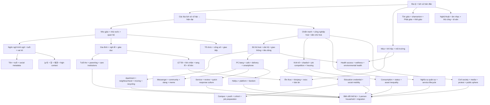

# Master Knowledge Book — Văn hoá Hàn Quốc

> Phạm vi của bộ sách là văn hoá Hàn Quốc với trọng tâm là **Đại Hàn Dân Quốc (Republic of Korea / 대한민국)** đương đại, nhưng luôn quay về lịch sử của bán đảo Triều Tiên khi một tập quán hiện nay chỉ có thể hiểu đúng bằng nguồn gốc lịch sử của nó. “Văn hoá Hàn Quốc” ở đây không được hiểu như một danh sách món ăn, lễ hội hay quy tắc phép lịch sự, mà như một **hệ thống văn hoá (Cultural System / 문화 체계)**: tập hợp các ý nghĩa, chuẩn mực, thiết chế, ký ức, môi trường vật chất, incentive và công nghệ khiến một số cách diễn giải hay hành động trở nên có xác suất cao hơn trong những bối cảnh nhất định.

## Cách đọc bộ sách

Văn hoá không hoạt động như một chương trình máy tính trong đó mọi người nhận cùng input rồi trả về cùng output. Một người Hàn sinh năm 1950 ở vùng nông thôn Jeolla, một nhân viên văn phòng sinh năm 1985 tại Seoul và một sinh viên sinh năm 2005 có thể cùng nói tiếng Hàn nhưng mang những trải nghiệm xã hội rất khác nhau. Vì vậy, mỗi chương cố gắng phân biệt **cấu trúc lịch sử**, **thiết chế**, **chuẩn mực quan hệ**, **điều kiện vật chất–kinh tế**, **công nghệ** và **mức độ biến thiên trong thực tế**.

Một cách hữu ích là coi văn hoá như một hệ thống xác suất thay vì một tập luật tuyệt đối. Nếu ký hiệu hành vi của một cá nhân là `B`, tình huống là `S`, thế hệ là `G`, môi trường tổ chức là `O`, constraint vật chất là `M` và tập các chuẩn mực văn hoá là `C`, ta có thể hình dung:

```math
P(B\mid S,G,O,M,C)
```

Biểu thức này không phải công thức xã hội học dùng để “tính người Hàn”, mà là một mental model. Văn hoá thay đổi **xác suất** của hành vi trong một bối cảnh; nó không quyết định tuyệt đối hành vi ấy. Cách nghĩ này giúp tránh stereotype và giúp người đọc update model khi gặp dữ liệu mới.

## Knowledge dependency



Dependency này thể hiện logic hiểu biết, không phải thứ tự “dễ → khó”. Chẳng hạn, muốn hiểu vì sao một nhân viên trẻ vẫn dùng `존댓말` với đồng nghiệp lớn tuổi dù công ty quảng bá văn hoá phẳng, ta cần đồng thời hiểu lịch sử trật tự quan hệ, metadata tuổi–vai trò, ngữ pháp kính ngữ và logic của tổ chức hiện đại. Tương tự, muốn hiểu vì sao delivery nhanh hoặc parenting pressure lại trở thành “văn hoá”, ta phải nối infrastructure, labour, household schedule, market incentive và expectation xã hội thay vì quy về tính cách dân tộc.

## Lộ trình đọc khuyến nghị

Không bắt buộc đọc theo số file. Nếu muốn xây model từ nền tảng, có thể đi theo luồng sau:

```text
01 → 21 → 02 → 22 → 03
                ↓
04 → 29 → 05 → 30 → 06 → 23 → 24
                ↓
07 → 32 → 08 → 31 → 09 → 10 → 11
                ↓
12 → 33 → 27 → 13 → 18 → 19 → 20 → 26
                ↓
14 → 15 → 25 → 16 → 17 → 28
```

`16_connections_mental_models_misconceptions.md` nên đọc lại nhiều lần sau các nhóm chương lớn. Nó đóng vai trò “knowledge graph bằng văn xuôi” chứ không phải summary cuối sách.

## Cấu trúc thư mục

| File | Nội dung trung tâm |
|---|---|
| [`01_cultural_system_history_geography.md`](01_cultural_system_history_geography.md) | Địa lý, bán đảo, nhà nước, chiến tranh, công nghiệp hoá và cách nhìn văn hoá như system |
| [`21_historical_layers_ancient_to_modern.md`](21_historical_layers_ancient_to_modern.md) | Các lớp lịch sử Gojoseon, Three Kingdoms, Goryeo, Joseon, thuộc địa, chiến tranh, compressed modernity |
| [`02_confucianism_relations_hierarchy.md`](02_confucianism_relations_hierarchy.md) | Nho giáo, tuổi, vai trò, thứ bậc, reciprocity, tập thể và cá nhân |
| [`22_names_age_identity_social_metadata.md`](22_names_age_identity_social_metadata.md) | Tên, 본관, 항렬자, 만 나이, năm sinh, 동갑 và identity infrastructure |
| [`03_language_honorifics_nunchi_jeong_face.md`](03_language_honorifics_nunchi_jeong_face.md) | Kính ngữ, 눈치, 정, 체면, 한 và giao tiếp ngữ cảnh cao |
| [`04_family_kinship_gender_life_cycle.md`](04_family_kinship_gender_life_cycle.md) | Gia đình, họ tộc, hôn nhân, giới, sinh con, tang lễ và tổ tiên |
| [`29_childhood_parenting_care_institutions.md`](29_childhood_parenting_care_institutions.md) | 태교, 산후조리, 백일, 육아, childcare, grandparents, parent communities và care economy |
| [`05_education_exams_credentials.md`](05_education_exams_credentials.md) | Giáo dục, 수능, 학원, credentialism, cạnh tranh và mobility |
| [`30_school_university_youth_campus_culture.md`](30_school_university_youth_campus_culture.md) | 학번, 새내기, 선후배, 동아리, MT, 휴학, 취준생 và youth/campus socialization |
| [`06_workplace_organization_hoesik.md`](06_workplace_organization_hoesik.md) | Công sở, 직급, 보고, 결재, 회식, 회의, 조직문화 và biến đổi thế hệ |
| [`23_military_conscription_service_culture.md`](23_military_conscription_service_culture.md) | Nghĩa vụ quân sự, 입대–전역, 선임–후임, reserve và ảnh hưởng lên civilian timeline |
| [`24_economy_chaebol_housing_status_mobility.md`](24_economy_chaebol_housing_status_mobility.md) | 재벌, đại doanh nghiệp–SME, 스펙, apartment, 전세, 청약, housing và social mobility |
| [`07_food_table_fermentation_drinking.md`](07_food_table_fermentation_drinking.md) | Bữa ăn, 밥, 반찬, kimchi, fermentation, rượu và phép bàn ăn |
| [`32_seasons_climate_environment_daily_rhythm.md`](32_seasons_climate_environment_daily_rhythm.md) | 사계절, 벚꽃, 장마, 폭염, 복날, 단풍, winter culture, fine dust và climate adaptation |
| [`08_home_space_hanok_clothing_aesthetics.md`](08_home_space_hanok_clothing_aesthetics.md) | 한옥, 온돌, căn hộ, 한복, thẩm mỹ, không gian và cơ thể |
| [`31_apartment_neighborhood_moving_recycling_everyday_life.md`](31_apartment_neighborhood_moving_recycling_everyday_life.md) | 이사, 손 없는 날, 관리사무소, 층간소음, 택배, 분리수거, 주차 và digital neighbourhood |
| [`09_religion_ritual_worldview.md`](09_religion_ritual_worldview.md) | Shamanism, Phật giáo, Nho giáo nghi lễ, Kitô giáo và thế giới quan |
| [`10_arts_music_performance_craft.md`](10_arts_music_performance_craft.md) | Pansori, Arirang, nongak, talchum, gốm, giấy và di sản sống |
| [`11_holidays_rites_games_memory.md`](11_holidays_rites_games_memory.md) | 설날, 추석, 제사, 세배, trò chơi và ký ức tập thể |
| [`12_city_consumption_digital_life.md`](12_city_consumption_digital_life.md) | Seoul, subway, convenience store, cafe, delivery, PC bang, Kakao và payment |
| [`33_service_customer_review_quick_response_culture.md`](33_service_customer_review_quick_response_culture.md) | 서비스, 고객님, 감정노동, 리뷰, 배송, 반품, 기프티콘, 팝업 và low-latency service culture |
| [`27_internet_communities_messaging_slang_memes.md`](27_internet_communities_messaging_slang_memes.md) | Online communities, KakaoTalk, read receipt, 초성체, slang, meme và reputation systems |
| [`13_hallyu_media_platforms.md`](13_hallyu_media_platforms.md) | K-pop, drama, film, webtoon, game, platform economy và global Hallyu |
| [`18_daily_etiquette_gifts_relationships.md`](18_daily_etiquette_gifts_relationships.md) | Etiquette hằng ngày, quà tặng, bạn bè, dating và messaging culture |
| [`19_beauty_fashion_body_culture.md`](19_beauty_fashion_body_culture.md) | Beauty, thời trang, body image, K-beauty và visual culture |
| [`20_sports_leisure_fan_culture.md`](20_sports_leisure_fan_culture.md) | Thể thao, hiking, esports, leisure và fandom |
| [`26_health_medicine_wellness_body.md`](26_health_medicine_wellness_body.md) | Healthcare, 건강보험, 한의학, screening, wellness, 미세먼지 và body care |
| [`14_regions_jeju_local_identity_peninsula.md`](14_regions_jeju_local_identity_peninsula.md) | Vùng miền, dialect, Jeju, center–periphery và văn hoá chung bán đảo |
| [`15_contemporary_change_demography_migration.md`](15_contemporary_change_demography_migration.md) | Già hoá, hộ một người, mức sinh thấp, migration, generation và thay đổi chuẩn mực |
| [`25_civic_media_public_sphere_protest.md`](25_civic_media_public_sphere_protest.md) | Civil society, media, portal, comment, assembly, protest và digital public sphere |
| [`16_connections_mental_models_misconceptions.md`](16_connections_mental_models_misconceptions.md) | Knowledge connections, causal models, mental models và các hiểu lầm phổ biến |
| [`17_glossary_and_reference_map.md`](17_glossary_and_reference_map.md) | Glossary Korean–English–Vietnamese và bản đồ nguồn tham khảo |
| [`28_naming_translation_conventions.md`](28_naming_translation_conventions.md) | Quy ước tên riêng Việt–Hàn–Anh, romanization và cách tránh dịch sai tên lịch sử |

## Một mental model xuyên suốt: văn hoá là giao thức xã hội

Trong mạng máy tính, **protocol / 프로토콜** không quyết định nội dung người dùng gửi, nhưng nó xác định cách các máy nhận diện nhau, bắt tay, chuyển thông tin và xử lý lỗi. Văn hoá có một chức năng tương tự. Nó cung cấp những quy ước mặc định về cách gọi nhau, ai nói trước, mức trực tiếp nào được chấp nhận, khi nào nên tặng quà, cách chia trách nhiệm, điều gì được xem là lịch sự hoặc gây mất mặt.

Ẩn dụ này có giới hạn: con người không phải máy, chuẩn mực có thể bị phản đối, thương lượng và thay đổi. Nhưng nó giúp hiểu vì sao một người nước ngoài có thể biết từng từ tiếng Hàn mà vẫn “lệch protocol”: câu đúng ngữ pháp nhưng sai quan hệ; hành động thiện chí nhưng sai timing; ý kiến hợp lý nhưng trình bày theo cách khiến người nghe khó tiếp nhận.

## Một mental model thứ hai: constraint tạo hành vi

Nhiều điều trông giống “tính cách dân tộc” thực ra có thể xuất phát một phần từ constraint. Khi housing, school, job hoặc military timeline tạo bottleneck, con người thích nghi với bottleneck đó. Khi technology giảm transaction cost, behaviour mới xuất hiện.

Vì vậy một causal explanation nên hỏi theo thứ tự:

```text
History
  ↓
Institution + law
  ↓
Material/economic constraint
  ↓
Relationship + incentive
  ↓
Technology/interface
  ↓
Observed behaviour
```

Không phải hiện tượng nào cũng đi qua đủ mọi layer, nhưng model này buộc người đọc tìm mechanism trước khi gắn nhãn “đó là văn hoá Hàn”.

## Một mental model thứ ba: convenience luôn có cost map

Một phần văn hoá Hàn Quốc đương đại được trải nghiệm qua tốc độ và tiện lợi: delivery nhanh, parcel dày đặc, app realtime, childcare service, apartment management, mobile gift và customer support. Tuy nhiên, **friction giảm ở phía người dùng không có nghĩa cost biến mất**. Cost có thể được chuyển sang logistics worker, caregiver, management office, server infrastructure hoặc household khác.

Vì vậy khi gặp một hiện tượng “rất tiện”, hãy hỏi thêm:

```text
Ai đang nhận convenience?
Ai đang hấp thụ labour/time/capital cost?
Technology nào làm việc đó scale được?
Expectation mới nào được tạo ra sau khi convenience trở thành bình thường?
```

Câu hỏi này giúp nối culture với economics, labour và engineering thay vì chỉ mô tả bề mặt.

## Nguyên tắc chống stereotype

Khi đọc những từ như `빨리빨리`, `정`, `눈치`, `유교`, `군대문화`, `재벌`, không nên chuyển chúng thành câu kiểu “người Hàn luôn...”. Câu hỏi tốt hơn là: **chuẩn mực hoặc pattern này được hình thành trong điều kiện lịch sử nào, được củng cố bởi thiết chế nào, xuất hiện mạnh trong bối cảnh nào, nhóm nào không tuân theo và đang thay đổi ra sao?**

Một mô tả cultural tốt phải luôn chừa chỗ cho variance. Seoul không phải toàn Hàn Quốc. Comment online không phải public opinion. Một K-drama không phải ethnography. Một công ty hierarchy cao không đại diện mọi workplace. Một gia đình dùng `산후조리원` không đại diện mọi household. Một apartment complex có rule phân loại rác cụ thể không có nghĩa toàn quốc dùng đúng cùng implementation. Một người Hàn không có nghĩa vụ “hành xử đúng như sách”.