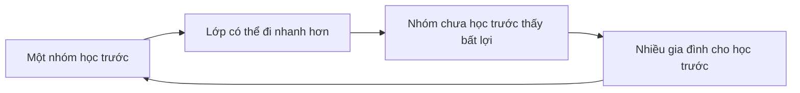

# Giáo dục, kỳ thi và xã hội bằng cấp

## Tại sao giáo dục mang trọng lượng xã hội lớn?

Giáo dục Hàn Quốc thường được nhìn từ bên ngoài qua hình ảnh học sinh học muộn, `학원` và kỳ thi `수능`. Nếu chỉ gọi đây là “văn hoá học nhiều”, ta chưa giải thích được cơ chế. Cần hỏi: **tại sao gia đình sẵn sàng đầu tư nhiều thời gian và tiền cho giáo dục, và tại sao một kỳ thi có thể tập trung kỳ vọng lớn đến vậy?**

Có ba lớp lịch sử chồng lên nhau. Nho giáo gắn học tập với đạo đức và status của scholar-official. Công nghiệp hoá tạo nhu cầu nhân lực có trình độ và mở education như một con đường mobility. Sau đó, nền kinh tế tri thức và competition cho các trường/việc làm uy tín làm credential tiếp tục có giá trị như signal.

## 교육열: “nhiệt giáo dục” như một cơ chế đầu tư

**Educational zeal / 교육열** chỉ mức kỳ vọng và đầu tư mạnh vào giáo dục. Không nên hiểu đơn giản là cha mẹ “ám ảnh điểm số”. Với một household, chi tiêu giáo dục có thể được xem như human-capital investment.

Trong kinh tế học, nếu kỳ vọng thu nhập tương lai `Y` phụ thuộc một phần vào education `E`, gia đình cân nhắc cost hiện tại với expected benefit:

```math
\text{Invest if } \mathbb{E}[\Delta Y(E)] > \text{Cost}(E)
```

Nhưng điều khó là benefit không chỉ monetary. Trường đại học còn cho network, prestige, job access và marriage-market signal. Khi nhiều gia đình cùng tối ưu như vậy, competition có thể tăng ngay cả khi return marginal giảm. Đây là **arms race / 군비경쟁** về credential: nếu mọi người mua thêm signal, baseline của thị trường tăng.

## 수능: chuẩn hoá và áp lực tập trung

**College Scholastic Ability Test / 대학수학능력시험, 수능** là kỳ thi tuyển sinh đại học quốc gia có vai trò lớn. Ý nghĩa văn hoá của 수능 không đến từ bản thân exam format mà từ việc nó trở thành coordination point cho hàng trăm nghìn học sinh, phụ huynh, trường học, media và thị trường giáo dục.

Một standardized test giải quyết một vấn đề: làm sao so sánh lượng lớn applicant theo cùng metric. Nhưng metric nào cũng compress một con người đa chiều thành số ít dimensions. Trong data science, đây là dimensionality reduction; nó tạo comparability nhưng mất information.

Khi downstream institutions đặt weight lớn vào metric, người học sẽ optimize cho metric. Đây là **Goodhart’s Law**: khi một measure trở thành target, nó có thể không còn phản ánh hoàn hảo thứ ta muốn đo. Nếu education mục tiêu là tư duy, nhưng admissions tối ưu hoá score, ecosystem có thể đổ nguồn lực vào test strategy.

## 학원 và shadow education

**Private academy / 학원** là một phần nổi bật của education ecosystem. Học viện có thể dạy school subjects, language, music, coding, art hoặc exam prep. Sự tồn tại của `학원` không đơn giản do trường công “kém”; nó còn do competition, parental anxiety, scheduling và desire for differentiation.

Khi một số học sinh học thêm, các học sinh khác có incentive tham gia để không tụt relative position. Đây là coordination trap. Nếu score xếp hạng tương đối, lợi ích của một cá nhân có thể dẫn đến cost tập thể cao hơn.

Theo báo cáo `한국의 사회동향 2025`, tổng chi tiêu giáo dục tư nhân đã tăng lên khoảng 29,2 nghìn tỷ won trong năm 2024. Con số này minh hoạ quy mô kinh tế của competition giáo dục, nhưng không nên suy ra rằng mọi household chi tiêu giống nhau; income và region tạo chênh lệch lớn.

## 학벌: bằng cấp như signal và network

**Academic pedigree / 학벌** chỉ trọng lượng xã hội của trường từng học. Trong labour market, employer không quan sát trực tiếp năng lực tương lai nên dùng signal: trường, major, GPA, certificate, internship. Đây là vấn đề **information asymmetry / 정보 비대칭**.

Nếu một trường có admission khó, employer có thể dùng tên trường như proxy. Nhưng proxy tạo feedback loop: công ty tuyển nhiều từ trường uy tín → alumni network mạnh → applicants giỏi cạnh tranh vào → signal của trường tiếp tục mạnh. Đây là network effect.

Mặt trái là năng lực thật có thể bị overshadowed bởi credential. Tech hiring cố giảm vấn đề này bằng coding test, portfolio và practical interview, nhưng ngay cả các metric đó cũng có thể bị “luyện thi hoá”.

## 선행학습 và việc học trước chương trình

**Advanced learning ahead of curriculum / 선행학습** là học kiến thức trước khi trường chính thức dạy. Nó tạo một paradox trong classroom: teacher tưởng đang giới thiệu nội dung mới nhưng nhiều học sinh đã biết; tốc độ lớp tăng; học sinh chưa học trước càng khó theo; incentive học trước tăng thêm.

Đây là positive feedback loop:



Hiểu loop quan trọng hơn phán xét cha mẹ hay học sinh riêng lẻ.

## Đại học, công việc và “đường ray chuẩn”

Trong một xã hội công nghiệp hoá nhanh, từng tồn tại một life script tương đối rõ: học tốt → đại học tốt → công ty lớn/việc ổn định → kết hôn → mua nhà. Khi tăng trưởng chậm, giá nhà cao và labour market phân mảnh, probability của script này giảm. Nhưng expectation có thể tồn tại lâu hơn reality, tạo cảm giác competition và delay adulthood.

Thế hệ trẻ vì vậy không chỉ “ít cố gắng hơn”; họ đang tối ưu trong payoff matrix khác. Startup, freelance, creator, overseas career và chuyển việc thường xuyên mở thêm đường, trong khi một số industry vẫn rất credential-driven.

## 사교육과 불평등: education như máy khuếch đại hay thang máy?

Giáo dục có hai vai trò có thể xung đột. Nó là **mobility engine** khi người có năng lực từ background yếu có thể đi lên. Nhưng nếu access đến tutoring, housing gần school tốt và information về admission phụ thuộc income, education có thể reproduce inequality.

Trong causal inference, correlation giữa “học thêm” và “điểm cao” không đủ chứng minh effect thuần của 학원, vì family income, prior achievement và parental education là confounders. Đây là một connection quan trọng giữa social science và statistics: văn hoá giáo dục cần phân tích bằng causal reasoning, không chỉ anecdote.

## 교권, 학교폭력 và school culture

Trường học là nơi hierarchy giữa teacher–student, senior–junior và peer group gặp nhau. Những tranh luận về **teacher authority / 교권**, **school violence / 학교폭력** và student rights cho thấy hệ thống đang điều chỉnh ranh giới giữa authority, protection và accountability.

Kỷ luật không còn được xem đơn thuần là quyền của người lớn; đồng thời việc bảo vệ giáo viên khỏi harassment cũng trở thành vấn đề. Đây là ví dụ hệ thống chuyển từ role-based obedience sang rule-based accountability.

## Knowledge Connection: learning science và exam optimization

Cường độ học cao không đảm bảo retention cao. Cognitive science phân biệt rereading với active recall, massed practice với spaced repetition. Một học sinh có thể dành nhiều giờ nhưng học không hiệu quả nếu strategy chỉ là passive exposure.

Vì vậy “học kiểu Hàn” không phải một method thống nhất. Học sinh top có thể dùng error log, past papers, retrieval practice rất có hệ thống; người khác có thể chỉ tăng time-on-task.

Trong programming, điều tương tự xảy ra: xem 50 giờ tutorial không tương đương debug một project thật. Output học tập phụ thuộc quality của feedback loop.

## Mental Model

> Hãy coi hệ thống giáo dục Hàn Quốc như một market nơi education vừa là knowledge, vừa là signal, vừa là insurance cho tương lai. Khi nhiều người cùng cạnh tranh bằng signal, cost có thể tăng nhanh hơn knowledge thực. Muốn hiểu `수능`, `학원`, `학벌`, phải nhìn incentive của toàn hệ thống chứ không quy nó về “người Hàn thích học”.

## Common Misconceptions

“수능 quyết định toàn bộ cuộc đời” là exaggeration. Nó có weight lớn ở một số admissions path nhưng tồn tại nhiều route khác.

“학원 chỉ để luyện thi” sai; academy ecosystem bao gồm vô số kỹ năng.

“Học sinh Hàn giỏi vì học nhiều giờ” bỏ qua selection, family resources, pedagogy, peer effect và individual variation.
