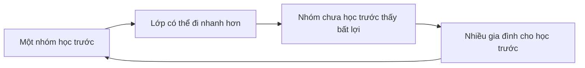

# Giáo dục, kỳ thi và xã hội bằng cấp

## Tại sao giáo dục mang trọng lượng xã hội lớn?

Giáo dục Hàn Quốc thường được nhìn từ bên ngoài qua hình ảnh học sinh học muộn, `학원` và kỳ thi `수능`. Nếu chỉ gọi đây là “văn hoá học nhiều”, ta chưa giải thích được cơ chế. Cần hỏi: **tại sao gia đình sẵn sàng đầu tư nhiều thời gian và tiền cho giáo dục, và tại sao một kỳ thi có thể tập trung kỳ vọng lớn đến vậy?**

Có nhiều lớp lịch sử chồng lên nhau. Nho giáo gắn học tập với đạo đức và địa vị của tầng lớp sĩ đại phu. Công nghiệp hoá tạo nhu cầu nhân lực có trình độ và mở giáo dục như một con đường **dịch chuyển xã hội (mobility)**. Sau đó, nền kinh tế tri thức và cạnh tranh cho các trường/việc làm uy tín làm bằng cấp tiếp tục có giá trị như tín hiệu.

Giáo dục vì vậy đồng thời là **hệ thống tri thức**, **hệ thống phân loại**, **cơ chế dịch chuyển** và **tín hiệu địa vị**. Bốn chức năng này không phải lúc nào cũng đi cùng nhau; chính sự căng thẳng giữa chúng tạo ra nhiều đặc điểm của văn hoá giáo dục Hàn Quốc.

## 학교 체계: trường học như một đường ống dài

Hệ phổ thông quen thuộc gồm `초등학교`, `중학교`, `고등학교`, sau đó có thể đi `대학교`, `전문대학`, `대학원` hoặc lộ trình nghề nghiệp khác. Nhưng điều quan trọng về văn hoá không phải thuộc sơ đồ, mà hiểu rằng mỗi bước chuyển tạo một **điểm sàng lọc (selection point)**.

```text
초등학교
  ↓
중학교
  ↓
고등학교
  ↓
대학 / 전문대 / 취업 / 기타 경로
  ↓
취업·자격·대학원·재교육
```

Khi bước chuyển có cạnh tranh cao, hệ sinh thái dịch vụ chuẩn bị xuất hiện: 학원, 과외, thông tin tuyển sinh, đề thi thử, tư vấn và bài giảng trực tuyến. Điểm sàng lọc càng quan trọng, “ngành công nghiệp quanh sàng lọc” càng lớn.

## 교육열: “nhiệt giáo dục” như một cơ chế đầu tư

**Nhiệt giáo dục (교육열 / educational zeal)** chỉ mức kỳ vọng và đầu tư mạnh vào giáo dục. Không nên hiểu đơn giản là cha mẹ “ám ảnh điểm số”. Với một hộ gia đình, chi tiêu giáo dục có thể được xem như **đầu tư vốn con người (human-capital investment)**.

Trong kinh tế học, nếu thu nhập tương lai kỳ vọng `Y` phụ thuộc một phần vào giáo dục `E`, gia đình cân nhắc chi phí hiện tại với lợi ích dự kiến:

```math
\text{Invest if } \mathbb{E}[\Delta Y(E)] > \text{Cost}(E)
```

Nhưng lợi ích không chỉ bằng tiền. Trường đại học còn cho mạng quan hệ, uy tín, quyền tiếp cận việc làm và tín hiệu xã hội. Khi nhiều gia đình cùng tối ưu như vậy, cạnh tranh có thể tăng ngay cả khi lợi ích cận biên giảm. Đây là **cuộc đua vũ trang bằng cấp (군비경쟁 / arms race)**: nếu mọi người đều mua thêm tín hiệu, mức nền của thị trường sẽ tăng.

## 내신: thành tích trong trường và việc đo lường trở thành động lực

`내신` thường chỉ thành tích/điểm được ghi trong hồ sơ trường và được dùng trong nhiều bối cảnh tuyển sinh. Khi kết quả trong trường có ảnh hưởng xuống các bước sau, từng bài kiểm tra, thứ hạng, hoạt động và bản ghi có thể trở nên nổi bật hơn.

Điều này minh hoạ nguyên lý rộng: **đo lường thay đổi hành vi**. Nếu hệ thống thưởng một chỉ số, người tham gia sẽ tối ưu chỉ số đó. Nhưng nếu chỉ tập trung chỉ số, giáo dục có thể lệch khỏi mục tiêu học tập rộng hơn.

Không nên kết luận rằng mọi học sinh chỉ học để lấy điểm. Nhưng cấu trúc động lực giúp giải thích vì sao phụ huynh/học sinh theo dõi chi tiết đánh giá rất kỹ.

## 수능: chuẩn hoá và áp lực tập trung

**Kỳ thi năng lực học tập đại học (대학수학능력시험 / College Scholastic Ability Test, 수능)** có vai trò lớn trong tuyển sinh. Ý nghĩa văn hoá của 수능 không chỉ đến từ dạng đề mà từ việc nó trở thành điểm phối hợp cho học sinh, phụ huynh, trường học, truyền thông và thị trường giáo dục.

Một kỳ thi chuẩn hoá giải quyết vấn đề: làm sao so sánh lượng lớn ứng viên bằng cùng thước đo. Nhưng mọi thước đo đều nén một con người nhiều chiều thành số ít chiều. Trong khoa học dữ liệu, đây giống **giảm chiều dữ liệu (dimensionality reduction)**: tạo khả năng so sánh nhưng mất thông tin.

Khi thiết chế phía sau đặt trọng số lớn vào thước đo, người học sẽ tối ưu thước đo. Đây là **Định luật Goodhart (Goodhart’s Law)**: khi một thước đo trở thành mục tiêu, nó có thể không còn phản ánh hoàn hảo thứ ta thật sự muốn đo.

## 고3: một năm học trở thành trạng thái xã hội riêng

`고3` — học sinh năm cuối cấp ba — không chỉ là nhãn lớp. Trong tưởng tượng công chúng, nó là trạng thái gắn với áp lực thi đại học, lịch dày và sự phối hợp của cả gia đình quanh việc học.

Khi hộ có con `고3`, giờ ăn, kế hoạch ngày lễ và chi tiêu có thể điều chỉnh theo lịch thi. Đây là ví dụ nhỏ cho thấy giáo dục không chỉ nằm trong lớp học; nó tái tổ chức thời gian của hộ gia đình.

## 수시 và 정시: nhiều đường cùng đi vào đại học

Trong diễn ngôn tuyển sinh, `수시` và `정시` là hai nhóm rất quen. Cách tuyển cụ thể có nhiều biến thể và thay đổi theo trường/thời kỳ, nhưng mô hình cơ bản là:

- `수시`: dùng nhiều loại hồ sơ/đánh giá ngoài một lần thi duy nhất, có thể gồm hồ sơ trường và tiêu chí khác;
- `정시`: trong nhiều trường hợp nhấn mạnh hơn vào điểm chuẩn hoá như `수능`.

Điều quan trọng là không biến hai từ thành nhị phân “toàn hồ sơ” và “toàn 수능”; quy tắc chi tiết phải đọc theo từng trường và năm.

Điểm văn hoá ở đây là **đa dạng đường vào**: khi một đường cạnh tranh cao hoặc bất định, gia đình đầu tư vào thông tin để chọn đường phù hợp.

## 입시 정보: bản thân thông tin trở thành tài nguyên

Tuyển sinh không chỉ cần học lực mà còn cần hiểu quy tắc: thời hạn, trọng số, điều kiện, hồ sơ, phỏng vấn, chọn ngành. Khi quy tắc phức tạp, người có quyền tiếp cận tốt tới thông tin và tư vấn có lợi thế.

Đây là **bất cân xứng thông tin (정보 비대칭 / information asymmetry)**. Hai học sinh có năng lực tương tự nhưng khác kinh nghiệm của cha mẹ, tư vấn trường học hoặc quyền tiếp cận dịch vụ tư vấn có thể đưa ra quyết định khác.

Vì vậy bất bình đẳng giáo dục không chỉ là ai mua nhiều giờ học thêm hơn; nó còn là ai hiểu hệ thống sớm hơn.

## 학원 và giáo dục ngoài trường

**Học viện tư (학원 / private academy)** là một phần nổi bật của hệ sinh thái giáo dục. Học viện có thể dạy môn phổ thông, ngoại ngữ, âm nhạc, lập trình, nghệ thuật hoặc luyện thi. Sự tồn tại của `학원` không đơn giản vì trường công “kém”; nó còn do cạnh tranh, lo lắng của phụ huynh, lịch sinh hoạt và mong muốn tạo khác biệt.

Khi một số học sinh học thêm, các học sinh khác có động lực tham gia để không tụt vị trí tương đối. Đây là bẫy phối hợp. Nếu điểm số xếp hạng tương đối, lợi ích của một cá nhân có thể tạo chi phí tập thể cao hơn.

Thống kê theo từng năm cho thấy giáo dục tư là thị trường rất lớn, nhưng khi dùng con số cụ thể phải luôn ghi năm dữ liệu. Điều bền hơn cần hiểu là cơ chế:

`cạnh tranh tương đối + bất định + đầu tư phụ huynh → nhu cầu giáo dục ngoài trường`.

## 과외, 인강, 스터디카페: giáo dục ngoài trường không chỉ có 학원

`과외` là dạy kèm riêng, thường cá nhân hoặc nhóm nhỏ. `인강` là bài giảng trực tuyến. `스터디카페` bán không gian tập trung học hơn là “quán cà phê” theo nghĩa đồ uống.

Ba hình thức giải ba ràng buộc khác nhau:

- 과외 tối ưu cá nhân hoá;
- 인강 tối ưu quy mô và độc lập địa điểm;
- 스터디카페 tối ưu môi trường và tập trung.

Đây là ví dụ thị trường tách giáo dục thành **nội dung, phản hồi và không gian**.

## 선행학습: học trước chương trình và vòng phản hồi

**Học trước chương trình (선행학습 / advanced learning ahead of curriculum)** tạo một nghịch lý trong lớp: giáo viên tưởng đang giới thiệu nội dung mới nhưng nhiều học sinh đã biết; tốc độ lớp tăng; người chưa học trước càng bất lợi; động lực học trước lại tăng.



Hiểu vòng phản hồi quan trọng hơn phán xét từng phụ huynh hay học sinh riêng lẻ.

## 문제집, 오답노트 và văn hoá luyện dạng bài

Hệ sinh thái giáo dục Hàn có lượng lớn `문제집` — sách bài tập — và tài liệu luyện. `오답노트` là **sổ lỗi (error log)** ghi câu sai, nguyên nhân và cách sửa.

Đây là thực hành đáng chú ý từ khoa học học tập. Nếu chỉ làm nhiều câu nhưng không phân loại lỗi, vòng học yếu. Nếu sổ lỗi tách:

```text
hổng khái niệm
vs
lỗi bất cẩn
vs
vấn đề quản lý thời gian
vs
hiểu sai dạng câu hỏi
```

thì phản hồi trở nên có thể hành động được.

Tương tự trong lập trình: nhật ký lỗi tốt không chỉ lưu “test fail”, mà lưu nguyên nhân gốc và cách phòng ngừa.

## 학벌: bằng cấp như tín hiệu và mạng quan hệ

**Uy tín trường đã học (학벌 / academic pedigree)** chỉ trọng lượng xã hội của trường. Trong thị trường lao động, nhà tuyển dụng không quan sát trực tiếp năng lực tương lai nên dùng tín hiệu: trường, ngành, GPA, chứng chỉ, thực tập. Đây là vấn đề bất cân xứng thông tin.

Nếu một trường có tuyển sinh khó, doanh nghiệp có thể dùng tên trường như chỉ báo thay thế. Nhưng chỉ báo tạo vòng phản hồi: doanh nghiệp tuyển nhiều từ trường uy tín → mạng cựu sinh viên mạnh → ứng viên giỏi cạnh tranh vào → tín hiệu của trường tiếp tục mạnh.

Mặt trái là năng lực thật có thể bị che bởi bằng cấp. Tuyển dụng công nghệ cố giảm vấn đề bằng bài kiểm tra lập trình, hồ sơ dự án và phỏng vấn thực hành, nhưng ngay cả những thước đo đó cũng có thể bị “luyện thi hoá”.

## SKY và nhãn trường như ký hiệu rút gọn xã hội

`SKY` là nhãn thông dụng cho Seoul National University, Korea University và Yonsei University. Trong diễn ngôn, nó hoạt động như cách viết tắt cho nhóm đại học tinh hoa.

Nhưng ký hiệu rút gọn dễ làm người đọc khái quát quá mức. Uy tín đại học có tác động khác nhau theo ngành, chuyên môn, giai đoạn nghề nghiệp và mạng quan hệ cá nhân. Sau nhiều năm kinh nghiệm, hiệu suất thực tế có thể quan trọng hơn tên trường trong nhiều nghề.

Hiểu văn hoá nên nhận diện tín hiệu mà không biến tín hiệu thành định mệnh.

## 학군 và nhà ở: giáo dục đi vào bản đồ thành phố

`학군` có thể chỉ khu trường học trong diễn ngôn công chúng. Khi danh tiếng trường và khả năng tiếp cận giáo dục được phản ánh vào vị trí, nhu cầu nhà ở và nhu cầu giáo dục tạo vòng phản hồi.

```text
danh tiếng trường
→ gia đình muốn vào khu vực
→ nhu cầu nhà ở tăng
→ hộ bị sàng lọc theo thu nhập
→ thành phần bạn học / dịch vụ giáo dục tập trung
→ danh tiếng khu trường tiếp tục mạnh
```

Vòng này không đơn giản hay tuyệt đối, nhưng giúp hiểu vì sao văn hoá giáo dục và bất động sản ở Hàn Quốc thường nối nhau.

Đọc thêm tại [`24_economy_chaebol_housing_status_mobility.md`](24_economy_chaebol_housing_status_mobility.md).

## 재수, 반수, N수: khi bước chuyển được thử lại

`재수` thường chỉ thi/luyện lại sau khi không đạt kết quả mong muốn lần đầu; `N수` là cách nói rộng cho nhiều lần thử; `반수` thường chỉ trường hợp đang học đại học nhưng chuẩn bị thi lại để đổi hướng.

Các nhãn này cho thấy tuyển sinh không chỉ là một sự kiện mà có thể kéo dài thành một giai đoạn của vòng đời. Chi phí cơ hội gồm thời gian, học phí, căng thẳng và trì hoãn các bước tiếp theo.

Điểm cần tránh là coi người `재수생` như “thất bại”. Trong hệ thống cạnh tranh, thử lại là một chiến lược, dù có chi phí.

## Đại học, công việc và “đường ray chuẩn”

Trong xã hội công nghiệp hoá nhanh, từng tồn tại một kịch bản đời sống tương đối rõ: học tốt → đại học tốt → công ty lớn/việc ổn định → kết hôn → mua nhà. Khi tăng trưởng chậm, giá nhà cao và thị trường lao động phân mảnh, xác suất đi hết kịch bản này giảm. Nhưng kỳ vọng có thể tồn tại lâu hơn thực tế, tạo cảm giác cạnh tranh và trì hoãn trưởng thành.

Thế hệ trẻ vì vậy không chỉ “ít cố gắng hơn”; họ đang tối ưu trong ma trận phần thưởng khác. Khởi nghiệp, làm tự do, nghề sáng tạo, sự nghiệp ở nước ngoài và chuyển việc thường xuyên mở thêm đường, trong khi một số ngành vẫn rất coi trọng bằng cấp.

## 취준생: học không dừng ở tốt nghiệp

`취준생` — người đang chuẩn bị xin việc — là một nhóm xã hội quen thuộc. Giai đoạn này có thể gồm chứng chỉ, điểm ngoại ngữ, thực tập, bài kiểm tra năng lực, luyện phỏng vấn và hồ sơ dự án.

Điều này cho thấy cạnh tranh bằng cấp dịch chuyển từ **thị trường tuyển sinh** sang **thị trường lao động**. Tốt nghiệp không nhất thiết chấm dứt văn hoá thi cử; chỉ thay loại bài thi.

Khi nhiều ứng viên cùng tích luỹ `스펙`, nhà tuyển dụng lại tìm tín hiệu mới. Đây là cuộc đua tương tự lạm phát bằng cấp.

## 전문대, 특성화고 và lộ trình nghề

Không phải mọi đường đều đi qua đại học bốn năm. `전문대학`, trường nghề và các chương trình đào tạo cung cấp lộ trình định hướng kỹ năng. Vấn đề văn hoá là thứ bậc uy tín đôi khi làm lộ trình nghề bị đánh giá thấp hơn giá trị kinh tế thực.

Đây là chỗ có thể lệch giữa **giá trị địa vị** và **giá trị thị trường**. Một kỹ năng đang thiếu nhân lực có thể tạo thu nhập tốt nhưng vẫn mang địa vị xã hội thấp hơn một bằng học thuật phổ biến.

## 사교육과 불평등: giáo dục là thang máy hay máy khuếch đại bất bình đẳng?

Giáo dục có hai vai trò có thể xung đột. Nó là **động cơ dịch chuyển** khi người có năng lực từ hoàn cảnh yếu có thể đi lên. Nhưng nếu quyền tiếp cận dạy kèm, nhà gần trường tốt và thông tin tuyển sinh phụ thuộc thu nhập, giáo dục có thể tái tạo bất bình đẳng.

Trong **suy luận nhân quả (causal inference)**, tương quan giữa “học thêm” và “điểm cao” không đủ chứng minh tác động thuần của 학원, vì thu nhập gia đình, năng lực ban đầu và học vấn cha mẹ là biến gây nhiễu.

Đây là liên hệ quan trọng giữa khoa học xã hội và thống kê: văn hoá giáo dục cần phân tích bằng tư duy nhân quả, không chỉ giai thoại.

## Cộng đồng phụ huynh và mạng thông tin

Cha mẹ không chỉ mua dịch vụ giáo dục; họ trao đổi thông tin qua mạng trường học, nhóm khu dân cư và cộng đồng trực tuyến. Những mạng này giúp tìm giáo viên, 학원, sự kiện trường và thông tin tuyển sinh.

Nhưng mạng xã hội cũng có thể lan lo âu. Nếu mọi người xung quanh nói con họ học trước hai năm, mức “bình thường” trong cảm nhận bị kéo lên dù trung bình toàn quốc có thể khác.

Đây là **hiệu ứng sẵn có + hiệu ứng đồng trang lứa (availability + peer effect)**: điều nhìn thấy trong mạng địa phương dễ bị nhầm thành chuẩn mực phổ quát.

## 교권, 학교폭력 và văn hoá trường học

Trường học là nơi thứ bậc giáo viên–học sinh, tiền bối–hậu bối và nhóm bạn gặp nhau. Tranh luận về **quyền của giáo viên (교권 / teacher authority)**, **bạo lực học đường (학교폭력 / school violence)** và quyền học sinh cho thấy hệ thống đang điều chỉnh ranh giới giữa quyền hạn, bảo vệ và trách nhiệm giải trình.

Kỷ luật không còn được xem đơn thuần là quyền của người lớn; đồng thời bảo vệ giáo viên khỏi quấy rối cũng trở thành vấn đề. Đây là ví dụ chuyển từ **phục tùng theo vai trò** sang **trách nhiệm theo quy tắc**.

## 대학 문화: từ học sinh thành người trưởng thành trẻ

Đại học không chỉ là lớp học mà còn là bước chuyển xã hội. `학번`, `동기`, `선배·후배`, `동아리`, `MT`, `휴학`, `복학` tạo từ vựng riêng cho đời sống đại học.

Đọc sâu tại [`30_school_university_youth_campus_culture.md`](30_school_university_youth_campus_culture.md). Chương này tập trung hệ thống giáo dục và bằng cấp; chương 30 tập trung văn hoá sau khi bước vào đại học.

## 평생교육 và học lại kỹ năng

Trong thị trường lao động thay đổi nhanh, giáo dục không còn kết thúc ở tuổi 22. `평생교육` — học tập suốt đời — bao gồm chứng chỉ, khoá trực tuyến, ngoại ngữ, đào tạo nghề và bằng cho người trưởng thành.

Khi công nghệ làm kỹ năng mất giá nhanh hơn, người lao động phải cập nhật vốn con người nhiều lần. Điều này làm ranh giới giữa “học sinh” và “người đi làm” mờ hơn.

Với lập trình viên, học framework mới sau giờ làm là ví dụ rất trực tiếp của học tập suốt đời, dù không liên quan kỳ thi truyền thống.

## Liên hệ kiến thức: khoa học học tập và tối ưu thi cử

Cường độ học cao không đảm bảo ghi nhớ cao. Khoa học nhận thức phân biệt đọc lại với **gợi nhớ chủ động (active recall)**, học dồn với **lặp lại ngắt quãng (spaced repetition)**. Một học sinh có thể dành nhiều giờ nhưng học không hiệu quả nếu chiến lược chỉ là tiếp xúc thụ động.

Vì vậy “học kiểu Hàn” không phải một phương pháp thống nhất. Học sinh giỏi có thể dùng sổ lỗi, đề cũ và luyện truy hồi rất có hệ thống; người khác có thể chỉ tăng thời gian ngồi học.

Trong lập trình, điều tương tự xảy ra: xem 50 giờ hướng dẫn không tương đương tự gỡ lỗi một dự án thật. Đầu ra học tập phụ thuộc chất lượng vòng phản hồi.

## Liên hệ kiến thức: lạm phát bằng cấp giống leo phiên bản

Nếu chứng chỉ A từng hiếm, nó phát tín hiệu mạnh. Khi phần lớn ứng viên có A, tín hiệu yếu đi; ứng viên thêm B; sau đó B cũng phổ biến.

```text
bằng cấp hiếm
→ tín hiệu mạnh
→ nhiều người đạt được
→ tín hiệu yếu
→ thêm bằng cấp mới
```

Đây là **lạm phát bằng cấp (자격 인플레이션 / credential inflation)**. Nó giải thích tại sao một xã hội có thể học nhiều hơn mà cá nhân vẫn cảm thấy “chưa đủ”.

## Mô hình tư duy (Mental Model)

> Hãy coi hệ thống giáo dục Hàn Quốc như một thị trường nơi giáo dục vừa là **tri thức**, vừa là **tín hiệu**, vừa là **cơ chế sàng lọc**, vừa là **bảo hiểm cho tương lai**. Khi nhiều người cùng cạnh tranh bằng tín hiệu, chi phí có thể tăng nhanh hơn tri thức thực. Muốn hiểu `수능`, `학원`, `학벌`, `학군`, `취준`, phải nhìn động lực của toàn hệ thống chứ không quy nó về “người Hàn thích học”.

## Hiểu lầm phổ biến (Common Misconceptions)

“수능 quyết định toàn bộ cuộc đời” là phóng đại. Nó có trọng lượng lớn ở một số đường tuyển sinh nhưng tồn tại nhiều lộ trình khác.

“학원 chỉ để luyện thi” là sai; hệ sinh thái học viện bao gồm rất nhiều kỹ năng.

“Học sinh Hàn giỏi vì học nhiều giờ” bỏ qua tuyển chọn, nguồn lực gia đình, phương pháp dạy, hiệu ứng bạn bè và khác biệt cá nhân.

“Học trường nổi tiếng đảm bảo sự nghiệp tốt” biến tín hiệu xác suất thành quy luật chắc chắn.

“Cạnh tranh giáo dục chỉ do cha mẹ tham vọng” bỏ qua cách thị trường lao động sàng lọc, nhà ở, hiệu ứng bạn bè và bất định về tương lai.