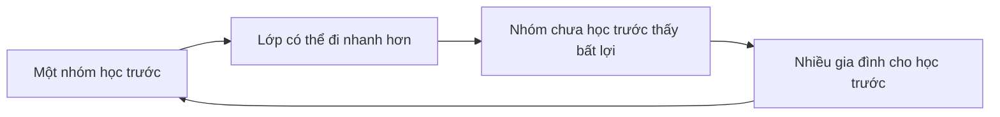

# Giáo dục, kỳ thi và xã hội bằng cấp

## Tại sao giáo dục mang trọng lượng xã hội lớn?

Giáo dục Hàn Quốc thường được nhìn từ bên ngoài qua hình ảnh học sinh học muộn, `학원` và kỳ thi `수능`. Nếu chỉ gọi đây là “văn hoá học nhiều”, ta chưa giải thích được cơ chế. Cần hỏi: **tại sao gia đình sẵn sàng đầu tư nhiều thời gian và tiền cho giáo dục, và tại sao một kỳ thi có thể tập trung kỳ vọng lớn đến vậy?**

Có nhiều lớp lịch sử chồng lên nhau. Nho giáo gắn học tập với đạo đức và status của scholar-official. Công nghiệp hoá tạo nhu cầu nhân lực có trình độ và mở education như một con đường mobility. Sau đó, nền kinh tế tri thức và competition cho các trường/việc làm uy tín làm credential tiếp tục có giá trị như signal.

Giáo dục vì vậy đồng thời là **knowledge system**, **sorting system**, **mobility mechanism** và **status signal**. Bốn chức năng này không phải lúc nào cũng đi cùng nhau; chính sự căng thẳng giữa chúng tạo ra nhiều đặc điểm của education culture Hàn Quốc.

## 학교 체계: trường học như một pipeline dài

Hệ phổ thông quen thuộc gồm `초등학교`, `중학교`, `고등학교`, sau đó có thể đi `대학교`, `전문대학`, `대학원` hoặc route nghề nghiệp khác. Nhưng điều quan trọng về văn hoá không phải thuộc sơ đồ, mà hiểu rằng mỗi transition tạo một **selection point**.

```text
초등학교
  ↓
중학교
  ↓
고등학교
  ↓
대학 / 전문대 / 취업 / 기타 경로
  ↓
취업·자격·대학원·재교육
```

Khi transition có cạnh tranh cao, ecosystem xuất hiện dịch vụ chuẩn bị: 학원, 과외, 입시 정보, mock test, consulting và online lecture. Selection point càng quan trọng, “industry quanh selection” càng lớn.

## 교육열: “nhiệt giáo dục” như một cơ chế đầu tư

**Educational zeal / 교육열** chỉ mức kỳ vọng và đầu tư mạnh vào giáo dục. Không nên hiểu đơn giản là cha mẹ “ám ảnh điểm số”. Với một household, chi tiêu giáo dục có thể được xem như human-capital investment.

Trong kinh tế học, nếu kỳ vọng thu nhập tương lai `Y` phụ thuộc một phần vào education `E`, gia đình cân nhắc cost hiện tại với expected benefit:

```math
\text{Invest if } \mathbb{E}[\Delta Y(E)] > \text{Cost}(E)
```

Nhưng benefit không chỉ monetary. Trường đại học còn cho network, prestige, job access và social signal. Khi nhiều gia đình cùng tối ưu như vậy, competition có thể tăng ngay cả khi return marginal giảm. Đây là **arms race / 군비경쟁** về credential: nếu mọi người mua thêm signal, baseline của thị trường tăng.

## 내신: performance trong trường và việc measurement trở thành incentive

`내신` thường chỉ thành tích/điểm số được ghi nhận trong school record và được dùng trong nhiều context admissions. Khi school performance có downstream consequence, từng bài kiểm tra, ranking, activity và record có thể trở nên salient hơn.

Điều này minh hoạ một nguyên lý rộng: **measurement thay đổi behaviour**. Nếu hệ thống reward một metric, actor tối ưu metric đó. Nhưng nếu chỉ tập trung metric, education có thể drift khỏi mục tiêu broader learning.

Không nên kết luận rằng mọi học sinh chỉ học để lấy điểm. Nhưng incentive structure giúp giải thích vì sao parent/student theo dõi evaluation detail rất kỹ.

## 수능: chuẩn hoá và áp lực tập trung

**College Scholastic Ability Test / 대학수학능력시험, 수능** là kỳ thi tuyển sinh đại học quốc gia có vai trò lớn. Ý nghĩa văn hoá của 수능 không đến từ bản thân exam format mà từ việc nó trở thành coordination point cho học sinh, phụ huynh, trường học, media và thị trường giáo dục.

Một standardized test giải quyết một vấn đề: làm sao so sánh lượng lớn applicant theo cùng metric. Nhưng metric nào cũng compress một con người đa chiều thành số ít dimensions. Trong data science, đây là dimensionality reduction; nó tạo comparability nhưng mất information.

Khi downstream institutions đặt weight lớn vào metric, người học sẽ optimize cho metric. Đây là **Goodhart’s Law**: khi một measure trở thành target, nó có thể không còn phản ánh hoàn hảo thứ ta muốn đo.

## 고3: một năm học trở thành social state riêng

`고3` — học sinh năm cuối cấp ba — không chỉ là grade label. Trong public imagination, nó là state gắn với entrance exam pressure, schedule dày và family coordination quanh study.

Khi household có con `고3`, meal timing, holiday plan và spending có thể điều chỉnh theo exam calendar. Đây là một ví dụ nhỏ cho thấy education không chỉ nằm trong classroom; nó tái tổ chức household time.

## 수시와 정시: nhiều route cùng đi vào đại học

Trong admission discourse, `수시` và `정시` là hai category rất quen thuộc. Cách tuyển cụ thể có nhiều biến thể và thay đổi theo institution/thời kỳ, nhưng mental model cơ bản là:

- `수시`: dùng nhiều loại record/evaluation ngoài một lần thi duy nhất, có thể bao gồm school record và tiêu chí khác.
- `정시`: nhấn mạnh mạnh hơn vào score chuẩn hoá như `수능` trong nhiều trường hợp.

Điều quan trọng là không biến hai từ thành binary “toàn hồ sơ” vs “toàn 수능”; thực tế admissions rule chi tiết phải đọc theo từng trường và năm.

Culture point ở đây là **route diversification**: khi một route cạnh tranh cao hoặc có uncertainty, family đầu tư vào information để chọn route phù hợp.

## 입시 정보: information itself trở thành một resource

Admissions không chỉ cần học lực mà còn cần hiểu rule: deadline, weighting, eligibility, document, interview, major selection. Khi rule phức tạp, người có access tốt tới information và counselling có advantage.

Đây là **information asymmetry / 정보 비대칭**. Hai học sinh có ability tương tự nhưng khác nhau về parental experience, school counselling hoặc access tới consulting có thể đưa ra decision khác.

Vì vậy inequality education không chỉ là ai mua nhiều giờ học thêm hơn; nó còn là ai hiểu system sớm hơn.

## 학원 và shadow education

**Private academy / 학원** là một phần nổi bật của education ecosystem. Học viện có thể dạy school subjects, language, music, coding, art hoặc exam prep. Sự tồn tại của `학원` không đơn giản do trường công “kém”; nó còn do competition, parental anxiety, scheduling và desire for differentiation.

Khi một số học sinh học thêm, các học sinh khác có incentive tham gia để không tụt relative position. Đây là coordination trap. Nếu score xếp hạng tương đối, lợi ích của một cá nhân có thể dẫn đến cost tập thể cao hơn.

Báo cáo thống kê theo từng năm cho thấy private education là một market rất lớn, nhưng khi dùng con số cụ thể phải luôn ghi năm dữ liệu. Điều bền hơn cần hiểu là mechanism: **relative competition + uncertainty + parental investment → demand cho shadow education**.

## 과외, 인강, 스터디카페: shadow education không chỉ có 학원

`과외` là private tutoring, thường cá nhân hoặc nhóm nhỏ. `인강` là online lecture. `스터디카페` bán không gian tập trung học hơn là “cafe” theo nghĩa đồ uống.

Ba form này giải ba constraint khác nhau:

- 과외 tối ưu personalization;
- 인강 tối ưu scale và location independence;
- 스터디카페 tối ưu environment và concentration.

Đây là ví dụ market unbundle education thành **content, feedback và space**.

## 선행학습: học trước chương trình và feedback loop

**Advanced learning ahead of curriculum / 선행학습** là học kiến thức trước khi trường chính thức dạy. Nó tạo một paradox trong classroom: teacher tưởng đang giới thiệu nội dung mới nhưng nhiều học sinh đã biết; tốc độ lớp tăng; học sinh chưa học trước càng khó theo; incentive học trước tăng thêm.



Hiểu loop quan trọng hơn phán xét cha mẹ hay học sinh riêng lẻ.

## 문제집, 오답노트 và culture của luyện pattern

Education ecosystem Hàn có lượng lớn `문제집` — sách bài tập — và practice material. `오답노트` là error log ghi lại câu sai, nguyên nhân và cách sửa.

Đây là một practice rất đáng chú ý từ learning science. Nếu chỉ làm nhiều câu nhưng không phân loại lỗi, learning loop yếu. Nếu error log tách:

```text
concept gap
vs
careless error
vs
time-management problem
vs
question-pattern misunderstanding
```

thì feedback trở nên actionable hơn.

Cách học này có analogue trực tiếp trong programming: bug log tốt không chỉ lưu “test fail”, mà lưu root cause và prevention.

## 학벌: bằng cấp như signal và network

**Academic pedigree / 학벌** chỉ trọng lượng xã hội của trường từng học. Trong labour market, employer không quan sát trực tiếp năng lực tương lai nên dùng signal: trường, major, GPA, certificate, internship. Đây là vấn đề information asymmetry.

Nếu một trường có admission khó, employer có thể dùng tên trường như proxy. Nhưng proxy tạo feedback loop: công ty tuyển nhiều từ trường uy tín → alumni network mạnh → applicants giỏi cạnh tranh vào → signal của trường tiếp tục mạnh.

Mặt trái là năng lực thật có thể bị overshadowed bởi credential. Tech hiring cố giảm vấn đề này bằng coding test, portfolio và practical interview, nhưng ngay cả các metric đó cũng có thể bị “luyện thi hoá”.

## SKY và label trường như shorthand xã hội

`SKY` là label thông dụng cho Seoul National University, Korea University và Yonsei University. Trong discourse, nó hoạt động như shorthand cho elite university status.

Nhưng shorthand có thể làm người đọc overgeneralize. University prestige có effect khác nhau theo industry, major, career stage và individual network. Sau nhiều năm kinh nghiệm, actual performance có thể quan trọng hơn school label trong nhiều nghề.

Cultural literacy nên nhận diện signal mà không biến signal thành định mệnh.

## 학군 và housing: giáo dục đi vào bản đồ thành phố

`학군` có thể chỉ school district hoặc vùng trường học trong public discourse. Khi reputation của trường và access education được capitalized vào location, housing demand và education demand tạo feedback loop.

```text
school reputation
→ family demand for area
→ housing demand
→ household selection by income
→ peer composition / education services
→ school-area reputation
```

Loop này không đơn giản hay tuyệt đối, nhưng giúp hiểu tại sao education culture và real-estate culture ở Hàn Quốc thường nối nhau.

Đọc thêm tại [`24_economy_chaebol_housing_status_mobility.md`](24_economy_chaebol_housing_status_mobility.md).

## 재수, 반수, N수: khi transition được thử lại

`재수` thường chỉ thi/luyện lại sau khi không đạt kết quả mong muốn ở lần đầu; `N수` là cách nói rộng cho nhiều lần thử lại; `반수` thường chỉ trường hợp đang học đại học nhưng chuẩn bị thi lại để chuyển route.

Các label này cho thấy entrance không chỉ là một event mà có thể kéo dài thành một phase của life course. Opportunity cost gồm thời gian, học phí, stress và delay các bước tiếp theo.

Điểm cần tránh là coi người `재수생` như “thất bại”. Trong system cạnh tranh, retry là một strategy, dù có cost.

## Đại học, công việc và “đường ray chuẩn”

Trong một xã hội công nghiệp hoá nhanh, từng tồn tại một life script tương đối rõ: học tốt → đại học tốt → công ty lớn/việc ổn định → kết hôn → mua nhà. Khi tăng trưởng chậm, giá nhà cao và labour market phân mảnh, probability của script này giảm. Nhưng expectation có thể tồn tại lâu hơn reality, tạo cảm giác competition và delay adulthood.

Thế hệ trẻ vì vậy không chỉ “ít cố gắng hơn”; họ đang tối ưu trong payoff matrix khác. Startup, freelance, creator, overseas career và chuyển việc thường xuyên mở thêm đường, trong khi một số industry vẫn rất credential-driven.

## 취준생: học không dừng ở graduation

`취준생` — người đang chuẩn bị xin việc — là một social category quen thuộc. Giai đoạn này có thể gồm certificate, language score, internship, aptitude test, interview prep và portfolio.

Điều này cho thấy credential competition dịch chuyển từ **admission market** sang **labour market**. Tốt nghiệp không nhất thiết chấm dứt exam culture; chỉ thay loại exam.

Khi nhiều applicant cùng tích luỹ `스펙`, employer lại tìm signal mới. Đây là arms race tương tự education credential.

## 전문대, 특성화고 và vocational route

Không phải mọi path đều đi qua bốn năm đại học. `전문대학`, vocational high school và training route cung cấp skill-oriented path. Vấn đề văn hoá là prestige hierarchy đôi khi làm vocational route bị đánh giá thấp hơn economic value thực.

Đây là mismatch có thể xảy ra giữa **status value** và **market value**. Một skill nghề có shortage có thể tạo thu nhập tốt nhưng vẫn mang status thấp hơn một credential academic phổ biến.

## 사교육과 불평등: education như máy khuếch đại hay thang máy?

Giáo dục có hai vai trò có thể xung đột. Nó là **mobility engine** khi người có năng lực từ background yếu có thể đi lên. Nhưng nếu access đến tutoring, housing gần school tốt và information về admission phụ thuộc income, education có thể reproduce inequality.

Trong causal inference, correlation giữa “học thêm” và “điểm cao” không đủ chứng minh effect thuần của 학원, vì family income, prior achievement và parental education là confounders.

Đây là một connection quan trọng giữa social science và statistics: văn hoá giáo dục cần phân tích bằng causal reasoning, không chỉ anecdote.

## 학부모 community và information network

Cha mẹ không chỉ mua education service; họ trao đổi information qua school network, neighborhood group và online community. Những network này giúp tìm teacher, hagwon, school event và admissions information.

Nhưng social network cũng có thể tạo anxiety contagion. Nếu mọi người xung quanh nói con họ học trước hai năm, baseline subjective của “bình thường” bị kéo lên dù national average có thể khác.

Đây là **availability + peer effect**: điều nhìn thấy trong local network dễ bị nhầm thành universal norm.

## 교권, 학교폭력 và school culture

Trường học là nơi hierarchy giữa teacher–student, senior–junior và peer group gặp nhau. Những tranh luận về **teacher authority / 교권**, **school violence / 학교폭력** và student rights cho thấy hệ thống đang điều chỉnh ranh giới giữa authority, protection và accountability.

Kỷ luật không còn được xem đơn thuần là quyền của người lớn; đồng thời việc bảo vệ giáo viên khỏi harassment cũng trở thành vấn đề. Đây là ví dụ hệ thống chuyển từ role-based obedience sang rule-based accountability.

## 대학 문화: từ student sang young adult

University không chỉ là lớp học mà còn là social transition. `학번`, `동기`, `선배·후배`, `동아리`, `MT`, `휴학`, `복학` tạo một vocabulary riêng cho campus life.

Đọc sâu phần này ở [`30_school_university_youth_campus_culture.md`](30_school_university_youth_campus_culture.md). Chương hiện tại tập trung vào education system và credential; chapter 30 tập trung vào culture sau khi bước vào campus.

## 평생교육 và reskilling

Trong labour market thay đổi nhanh, education không còn kết thúc ở tuổi 22. `평생교육` — lifelong learning — bao gồm certificate, online course, language, vocational training và adult degree.

Khi technology làm skill depreciate nhanh hơn, worker phải update human capital nhiều lần. Điều này làm ranh giới giữa “học sinh” và “người đi làm” mờ hơn.

Với developer, học framework mới sau giờ làm là một ví dụ rất trực tiếp của lifelong education culture, dù không liên quan exam truyền thống.

## Knowledge Connection: learning science và exam optimization

Cường độ học cao không đảm bảo retention cao. Cognitive science phân biệt rereading với active recall, massed practice với spaced repetition. Một học sinh có thể dành nhiều giờ nhưng học không hiệu quả nếu strategy chỉ là passive exposure.

Vì vậy “học kiểu Hàn” không phải một method thống nhất. Học sinh top có thể dùng error log, past papers, retrieval practice rất có hệ thống; người khác có thể chỉ tăng time-on-task.

Trong programming, điều tương tự xảy ra: xem 50 giờ tutorial không tương đương debug một project thật. Output học tập phụ thuộc quality của feedback loop.

## Knowledge Connection: credential inflation giống version escalation

Nếu certificate A từng hiếm, nó signal mạnh. Khi phần lớn applicant có A, signal yếu đi; applicant thêm B; sau đó B cũng phổ biến.

```text
rare credential
→ strong signal
→ more people acquire it
→ signal weakens
→ new credential added
```

Đây là **credential inflation / 자격 인플레이션**. Nó giải thích tại sao một xã hội có thể học nhiều hơn mà individual vẫn cảm thấy “chưa đủ”.

## Mental Model

> Hãy coi hệ thống giáo dục Hàn Quốc như một market nơi education vừa là **knowledge**, vừa là **signal**, vừa là **selection mechanism**, vừa là **insurance cho tương lai**. Khi nhiều người cùng cạnh tranh bằng signal, cost có thể tăng nhanh hơn knowledge thực. Muốn hiểu `수능`, `학원`, `학벌`, `학군`, `취준`, phải nhìn incentive của toàn hệ thống chứ không quy nó về “người Hàn thích học”.

## Common Misconceptions

“수능 quyết định toàn bộ cuộc đời” là exaggeration. Nó có weight lớn ở một số admissions path nhưng tồn tại nhiều route khác.

“학원 chỉ để luyện thi” sai; academy ecosystem bao gồm vô số kỹ năng.

“Học sinh Hàn giỏi vì học nhiều giờ” bỏ qua selection, family resources, pedagogy, peer effect và individual variation.

“Học trường nổi tiếng đảm bảo career tốt” biến probabilistic signal thành deterministic rule.

“Education competition chỉ do cha mẹ tham vọng” bỏ qua labour-market sorting, housing, peer effect và uncertainty về tương lai.
