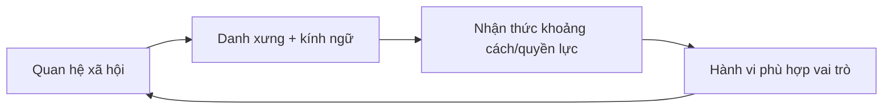

# Liên hệ kiến thức, mô hình tư duy và những hiểu lầm cần tránh

## Mục đích của chương này

Các chương trước đã giải thích từng hệ thống con. Chương này không tóm tắt theo kiểu cheat sheet mà xây một **đồ thị kiến thức (knowledge graph)**: những ý tưởng nào thực chất là cùng một cơ chế nhưng xuất hiện trong gia đình, ngôn ngữ, công ty, ẩm thực và công nghệ.

Nếu sau khi đọc bạn chỉ nhớ danh sách `정`, `눈치`, `한`, `빨리빨리`, bộ sách chưa đạt mục tiêu. Điều cần đạt là khi gặp tình huống mới — một cuộc họp, đám cưới, bữa nhậu, bình luận trong KakaoTalk hay một bộ phim — bạn có thể phân rã nó thành quan hệ, động lực, tín hiệu, môi trường và lớp lịch sử.

## Liên hệ 1: Quan hệ ↔ ngôn ngữ ↔ quyền lực

Tuổi và chức vụ có ý nghĩa vì chúng giúp xác định vai trò. Vai trò được mã hoá vào `호칭` và cấp độ lời nói. Cách nói lại củng cố cách người ta cảm nhận vai trò. Đây là một **vòng phản hồi (feedback loop)**:



Nếu công ty đổi chức danh nhưng giữ nguyên quyền đánh giá, vòng lặp chỉ bị sửa ở lớp ngôn ngữ. Vì vậy bề mặt giao tiếp có thể thay trước cấu trúc quyền lực thực.

## Liên hệ 2: 눈치 ↔ giao tiếp ngữ cảnh cao ↔ API không có tài liệu

`눈치` hoạt động hiệu quả khi mọi người chia sẻ đủ bối cảnh. Một nhóm làm việc lâu năm có thể truyền nhiều ý nghĩa bằng rất ít từ. Có thể xem đây là **nén thông tin (compression)**: nền tảng chung đóng vai trò như từ điển.

Nhưng cơ chế nén này dễ thất bại khi có người mới hoặc nhóm đa văn hoá. Trong lý thuyết thông tin, nếu phía giải mã thiếu bộ mã chung thì thông điệp dễ bị tái dựng sai. Vì vậy nhóm quốc tế cần đặc tả rõ hơn, không phải vì bên nào “kém tinh tế” mà vì lượng thông tin chung thấp hơn.

### Mô hình tư duy

> Giao tiếp ngữ cảnh cao (high-context communication) hiệu quả khi mạng lưới có lịch sử chung; giao tiếp rõ ràng, tường minh hiệu quả hơn khi mạng lưới không đồng nhất.

## Liên hệ 3: 정 ↔ tính có đi có lại ↔ trò chơi lặp lại

Trong lý thuyết trò chơi, **trò chơi lặp lại (repeated game / 반복 게임)** khác trò chơi một lần vì người chơi biết họ sẽ còn gặp lại nhau. Hợp tác có thể bền hơn khi danh tiếng và tương tác tương lai quan trọng.

`정`, trao đổi quà, đi đám cưới và giúp đỡ lẫn nhau đều mạnh trong quan hệ lặp lại. Nếu mọi trao đổi đều bị biến thành tính toán ngay lập tức, giá trị quan hệ có thể giảm. Ngược lại, nghĩa vụ lặp lại cũng có thể trở thành gánh nặng nếu chi phí rời khỏi quan hệ quá cao.

Văn hoá ở đây là cơ chế làm tương tác trong tương lai trở nên nổi bật trong quyết định hiện tại.

## Liên hệ 4: 체면 ↔ giữ thể diện ↔ xử lý lỗi

Trong kỹ thuật, thông báo lỗi tốt phải cung cấp đủ thông tin để sửa nhưng không làm người dùng mất niềm tin. Trong tương tác xã hội, phê bình cũng là một dạng xử lý lỗi.

Nếu phản hồi công khai và mang tính buộc tội, người nhận phải đồng thời sửa vấn đề và bảo vệ hình ảnh xã hội của mình. Năng lực chú ý bị chia đôi. Phản hồi riêng, dựa trên bằng chứng thường giảm tải thứ cấp này.

Giữ thể diện không đồng nghĩa che giấu lỗi. Giao thức tốt là bảo vệ phẩm giá trong khi vẫn làm vấn đề được nhìn thấy rõ.

## Liên hệ 5: 빨리빨리 ↔ logistics ↔ vòng phản hồi kỳ vọng

Tốc độ không phải đặc điểm thần bí của dân tộc. Khi hạ tầng cho phép giao hàng trong ngày hoặc ngày hôm sau, chuẩn kỳ vọng của người dùng thay đổi. Doanh nghiệp chậm mất khách, nên đầu tư thêm vào tự động hoá và vận hành.

```text
hạ tầng tốt hơn
→ dịch vụ nhanh hơn
→ kỳ vọng cao hơn
→ cạnh tranh mạnh hơn
→ đầu tư hạ tầng nhiều hơn
```

Cùng logic xuất hiện trong tốc độ Internet, thanh toán di động và phản hồi khách hàng.

## Liên hệ 6: 교육열 ↔ tín hiệu ↔ cuộc đua vị thế

Nếu bằng cấp là tín hiệu hiếm, nó phân biệt ứng viên tốt. Khi quá nhiều người có cùng bằng, thị trường tìm tín hiệu mới: trường tốt hơn, chứng chỉ, thực tập, điểm ngoại ngữ. Người học đầu tư thêm để giữ vị trí tương đối.

Đây là **cạnh tranh vị thế (positional competition / 지위 경쟁)**. Chi phí cá nhân có thể hợp lý với từng người nhưng tổng chi phí xã hội tăng. Cơ chế tương tự xuất hiện ở thương hiệu xa xỉ, khu nhà có trường tốt và bằng cấp nghề nghiệp.

## Liên hệ 7: 김장 ↔ lao động phân tán ↔ công nghệ bảo quản

Kimjang giải một bài toán vật chất: bảo quản rau qua mùa đông. Nhưng khối lượng lớn vượt khả năng một người, nên gia đình và cộng đồng phối hợp. Công nghệ lên men và tổ chức xã hội cùng phát triển.

Khi tủ lạnh và siêu thị giảm nhu cầu phải tự bảo quản, lao động hợp tác giảm; ý nghĩa tụ họp vẫn có thể còn. Công nghệ thay chức năng nhưng không xoá ý nghĩa ngay lập tức.

## Liên hệ 8: 온돌 ↔ văn hoá cơ thể ↔ khả năng hành động

Sàn ấm làm việc ngồi sàn thoải mái; ngồi sàn làm độ sạch của sàn quan trọng hơn; nhu cầu giữ sàn sạch làm ranh giới tháo giày mạnh hơn. Một hệ kỹ thuật kéo theo quy ước xã hội.

Đây là khái niệm **khả năng hành động (affordance)**: môi trường làm một hành vi trở nên dễ hoặc tự nhiên hơn. Nhiều tập quán trông hoàn toàn biểu tượng thực ra có nền tảng vật chất.

## Liên hệ 9: 아파트 ↔ hộ gia đình ↔ tài chính ↔ giáo dục

Vị trí căn hộ ảnh hưởng thời gian đi lại và tiếp cận trường học; danh tiếng trường ảnh hưởng nhu cầu nhà ở; giá nhà ảnh hưởng quyết định kết hôn và sinh con; quyết định hộ gia đình lại tác động nhu cầu dân số.

Đây là **liên kết đa hệ thống (multi-system coupling)**. Vì vậy một chính sách giáo dục có thể phản hồi vào bất động sản, còn chính sách nhà ở có thể ảnh hưởng gián tiếp đến sinh suất.

Không thể hiểu vấn đề xã hội nếu chia mỗi lĩnh vực thành một ngăn độc lập.

## Liên hệ 10: Hallyu ↔ nền tảng ↔ hiệu ứng mạng

Hallyu toàn cầu không chỉ nhờ chất lượng nội dung. Nền tảng giảm chi phí phân phối; phụ đề giảm rào cản ngôn ngữ; fandom khuếch đại miễn phí; thuật toán tăng khả năng được khám phá; thành công lại hút thêm đầu tư.

Đây là hệ sinh thái có phản hồi dương. Tuy nhiên phản hồi dương cũng có thể tạo tập trung: một số ít sản phẩm nổi bật nhận lượng chú ý vượt trội.

## Liên hệ 11: Truyền thống ↔ hiện đại không phải hai cực

Hanok có thể dùng bơm nhiệt; hanbok có thể dùng vải hiện đại; chùa có đặt chỗ trực tuyến; bói toán chạy trong ứng dụng; lễ tưởng niệm tổ tiên có thể có video call.

Nếu định nghĩa truyền thống là “không công nghệ”, ta sẽ liên tục kết luận rằng truyền thống đang chết dù thực tế nó đang chuyển sang hạ tầng mới.

Khái niệm hữu ích hơn là **tính liên tục về chức năng (functional continuity)**: chức năng hoặc ý nghĩa nào được giữ, lớp nào được thay.

## Liên hệ 12: Văn hoá ↔ xác suất, không phải quy tắc tất định

Đây là liên hệ quan trọng nhất. Mẫu hình nhóm không cho phép dự đoán chắc chắn từng cá nhân.

Giả sử 70% nhóm A thích X và 40% nhóm B thích X. Việc biết một người thuộc A làm xác suất thích X cao hơn, nhưng vẫn có 30% nhóm A không thích X và 40% nhóm B thích X. So sánh văn hoá hữu ích ở mức tổng thể; tương tác giữa người với người phải tiếp tục cập nhật bằng bằng chứng cá nhân.

Vì vậy câu “người Hàn là…” thường yếu hơn về tri thức so với câu “trong bối cảnh X, chuẩn Y tương đối phổ biến vì cơ chế Z”.

## Liên hệ 13: Tuổi ↔ ngôn ngữ ↔ chi phí phối hợp

Tuổi trong đời sống Hàn Quốc không chỉ là biến dân số. Trong tương tác mới, năm sinh có thể giảm bất định về cách xưng hô và cấp độ lời nói. Vì vậy `몇 년생이에요?` đôi khi hoạt động như một giao thức bắt tay (handshake protocol).

Khi cách tính tuổi pháp lý chuyển sang `만 나이`, lớp hành chính thay nhanh hơn thói quen hội thoại. Đây là ví dụ rõ về việc luật và văn hoá cập nhật với tốc độ khác nhau.

## Liên hệ 14: Nghĩa vụ quân sự ↔ dòng thời gian ↔ thâm niên nơi làm việc

Nghĩa vụ quân sự tạo một khoảng gián đoạn có cấu trúc trong học tập và sự nghiệp của nhiều nam giới. Vì vậy tuổi theo năm sinh, năm tốt nghiệp và số năm kinh nghiệm không ánh xạ một-một.

Trải nghiệm quân đội chung có thể củng cố từ vựng về thâm niên, nhưng không nên dùng văn hoá quân đội như nguyên nhân duy nhất của thứ bậc công sở.

## Liên hệ 15: Nhà ở ↔ giáo dục ↔ tài sản ↔ địa lý

Căn hộ không chỉ là một toà nhà. Khi khu trường học, giao thông, tiếp cận việc làm và kỳ vọng tăng giá tài sản cùng được phản ánh vào vị trí, nhà ở trở thành nút nối nhiều hệ thống.

Biến động giá nhà có thể ảnh hưởng thời điểm kết hôn, quyết định sinh con, thời gian đi lại và chi tiêu giáo dục. Đây là lý do chính sách nhà ở có thể tạo hiệu ứng văn hoá vượt xa thị trường bất động sản.

## Liên hệ 16: Không gian công cộng ↔ nền tảng ↔ thiên lệch mẫu

Portal, YouTube và cộng đồng trực tuyến giúp ý kiến lưu thông nhanh nhưng cũng khiến người quan sát dễ nhầm mức độ hiển thị với tính đại diện. Lượng bình luận là dấu vết hành vi của một tập con người dùng chứ không phải khảo sát ngẫu nhiên.

Mô hình này cần được giữ khi đọc mọi tranh luận trực tuyến về giới, thế hệ, vùng miền hoặc chính trị.

## Liên hệ 17: Giao diện messenger ↔ kỳ vọng quan hệ

Thông báo đã đọc là một tính năng nhỏ nhưng làm trạng thái `đã xem` trở nên quan sát được. Khi trạng thái được lộ ra, xã hội tạo chuẩn mới như `읽씹`.

Đây là liên hệ trực tiếp giữa tương tác người–máy (HCI) và văn hoá: thiết kế giao diện thay lượng thông tin người dùng nhìn thấy, từ đó thay kỳ vọng và cảm xúc.

## Liên hệ 18: Hành vi sức khoẻ ↔ khả năng tiếp cận ↔ thiết chế

Tần suất đi phòng khám, khám sàng lọc hay dùng sản phẩm sức khoẻ không thể chỉ giải thích bằng “người Hàn quan tâm sức khoẻ”. Bảo hiểm, mật độ phòng khám, khám sức khoẻ qua nơi làm việc và thị trường tiêu dùng làm chi phí giao dịch khác đi.

Khi cấu trúc chi phí thay đổi, hành vi có thể thay đổi một cách hợp lý theo điều kiện mới.

## Liên hệ 19: Nuôi con ↔ công việc ↔ sinh suất

Quyết định có con không nằm riêng trong chương gia đình. `육아` phụ thuộc giờ làm, thời gian đi lại, lịch nhà trẻ, nhà ở và kỳ vọng giáo dục. Nếu giờ làm kết thúc muộn hơn giờ childcare, gia đình phải tạo khoảng đệm bằng ông bà, dịch vụ chăm sóc trả phí hoặc một người giảm giờ làm.

```text
chuẩn nuôi con cao
→ thời gian / chi phí trên mỗi trẻ tăng
→ năng lực cảm nhận để sinh thêm giảm
→ quy mô gia đình nhỏ hơn
→ đầu tư kỳ vọng trên mỗi trẻ tiếp tục tăng
```

Vòng lặp này không phải lời giải duy nhất cho sinh suất thấp, nhưng cho thấy văn hoá, lao động và dân số không thể tách thành ba ngăn riêng.

## Liên hệ 20: Campus ↔ quân đội ↔ bước vào công sở

`학번`, `선배–후배`, `동아리`, `MT`, `군휴학`, `복학` và `취준생` cùng tạo một lớp chuyển tiếp giữa trường và nơi làm việc. Một người có thể học cách đọc thâm niên, tham gia group chat, nhận bàn giao, tổ chức sự kiện và xây mạng lưới trước khi có công việc toàn thời gian.

Campus vì vậy có thể giống một môi trường thử (staging environment) của đời sống tổ chức. Nhưng hướng tác động không chỉ một chiều: ngôn ngữ công sở quay lại campus qua thực tập, tuyển dụng và mạng cựu sinh viên.

## Liên hệ 21: Căn hộ ↔ hạ tầng chung ↔ tác động ngoại biên

`층간소음`, đỗ xe, bưu kiện, phân loại rác và phép lịch sự trong thang máy có cấu trúc chung: hộ gia đình thực hiện hành động riêng nhưng tác động đi vào không gian chung.

```text
hành động riêng
→ hạ tầng chung
→ chi phí lên hàng xóm
→ quy tắc / phép lịch sự / quản lý phản hồi
```

Đây là **tác động ngoại biên (externality)**. Nó giải thích vì sao một hành vi nhỏ dễ trở thành vấn đề đạo đức: khi chi phí bị người khác hấp thụ, tranh luận nhanh chuyển từ “sở thích cá nhân” sang “ý thức cộng đồng”.

## Liên hệ 22: Mùa ↔ thực phẩm ↔ kiến trúc ↔ lịch

`김장`, `복날`, `단풍`, `벚꽃`, `온돌`, `장마` và `여름휴가` có vẻ là các chủ đề khác nhau nhưng đều được đồng bộ bởi tính mùa vụ.

Mùa hoạt động như một đồng hồ bên ngoài. Khí hậu kích hoạt thay đổi quần áo và thực phẩm; thiết chế kích hoạt lịch trường học và nghỉ lễ; thị trường kích hoạt du lịch và sản phẩm.

Khi nền khí hậu thay đổi, sự kiện văn hoá không biến mất ngay nhưng thời điểm, ý nghĩa và logistics có thể phải điều chỉnh.

## Liên hệ 23: Tiện lợi ↔ lao động ↔ chi phí ẩn

Giao hàng, `산후조리원`, chuyển nhà trọn gói, tủ nhận bưu kiện, hoàn hàng nhanh và chăm sóc khách hàng đều có một logic chung: giảm ma sát cho người dùng bằng cách chuyển phần phối hợp sang tổ chức hoặc người lao động.

```text
ma sát phía người dùng giảm
≠
chi phí toàn hệ thống bằng 0
```

Chi phí có thể thực sự giảm nhờ tự động hoá và mật độ cao, nhưng cũng có thể chỉ được chuyển sang nhân viên kho, người giao hàng, người chăm sóc, tổng đài viên hoặc văn phòng quản lý.

Điều này giúp phân tích `빨리빨리` mà không biến nó thành tính cách dân tộc. Tốc độ là kết quả của **vốn + hạ tầng + lao động + kỳ vọng**.

## Mô hình tổng hợp: 5 lớp để đọc một hiện tượng văn hoá

Khi gặp một hiện tượng mới, hãy lần lượt hỏi năm nhóm câu hỏi.

### 1. Lớp vật chất (material layer) — điều kiện vật chất nào làm nó khả thi?

Khí hậu, nhà ở, công nghệ thực phẩm, giao thông, điện thoại, tiền và hệ thống nơi làm việc có vai trò gì?

### 2. Lớp thiết chế (institutional layer) — quy tắc và động lực nào duy trì nó?

Luật, trường học, công ty, gia đình, thị trường hay tôn giáo phân phối quyền và lợi ích ra sao?

### 3. Lớp quan hệ (relational layer) — ai đang ở quan hệ nào?

Tuổi, chức vụ, mức thân thiết, họ hàng, thâm niên và vai trò có ý nghĩa gì?

### 4. Lớp biểu tượng (symbolic layer) — người tham gia hiểu hành vi này là gì?

Nó biểu thị tôn trọng, quan tâm, địa vị, ký ức, bản sắc hay vui chơi?

### 5. Lớp lịch sử (historical layer) — vì sao cấu trúc này tồn tại hôm nay?

Nông nghiệp, Nho giáo, lịch sử thuộc địa, chiến tranh, công nghiệp hoá, dân chủ hoá hay nền tảng số đã tác động như thế nào?

Một lời giải thích mạnh thường dùng ít nhất hai hoặc ba lớp, thay vì dừng ở câu “vì truyền thống”.

## Những hiểu lầm tổng hợp

### “Văn hoá Hàn Quốc = Nho giáo”

Sai vì Nho giáo là một lớp mạnh nhưng luôn tương tác với Phật giáo, shamanism, Kitô giáo, chủ nghĩa tư bản, chủ nghĩa dân tộc, luật và công nghệ.

### “Người Hàn rất collectivist”

Quá thô. Mức hướng về nhóm thay đổi theo lĩnh vực. Một người có thể coi trọng nghĩa vụ gia đình nhưng rất cá nhân trong lựa chọn nghề nghiệp.

### “Giới trẻ đã bỏ hết truyền thống”

Không đúng. Họ có thể bỏ nghi thức hình thức nhưng vẫn giữ món ăn, ngôn ngữ, ký ức gia đình hoặc tái diễn giải truyền thống qua thời trang và truyền thông.

### “Hàn Quốc hiện đại vì công nghệ nên thứ bậc không còn”

Mức độ tiếp nhận công nghệ và cấu trúc thứ bậc xã hội là hai trục khác nhau.

### “Biết phép lịch sự là hiểu văn hoá”

Phép lịch sự chỉ là đầu ra. Hiểu sâu cần biết cơ chế tạo ra đầu ra đó.

### “Một bộ phim cho thấy đời sống thật của Hàn Quốc”

Phim là câu chuyện đã được chọn lọc. Nó có thể phản ánh mối quan tâm có thật nhưng thể loại, tuyển chọn và phóng đại tạo thiên lệch mẫu rất lớn.

### “Văn hoá giải thích mọi khác biệt”

Thu nhập, giới, tuổi, nghề nghiệp, tính cách, luật và tổ chức có thể giải thích mạnh hơn nền tảng văn hoá trong nhiều tình huống.

### “Càng tiện thì xã hội càng ít phải lao động”

Không nhất thiết. Tiện lợi có thể đến từ tự động hoá làm tổng chi phí giảm, nhưng cũng có thể đến từ việc chuyển ma sát sang người lao động hoặc hạ tầng mà người tiêu dùng không nhìn thấy.

### “Một thực hành nhìn rất phổ biến thì chắc là quy tắc toàn quốc”

Không đúng. Quy tắc căn hộ, lịch phân loại rác, vận hành childcare, văn hoá campus và chính sách dịch vụ có thể khác theo địa phương, tổ chức và thế hệ.

## Một phương pháp quan sát thực tế

Khi sống hoặc làm việc ở Hàn Quốc, thay vì ghi “họ làm thế này”, hãy ghi theo cấu trúc:

```text
Quan sát:
Bối cảnh:
Chủ thể và quan hệ:
Quy tắc được nói rõ:
Kỳ vọng ngầm:
Cơ chế lịch sử / thiết chế có thể có:
Lời giải thích thay thế:
Bằng chứng cần kiểm tra:
```

Ví dụ:

```text
Quan sát: 팀장님 không nói "làm trước 3 giờ" nhưng cả nhóm phản hồi trước 3 giờ.
Bối cảnh: lỗi UAT, gần ngày phát hành.
Quan hệ: quản lý → kỹ sư.
Quy tắc được nói rõ: không có hạn trong tin nhắn.
Kỳ vọng ngầm: mức khẩn được hiểu từ bối cảnh dự án.
Cơ chế có thể có: nhóm ngữ cảnh cao + cùng biết lịch phát hành.
Lời giải thích thay thế: hạn đã được nói trong cuộc họp trước.
Bằng chứng cần kiểm tra: hỏi nhóm hoặc xem ticket/lịch sử trao đổi.
```

Có thể áp dụng cùng khuôn này cho đời sống ngoài công sở:

```text
Quan sát: cư dân phân loại một loại rác khác khu tôi từng sống.
Bối cảnh: khu căn hộ mới.
Chủ thể: hộ gia đình + văn phòng quản lý + chính quyền địa phương.
Quy tắc được nói rõ: chưa kiểm tra.
Kỳ vọng ngầm: mọi người làm theo thông báo của khu này.
Cơ chế có thể có: cách triển khai địa phương khác nhau.
Lời giải thích thay thế: tôi đang hiểu sai loại rác.
Bằng chứng cần kiểm tra: thông báo của 관리사무소 hoặc hướng dẫn của địa phương.
```

Cách ghi này biến việc học văn hoá từ gán nhãn thành **kiểm định giả thuyết (hypothesis testing)**.

## Mô hình tư duy cuối cùng

> Văn hoá không phải câu trả lời cho câu hỏi “người Hàn là người như thế nào?”. Văn hoá là một phần của câu trả lời cho câu hỏi “trong hoàn cảnh này, những ý nghĩa, ràng buộc và kỳ vọng nào đang làm một số hành vi trở nên dễ hiểu hơn những hành vi khác?”.

Khi tư duy như vậy, người học không cần thuộc lòng một danh sách phép lịch sự. Họ xây một mô hình có thể cập nhật. Gặp dữ liệu mới thì sửa mô hình, giống cách khoa học và kỹ thuật hoạt động.