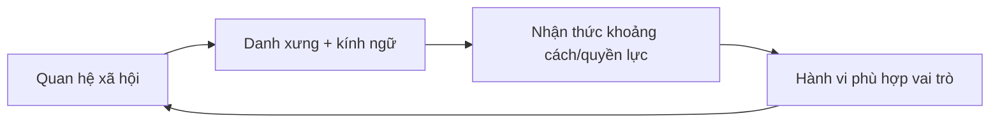

# Knowledge Connections, Mental Models và các hiểu lầm cần tránh

## Mục đích của chương này

Các chương trước đã giải thích từng subsystem. Chương cuối không tóm tắt kiểu cheat sheet mà xây một **knowledge graph**: những idea nào thực chất là cùng một cơ chế xuất hiện trong family, language, company, food và technology.

Nếu sau khi đọc bạn chỉ nhớ danh sách `정, 눈치, 한, 빨리빨리`, bộ sách thất bại. Mục tiêu là khi gặp tình huống mới — một cuộc họp, đám cưới, bữa nhậu, comment trong KakaoTalk hay một drama — bạn có thể phân rã nó thành relation, incentive, signal, environment và historical layer.

## Connection 1: Quan hệ ↔ ngôn ngữ ↔ quyền lực

Tuổi và chức vụ có ý nghĩa vì chúng giúp xác định role. Role được encode vào `호칭` và speech level. Cách nói lại reinforce perception của role. Đây là feedback loop:



Nếu company đổi title nhưng giữ evaluation power y như cũ, loop chỉ bị sửa ở node B. Vì vậy surface language có thể đổi trước structure.

## Connection 2: 눈치 ↔ high-context ↔ undocumented API

`눈치` hữu ích khi context shared. Cùng team lâu năm có thể truyền nhiều meaning bằng ít words. Đây là compression: shared background đóng vai dictionary.

Nhưng compression thất bại khi participant mới hoặc cross-cultural. Trong information theory, decoder thiếu codebook sẽ reconstruct sai. Vì vậy international team cần explicit specification nhiều hơn, không phải vì bên nào “kém tinh tế” mà vì mutual information thấp.

Mental model:

> High-context communication hiệu quả trong network có shared history; explicit communication hiệu quả khi network heterogeneous.

## Connection 3: 정 ↔ reciprocity ↔ repeated games

Trong game theory, **repeated game / 반복 게임** khác one-shot game vì người chơi biết sẽ gặp lại. Cooperation có thể bền hơn khi reputation và future interaction quan trọng.

`정`, gift exchange, wedding attendance và mutual help đều mạnh trong repeated relationship. Nếu bạn biến mọi exchange thành immediate accounting, relational value giảm. Ngược lại, repeated obligation có thể thành burden nếu exit cost quá cao.

Culture ở đây là mechanism làm future interaction salient.

## Connection 4: 체면 ↔ face-saving ↔ error handling

Trong engineering, error message nên báo đủ để sửa nhưng không phá user trust. Trong social interaction, criticism cũng là error handling.

Nếu feedback public và accusatory, recipient phải đồng thời solve task error và defend social identity. Cognitive bandwidth chia đôi. Private, evidence-based feedback giảm secondary load.

Face-saving không đồng nghĩa che lỗi. Good protocol là preserve dignity while exposing problem.

## Connection 5: 빨리빨리 ↔ logistics ↔ expectation feedback

Tốc độ không phải trait thần bí. Khi infrastructure cho phép 1-day delivery, user baseline đổi. Firm chậm mất market share, nên invest thêm automation. Đây là reinforcing loop.

```text
better infrastructure
→ faster service
→ higher expectation
→ stronger competition
→ more infrastructure investment
```

Cùng logic xuất hiện trong Internet speed, mobile payment và customer response.

## Connection 6: 교육열 ↔ signal ↔ arms race

Nếu bằng cấp là signal hiếm, nó phân biệt tốt. Khi nhiều người có cùng bằng, market tìm signal mới: trường tốt hơn, certificate, internship, language score. Người học invest thêm để giữ relative position.

Đây là **positional competition / 지위 경쟁**. Cost cá nhân có thể rational trong khi cost xã hội tăng. Điều tương tự xảy ra với luxury brand, apartment school district và resume credential.

## Connection 7: 김장 ↔ distributed labour ↔ preservation technology

Kimjang giải một bài toán vật chất: preserve vegetable qua winter. Nhưng amount lớn vượt capacity một cá nhân, nên household/community phối hợp. Fermentation technology và social organization co-evolve.

Khi refrigerator và supermarket giảm need preservation, cooperative labour giảm; symbolic gathering còn. Technology thay function nhưng không xoá meaning ngay.

## Connection 8: 온돌 ↔ embodied culture ↔ affordance

Sàn ấm làm floor sitting comfortable; floor sitting tăng importance của clean floor; clean floor làm shoe-removal boundary mạnh. Một technical system kéo theo social convention.

Đây là **affordance**: environment làm một action dễ/tự nhiên hơn. Nhiều custom tưởng purely symbolic thực ra có material substrate.

## Connection 9: 아파트 ↔ household ↔ finance ↔ education

Apartment location ảnh hưởng commute và school access; school reputation ảnh hưởng housing demand; housing price ảnh hưởng marriage/childbirth decision; household decision lại ảnh hưởng demographic demand.

Đây là multi-system coupling. Vì vậy một policy education có thể phản hồi vào real estate, và housing policy có thể ảnh hưởng fertility.

Không thể hiểu social issue bằng silo.

## Connection 10: Hallyu ↔ platform ↔ network effects

Hallyu global không chỉ nhờ content quality. Platform giảm distribution cost; subtitle giảm language barrier; fandom tạo free amplification; algorithm tăng discoverability; success lại thu hút investment.

Đây là ecosystem with positive feedback. Nhưng positive feedback cũng tạo concentration: vài hit nhận disproportionate attention.

## Connection 11: Tradition ↔ modernity không phải binary

Hanok có thể dùng heat pump; hanbok có modern fabric; temple có online reservation; fortune telling chạy trong app; ancestral memorial có video call. Nếu định nghĩa tradition là “không công nghệ”, ta sẽ liên tục kết luận tradition đang chết dù thực tế nó đang re-platform.

Một khái niệm tốt hơn là **functional continuity**: function hoặc meaning nào được giữ, layer nào được thay.

## Connection 12: Culture ↔ probability, không phải deterministic rule

Đây là connection quan trọng nhất. Group pattern không cho phép predict individual certainty.

Giả sử 70% group A thích X và 40% group B thích X. Biết một người thuộc A làm probability X cao hơn, nhưng vẫn có 30% A không thích X và 40% B thích X. Cultural comparison hữu ích ở aggregate; interpersonal interaction cần update bằng evidence cá nhân.

Đây là lý do câu “người Hàn là…” thường epistemically yếu hơn “trong bối cảnh X, norm Y tương đối phổ biến vì mechanism Z”.

## Connection 13: Tuổi ↔ ngôn ngữ ↔ coordination cost

Tuổi trong đời sống Hàn Quốc không chỉ là demographic variable. Trong interaction mới, birth year có thể giảm uncertainty về cách xưng hô và speech level. Vì vậy `몇 년생이에요?` đôi khi hoạt động như một handshake protocol. Khi legal age calculation chuyển sang `만 나이`, administrative layer thay đổi nhanh hơn conversational habit. Đây là ví dụ điển hình cho việc law và culture có tốc độ update khác nhau.

## Connection 14: Nghĩa vụ quân sự ↔ timeline ↔ workplace seniority

Conscription tạo một interruption có cấu trúc trong education/career timeline của nhiều nam giới. Điều này làm chronological age, graduation year và work experience không map 1:1. Shared military experience có thể reinforce vocabulary về seniority, nhưng không nên dùng military culture như nguyên nhân duy nhất của hierarchy công sở.

## Connection 15: Housing ↔ education ↔ wealth ↔ geography

Apartment không chỉ là building. Khi school district, transit, job access và expected asset value cùng được capitalized vào location, housing trở thành node nối nhiều subsystem. Một thay đổi giá nhà có thể ảnh hưởng marriage timing, fertility decision, commute và education spending. Đây là lý do housing policy thường tạo cultural effect vượt ra ngoài real-estate market.

## Connection 16: Public sphere ↔ platform ↔ sampling bias

Portal, YouTube và community giúp opinion lưu thông nhanh nhưng cũng làm người quan sát dễ nhầm visibility với representativeness. Comment volume là behavioural trace của subset user, không phải random survey. Mental model này cần được giữ khi đọc bất kỳ tranh luận online nào về giới, thế hệ, vùng miền hay politics.

## Connection 17: Messenger UI ↔ relationship expectation

Read receipt là một feature nhỏ nhưng làm trạng thái `đã xem` trở thành observable. Khi state được expose, xã hội phát minh norm mới như `읽씹`. Đây là một connection trực tiếp giữa HCI và culture: interface design thay đổi information available cho người dùng, từ đó thay đổi expectation và emotion.

## Connection 18: Health behaviour ↔ access ↔ institution

Tần suất đi clinic, screening hay dùng health product không thể giải thích chỉ bằng “người Hàn quan tâm sức khoẻ”. Insurance coverage, clinic density, workplace screening và consumer market làm transaction cost khác đi. Khi cost structure thay đổi, behaviour rationally thay đổi theo.

## Connection 19: Parenting ↔ workplace ↔ fertility

Quyết định có con không nằm riêng trong chapter family. `육아` phụ thuộc giờ làm, commute, childcare schedule, housing và expectation về education. Nếu workplace kết thúc muộn hơn childcare, household phải tự tạo buffer bằng grandparents, paid care hoặc một người giảm work hours.

Feedback loop có thể được mô tả:

```text
high parenting standard
→ time/cost per child tăng
→ perceived capacity sinh con giảm
→ family size nhỏ hơn
→ investment kỳ vọng trên mỗi child tiếp tục tăng
```

Loop này không phải explanation duy nhất của low fertility, nhưng nó cho thấy vì sao culture, labour và demography không thể tách thành ba silo.

## Connection 20: Campus ↔ military ↔ workplace onboarding

`학번`, `선배–후배`, `동아리`, `MT`, `군휴학`, `복학` và `취준생` cùng tạo một transition layer giữa school và workplace. Một người có thể học cách đọc seniority, tham gia group chat, nhận handover, tổ chức event và networking trước khi có full-time job.

Campus vì vậy giống staging environment của organizational life. Nhưng causal direction không chỉ một chiều: workplace language quay ngược vào campus qua internship, recruitment và alumni network.

## Connection 21: Apartment ↔ shared infrastructure ↔ conflict externality

`층간소음`, parking, parcel, recycling và elevator etiquette có chung structure: household tạo action private nhưng effect đi vào shared space.

```text
private action
→ shared infrastructure
→ externality lên neighbour
→ rule / etiquette / management response
```

Điều này giải thích vì sao một behaviour nhỏ dễ trở thành moral issue. Khi cost được người khác absorb, discussion nhanh chuyển từ “sở thích cá nhân” sang “ý thức cộng đồng”.

## Connection 22: Mùa ↔ food ↔ architecture ↔ calendar

`김장`, `복날`, `단풍`, `벚꽃`, `온돌`, `장마` và `여름휴가` trông như các chủ đề khác nhau nhưng đều được đồng bộ bởi seasonality.

Mùa hoạt động như external clock. Climate trigger clothing và food; institution trigger school/holiday cycle; market trigger travel và product. Vì vậy seasonal culture là coupling giữa ecology và social calendar.

Khi climate baseline thay đổi, cultural event không biến mất ngay nhưng timing, meaning và logistics có thể phải update.

## Connection 23: Convenience ↔ labour ↔ hidden cost

Delivery, `산후조리원`, full-service moving, parcel locker, fast return và customer support đều có một logic chung: giảm friction ở phía user bằng cách chuyển coordination sang organization hoặc worker.

Mental model quan trọng:

```text
user friction ↓
≠
system cost = 0
```

Cost có thể được giảm thực sự nhờ automation và density, nhưng cũng có thể chỉ được chuyển sang warehouse worker, rider, caregiver, call-center employee hoặc management office.

Điều này giúp phân tích `빨리빨리` mà không biến nó thành tính cách dân tộc. Tốc độ là result của capital + infrastructure + labour + expectation.

## Mental Model tổng hợp: 5 lớp để đọc một hiện tượng văn hoá

Khi gặp một hiện tượng mới, hãy chạy năm câu hỏi:

### 1. Material layer — vật chất nào làm nó khả thi?

Climate, house, food technology, transport, smartphone, money, workplace system là gì?

### 2. Institutional layer — rule và incentive nào duy trì nó?

Law, school, company, family, market hay religion phân phối quyền/lợi ích ra sao?

### 3. Relational layer — ai đang ở quan hệ nào?

Age, rank, intimacy, kinship, seniority và role có ý nghĩa gì?

### 4. Symbolic layer — người tham gia nghĩ hành vi này có nghĩa gì?

Respect, care, status, memory, identity hay fun?

### 5. Historical layer — vì sao cấu trúc này có mặt hôm nay?

Nông nghiệp, Nho giáo, colonial history, war, industrialization, democratization, platformization?

Một explanation mạnh thường dùng ít nhất hai hoặc ba layer, không chỉ “vì truyền thống”.

## Common Misconceptions tổng hợp

### “Korean culture = Confucianism”

Sai vì Nho giáo là một layer mạnh nhưng tương tác với Buddhism, shamanism, Christianity, capitalism, nationalism, law và technology.

### “Người Hàn rất collectivist”

Quá thô. Group orientation thay đổi theo domain. Một người có thể collectivist trong family obligation nhưng individualist trong career choice.

### “Giới trẻ đã bỏ hết truyền thống”

Không đúng. Họ có thể bỏ formal rite nhưng vẫn giữ food, language, family memory hoặc reinterpret tradition qua fashion/media.

### “Hàn Quốc hiện đại vì công nghệ nên hierarchy không còn”

Technology adoption và social hierarchy là hai axis khác nhau.

### “Nếu biết etiquette là hiểu culture”

Etiquette chỉ là output. Hiểu sâu cần biết mechanism tạo output.

### “Một drama cho thấy đời sống thật của Hàn Quốc”

Drama là curated narrative. Nó có thể phản ánh real concern nhưng selection, genre và exaggeration làm sample bias rất lớn.

### “Culture giải thích mọi khác biệt”

Income, gender, age, occupation, personality, law và organization có thể giải thích mạnh hơn cultural background trong nhiều tình huống.

### “Càng tiện thì xã hội càng ít phải lao động”

Không nhất thiết. Convenience có thể đến từ automation làm tổng cost giảm, nhưng cũng có thể đến từ việc chuyển friction sang worker hoặc infrastructure mà consumer không nhìn thấy.

### “Một practice nhìn rất phổ biến thì chắc là national rule”

Không đúng. Apartment rule, recycling schedule, childcare operation, campus culture và service policy có thể khác theo municipality, organization và generation.

## Một phương pháp quan sát thực tế

Khi sống hoặc làm việc ở Hàn Quốc, thay vì ghi “họ làm thế này”, hãy ghi theo cấu trúc:

```text
Observation:
Context:
Actors and relationship:
Explicit rule:
Implicit expectation:
Possible historical/institutional mechanism:
Alternative explanation:
Evidence needed:
```

Ví dụ:

```text
Observation: 팀장님 không nói "làm trước 3 giờ" nhưng cả team phản hồi trước 3 giờ.
Context: UAT issue, release gần.
Relationship: manager → engineers.
Explicit rule: không có deadline trong message.
Implicit expectation: urgency được hiểu từ project context.
Mechanism: high-context team + shared release schedule.
Alternative explanation: deadline đã nói trong meeting trước.
Evidence needed: hỏi team hoặc xem ticket/history.
```

Có thể áp dụng cùng template cho đời sống ngoài công sở:

```text
Observation: cư dân phân loại một loại rác theo cách khác khu tôi từng sống.
Context: apartment complex mới.
Actors: household + management office + municipality.
Explicit rule: chưa kiểm tra.
Implicit expectation: mọi người làm giống notice ở khu này.
Possible mechanism: local implementation khác nhau.
Alternative explanation: tôi đang hiểu sai category.
Evidence needed: notice của 관리사무소 hoặc local-government guide.
```

Cách ghi này biến cultural learning từ stereotype thành hypothesis testing.

## Mental Model cuối cùng

> Văn hoá không phải câu trả lời cho câu hỏi “người Hàn là người như thế nào?”. Văn hoá là một phần của câu trả lời cho câu hỏi “trong hoàn cảnh này, những meaning, constraint và expectation nào đang làm một số hành vi trở nên dễ hiểu hơn những hành vi khác?”.

Khi tư duy như vậy, người học không phải memorise danh sách etiquette. Họ xây một model có thể update. Gặp dữ liệu mới thì sửa model, giống cách khoa học và engineering hoạt động.