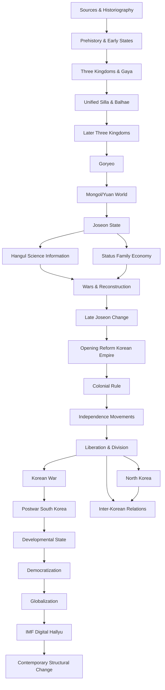

# Mục lục và Knowledge Dependency — Lịch sử Hàn Quốc

## Bản đồ toàn bộ thư viện

```text
01 Cách đọc lịch sử
   ↓
02 Tiền sử & các nhà nước sớm
   ↓
03 Tam Quốc & Gaya
   ↓
04 Unified Silla & Balhae
   ↓
05 Late Silla & Later Three Kingdoms
   ↓
06 Goryeo hình thành
   ↓
07 Goryeo quân nhân & Mongol/Yuan
   ↓
08 Joseon đầu kỳ & nhà nước Nho giáo
   ├── 09 Hangul, khoa học & information system
   └── 10 xã hội, thân phận, gia đình, kinh tế
          ↓
11 Imjin/Manchu wars & tái thiết
   ↓
12 Joseon hậu kỳ: thương mại, Silhak, biến đổi xã hội
   ↓
13 Thế kỷ XIX: mở cửa → Donghak → Gabo → Korean Empire
   ↓
14 Thuộc địa Nhật 1910–1945
   └── 15 phong trào độc lập & Provisional Government
          ↓
16 Giải phóng, chia cắt, lập hai nhà nước 1945–1950
   ↓
17 Korean War 1950–1953
   ↓
18 Tái thiết & First Republic
   ↓
19 Developmental state & công nghiệp hoá 1961–1979
   ↓
20 Gwangju, phong trào dân chủ & 1987
   ↓
21 Dân chủ hoá, toàn cầu hoá 1987–1997
   ↓
22 IMF crisis, số hoá, Hallyu 1997–2010s
   ↓
23 Những chuyển đổi cấu trúc 2010s–2020s
```

Một đường song song cần đọc cùng lịch sử miền Nam là:

```text
16 chia cắt
   ├── 24 Lịch sử Bắc Triều Tiên
   └── 25 Quan hệ liên Triều & Cold War system
```

Các trục xuyên thời gian:

```text
02 → 26 Social History
02 → 27 Economic History
02 → 28 Education / Writing / Science / Technology
01 → 29 Historiography / Collective Memory / Public History
```

## Vì sao dependency này không phải Beginner → Advanced

Ta cần biết Tam Quốc trước khi hiểu vì sao Goryeo tự đặt mình trong một legacy cụ thể; cần biết Goryeo trước khi hiểu những gì Joseon thay đổi; cần hiểu Joseon trước khi hiểu vì sao các cải cách cuối thế kỷ XIX đụng tới land, status, examination và ritual; cần hiểu colonial period trước khi hiểu division; và cần hiểu chiến tranh trước khi hiểu security state, nghĩa vụ quân sự và development model sau 1953.

Đây là dependency về **causal context (bối cảnh nhân quả / 인과적 맥락)**, không phải difficulty level.

## Mermaid knowledge graph



## Mental Model chung

> Hãy đọc mỗi giai đoạn như một hệ thống có “state”: population, territory, institutions, technology, resource flows, status rules và beliefs. Một sự kiện lớn tạo shock, nhưng state mới luôn kế thừa một phần data và constraint của state cũ. Vì vậy lịch sử có cả rupture lẫn continuity.

## Liên kết với bộ Văn hoá Hàn Quốc

Bộ này tập trung vào **historical process**. Khi cần giải thích sâu về `유교`, `눈치`, `정`, `회식`, `아파트`, `재벌`, `한류` hoặc đời sống đương đại, xem thư mục anh em [`../korean_culture/`](../korean_culture/).
