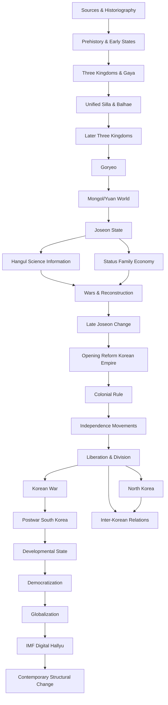

# Mục lục và Knowledge Dependency — Lịch sử Hàn Quốc

## Quy ước tên riêng Việt – Hàn – Anh

Trong toàn bộ library, tên người, địa danh, triều đại, công trình, sự kiện, tác phẩm và các danh xưng lịch sử quan trọng được ghi theo nguyên tắc **tiếng Việt trước, tiếng Hàn gốc thứ hai, English/Romanization thứ ba** ở lần xuất hiện đầu tiên trong mỗi tài liệu. Ví dụ: **Cung Cảnh Phúc (경복궁 / Gyeongbokgung Palace)**, **Đại vương Thế Tông (세종대왕 / King Sejong the Great)**, **Cao Ly (고려 / Goryeo)** và **Lý Thuấn Thần (이순신 / Yi Sun-sin)**.

Với tên lịch sử có Hán tự và đã có cách đọc Hán–Việt hữu ích, tài liệu ưu tiên dạng Việt hoá để người đọc hiểu nghĩa và liên hệ với sử liệu Việt Nam/Đông Á. Với tên người và địa danh hiện đại mà tiếng Việt không có tên dịch ổn định, tài liệu giữ romanization quốc tế làm tên chính, đồng thời ghi nguyên bản tiếng Hàn; không ép dịch Hán–Việt nếu cách gọi đó khiến tên trở nên xa lạ hoặc dễ gây nhầm. Tên file vẫn dùng tiếng Anh/romanization để URL, Git và cross-link ổn định.

Các tên có thể mang nhiều convention khác nhau trong tiếng Việt sẽ được ghi chú ở glossary. Mục tiêu của quy ước này không phải thay thế tên Hàn Quốc bằng tên Hán–Việt, mà giúp người đọc nhận ra rằng **Cung Cảnh Phúc – Gyeongbokgung – 경복궁** là cùng một thực thể.

## Bản đồ toàn bộ thư viện

```text
01 Cách đọc lịch sử
   ↓
02 Tiền sử & các nhà nước sớm
   ↓
03 Tam Quốc & Già Da (가야 / Gaya)
   ↓
04 Tân La Thống nhất (통일신라 / Unified Silla) & Bột Hải (발해 / Balhae)
   ↓
05 Late Tân La (신라 / Silla) & Later Three Kingdoms
   ↓
06 Goryeo hình thành
   ↓
07 Goryeo quân nhân & Mongol/Yuan
   ↓
08 nhà Triều Tiên (조선 / Joseon) đầu kỳ & nhà nước Nho giáo
   ├── 09 Hangul, khoa học & information system
   └── 10 xã hội, thân phận, gia đình, kinh tế
          ↓
11 Imjin/Manchu wars & tái thiết
   ↓
12 Joseon hậu kỳ: thương mại, Silhak, biến đổi xã hội
   ↓
13 Thế kỷ XIX: mở cửa → Donghak → Gabo → Korean Empire
   ↓
14 Thuộc địa Nhật 1910–1945
   └── 15 phong trào độc lập & Provisional Government
          ↓
16 Giải phóng, chia cắt, lập hai nhà nước 1945–1950
   ↓
17 Chiến tranh Triều Tiên (한국전쟁 / Korean War) 1950–1953
   ↓
18 Tái thiết & First Republic
   ↓
19 Developmental state & công nghiệp hoá 1961–1979
   ↓
20 Gwangju, phong trào dân chủ & 1987
   ↓
21 Dân chủ hoá, toàn cầu hoá 1987–1997
   ↓
22 IMF crisis, số hoá, Làn sóng Hàn Quốc (한류 / Hallyu, Korean Wave) 1997–2010s
   ↓
23 Những chuyển đổi cấu trúc 2010s–2020s
```

Một đường song song cần đọc cùng lịch sử miền Nam là:

```text
16 chia cắt
   ├── 24 Lịch sử Bắc Triều Tiên
   └── 25 Quan hệ liên Triều & Cold War system
```

Các trục xuyên thời gian:

```text
02 → 26 Social History
02 → 27 Economic History
02 → 28 Education / Writing / Science / Technology
01 → 29 Historiography / Collective Memory / Public History
```

## Vì sao dependency này không phải Beginner → Advanced

Ta cần biết Tam Quốc trước khi hiểu vì sao Goryeo tự đặt mình trong một legacy cụ thể; cần biết Goryeo trước khi hiểu những gì Joseon thay đổi; cần hiểu Joseon trước khi hiểu vì sao các cải cách cuối thế kỷ XIX đụng tới land, status, examination và ritual; cần hiểu colonial period trước khi hiểu division; và cần hiểu chiến tranh trước khi hiểu security state, nghĩa vụ quân sự và development model sau 1953.

Đây là dependency về **causal context (bối cảnh nhân quả / 인과적 맥락)**, không phải difficulty level.

## Mermaid knowledge graph



## Mental Model chung

> Hãy đọc mỗi giai đoạn như một hệ thống có “state”: population, territory, institutions, technology, resource flows, status rules và beliefs. Một sự kiện lớn tạo shock, nhưng state mới luôn kế thừa một phần data và constraint của state cũ. Vì vậy lịch sử có cả rupture lẫn continuity.

## Liên kết với bộ Văn hoá Hàn Quốc

Bộ này tập trung vào **historical process**. Khi cần giải thích sâu về `유교`, `눈치`, `정`, `회식`, `아파트`, `재벌`, `한류` hoặc đời sống đương đại, xem thư mục anh em [`../korean_culture/`](../korean_culture/).
