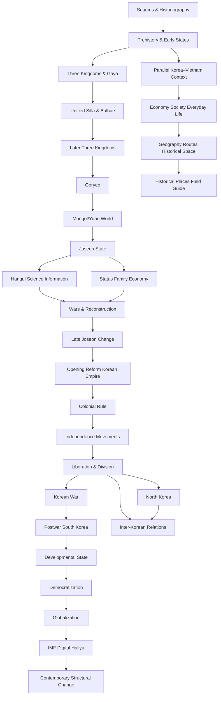

# Mục lục và Knowledge Dependency — Lịch sử Hàn Quốc

## Quy ước tên riêng Việt – Hàn – Anh

Trong toàn bộ library, tên người, địa danh, triều đại, công trình, sự kiện, tác phẩm và các danh xưng lịch sử quan trọng được ghi theo nguyên tắc **tiếng Việt trước, tiếng Hàn gốc thứ hai, English/Romanization thứ ba** ở lần xuất hiện đầu tiên trong mỗi tài liệu. Ví dụ: **Cung Cảnh Phúc (경복궁 / Gyeongbokgung Palace)**, **Đại vương Thế Tông (세종대왕 / King Sejong the Great)**, **Cao Ly (고려 / Goryeo)** và **Lý Thuấn Thần (이순신 / Yi Sun-sin)**.

Với tên lịch sử có Hán tự và đã có cách đọc Hán–Việt hữu ích, tài liệu ưu tiên dạng Việt hoá để người đọc hiểu nghĩa và liên hệ với sử liệu Việt Nam/Đông Á. Với tên người và địa danh hiện đại mà tiếng Việt không có tên dịch ổn định, tài liệu giữ romanization quốc tế làm tên chính, đồng thời ghi nguyên bản tiếng Hàn; không ép dịch Hán–Việt nếu cách gọi đó khiến tên trở nên xa lạ hoặc dễ gây nhầm. Tên file vẫn dùng tiếng Anh/romanization để URL, Git và cross-link ổn định.

Các tên có thể mang nhiều convention khác nhau trong tiếng Việt sẽ được ghi chú ở glossary. Mục tiêu của quy ước này không phải thay thế tên Hàn Quốc bằng tên Hán–Việt, mà giúp người đọc nhận ra rằng **Cung Cảnh Phúc – Gyeongbokgung – 경복궁** là cùng một thực thể.

## Bản đồ toàn bộ thư viện

```text
01 Cách đọc lịch sử
   ↓
02 Tiền sử & các nhà nước sớm
   ↓
03 Tam Quốc & Già Da (가야 / Gaya)
   ↓
04 Tân La Thống nhất (통일신라 / Unified Silla) & Bột Hải (발해 / Balhae)
   ↓
05 Late Tân La (신라 / Silla) & Later Three Kingdoms
   ↓
06 Goryeo hình thành
   ↓
07 Goryeo quân nhân & Mongol/Yuan
   ↓
08 nhà Triều Tiên (조선 / Joseon) đầu kỳ & nhà nước Nho giáo
   ├── 09 Hangul, khoa học & information system
   └── 10 xã hội, thân phận, gia đình, kinh tế
          ↓
11 Imjin/Manchu wars & tái thiết
   ↓
12 Joseon hậu kỳ: thương mại, Silhak, biến đổi xã hội
   ↓
13 Thế kỷ XIX: mở cửa → Donghak → Gabo → Korean Empire
   ↓
14 Thuộc địa Nhật 1910–1945
   └── 15 phong trào độc lập & Provisional Government
          ↓
16 Giải phóng, chia cắt, lập hai nhà nước 1945–1950
   ↓
17 Chiến tranh Triều Tiên (한국전쟁 / Korean War) 1950–1953
   ↓
18 Tái thiết & First Republic
   ↓
19 Developmental state & công nghiệp hoá 1961–1979
   ↓
20 Gwangju, phong trào dân chủ & 1987
   ↓
21 Dân chủ hoá, toàn cầu hoá 1987–1997
   ↓
22 IMF crisis, số hoá, Làn sóng Hàn Quốc (한류 / Hallyu, Korean Wave) 1997–2010s
   ↓
23 Những chuyển đổi cấu trúc 2010s–2020s
```

Một đường song song cần đọc cùng lịch sử miền Nam là:

```text
16 chia cắt
   ├── 24 Lịch sử Bắc Triều Tiên
   └── 25 Quan hệ liên Triều & Cold War system
```

Các trục xuyên thời gian:

```text
02 → 26 Social History
02 → 27 Economic History
02 → 28 Education / Writing / Science / Technology
01 → 29 Historiography / Collective Memory / Public History
30 → Timeline tra cứu mốc
31 → Glossary & reference map
32 → Naming / translation conventions
33 → Korea–Vietnam parallel timeline & context
34 → Historical places / field guide
35 → Economy / society / everyday life
36 → Geography / routes / historical space
37 → Historical case labs: sáu tình huống nối chronology, economy, Việt Nam và địa điểm
```

## Lớp đọc mới: timeline + kinh tế + Việt Nam + địa điểm + geography

Các file `33`–`36` tạo một **context layer** chạy song song toàn bộ `02`–`23`.

[`33_korea_vietnam_parallel_timeline_and_context.md`](33_korea_vietnam_parallel_timeline_and_context.md) đặt từng giai đoạn Hàn Quốc vào cùng trục thời gian với Việt Nam, đồng thời giải thích economy, state capacity, everyday context và transition. Comparison dùng để tạo mốc neo thời gian, không giả định hai xã hội có cùng trajectory.

[`34_historical_places_field_guide.md`](34_historical_places_field_guide.md) nối từng giai đoạn với physical evidence: dolmen, Gyeongju, Baekje Historic Areas, Gaya tumuli, Ganghwa, Haeinsa, Gyeongbokgung, Hwaseong, Deoksugung, Seodaemun Prison, DMZ, Gwangju, Ulsan/Pohang và urban landscape hiện đại. Mục tiêu là biết **đến đó thì phải nhìn gì và câu hỏi lịch sử nào có thể đọc ra từ không gian**.

[`35_economy_society_everyday_life_by_period.md`](35_economy_society_everyday_life_by_period.md) theo dõi production, land, tax, trade, labor, household, class/status, industrialization và đời sống thường ngày qua từng thời kỳ. Nó đóng vai trò bridge dễ đọc trước khi đi sâu vào các chapter thematic như `26` và `27`.

[`36_geography_routes_and_historical_space.md`](36_geography_routes_and_historical_space.md) giải thích vì sao Han River basin, mountain pass, coast, capital, port, railway và logistics làm một nơi trở thành strategic node. File này giúp trả lời câu hỏi mà timeline thường bỏ qua: **vì sao sự kiện lại xảy ra ở chính địa điểm đó?**

Đường đọc khuyến nghị từ nay là:

```text
chapter chronology 02–23
        ↓
33: cùng lúc Việt Nam ở đâu + context khu vực
        ↓
35: economy và người bình thường sống thế nào
        ↓
36: geography/logistics khiến system vận hành ở đâu và vì sao
        ↓
34: dấu vết vật chất hôm nay nằm ở đâu
        ↓
37: luyện đọc bằng tình huống và câu hỏi nhân quả
        ↓
26–29: thematic deep dive khi cần
```

Không bắt buộc mở các file cùng lúc. Mỗi chapter chính vẫn phải tự giải thích được vấn đề; `33`–`36` chỉ tăng chiều sâu và giúp xây mental map.

## Vì sao dependency này không phải Beginner → Advanced

Ta cần biết Tam Quốc trước khi hiểu vì sao Goryeo tự đặt mình trong một legacy cụ thể; cần biết Goryeo trước khi hiểu những gì Joseon thay đổi; cần hiểu Joseon trước khi hiểu vì sao các cải cách cuối thế kỷ XIX đụng tới land, status, examination và ritual; cần hiểu colonial period trước khi hiểu division; và cần hiểu chiến tranh trước khi hiểu security state, nghĩa vụ quân sự và development model sau 1953.

Đây là dependency về **causal context (bối cảnh nhân quả / 인과적 맥락)**, không phải difficulty level.

## Mermaid knowledge graph


```mermaid
graph TD
    A[Sources & Historiography] --> B[Prehistory & Early States]
    B --> C[Three Kingdoms & Gaya]
    C --> D[Unified Silla & Balhae]
    D --> E[Later Three Kingdoms]
    E --> F[Goryeo]
    F --> G[Mongol/Yuan World]
    G --> H[Joseon State]
    H --> I[Hangul Science Information]
    H --> J[Status Family Economy]
    I --> K[Wars & Reconstruction]
    J --> K
    K --> L[Late Joseon Change]
    L --> M[Opening Reform Korean Empire]
    M --> N[Colonial Rule]
    N --> O[Independence Movements]
    O --> P[Liberation & Division]
    P --> Q[Korean War]
    P --> R[North Korea]
    Q --> S[Postwar South Korea]
    S --> T[Developmental State]
    T --> U[Democratization]
    U --> V[Globalization]
    V --> W[IMF Digital Hallyu]
    W --> X[Contemporary Structural Change]
    P --> Y[Inter-Korean Relations]
    R --> Y
    B --> Z[Parallel Korea–Vietnam Context]
    Z --> ZA[Economy Society Everyday Life]
    ZA --> ZB[Geography Routes Historical Space]
    ZB --> ZC[Historical Places Field Guide]
```

## Mental Model chung

> Hãy đọc mỗi giai đoạn như một hệ thống có “state”: population, territory, institutions, technology, resource flows, status rules và beliefs. Một sự kiện lớn tạo shock, nhưng state mới luôn kế thừa một phần data và constraint của state cũ. Vì vậy lịch sử có cả rupture lẫn continuity.

Với mỗi giai đoạn, thêm năm câu hỏi bắt buộc: **mốc thời gian nào là anchor; economy tạo và chuyển surplus ra sao; cùng lúc Việt Nam đang ở phase nào; geography/logistics tạo constraint nào; và ngày nay còn có thể nhìn thấy system đó ở địa điểm/di tích nào?** Nếu một lời giải thích chỉ trả lời “ai lên ngôi, ai đánh ai” mà không trả lời được các câu này, nó chưa đủ cho mục tiêu của library.

## Liên kết với bộ Văn hoá Hàn Quốc

Bộ này tập trung vào **historical process**. Khi cần giải thích sâu về `유교`, `눈치`, `정`, `회식`, `아파트`, `재벌`, `한류` hoặc đời sống đương đại, xem thư mục anh em [`../korean_culture/`](../korean_culture/).
