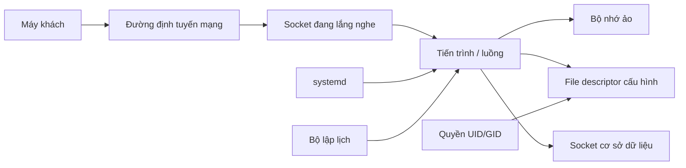

# Mô hình tư duy hệ thống Linux và các kết nối kiến thức

Chương này không phải bản tóm tắt câu lệnh. Mục tiêu là nối các lớp trừu tượng đã học thành một **đồ thị kiến thức (knowledge graph)** để khi gặp vấn đề mới, người đọc có thể suy luận từ mô hình thay vì nhớ một công thức xử lý có sẵn.

## Một yêu cầu web đi qua Linux như thế nào?

Giả sử một dịch vụ Java nhận yêu cầu TCP trên cổng 8080 và đọc cấu hình cơ sở dữ liệu từ đĩa.

Ứng dụng tồn tại dưới dạng một **tiến trình (process)** có UID/GID, không gian địa chỉ ảo, nhiều luồng và các bộ mô tả tệp. Systemd có thể là trình quản lý dịch vụ đã tạo tiến trình với biến môi trường, thư mục làm việc và giới hạn tài nguyên cụ thể. Khi JVM đọc cấu hình, đường dẫn được hệ thống tệp phân giải qua các thư mục tới `inode`; kernel kiểm tra thông tin xác thực và quyền của tiến trình rồi trả về một file descriptor. Khi ứng dụng lắng nghe cổng 8080, ngăn xếp mạng của kernel quản lý socket; tiến trình cũng giữ socket thông qua descriptor. Khi yêu cầu tới, bộ lập lịch cấp thời gian CPU cho luồng xử lý, dữ liệu đi qua bộ đệm socket và ứng dụng có thể gọi cơ sở dữ liệu qua một socket khác.

Một việc tưởng đơn giản như "Spring Boot xử lý HTTP" thực ra phụ thuộc vào nhiều lớp trừu tượng của hệ điều hành:



Khi yêu cầu thất bại, đồ thị này tạo ra danh sách các lớp có thể quan sát và kiểm tra.

## Tên và đối tượng

Một quy luật xuyên suốt Linux là **tên không phải bản thân đối tượng**.

Đường dẫn là tên dẫn tới `inode` hoặc đối tượng trong hệ thống tệp. `PID` là mã định danh tạm thời dẫn tới một tiến trình. Hostname được DNS phân giải thành địa chỉ. Tên dịch vụ trong systemd dẫn tới cấu hình unit. Số cổng chỉ là một phần của điểm cuối socket, không phải bản thân ứng dụng.

Khi đồng nhất tên với đối tượng, việc xử lý sự cố dễ đi sai hướng. "Không còn thấy tệp trong `ls`" không chứng minh đối tượng đã được thu hồi. "PID 1234" từ 10 phút trước không chắc vẫn là tiến trình cũ. `api.example.com` có thể được phân giải khác nhau tùy ngữ cảnh DNS.

Mô hình chung là luôn hỏi: **bước phân giải nào biến tên thành đối tượng hoặc trạng thái hiện tại?**

## Tham chiếu và vòng đời

Nhiều đối tượng Linux tồn tại dựa trên tham chiếu và vòng đời. Một file descriptor đang mở có thể giữ đối tượng tệp sống sau khi tên bị `unlink`. Socket tồn tại theo vòng đời tiến trình và file descriptor. Tiến trình con kết thúc cần tiến trình cha thu nhận trạng thái. Mount giữ một hệ thống tệp gắn trong namespace.

Khái niệm **tham chiếu và vòng đời (reference/lifetime)** có mối liên hệ mạnh với lập trình: garbage collection, reference counting, quyền sở hữu tài nguyên và RAII/`try-with-resources` đều giải quyết các biến thể của câu hỏi "tài nguyên này vẫn đang được ai giữ?".

## Cô lập là thay đổi góc nhìn và quyền

Quyền người dùng giới hạn thao tác dựa trên danh tính. Bộ nhớ ảo cung cấp cho tiến trình không gian địa chỉ riêng. Namespace cho tiến trình trong container góc nhìn riêng về PID, mạng hoặc mount. Cgroup giới hạn và thống kê mức sử dụng tài nguyên.

Sự cô lập không phải một cơ chế duy nhất. Nó là sự kết hợp của nhiều ranh giới:

```text
đặc quyền CPU
+ bộ nhớ ảo
+ thông tin xác thực / quyền truy cập
+ namespace
+ cgroup
+ capabilities
+ MAC / seccomp
```

Đó là lý do câu "ứng dụng chạy trong container" chưa đủ để trả lời một câu hỏi bảo mật.

## Khả năng kết hợp thông qua file descriptor

Tệp thông thường, pipe, terminal và socket khác nhau về quy tắc hoạt động, nhưng nhiều thao tác hội tụ ở lớp trừu tượng file descriptor. Shell tận dụng điểm chung này để chuyển hướng và tạo pipeline mà chương trình không cần biết trước đích cụ thể.

Đây là một bài học rộng hơn trong kỹ nghệ phần mềm: **giao diện nhỏ, ổn định làm tăng khả năng kết hợp**. Giao diện I/O của Unix là một ví dụ lịch sử rất rõ cho nguyên tắc này.

## Trạng thái và bằng chứng

Máy chủ là một hệ thống trạng thái luôn thay đổi. `ps`, `ss`, `df`, `free`, `journalctl` là những công cụ quan sát các chiều khác nhau. `kill`, `rm`, `chmod`, `restart` là những thao tác làm thay đổi trạng thái.

Xử lý sự cố tốt ưu tiên quan sát có giá trị thông tin cao trước khi can thiệp. Đây là một ứng dụng của suy luận theo phương pháp khoa học:

```text
quan sát -> giả thuyết -> phép kiểm tra phân biệt -> can thiệp -> xác minh
```

Cùng cách suy nghĩ này áp dụng được cho gỡ lỗi mã nguồn, hiệu năng truy vấn cơ sở dữ liệu và hệ thống phân tán.

## Dung lượng phục vụ và hàng đợi

Hàng đợi tiến trình chờ CPU, hàng đợi I/O, hàng đợi accept của TCP, thread pool và connection pool của cơ sở dữ liệu đều là các biến thể của cùng một ý tưởng hệ thống: **tốc độ công việc đi vào gặp một năng lực phục vụ hữu hạn**.

Khi tốc độ đến vượt tốc độ xử lý đủ lâu, hàng đợi tăng, độ trễ tăng và cuối cùng timeout hoặc loại bỏ công việc xảy ra. Đây là mối liên hệ với **lý thuyết hàng đợi (queueing theory)**.

Định luật Little trong một hệ thống gần trạng thái ổn định:

\[
L = \lambda W
\]

Trong đó `L` là số lượng phần tử trung bình trong hệ thống, `λ` là tốc độ đến hoặc thông lượng, còn `W` là thời gian trung bình một phần tử ở trong hệ thống. Công thức này không phải công cụ chẩn đoán trực tiếp cho mọi sự cố, nhưng cung cấp một hiểu biết quan trọng: nếu throughput gần như không đổi mà latency tăng, số công việc đang tồn tại đồng thời trong hệ thống thường cũng tăng.

Cần nhớ giả định trạng thái ổn định và ranh giới đo phải được xác định rõ; một đợt tăng tải ngắn trên production có thể chưa thỏa các giả định đó.

## Cache là sự đánh đổi giữa thời gian, không gian và độ mới

Page cache dùng RAM để giảm I/O đĩa. Cache DNS giảm thời gian phân giải nhưng làm thay đổi không lan truyền tức thời. Cache CPU và TLB giảm chi phí truy cập hoặc dịch địa chỉ. Cache ở ứng dụng giảm tải phía sau nhưng tạo bài toán hết hạn và làm mới dữ liệu.

Mô hình chung là cache đổi **không gian lưu trữ và độ phức tạp nhất quán** để lấy **độ trễ thấp hơn hoặc thông lượng cao hơn**. Khi gỡ lỗi, hãy hỏi cache nằm ở lớp nào, cơ chế hết hạn là gì và dữ liệu được làm mới theo quy tắc nào.

## Ánh xạ gián tiếp tạo linh hoạt nhưng thêm lớp

Bộ nhớ ảo ánh xạ địa chỉ ảo → vật lý. Hệ thống tệp ánh xạ đường dẫn → `inode`/dữ liệu. DNS ánh xạ tên → IP. Symlink ánh xạ tên → đường dẫn đích. LVM ánh xạ volume logic → lưu trữ vật lý. Mạng container ánh xạ giao diện ảo → mạng host.

**Ánh xạ gián tiếp (indirection)** tạo sự linh hoạt nhưng đồng thời thêm một lớp phân giải có thể thất bại. Người xử lý sự cố có kinh nghiệm thường nhanh hơn vì biết các điểm ánh xạ nào cần được kiểm tra.

## Trạng thái mong muốn và trạng thái thực tế

Tệp cấu hình, unit systemd, container image hoặc mã hạ tầng mô tả một dạng **trạng thái mong muốn (desired state)**. Tiến trình, socket và mount đang tồn tại là **trạng thái khi đang chạy (runtime state)**. Hai thứ có thể khác nhau.

Sửa `application.yml` không có nghĩa JVM đang chạy đã nạp lại. Sửa unit systemd không có nghĩa systemd đã chạy `daemon-reload`. Xây image mới không có nghĩa container hiện tại đang dùng image mới.

Việc xác minh vận hành phải kiểm tra **trạng thái thực tế đang có hiệu lực**, không chỉ nhìn tệp cấu hình.

## Kết nối với độ tin cậy

Một hệ thống đáng tin không phải là hệ thống "không bao giờ lỗi", mà là hệ thống có các kiểu thất bại được giới hạn, có thể quan sát và có thể phục hồi. Các cơ chế Linux cung cấp những khối xây dựng; kiến trúc quyết định cách kết hợp chúng.

Chính sách restart của systemd, lưu giữ nhật ký, giới hạn tài nguyên, đặc quyền tối thiểu, health check và backup đều chỉ là cơ chế. Chúng chỉ có giá trị khi phù hợp với mô hình lỗi thực tế của hệ thống.

## Mô hình tư duy cuối cùng

Khi SSH vào một máy chủ Linux, có thể nhìn hệ thống qua sáu câu hỏi:

1. **Danh tính (Identity)** — tiến trình hoặc người dùng nào đang thực hiện thao tác?
2. **Vùng tên (Namespace)** — tên, đường dẫn, PID hoặc địa chỉ đang được phân giải trong ngữ cảnh nào?
3. **Tài nguyên (Resource)** — CPU, bộ nhớ, lưu trữ, socket hay file descriptor nào liên quan?
4. **Chính sách (Policy)** — quyền truy cập, giới hạn, firewall, trình quản lý dịch vụ hay chính sách bảo mật nào đang áp dụng?
5. **Vòng đời (Lifecycle)** — đối tượng được tạo, giữ tham chiếu, nạp lại, khởi động lại và giải phóng như thế nào?
6. **Bằng chứng (Evidence)** — quan sát nào thật sự chứng minh giả thuyết thay vì chỉ cho thấy tương quan?

Nếu trả lời được sáu câu hỏi này, phần lớn câu lệnh trong [tài liệu tham chiếu](../reference/putty_ssh_linux_server_commands.md) sẽ trở thành công cụ tự nhiên thay vì một danh sách phải học thuộc.