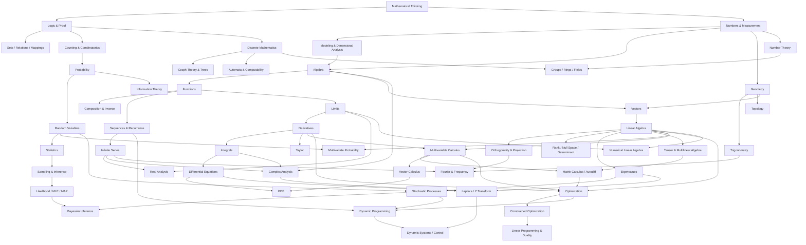

# Master Knowledge Book — Toán học

`mathematics/` là Mathematics Knowledge Library canonical của repository. Thư viện được tổ chức theo **conceptual dependency**, không theo Beginner → Intermediate → Advanced và không nhằm trở thành cheat sheet công thức.

Triết lý xuyên suốt:

> Understanding > Memorization  
> Reasoning > Formula  
> Connection > Isolated Facts  
> First Principles > Rules

Mỗi chapter cố gắng đi theo flow tự nhiên: vấn đề cần giải quyết → intuition → formalism → derivation/proof idea → assumptions/domain → worked example → failure modes → connections → mental model.

## Trạng thái canonical

Tính đến final consistency audit ngày **2026-09-22**, library giữ nguyên **87 topic files**. Các vòng quality/depth audit từ Round 5 đến Round 11 đã lần lượt nâng những node có dependency centrality cao: logic/proof, functions, algebra, geometry, linear algebra, calculus, probability/statistics, Bayesian reasoning, discrete mathematics, graph theory, information theory, numerical methods, optimization, Fourier/Laplace, stochastic processes, matrix calculus/autodiff và dynamic programming/control.

Vòng finalization không thêm chapter mới. Trọng tâm là consistency: prerequisite, notation, glossary, clickable internal links, dependency graph, scope boundary và branch canonicalization. Chi tiết nằm tại [Coverage & Finalization Audit](./COVERAGE_AUDIT.md).

## Cách sử dụng

Không bắt buộc đọc tuần tự toàn bộ. Nếu một concept dùng thuật ngữ chưa chắc, hãy quay về prerequisite gần nhất trong các learning routes bên dưới. Mỗi chapter có thể đọc độc lập trong phạm vi hợp lý, nhưng việc học theo dependency giúp giảm black box và tránh học công thức trước khi hiểu structure.

## Table of Contents

### 00 — Foundations

- [Tư duy toán học và First Principles](./00_foundations/00_mathematical_thinking.md)
- [Logic và chứng minh](./00_foundations/01_logic_and_proof.md)
- [Tập hợp, quan hệ và ánh xạ](./00_foundations/02_sets_relations_and_mappings.md)
- [Số và các hệ số](./00_foundations/03_numbers_and_number_systems.md)
- [Đo lường, đơn vị và ước lượng](./00_foundations/04_measurement_units_and_estimation.md)
- [Mô hình toán học, phân tích thứ nguyên và scaling](./00_foundations/05_mathematical_modeling_dimensional_analysis_and_scaling.md)

### 01 — Algebra

- [Ngôn ngữ đại số: biến, biểu thức và phép biến đổi](./01_algebra/00_algebraic_language.md)
- [Phương trình và bất phương trình](./01_algebra/01_equations_and_inequalities.md)
- [Tỉ số, tỉ lệ và phần trăm](./01_algebra/02_ratio_proportion_percentage.md)
- [Lũy thừa, căn và logarithm](./01_algebra/03_powers_roots_and_logarithms.md)
- [Đa thức và phân tích nhân tử](./01_algebra/04_polynomials_and_factorization.md)
- [Số phức: từ nghiệm phương trình đến rotation](./01_algebra/05_complex_numbers.md)
- [Biểu thức hữu tỉ, miền xác định và tiệm cận](./01_algebra/06_rational_expressions_domain_and_asymptotes.md)

### 02 — Functions

- [Hàm số: từ quan hệ đến quy tắc biến đổi](./02_functions/00_function_concept.md)
- [Mô hình tuyến tính và bậc hai](./02_functions/01_linear_and_quadratic_models.md)
- [Hàm mũ và logarithm: toán học của tăng trưởng theo tỷ lệ](./02_functions/02_exponential_and_logarithmic_models.md)
- [Dãy, chuỗi và recurrence](./02_functions/03_sequences_series_and_recurrence.md)
- [Hợp hàm, hàm ngược và phép biến đổi hàm](./02_functions/04_composition_inverse_and_function_transformations.md)
- [Quan hệ ẩn, tham số và tọa độ cực](./02_functions/05_parametric_polar_and_implicit_relations.md)

### 03 — Geometry & Trigonometry

- [Hình học Euclid: điểm, đường, góc và cấu trúc không gian](./03_geometry_trigonometry/00_euclidean_geometry.md)
- [Hình học tọa độ: biến không gian thành algebra](./03_geometry_trigonometry/01_coordinate_geometry.md)
- [Định lý Pythagoras và ý tưởng khoảng cách](./03_geometry_trigonometry/02_pythagorean_theorem_and_distance.md)
- [Đồng dạng, diện tích, thể tích và scaling laws](./03_geometry_trigonometry/03_similarity_area_volume_and_scaling.md)
- [Lượng giác: từ tam giác đến rotation, phase và wave](./03_geometry_trigonometry/04_trigonometry.md)
- [Phép biến hình và đối xứng](./03_geometry_trigonometry/05_transformations_and_symmetry.md)
- [Đường tròn, conic sections và quỹ tích](./03_geometry_trigonometry/06_circles_conics_and_loci.md)
- [Đồng nhất thức lượng giác, phương trình lượng giác và harmonics](./03_geometry_trigonometry/07_trigonometric_identities_equations_and_harmonics.md)
- [Nhập môn topology: continuity, connectivity và shape](./03_geometry_trigonometry/08_topology_continuity_connectivity.md)

### 04 — Vectors & Linear Algebra

- [Vector: representation, magnitude và direction](./04_vectors_linear_algebra/00_vectors.md)
- [Ma trận và hệ phương trình tuyến tính](./04_vectors_linear_algebra/01_matrices_and_linear_systems.md)
- [Phép biến đổi tuyến tính](./04_vectors_linear_algebra/02_linear_transformations.md)
- [Không gian vector, cơ sở và số chiều](./04_vectors_linear_algebra/03_vector_spaces_basis_dimension.md)
- [Eigenvalues và eigenvectors: natural directions của transformation](./04_vectors_linear_algebra/04_eigenvalues_and_eigenvectors.md)
- [Least squares, SVD và matrix decompositions](./04_vectors_linear_algebra/05_least_squares_svd_and_decompositions.md)
- [Inner product, trực giao và phép chiếu](./04_vectors_linear_algebra/06_inner_product_orthogonality_and_projection.md)
- [Determinant, rank, null space và nghịch đảo ma trận](./04_vectors_linear_algebra/07_determinant_rank_nullspace_and_inverse.md)
- [Tensor và multilinear algebra](./04_vectors_linear_algebra/08_tensors_and_multilinear_algebra.md)
- [Matrix calculus, Jacobian, Hessian và automatic differentiation](./04_vectors_linear_algebra/09_matrix_calculus_jacobian_hessian_and_autodiff.md)

### 05 — Calculus & Analysis

- [Giới hạn và tính liên tục: làm chính xác ý tưởng “tiến gần”](./05_calculus/00_limits_and_continuity.md)
- [Đạo hàm: tốc độ thay đổi cục bộ](./05_calculus/01_derivatives.md)
- [Ứng dụng của đạo hàm: shape, approximation và optimization](./05_calculus/02_derivative_applications.md)
- [Tích phân: accumulation, area, expectation và tổng liên tục](./05_calculus/03_integrals_and_accumulation.md)
- [Giải tích nhiều biến: gradient, Jacobian và tối ưu trong nhiều chiều](./05_calculus/04_multivariable_calculus.md)
- [Phương trình vi phân và hệ động lực](./05_calculus/05_differential_equations.md)
- [Giải tích số: khi máy tính phải xấp xỉ calculus](./05_calculus/06_numerical_calculus.md)
- [Chuỗi vô hạn, power series và sự hội tụ](./05_calculus/07_infinite_series_power_series_and_convergence.md)
- [Taylor approximation: từ đạo hàm đến mô hình cục bộ nhiều bậc](./05_calculus/08_taylor_series_and_local_approximation.md)
- [Vector calculus: gradient, divergence, curl và tích phân trên đường/mặt](./05_calculus/09_vector_calculus.md)
- [Nhập môn PDE: fields, heat, wave và boundary conditions](./05_calculus/10_partial_differential_equations_and_fields_intro.md)
- [Real analysis: giới hạn, hội tụ và nền tảng chặt chẽ của calculus](./05_calculus/11_real_analysis_convergence_and_rigor.md)
- [Complex analysis: analytic functions, contour integrals và residues](./05_calculus/12_complex_analysis_and_analytic_functions.md)

### 06 — Probability & Statistics

- [Đếm và tổ hợp](./06_probability_statistics/00_counting_and_combinatorics.md)
- [Nền tảng xác suất: mô hình hóa bất định](./06_probability_statistics/01_probability_foundations.md)
- [Xác suất có điều kiện và Bayes: cập nhật uncertainty khi information thay đổi](./06_probability_statistics/02_conditional_probability_and_bayes.md)
- [Biến ngẫu nhiên và phân phối](./06_probability_statistics/03_random_variables_and_distributions.md)
- [Kỳ vọng, phương sai và các luật giới hạn](./06_probability_statistics/04_expectation_variance_and_limit_laws.md)
- [Thống kê mô tả và suy luận](./06_probability_statistics/05_descriptive_and_inferential_statistics.md)
- [Hồi quy và tương quan](./06_probability_statistics/06_regression_and_correlation.md)
- [Lấy mẫu, ước lượng, confidence interval và hypothesis testing](./06_probability_statistics/07_sampling_estimation_confidence_and_hypothesis_testing.md)
- [Covariance, xác suất nhiều biến và multivariate Gaussian](./06_probability_statistics/08_covariance_multivariate_probability_and_gaussian.md)
- [Các phân phối xác suất thường gặp và vì sao chúng xuất hiện](./06_probability_statistics/09_common_distributions_and_when_they_arise.md)
- [Likelihood, MLE, MAP và chọn mô hình từ dữ liệu](./06_probability_statistics/10_likelihood_mle_map_and_model_selection.md)
- [Stochastic processes, Markov chains và time series](./06_probability_statistics/11_stochastic_processes_markov_chains_and_time_series.md)
- [Bayesian inference, posterior predictive và hierarchical models](./06_probability_statistics/12_bayesian_inference_posterior_predictive_and_hierarchical_models.md)

### 07 — Discrete Mathematics & Theoretical CS

- [Lý thuyết đồ thị: quan hệ, đường đi và cấu trúc mạng](./07_discrete_cs/00_graph_theory.md)
- [Độ phức tạp thuật toán và ý nghĩa của logarithm](./07_discrete_cs/01_algorithms_complexity_and_logarithms.md)
- [Recurrence, induction và đệ quy trong thuật toán](./07_discrete_cs/02_recurrence_and_induction_in_algorithms.md)
- [Boolean algebra và logic số](./07_discrete_cs/03_boolean_algebra_and_digital_logic.md)
- [Lý thuyết số và số học modulo](./07_discrete_cs/04_number_theory_and_modular_arithmetic.md)
- [Cây, thứ tự bộ phận và lattice](./07_discrete_cs/05_trees_posets_and_lattices.md)
- [Information theory, entropy và coding](./07_discrete_cs/06_information_theory_and_coding.md)
- [Automata, formal languages và computability](./07_discrete_cs/07_automata_formal_languages_and_computability.md)
- [Cấu trúc đại số: group, ring và field](./07_discrete_cs/08_groups_rings_fields_and_algebraic_structures.md)

### 08 — Optimization & Numerical Mathematics

- [Tối ưu hóa: mục tiêu, ràng buộc và trade-off](./08_optimization_numerical/00_optimization.md)
- [Gradient descent, learning rate và geometry của optimization](./08_optimization_numerical/01_gradient_descent_and_convexity.md)
- [Toán số: approximation, conditioning và stability trên máy tính hữu hạn](./08_optimization_numerical/02_numerical_methods_and_error.md)
- [Tối ưu có ràng buộc, Lagrange multipliers và KKT](./08_optimization_numerical/03_constrained_optimization_lagrange_and_kkt.md)
- [Root finding, interpolation và numerical linear algebra](./08_optimization_numerical/04_root_finding_interpolation_and_numerical_linear_algebra.md)
- [Linear programming, duality và simplex](./08_optimization_numerical/05_linear_programming_duality_and_simplex.md)
- [Dynamic programming, Bellman equation và optimal control](./08_optimization_numerical/06_dynamic_programming_bellman_and_optimal_control.md)

### 09 — Knowledge Connections

- [Rate, Change và Accumulation](./09_connections/00_rate_change_and_accumulation.md)
- [Distance, Similarity và Projection](./09_connections/01_distance_similarity_and_projection.md)
- [Xác suất, thông tin và entropy](./09_connections/02_uncertainty_information_and_entropy.md)
- [Toán trong AI, Data và Software Engineering](./09_connections/03_math_for_ai_data_and_software.md)
- [Toán trong Finance, công việc và đời sống](./09_connections/04_math_for_finance_work_and_daily_life.md)
- [Fourier, Signals và Frequency](./09_connections/05_fourier_signals_and_frequency.md)
- [Laplace transform, Z-transform và Dynamic Systems](./09_connections/06_laplace_z_transform_and_dynamic_systems.md)

### Reference & Editorial

- [Glossary Việt / English / 한국어](./10_glossary.md)
- [Coverage & Finalization Audit](./COVERAGE_AUDIT.md)
- [Editorial Standard](./EDITORIAL_STANDARD.md)
- [Quality Audit Round 5](./QUALITY_AUDIT_ROUND5.md)
- [Quality Audit Round 7](./QUALITY_AUDIT_ROUND7.md)
- [Quality Audit Round 8](./QUALITY_AUDIT_ROUND8.md)
- [Quality Audit Round 9](./QUALITY_AUDIT_ROUND9.md)
- [Quality Audit Round 10](./QUALITY_AUDIT_ROUND10.md)
- [Quality Audit Round 11](./QUALITY_AUDIT_ROUND11.md)

## Learning routes có thể click trực tiếp

### Computer Science & Algorithms

[Logic & Proof](./00_foundations/01_logic_and_proof.md) → [Sets, Relations & Mappings](./00_foundations/02_sets_relations_and_mappings.md) → [Functions](./02_functions/00_function_concept.md) → [Recurrence & Induction](./07_discrete_cs/02_recurrence_and_induction_in_algorithms.md) → [Graph Theory](./07_discrete_cs/00_graph_theory.md) → [Algorithmic Complexity](./07_discrete_cs/01_algorithms_complexity_and_logarithms.md) → [Automata & Computability](./07_discrete_cs/07_automata_formal_languages_and_computability.md).

### AI / Machine Learning / Data Engineering

[Functions](./02_functions/00_function_concept.md) → [Vectors](./04_vectors_linear_algebra/00_vectors.md) → [Matrices](./04_vectors_linear_algebra/01_matrices_and_linear_systems.md) → [Linear Transformations](./04_vectors_linear_algebra/02_linear_transformations.md) → [Least Squares & SVD](./04_vectors_linear_algebra/05_least_squares_svd_and_decompositions.md) → [Multivariable Calculus](./05_calculus/04_multivariable_calculus.md) → [Matrix Calculus & Autodiff](./04_vectors_linear_algebra/09_matrix_calculus_jacobian_hessian_and_autodiff.md) → [Probability](./06_probability_statistics/01_probability_foundations.md) → [Statistics](./06_probability_statistics/05_descriptive_and_inferential_statistics.md) → [Optimization](./08_optimization_numerical/00_optimization.md) → [Math for AI/Data/Software](./09_connections/03_math_for_ai_data_and_software.md).

### Physics & Engineering

[Measurement](./00_foundations/04_measurement_units_and_estimation.md) → [Modeling & Dimensional Analysis](./00_foundations/05_mathematical_modeling_dimensional_analysis_and_scaling.md) → [Geometry](./03_geometry_trigonometry/00_euclidean_geometry.md) → [Trigonometry](./03_geometry_trigonometry/04_trigonometry.md) → [Vectors](./04_vectors_linear_algebra/00_vectors.md) → [Derivatives](./05_calculus/01_derivatives.md) → [Integrals](./05_calculus/03_integrals_and_accumulation.md) → [Differential Equations](./05_calculus/05_differential_equations.md) → [Vector Calculus](./05_calculus/09_vector_calculus.md) → [PDE](./05_calculus/10_partial_differential_equations_and_fields_intro.md) → [Fourier](./09_connections/05_fourier_signals_and_frequency.md).

### Signal, Systems & Control

[Trigonometry](./03_geometry_trigonometry/04_trigonometry.md) → [Complex Numbers](./01_algebra/05_complex_numbers.md) → [Eigenvalues](./04_vectors_linear_algebra/04_eigenvalues_and_eigenvectors.md) → [Differential Equations](./05_calculus/05_differential_equations.md) → [Fourier](./09_connections/05_fourier_signals_and_frequency.md) → [Laplace/Z-transform](./09_connections/06_laplace_z_transform_and_dynamic_systems.md) → [Bellman & Optimal Control](./08_optimization_numerical/06_dynamic_programming_bellman_and_optimal_control.md).

### Finance / Investing

[Ratio & Percentage](./01_algebra/02_ratio_proportion_percentage.md) → [Exponential & Logarithm](./02_functions/02_exponential_and_logarithmic_models.md) → [Probability](./06_probability_statistics/01_probability_foundations.md) → [Expectation & Variance](./06_probability_statistics/04_expectation_variance_and_limit_laws.md) → [Covariance](./06_probability_statistics/08_covariance_multivariate_probability_and_gaussian.md) → [Regression](./06_probability_statistics/06_regression_and_correlation.md) → [Stochastic Processes](./06_probability_statistics/11_stochastic_processes_markov_chains_and_time_series.md) → [Optimization](./08_optimization_numerical/00_optimization.md) → [Math for Finance & Daily Life](./09_connections/04_math_for_finance_work_and_daily_life.md).

### Software Engineering & production reasoning

[Logic & Proof](./00_foundations/01_logic_and_proof.md) → [Functions & Contracts](./02_functions/00_function_concept.md) → [Composition & Inverse](./02_functions/04_composition_inverse_and_function_transformations.md) → [Graphs](./07_discrete_cs/00_graph_theory.md) → [Complexity](./07_discrete_cs/01_algorithms_complexity_and_logarithms.md) → [Probability & Calibration](./06_probability_statistics/02_conditional_probability_and_bayes.md) → [Numerical Stability](./08_optimization_numerical/02_numerical_methods_and_error.md) → [Math for AI/Data/Software](./09_connections/03_math_for_ai_data_and_software.md).

## Knowledge Dependency

Mermaid ở trên chỉ dùng để nhìn topology. Khi cần navigation trên website, dùng các **Learning routes có thể click trực tiếp** hoặc links nằm trong từng chapter.

## Connections sang các Knowledge Library khác

- [Computer Science](../computer_science/README.md): logic/proof, graphs, automata, complexity, numerical/performance reasoning và system design.
- [Physics](../physics/README.md): measurement, vectors, calculus, differential equations, fields, Fourier và modeling assumptions.
- [Investing](../investing/README.md): compounding, probability, statistics, covariance, regression, optimization và stochastic reasoning.
- AI/ML, Data Engineering và Software Engineering được nối qua [Math for AI, Data and Software](./09_connections/03_math_for_ai_data_and_software.md); chapter này giữ boundary toán học, còn implementation thuộc các library kỹ thuật tương ứng.

## Những mental models xuyên suốt

**Representation.** Cùng một object có thể được nhìn bằng formula, graph, vector, matrix, tensor, basis coefficients, probability distribution hoặc code. Representation tốt biến problem khó thành structure quen thuộc.

**Local → Global.** Derivative là local rate nhưng integration tạo global accumulation; differential equation là local law nhưng sinh global trajectory; transition rule của Markov chain tạo long-run distribution.

**Linearization.** Linear algebra quan trọng không phải vì mọi hệ đều linear, mà vì nonlinear systems thường được approximate locally bằng linear maps: Jacobian, Hessian, Taylor expansion và eigenmodes.

**Uncertainty as structure.** Probability cung cấp algebra để model uncertainty, update information và ra quyết định khi data không đủ chắc chắn.

**Optimization as choice under structure.** Gradient methods dùng local geometry, linear programming dùng convex polyhedra/duality, dynamic programming dùng optimal substructure và Bellman recursion.

**Change of representation.** Fourier, Laplace/Z-transform, eigenbasis, SVD và complex representation cùng theo một strategy: chuyển problem sang coordinates/domain nơi operations trở nên đơn giản hơn.

## Scope boundary

Library này chủ động không thêm measure theory/Lebesgue integration, functional analysis, differential geometry/manifolds, stochastic calculus, advanced PDE hoặc category theory chỉ để tăng coverage. Những domain đó chỉ nên xuất hiện khi một dependency thực tế của repository cần đến chúng.

## Trạng thái audit

[Coverage & Finalization Audit](./COVERAGE_AUDIT.md) là source of truth cho trạng thái 87 chapter, branch review và checklist canonicalization. Các `QUALITY_AUDIT_ROUND*.md` được giữ như lịch sử lý do của những lần rewrite, không phải competing canonical indexes.
