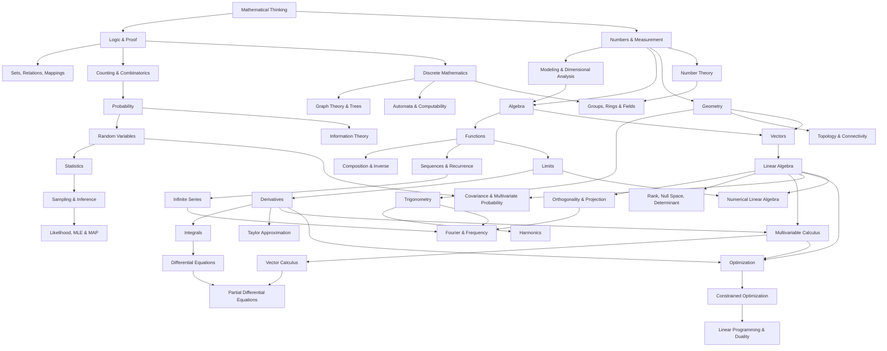

# Master Knowledge Book — Toán học

Đây là bộ sách Markdown được tổ chức theo **conceptual dependency**, không theo Beginner → Intermediate → Advanced. Mỗi file là một chủ đề đủ độc lập để đọc như một chapter nhỏ, nhưng toàn bộ liên kết thành một knowledge graph.

Mục tiêu là **Understanding > Memorization**, **Reasoning > Formula**, **Connection > Isolated Facts**, **First Principles > Rules**.

Bản này đã được rà soát qua nhiều vòng. Ngoài các khoảng trống đã bổ sung ở V2 như rational functions, function composition/inverse, conics, orthogonality/projection, infinite series, vector calculus, statistical inference, information theory, constrained optimization và Fourier, vòng audit mới còn bổ sung mathematical modeling & dimensional analysis, topology nhập môn, PDE, likelihood/MLE/MAP, abstract algebra nền tảng, linear programming/duality và Laplace/Z-transform. Các phần này được tách thành topic riêng để dependency giữa Toán nền tảng, CS, AI/Data, signal/control và engineering không bị nhảy cóc.

## Cách sử dụng

Nếu đang đọc một topic và gặp prerequisite chưa chắc, dùng dependency map bên dưới để quay về file nền. Không cần đọc tuần tự tuyệt đối. Ví dụ Graph Theory không cần Calculus; nhưng để hiểu Gradient Descent đúng bản chất nên đi qua Functions → Vectors/Linear Algebra → Derivatives/Gradient → Optimization.

Thuật ngữ quan trọng dùng format **Tiếng Việt (English / 한국어)**. English được ưu tiên vì xuất hiện trong documentation, textbook và research; Korean được bổ sung để đối chiếu giáo trình, 시험 và môi trường kỹ thuật tại Hàn Quốc.

## Table of Contents

### 00 — Foundations

- [Tư duy toán học và First Principles](./00_foundations/00_mathematical_thinking.md)
- [Logic và chứng minh](./00_foundations/01_logic_and_proof.md)
- [Tập hợp, quan hệ và ánh xạ](./00_foundations/02_sets_relations_and_mappings.md)
- [Số và các hệ số](./00_foundations/03_numbers_and_number_systems.md)
- [Đo lường, đơn vị và ước lượng](./00_foundations/04_measurement_units_and_estimation.md)
- [Mô hình toán học, phân tích thứ nguyên và scaling](./00_foundations/05_mathematical_modeling_dimensional_analysis_and_scaling.md)

### 01 — Algebra

- [Ngôn ngữ đại số: biến, biểu thức và phép biến đổi](./01_algebra/00_algebraic_language.md)
- [Phương trình và bất phương trình](./01_algebra/01_equations_and_inequalities.md)
- [Tỉ số, tỉ lệ và phần trăm](./01_algebra/02_ratio_proportion_percentage.md)
- [Lũy thừa, căn và logarithm](./01_algebra/03_powers_roots_and_logarithms.md)
- [Đa thức và phân tích nhân tử](./01_algebra/04_polynomials_and_factorization.md)
- [Số phức: từ nghiệm phương trình đến rotation](./01_algebra/05_complex_numbers.md)
- [Biểu thức hữu tỉ, miền xác định và tiệm cận](./01_algebra/06_rational_expressions_domain_and_asymptotes.md)

### 02 — Functions

- [Hàm số: quy tắc biến input thành output](./02_functions/00_function_concept.md)
- [Mô hình tuyến tính và bậc hai](./02_functions/01_linear_and_quadratic_models.md)
- [Hàm mũ và logarithmic models](./02_functions/02_exponential_and_logarithmic_models.md)
- [Dãy, chuỗi và recurrence](./02_functions/03_sequences_series_and_recurrence.md)
- [Hợp hàm, hàm ngược và phép biến đổi hàm](./02_functions/04_composition_inverse_and_function_transformations.md)
- [Quan hệ ẩn, tham số và tọa độ cực](./02_functions/05_parametric_polar_and_implicit_relations.md)

### 03 — Geometry & Trigonometry

- [Hình học Euclid: điểm, đường, góc và cấu trúc không gian](./03_geometry_trigonometry/00_euclidean_geometry.md)
- [Hình học tọa độ: biến không gian thành algebra](./03_geometry_trigonometry/01_coordinate_geometry.md)
- [Định lý Pythagoras và ý tưởng khoảng cách](./03_geometry_trigonometry/02_pythagorean_theorem_and_distance.md)
- [Đồng dạng, diện tích, thể tích và scaling laws](./03_geometry_trigonometry/03_similarity_area_volume_and_scaling.md)
- [Lượng giác: góc, tỷ số và dao động](./03_geometry_trigonometry/04_trigonometry.md)
- [Phép biến hình và đối xứng](./03_geometry_trigonometry/05_transformations_and_symmetry.md)
- [Đường tròn, conic sections và quỹ tích](./03_geometry_trigonometry/06_circles_conics_and_loci.md)
- [Đồng nhất thức lượng giác, phương trình lượng giác và dao động điều hòa](./03_geometry_trigonometry/07_trigonometric_identities_equations_and_harmonics.md)
- [Nhập môn topology: continuity, connectivity và shape không phụ thuộc thước đo](./03_geometry_trigonometry/08_topology_continuity_connectivity.md)

### 04 — Vectors & Linear Algebra

- [Vector: đại lượng có nhiều thành phần và hướng](./04_vectors_linear_algebra/00_vectors.md)
- [Ma trận và hệ phương trình tuyến tính](./04_vectors_linear_algebra/01_matrices_and_linear_systems.md)
- [Phép biến đổi tuyến tính](./04_vectors_linear_algebra/02_linear_transformations.md)
- [Không gian vector, cơ sở và số chiều](./04_vectors_linear_algebra/03_vector_spaces_basis_dimension.md)
- [Eigenvalues và eigenvectors: những hướng không đổi dưới transformation](./04_vectors_linear_algebra/04_eigenvalues_and_eigenvectors.md)
- [Least squares, SVD và matrix decompositions](./04_vectors_linear_algebra/05_least_squares_svd_and_decompositions.md)
- [Inner product, trực giao và phép chiếu](./04_vectors_linear_algebra/06_inner_product_orthogonality_and_projection.md)
- [Determinant, rank, null space và nghịch đảo ma trận](./04_vectors_linear_algebra/07_determinant_rank_nullspace_and_inverse.md)

### 05 — Calculus

- [Giới hạn và tính liên tục](./05_calculus/00_limits_and_continuity.md)
- [Đạo hàm: tốc độ thay đổi cục bộ](./05_calculus/01_derivatives.md)
- [Ứng dụng của đạo hàm: shape, approximation và optimization](./05_calculus/02_derivative_applications.md)
- [Tích phân: tích lũy từ những đóng góp vi phân](./05_calculus/03_integrals_and_accumulation.md)
- [Giải tích nhiều biến: gradient, Jacobian và tối ưu trong nhiều chiều](./05_calculus/04_multivariable_calculus.md)
- [Phương trình vi phân và hệ động lực](./05_calculus/05_differential_equations.md)
- [Giải tích số: khi máy tính phải xấp xỉ calculus](./05_calculus/06_numerical_calculus.md)
- [Chuỗi vô hạn, power series và sự hội tụ](./05_calculus/07_infinite_series_power_series_and_convergence.md)
- [Taylor approximation: từ đạo hàm đến mô hình cục bộ nhiều bậc](./05_calculus/08_taylor_series_and_local_approximation.md)
- [Vector calculus: gradient, divergence, curl và tích phân trên đường/mặt](./05_calculus/09_vector_calculus.md)
- [Nhập môn phương trình vi phân riêng phần: fields, heat, wave và boundary conditions](./05_calculus/10_partial_differential_equations_and_fields_intro.md)

### 06 — Probability & Statistics

- [Đếm và tổ hợp](./06_probability_statistics/00_counting_and_combinatorics.md)
- [Nền tảng xác suất: mô hình hóa bất định](./06_probability_statistics/01_probability_foundations.md)
- [Xác suất có điều kiện và định lý Bayes](./06_probability_statistics/02_conditional_probability_and_bayes.md)
- [Biến ngẫu nhiên và phân phối](./06_probability_statistics/03_random_variables_and_distributions.md)
- [Kỳ vọng, phương sai và các luật giới hạn](./06_probability_statistics/04_expectation_variance_and_limit_laws.md)
- [Thống kê mô tả và suy luận](./06_probability_statistics/05_descriptive_and_inferential_statistics.md)
- [Hồi quy và tương quan](./06_probability_statistics/06_regression_and_correlation.md)
- [Lấy mẫu, ước lượng, confidence interval và hypothesis testing](./06_probability_statistics/07_sampling_estimation_confidence_and_hypothesis_testing.md)
- [Covariance, xác suất nhiều biến và multivariate Gaussian](./06_probability_statistics/08_covariance_multivariate_probability_and_gaussian.md)
- [Các phân phối xác suất thường gặp và vì sao chúng xuất hiện](./06_probability_statistics/09_common_distributions_and_when_they_arise.md)
- [Likelihood, MLE, MAP và chọn mô hình từ dữ liệu](./06_probability_statistics/10_likelihood_mle_map_and_model_selection.md)

### 07 — Discrete Mathematics & Theoretical CS

- [Lý thuyết đồ thị: toán học của mạng lưới và quan hệ](./07_discrete_cs/00_graph_theory.md)
- [Độ phức tạp thuật toán và ý nghĩa của logarithm](./07_discrete_cs/01_algorithms_complexity_and_logarithms.md)
- [Recurrence, induction và đệ quy trong thuật toán](./07_discrete_cs/02_recurrence_and_induction_in_algorithms.md)
- [Boolean algebra và logic số](./07_discrete_cs/03_boolean_algebra_and_digital_logic.md)
- [Lý thuyết số và số học modulo](./07_discrete_cs/04_number_theory_and_modular_arithmetic.md)
- [Cây, thứ tự bộ phận và lattice](./07_discrete_cs/05_trees_posets_and_lattices.md)
- [Information theory, entropy và coding](./07_discrete_cs/06_information_theory_and_coding.md)
- [Automata, formal languages và computability](./07_discrete_cs/07_automata_formal_languages_and_computability.md)
- [Cấu trúc đại số: group, ring và field](./07_discrete_cs/08_groups_rings_fields_and_algebraic_structures.md)

### 08 — Optimization & Numerical Mathematics

- [Tối ưu hóa: mục tiêu, ràng buộc và trade-off](./08_optimization_numerical/00_optimization.md)
- [Gradient descent, learning rate và geometry của optimization](./08_optimization_numerical/01_gradient_descent_and_convexity.md)
- [Toán số: approximation, conditioning và stability](./08_optimization_numerical/02_numerical_methods_and_error.md)
- [Tối ưu có ràng buộc, Lagrange multipliers và KKT](./08_optimization_numerical/03_constrained_optimization_lagrange_and_kkt.md)
- [Root finding, interpolation và numerical linear algebra](./08_optimization_numerical/04_root_finding_interpolation_and_numerical_linear_algebra.md)
- [Linear programming, duality và simplex](./08_optimization_numerical/05_linear_programming_duality_and_simplex.md)

### 09 — Knowledge Connections

- [Knowledge Connection — Rate, Change và Accumulation](./09_connections/00_rate_change_and_accumulation.md)
- [Knowledge Connection — Distance, Similarity và Projection](./09_connections/01_distance_similarity_and_projection.md)
- [Knowledge Connection — Xác suất, thông tin và entropy](./09_connections/02_uncertainty_information_and_entropy.md)
- [Knowledge Connection — Toán trong AI, Data và Software Engineering](./09_connections/03_math_for_ai_data_and_software.md)
- [Knowledge Connection — Toán trong tài chính, công việc và đời sống](./09_connections/04_math_for_finance_work_and_daily_life.md)
- [Fourier, tín hiệu và miền tần số](./09_connections/05_fourier_signals_and_frequency.md)
- [Laplace transform, Z-transform và dynamic systems](./09_connections/06_laplace_z_transform_and_dynamic_systems.md)

### Reference

- [Glossary Việt / English / 한국어](./10_glossary.md)
- [Coverage Audit](./COVERAGE_AUDIT.md)

## Knowledge Dependency

## Những mental models xuyên suốt

**Representation:** cùng một object có thể được biểu diễn bằng formula, graph, vector, matrix, basis coefficients hoặc code. Representation tốt làm structure cần dùng trở nên rõ hơn.

**Constraint ↔ feasible set:** equation, inequality, implicit curve, probability simplex và optimization constraints đều là cách cắt không gian xuống các states hợp lệ.

**Rate ↔ accumulation:** difference/derivative mô tả local change; sum/integral reconstruct total. Differential equations dùng relationship giữa state và rate để model dynamics.

**Distance ↔ inner product ↔ projection:** Pythagoras mở rộng thành norm; dot product tạo angle/alignment; projection dẫn tới least squares, regression và PCA.

**Dimension ↔ information loss:** rank và null space mô tả linear map giữ hoặc xóa bao nhiêu directions; inverse tồn tại khi information cần thiết chưa bị collapse.

**Multiplicative scale ↔ logarithm:** exponential mô tả repeated multiplication; logarithm đo multiplicative depth, nên xuất hiện trong algorithm complexity, information theory, finance và scientific scales.

**Local approximation ↔ global behavior:** derivative/Taylor mô tả local model; numerical methods ghép local approximations thành algorithms; convergence/error quyết định khi approximation đáng tin.

**Uncertainty ↔ evidence:** probability mô tả uncertainty; statistics dùng finite data để estimate/update claims; information theory đo surprise và coding cost.

**Time domain ↔ frequency domain:** Fourier là change of representation tương tự đổi basis trong linear algebra; convolution, filtering và harmonic behavior trở nên rõ hơn trong frequency coordinates.

## Phạm vi hoàn thiện

Bộ này được xem là **hoàn thiện trong phạm vi nền tảng phổ thông + đại học nền tảng + toán cốt lõi cho CS/Software/AI/Data/Statistics/Engineering/quantitative life**. “Hoàn thiện” ở đây không có nghĩa toàn bộ toán học hiện đại đã được bao phủ. Các mảng graduate/research như measure theory, abstract algebra chuyên sâu, topology chuyên sâu, differential geometry chuyên sâu, functional analysis, stochastic calculus, advanced PDE theory/numerical PDE, algebraic geometry và category theory được để ngoài scope thay vì ghi giả là đã cover. Bộ hiện chỉ thêm các chapter nhập môn về topology, algebraic structures và PDE để tạo cầu nối khái niệm.

Xem `COVERAGE_AUDIT.md` để biết ranh giới và kết quả audit chi tiết.
