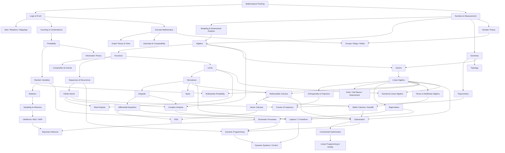

# Master Kiến thức (knowledge / 지식) Book — Toán học

> **Mạch đọc:** [README](./README.md) là bản đồ owner của **Master Kiến thức (knowledge / 지식) Book — Toán học**; nhìn vào vị trí đó trước để biết file này đang phục vụ nhánh kiến thức nào. **Trạng thái chuẩn gốc (canonical / 정본)** chỉ đường quay lại owner và tài liệu chuẩn khi cần đào sâu; sau đó sang **Cách sử dụng** để mở rộng đối tượng sang phạm vi kế cận. Mạch này dùng README làm bản đồ owner của mathematics, rồi nối foundations, algebra, calculus, probability, discrete structures và applications.

`mathematics/` là Mathematics Thư viện kiến thức (knowledge library / 지식 라이브러리) chuẩn gốc (canonical / 정본) của repository. Thư viện được tổ chức theo **conceptual phụ thuộc (dependency / 의존성)**, không theo Beginner → Intermediate → Advanced và không nhằm trở thành cheat sheet công thức.

Triết lý xuyên suốt:

> Understanding > Memorization  
> Lập luận (reasoning / 추론) > Formula
> Liên kết (connection / 연결) > Isolated Facts
> Nguyên lý nền tảng (first principles / 제일 원리) > Rules

Mỗi chapter cố gắng đi theo luồng (flow / 흐름) tự nhiên: vấn đề cần giải quyết → intuition → formalism → derivation/proof idea → các giả định (assumptions / 가정들)/lĩnh vực (domain / 도메인) → worked example → thất bại (failure / 실패) modes → connections → mô hình tư duy (mental model / 사고 모델).

## Trạng thái chuẩn gốc (canonical / 정본)

Tính đến final consistency kiểm tra (audit / 감사) ngày **2026-09-22**, thư viện (library / 라이브러리) giữ nguyên **87 topic files**. Các vòng chất lượng (quality / 품질)/độ sâu (depth / 깊이) kiểm tra (audit / 감사) từ Round 5 đến Round 11 đã lần lượt nâng những nút (node / 노드) có phụ thuộc (dependency / 의존성) centrality cao: lô-gic (logic / 논리)/proof, functions, algebra, hình học (geometry / 기하학), tuyến tính (linear / 선형) algebra, calculus, xác suất (probability / 확률)/statistics, Bayesian lập luận (reasoning / 추론), discrete mathematics, đồ thị (graph / 그래프) lý thuyết (theory / 이론), thông tin (information / 정보) lý thuyết (theory / 이론), numerical methods, tối ưu hóa (optimization / 최적화), Fourier/Laplace, stochastic processes, ma trận (matrix / 행렬) calculus/autodiff và động (dynamic / 동적) programming/điều khiển (control / 제어).

Vòng finalization không thêm chapter mới. Trọng tâm là consistency: prerequisite, notation, glossary, clickable nội bộ (internal / 내부) links, phụ thuộc (dependency / 의존성) đồ thị (graph / 그래프), phạm vi (scope / 범위) ranh giới (boundary / 경계) và branch canonicalization. Chi tiết nằm tại [Coverage & Finalization Audit](./COVERAGE_AUDIT.md).

> **Chuyển mạch:** **Trạng thái canonical** xác định source và boundary; **Cách sử dụng** giải thích cách đọc, rồi **Table of Contents** biến cấu trúc đó thành route.

## Cách sử dụng

Không bắt buộc đọc tuần tự toàn bộ. Nếu một concept dùng thuật ngữ chưa chắc, hãy quay về prerequisite gần nhất trong các học tập (learning / 학습) routes bên dưới. Mỗi chapter có thể đọc độc lập trong phạm vi hợp lý, nhưng việc học theo phụ thuộc (dependency / 의존성) giúp giảm black box và tránh học công thức trước khi hiểu cấu trúc (structure / 구조).

> **Chuyển mạch:** **Table of Contents** cho biết domain và prerequisite; **Learning routes có thể click trực tiếp** chuyển chúng thành đường đọc không cần đoán.

## Bảng (table / 테이블) of Contents

Mục lục được sắp theo dependency: ngôn ngữ và đại số làm nền, hàm và hình học mở rộng biểu diễn, calculus và probability xử lý thay đổi và bất định, rồi các connection đưa chúng vào khoa học máy tính và mô hình hóa. Đọc theo nhánh phù hợp sẽ giữ được câu hỏi mà mỗi nhóm đang giải quyết.

### 00 — Foundations

Phần nền dựng ngôn ngữ, logic, tập hợp, số và cách đo trước khi dùng công thức. Hãy coi đây là lớp giúp kiểm tra giả định của mọi mô hình phía sau.

- [Tư duy toán học và First Principles](./00_foundations/00_mathematical_thinking.md)
- [Logic và chứng minh](./00_foundations/01_logic_and_proof.md)
- [Tập hợp, quan hệ và ánh xạ](./00_foundations/02_sets_relations_and_mappings.md)
- [Số và các hệ số](./00_foundations/03_numbers_and_number_systems.md)
- [Đo lường, đơn vị và ước lượng](./00_foundations/04_measurement_units_and_estimation.md)
- [Mô hình toán học, phân tích thứ nguyên và scaling](./00_foundations/05_mathematical_modeling_dimensional_analysis_and_scaling.md)

### 01 — Algebra

Đại số biến quantities và quan hệ thành biểu thức có thể biến đổi. Nó là cầu nối từ số và tỷ lệ tới hàm, mô hình tăng trưởng và tối ưu.

- [Ngôn ngữ đại số: biến, biểu thức và phép biến đổi](./01_algebra/00_algebraic_language.md)
- [Phương trình và bất phương trình](./01_algebra/01_equations_and_inequalities.md)
- [Tỉ số, tỉ lệ và phần trăm](./01_algebra/02_ratio_proportion_percentage.md)
- [Lũy thừa, căn và logarithm](./01_algebra/03_powers_roots_and_logarithms.md)
- [Đa thức và phân tích nhân tử](./01_algebra/04_polynomials_and_factorization.md)
- [Số phức: từ nghiệm phương trình đến rotation](./01_algebra/05_complex_numbers.md)
- [Biểu thức hữu tỉ, miền xác định và tiệm cận](./01_algebra/06_rational_expressions_domain_and_asymptotes.md)

### 02 — Functions

Hàm mô tả cách input được biến thành output. Các chapter này nối biểu diễn đại số với thay đổi theo thời gian, composition và recurrence.

- [Hàm số: quy tắc biến input thành output](./02_functions/00_function_concept.md)
- [Mô hình tuyến tính và bậc hai](./02_functions/01_linear_and_quadratic_models.md)
- [Hàm mũ và logarithm: toán học của tăng trưởng theo tỷ lệ](./02_functions/02_exponential_and_logarithmic_models.md)
- [Dãy, chuỗi và recurrence](./02_functions/03_sequences_series_and_recurrence.md)
- [Hợp hàm, hàm ngược và phép biến đổi hàm](./02_functions/04_composition_inverse_and_function_transformations.md)
- [Quan hệ ẩn, tham số và tọa độ cực](./02_functions/05_parametric_polar_and_implicit_relations.md)

### 03 — Hình học (geometry / 기하학) & Trigonometry

Hình học và lượng giác đưa cấu trúc không gian, góc, khoảng cách và dao động vào cùng một ngôn ngữ. Đây là nền cho vectors, physics và signal.

- [Hình học Euclid: điểm, đường, góc và cấu trúc không gian](./03_geometry_trigonometry/00_euclidean_geometry.md)
- [Hình học tọa độ: biến không gian thành algebra](./03_geometry_trigonometry/01_coordinate_geometry.md)
- [Định lý Pythagoras và ý tưởng khoảng cách](./03_geometry_trigonometry/02_pythagorean_theorem_and_distance.md)
- [Đồng dạng, diện tích, thể tích và scaling laws](./03_geometry_trigonometry/03_similarity_area_volume_and_scaling.md)
- [Lượng giác: từ tam giác đến rotation, phase và wave](./03_geometry_trigonometry/04_trigonometry.md)
- [Phép biến hình và đối xứng](./03_geometry_trigonometry/05_transformations_and_symmetry.md)
- [Đường tròn, conic sections và quỹ tích](./03_geometry_trigonometry/06_circles_conics_and_loci.md)
- [Đồng nhất thức lượng giác, phương trình lượng giác và harmonics](./03_geometry_trigonometry/07_trigonometric_identities_equations_and_harmonics.md)
- [Nhập môn topology: continuity, connectivity và shape](./03_geometry_trigonometry/08_topology_continuity_connectivity.md)

### 04 — Vectors & Tuyến tính (linear / 선형) Algebra

Đại số tuyến tính mở rộng từ một biến sang nhiều chiều, nơi basis, projection và transformation trở thành công cụ mô hình hóa dữ liệu và hệ vật lý.

- [Vector: đại lượng có nhiều thành phần và hướng](./04_vectors_linear_algebra/00_vectors.md)
- [Ma trận và hệ phương trình tuyến tính](./04_vectors_linear_algebra/01_matrices_and_linear_systems.md)
- [Phép biến đổi tuyến tính](./04_vectors_linear_algebra/02_linear_transformations.md)
- [Không gian vector, cơ sở và số chiều](./04_vectors_linear_algebra/03_vector_spaces_basis_dimension.md)
- [Eigenvalues và eigenvectors: natural directions của transformation](./04_vectors_linear_algebra/04_eigenvalues_and_eigenvectors.md)
- [Least squares, SVD và matrix decompositions](./04_vectors_linear_algebra/05_least_squares_svd_and_decompositions.md)
- [Inner product, trực giao và phép chiếu](./04_vectors_linear_algebra/06_inner_product_orthogonality_and_projection.md)
- [Determinant, rank, null space và nghịch đảo ma trận](./04_vectors_linear_algebra/07_determinant_rank_nullspace_and_inverse.md)
- [Tensor và multilinear algebra](./04_vectors_linear_algebra/08_tensors_and_multilinear_algebra.md)
- [Matrix calculus, Jacobian, Hessian và automatic differentiation](./04_vectors_linear_algebra/09_matrix_calculus_jacobian_hessian_and_autodiff.md)

### 05 — Calculus & Phân tích (analysis / 분석)

Calculus nghiên cứu giới hạn, tốc độ thay đổi và tích lũy; analysis làm rõ điều kiện để các phép đó hợp lệ. Hãy giữ quan hệ giữa local approximation và global behavior.

- [Giới hạn và tính liên tục](./05_calculus/00_limits_and_continuity.md)
- [Đạo hàm: tốc độ thay đổi cục bộ](./05_calculus/01_derivatives.md)
- [Ứng dụng của đạo hàm: shape, approximation và optimization](./05_calculus/02_derivative_applications.md)
- [Tích phân: accumulation, area, expectation và tổng liên tục](./05_calculus/03_integrals_and_accumulation.md)
- [Giải tích nhiều biến: gradient, Jacobian và tối ưu trong nhiều chiều](./05_calculus/04_multivariable_calculus.md)
- [Phương trình vi phân và hệ động lực](./05_calculus/05_differential_equations.md)
- [Giải tích số: khi máy tính phải xấp xỉ calculus](./05_calculus/06_numerical_calculus.md)
- [Chuỗi vô hạn, power series và sự hội tụ](./05_calculus/07_infinite_series_power_series_and_convergence.md)
- [Taylor approximation: từ đạo hàm đến mô hình cục bộ nhiều bậc](./05_calculus/08_taylor_series_and_local_approximation.md)
- [Vector calculus: gradient, divergence, curl và tích phân trên đường/mặt](./05_calculus/09_vector_calculus.md)
- [Nhập môn PDE: fields, heat, wave và boundary conditions](./05_calculus/10_partial_differential_equations_and_fields_intro.md)
- [Real analysis: giới hạn, hội tụ và nền tảng chặt chẽ của calculus](./05_calculus/11_real_analysis_convergence_and_rigor.md)
- [Complex analysis: analytic functions, contour integrals và residues](./05_calculus/12_complex_analysis_and_analytic_functions.md)

### 06 — Xác suất (probability / 확률) & Statistics

Probability mô hình hóa bất định, còn statistics suy luận từ dữ liệu hữu hạn. Các chapter nối sample, distribution, estimation và decision để tránh nhầm tương quan với bằng chứng nhân quả.

- [Đếm và tổ hợp](./06_probability_statistics/00_counting_and_combinatorics.md)
- [Nền tảng xác suất: mô hình hóa bất định](./06_probability_statistics/01_probability_foundations.md)
- [Xác suất có điều kiện và Bayes: cập nhật uncertainty khi information thay đổi](./06_probability_statistics/02_conditional_probability_and_bayes.md)
- [Biến ngẫu nhiên và phân phối](./06_probability_statistics/03_random_variables_and_distributions.md)
- [Kỳ vọng, phương sai và các luật giới hạn](./06_probability_statistics/04_expectation_variance_and_limit_laws.md)
- [Thống kê mô tả và suy luận](./06_probability_statistics/05_descriptive_and_inferential_statistics.md)
- [Hồi quy và tương quan](./06_probability_statistics/06_regression_and_correlation.md)
- [Lấy mẫu, ước lượng, confidence interval và hypothesis testing](./06_probability_statistics/07_sampling_estimation_confidence_and_hypothesis_testing.md)
- [Covariance, xác suất nhiều biến và multivariate Gaussian](./06_probability_statistics/08_covariance_multivariate_probability_and_gaussian.md)
- [Các phân phối xác suất thường gặp và vì sao chúng xuất hiện](./06_probability_statistics/09_common_distributions_and_when_they_arise.md)
- [Likelihood, MLE, MAP và chọn mô hình từ dữ liệu](./06_probability_statistics/10_likelihood_mle_map_and_model_selection.md)
- [Stochastic processes, Markov chains và time series](./06_probability_statistics/11_stochastic_processes_markov_chains_and_time_series.md)
- [Bayesian inference, posterior predictive và hierarchical models](./06_probability_statistics/12_bayesian_inference_posterior_predictive_and_hierarchical_models.md)

### 07 — Discrete Mathematics & Theoretical CS

Nhánh rời rạc cung cấp ngôn ngữ cho logic, đồ thị, recurrence, information và computation. Nó giúp chuyển từ reasoning liên tục sang cấu trúc hữu hạn và thuật toán.

- [Lý thuyết đồ thị: toán học của mạng lưới và quan hệ](./07_discrete_cs/00_graph_theory.md)
- [Độ phức tạp thuật toán và ý nghĩa của logarithm](./07_discrete_cs/01_algorithms_complexity_and_logarithms.md)
- [Recurrence, induction và đệ quy trong thuật toán](./07_discrete_cs/02_recurrence_and_induction_in_algorithms.md)
- [Boolean algebra và logic số](./07_discrete_cs/03_boolean_algebra_and_digital_logic.md)
- [Lý thuyết số và số học modulo](./07_discrete_cs/04_number_theory_and_modular_arithmetic.md)
- [Cây, thứ tự bộ phận và lattice](./07_discrete_cs/05_trees_posets_and_lattices.md)
- [Information theory, entropy và coding](./07_discrete_cs/06_information_theory_and_coding.md)
- [Automata, formal languages và computability](./07_discrete_cs/07_automata_formal_languages_and_computability.md)
- [Cấu trúc đại số: group, ring và field](./07_discrete_cs/08_groups_rings_fields_and_algebraic_structures.md)

### 08 — Tối ưu hóa (optimization / 최적화) & Numerical Mathematics

Optimization chọn quyết định tốt dưới mục tiêu và ràng buộc; numerical mathematics kiểm tra sai số khi máy tính xấp xỉ. Hai lớp phải được đọc cùng conditioning và stability.

- [Tối ưu hóa: mục tiêu, ràng buộc và trade-off](./08_optimization_numerical/00_optimization.md)
- [Gradient descent, learning rate và geometry của optimization](./08_optimization_numerical/01_gradient_descent_and_convexity.md)
- [Toán số: approximation, conditioning và stability trên máy tính hữu hạn](./08_optimization_numerical/02_numerical_methods_and_error.md)
- [Tối ưu có ràng buộc, Lagrange multipliers và KKT](./08_optimization_numerical/03_constrained_optimization_lagrange_and_kkt.md)
- [Root finding, interpolation và numerical linear algebra](./08_optimization_numerical/04_root_finding_interpolation_and_numerical_linear_algebra.md)
- [Linear programming, duality và simplex](./08_optimization_numerical/05_linear_programming_duality_and_simplex.md)
- [Dynamic programming, Bellman equation và optimal control](./08_optimization_numerical/06_dynamic_programming_bellman_and_optimal_control.md)

### 09 — Kiến thức (knowledge / 지식) Connections

Các connection chapter đưa cùng một pattern toán học sang tốc độ, thông tin, AI, finance và tín hiệu. Hãy dùng chúng để kiểm tra khả năng chuyển mental model giữa domain.

- [Knowledge Connection — Rate, Change và Accumulation](./09_connections/00_rate_change_and_accumulation.md)
- [Knowledge Connection — Distance, Similarity và Projection](./09_connections/01_distance_similarity_and_projection.md)
- [Knowledge Connection — Xác suất, thông tin và entropy](./09_connections/02_uncertainty_information_and_entropy.md)
- [Knowledge Connection — Toán trong AI, Data và Software Engineering](./09_connections/03_math_for_ai_data_and_software.md)
- [Knowledge Connection — Toán trong tài chính, công việc và đời sống](./09_connections/04_math_for_finance_work_and_daily_life.md)
- [Fourier, tín hiệu và miền tần số](./09_connections/05_fourier_signals_and_frequency.md)
- [Laplace transform, Z-transform và dynamic systems](./09_connections/06_laplace_z_transform_and_dynamic_systems.md)

### Tham chiếu (reference / 참조) & Editorial

Reference dùng để tra thuật ngữ và trạng thái coverage sau khi đã học theo route. Nó hỗ trợ navigation, không thay thế chuỗi giải thích của chapter.

- [Glossary Việt / English / 한국어](./10_glossary.md)
- [Coverage & Finalization Audit](./COVERAGE_AUDIT.md)
- [Editorial Standard](./EDITORIAL_STANDARD.md)
- [Quality Audit Round 5](./QUALITY_AUDIT_ROUND5.md)
- [Quality Audit Round 7](./QUALITY_AUDIT_ROUND7.md)
- [Quality Audit Round 8](./QUALITY_AUDIT_ROUND8.md)
- [Quality Audit Round 9](./QUALITY_AUDIT_ROUND9.md)
- [Quality Audit Round 10](./QUALITY_AUDIT_ROUND10.md)
- [Quality Audit Round 11](./QUALITY_AUDIT_ROUND11.md)

> **Chuyển mạch:** **Learning routes** biến mục lục thành prerequisite graph; **Kiến thức phụ thuộc** giải thích vì sao một concept cần đứng trước concept khác.

## Học tập (learning / 학습) routes có thể click trực tiếp

### Khoa học máy tính (computer science / 컴퓨터 과학) & Algorithms

[Logic & Proof](./00_foundations/01_logic_and_proof.md) → [Sets, Relations & Mappings](./00_foundations/02_sets_relations_and_mappings.md) → [Functions](./02_functions/00_function_concept.md) → [Recurrence & Induction](./07_discrete_cs/02_recurrence_and_induction_in_algorithms.md) → [Graph Theory](./07_discrete_cs/00_graph_theory.md) → [Algorithmic Complexity](./07_discrete_cs/01_algorithms_complexity_and_logarithms.md) → [Automata & Computability](./07_discrete_cs/07_automata_formal_languages_and_computability.md).

### AI / Machine Học tập (learning / 학습) / Kỹ thuật dữ liệu (data engineering / 데이터 엔지니어링)

[Functions](./02_functions/00_function_concept.md) → [Vectors](./04_vectors_linear_algebra/00_vectors.md) → [Matrices](./04_vectors_linear_algebra/01_matrices_and_linear_systems.md) → [Linear Transformations](./04_vectors_linear_algebra/02_linear_transformations.md) → [Least Squares & SVD](./04_vectors_linear_algebra/05_least_squares_svd_and_decompositions.md) → [Multivariable Calculus](./05_calculus/04_multivariable_calculus.md) → [Matrix Calculus & Autodiff](./04_vectors_linear_algebra/09_matrix_calculus_jacobian_hessian_and_autodiff.md) → [Probability](./06_probability_statistics/01_probability_foundations.md) → [Statistics](./06_probability_statistics/05_descriptive_and_inferential_statistics.md) → [Optimization](./08_optimization_numerical/00_optimization.md) → [Math for AI/Data/Software](./09_connections/03_math_for_ai_data_and_software.md).

### Physics & Kỹ thuật (engineering / 엔지니어링)

[Measurement](./00_foundations/04_measurement_units_and_estimation.md) → [Modeling & Dimensional Analysis](./00_foundations/05_mathematical_modeling_dimensional_analysis_and_scaling.md) → [Geometry](./03_geometry_trigonometry/00_euclidean_geometry.md) → [Trigonometry](./03_geometry_trigonometry/04_trigonometry.md) → [Vectors](./04_vectors_linear_algebra/00_vectors.md) → [Derivatives](./05_calculus/01_derivatives.md) → [Integrals](./05_calculus/03_integrals_and_accumulation.md) → [Differential Equations](./05_calculus/05_differential_equations.md) → [Vector Calculus](./05_calculus/09_vector_calculus.md) → [PDE](./05_calculus/10_partial_differential_equations_and_fields_intro.md) → [Fourier](./09_connections/05_fourier_signals_and_frequency.md).

### Tín hiệu (signal / 신호), Các hệ thống (systems / 시스템들) & Điều khiển (control / 제어)

[Trigonometry](./03_geometry_trigonometry/04_trigonometry.md) → [Complex Numbers](./01_algebra/05_complex_numbers.md) → [Eigenvalues](./04_vectors_linear_algebra/04_eigenvalues_and_eigenvectors.md) → [Differential Equations](./05_calculus/05_differential_equations.md) → [Fourier](./09_connections/05_fourier_signals_and_frequency.md) → [Laplace/Z-transform](./09_connections/06_laplace_z_transform_and_dynamic_systems.md) → [Bellman & Optimal Control](./08_optimization_numerical/06_dynamic_programming_bellman_and_optimal_control.md).

### Finance / Investing

[Ratio & Percentage](./01_algebra/02_ratio_proportion_percentage.md) → [Exponential & Logarithm](./02_functions/02_exponential_and_logarithmic_models.md) → [Probability](./06_probability_statistics/01_probability_foundations.md) → [Expectation & Variance](./06_probability_statistics/04_expectation_variance_and_limit_laws.md) → [Covariance](./06_probability_statistics/08_covariance_multivariate_probability_and_gaussian.md) → [Regression](./06_probability_statistics/06_regression_and_correlation.md) → [Stochastic Processes](./06_probability_statistics/11_stochastic_processes_markov_chains_and_time_series.md) → [Optimization](./08_optimization_numerical/00_optimization.md) → [Math for Finance & Daily Life](./09_connections/04_math_for_finance_work_and_daily_life.md).

### Kỹ nghệ phần mềm (software engineering / 소프트웨어 공학) & môi trường vận hành (production / 운영 환경) lập luận (reasoning / 추론)

[Logic & Proof](./00_foundations/01_logic_and_proof.md) → [Functions & Contracts](./02_functions/00_function_concept.md) → [Composition & Inverse](./02_functions/04_composition_inverse_and_function_transformations.md) → [Graphs](./07_discrete_cs/00_graph_theory.md) → [Complexity](./07_discrete_cs/01_algorithms_complexity_and_logarithms.md) → [Probability & Calibration](./06_probability_statistics/02_conditional_probability_and_bayes.md) → [Numerical Stability](./08_optimization_numerical/02_numerical_methods_and_error.md) → [Math for AI/Data/Software](./09_connections/03_math_for_ai_data_and_software.md).

> **Chuyển mạch:** **Kiến thức phụ thuộc** khóa prerequisite và owner; **Connections sang thư viện khác** chỉ nơi invariant toán học được tái sử dụng.

## Kiến thức (knowledge / 지식) Phụ thuộc (dependency / 의존성)

Đồ thị dependency dưới đây tóm tắt prerequisite và downstream use. Khi một công thức chưa rõ, lần theo mũi tên ngược để tìm khái niệm cần dựng lại.

```mermaid
graph TD
    MT[Mathematical Thinking] --> LP[Logic & Proof]
    MT --> NM[Numbers & Measurement]
    LP --> SRM[Sets / Relations / Mappings]
    NM --> MODEL[Modeling & Dimensional Analysis]
    MODEL --> ALG[Algebra]
    NM --> ALG
    ALG --> FUNC[Functions]
    FUNC --> COMP[Composition & Inverse]
    FUNC --> SEQ[Sequences & Recurrence]

    NM --> GEO[Geometry]
    GEO --> TRIG[Trigonometry]
    GEO --> TOP[Topology]
    ALG --> VEC[Vectors]
    GEO --> VEC
    VEC --> LA[Linear Algebra]
    LA --> ORTH[Orthogonality & Projection]
    LA --> RANK[Rank / Null Space / Determinant]
    LA --> EIG[Eigenvalues]
    LA --> TEN[Tensor & Multilinear Algebra]

    FUNC --> LIM[Limits]
    LIM --> DER[Derivatives]
    DER --> INT[Integrals]
    SEQ --> SERIES[Infinite Series]
    DER --> TAYLOR[Taylor]
    LA --> MVC[Multivariable Calculus]
    DER --> MVC
    MVC --> MC[Matrix Calculus / Autodiff]
    TEN --> MC
    MVC --> VC[Vector Calculus]
    INT --> ODE[Differential Equations]
    VC --> PDE[PDE]
    ODE --> PDE
    LIM --> RA[Real Analysis]
    SERIES --> RA
    ALG --> CA[Complex Analysis]
    SERIES --> CA
    INT --> CA

    LP --> COUNT[Counting & Combinatorics]
    COUNT --> PROB[Probability]
    PROB --> RV[Random Variables]
    RV --> STAT[Statistics]
    STAT --> INF[Sampling & Inference]
    INF --> LKH[Likelihood / MLE / MAP]
    LA --> MP[Multivariate Probability]
    RV --> MP
    RV --> SP[Stochastic Processes]
    EIG --> SP
    LKH --> BAYES[Bayesian Inference]
    SP --> BAYES

    LP --> DISC[Discrete Mathematics]
    DISC --> GRAPH[Graph Theory & Trees]
    NM --> NT[Number Theory]
    PROB --> IT[Information Theory]
    DISC --> AUTO[Automata & Computability]
    NT --> ABS[Groups / Rings / Fields]
    DISC --> ABS

    DER --> OPT[Optimization]
    LA --> OPT
    MVC --> OPT
    MC --> OPT
    OPT --> KKT[Constrained Optimization]
    KKT --> LPDUAL[Linear Programming & Duality]
    LA --> NUM[Numerical Linear Algebra]
    LIM --> NUM
    SEQ --> DP[Dynamic Programming]
    OPT --> DP
    SP --> DP

    TRIG --> FOURIER[Fourier & Frequency]
    ORTH --> FOURIER
    SERIES --> FOURIER
    CA --> LAPLACE[Laplace / Z Transform]
    ODE --> LAPLACE
    EIG --> LAPLACE
    LAPLACE --> CONTROL[Dynamic Systems / Control]
    DP --> CONTROL
```

Mermaid ở trên chỉ dùng để nhìn topology. Khi cần điều hướng (navigation / 내비게이션) trên website, dùng các **Học tập (learning / 학습) routes có thể click trực tiếp** hoặc links nằm trong từng chapter.

> **Chuyển mạch:** **Connections** cho thấy toán học đi vào physics, economics, CS và data; **Mental models xuyên suốt** gom các invariant dùng lại giữa những domain đó.

## Connections sang các Thư viện kiến thức (knowledge library / 지식 라이브러리) khác

- [Computer Science](../computer_science/README.md): lô-gic (logic / 논리)/proof, graphs, automata, độ phức tạp (complexity / 복잡도), numerical/hiệu năng (performance / 성능) lập luận (reasoning / 추론) và hệ thống (system / 시스템) thiết kế (design / 설계).
- [Physics](../physics/README.md): đo lường (measurement / 측정), vectors, calculus, differential equations, fields, Fourier và modeling các giả định (assumptions / 가정들).
- [Investing](../investing/README.md): compounding, xác suất (probability / 확률), statistics, covariance, regression, tối ưu hóa (optimization / 최적화) và stochastic lập luận (reasoning / 추론).
- AI/ML, Kỹ thuật dữ liệu (data engineering / 데이터 엔지니어링) và Kỹ nghệ phần mềm (software engineering / 소프트웨어 공학) được nối qua [Math for AI, Data and Software](./09_connections/03_math_for_ai_data_and_software.md); chapter này giữ ranh giới (boundary / 경계) toán học, còn hiện thực (implementation / 구현) thuộc các thư viện (library / 라이브러리) kỹ thuật tương ứng.

> **Chuyển mạch:** **Mental models xuyên suốt** khép README bằng invariant, boundary và link owner; chi tiết chứng minh quay về chapter toán học canonical.

## Những mô hình tư duy (mental models / 사고 모델들) xuyên suốt

**Biểu diễn (representation / 표현).** Cùng một đối tượng (object / 객체) có thể được nhìn bằng formula, đồ thị (graph / 그래프), véc-tơ (vector / 벡터), ma trận (matrix / 행렬), tensor, basis coefficients, xác suất (probability / 확률) phân phối (distribution / 분포) hoặc mã (code / 코드). Biểu diễn (representation / 표현) tốt biến bài toán (problem / 문제) khó thành cấu trúc (structure / 구조) quen thuộc.

**Cục bộ (local / 로컬) → Toàn cục (global / 전역).** Derivative là cục bộ (local / 로컬) tỷ lệ (rate / 비율) nhưng tích hợp (integration / 통합) tạo toàn cục (global / 전역) accumulation; differential equation là cục bộ (local / 로컬) law nhưng sinh toàn cục (global / 전역) trajectory; chuyển tiếp (transition / 전이) quy tắc (rule / 규칙) của Markov chuỗi (chain / 사슬) tạo long-run phân phối (distribution / 분포).

**Linearization.** Tuyến tính (linear / 선형) algebra quan trọng không phải vì mọi hệ đều tuyến tính (linear / 선형), mà vì nonlinear các hệ thống (systems / 시스템들) thường được approximate locally bằng tuyến tính (linear / 선형) maps: Jacobian, Hessian, Taylor expansion và eigenmodes.

**Bất định (uncertainty / 불확실성) as cấu trúc (structure / 구조).** Xác suất (probability / 확률) cung cấp algebra để mô hình (model / 모델) bất định (uncertainty / 불확실성), cập nhật (update / 업데이트) thông tin (information / 정보) và ra quyết định khi dữ liệu (data / 데이터) không đủ chắc chắn.

Chi tiết scope, số topic theo từng nhóm và các phần được nâng cấp trong vòng audit gần nhất nằm tại [COVERAGE_AUDIT.md](./COVERAGE_AUDIT.md).

> **Bàn giao:** Sau **Những mô hình tư duy (mental models / 사고 모델들) xuyên suốt**, hãy giữ lại kết luận và ranh giới của mục này; quay về [README](./README.md) khi cần định vị owner hoặc chọn nhánh học tiếp theo.
