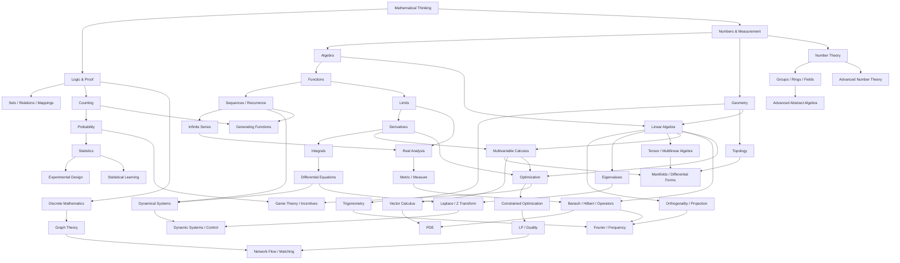

# Master Knowledge Book — Toán học

> **Mạch đọc:** README này là bản đồ owner của Mathematics; dùng trạng thái canonical để định vị coverage, rồi chọn learning route và quay về chapter prerequisite khi cần formalism sâu hơn.

`mathematics/` là thư viện Toán học chuẩn gốc (canonical / 정본) của repository. Nội dung được tổ chức theo **dependency của concept**, không theo nhãn Beginner → Intermediate → Advanced và không nhằm trở thành cheat sheet công thức.

Triết lý xuyên suốt:

> Understanding > Memorization
> Reasoning > Formula
> Connection > Isolated Facts
> First Principles > Rules

Mỗi chapter cố gắng đi theo luồng: vấn đề cần giải quyết → intuition → formalism → reasoning/derivation → assumptions/domain → worked examples → failure modes → connections → mental model.

## Trạng thái canonical

Tính đến **2026-10-04**, thư viện có **99 topic files** trong các domain `00`–`09`.

Con số này sửa một bookkeeping issue của audit trước: `09_connections/07_probability_calibration_decision_and_risk.md` đã tồn tại nhưng bị bỏ khỏi mục lục và count trước đó. Sau khi tính lại, trạng thái sau Abakcus Round 1 là **93 topics**; Round 2 thêm **6 topics**, đưa canonical coverage lên **99**.

Hai vòng audit gần nhất:

- [Abakcus Textbook Gap Audit — Round 1](./ABAKCUS_TEXTBOOK_GAP_AUDIT_2026_10.md)
- [Abakcus Mathematics Depth Audit — Round 2](./ABAKCUS_DEPTH_AUDIT_ROUND2_2026_10.md)

## Cách sử dụng

Không cần đọc tuần tự toàn bộ. Chọn learning route phù hợp với mục tiêu, và khi gặp một concept chưa chắc, quay lại prerequisite gần nhất. Mỗi file được viết để có thể đọc độc lập trong phạm vi hợp lý nhưng vẫn nối rõ sang upstream/downstream topics.

> **Chuyển mạch:** Các learning routes biến dependency thành đường đọc có thể click; từng chapter giữ formalism, assumptions và worked examples của Mathematics.

---

## 00 — Foundations

Ngôn ngữ, logic, số, đo lường và modeling trước khi đi vào các cấu trúc toán học cụ thể.

- [Tư duy toán học và First Principles](./00_foundations/00_mathematical_thinking.md)
- [Logic và chứng minh](./00_foundations/01_logic_and_proof.md)
- [Tập hợp, quan hệ và ánh xạ](./00_foundations/02_sets_relations_and_mappings.md)
- [Số và các hệ số](./00_foundations/03_numbers_and_number_systems.md)
- [Đo lường, đơn vị và ước lượng](./00_foundations/04_measurement_units_and_estimation.md)
- [Mô hình toán học, phân tích thứ nguyên và scaling](./00_foundations/05_mathematical_modeling_dimensional_analysis_and_scaling.md)

## 01 — Algebra

Đại số biến quantities và relations thành biểu thức có thể biến đổi mà vẫn giữ meaning của problem.

- [Ngôn ngữ đại số: biến, biểu thức và phép biến đổi](./01_algebra/00_algebraic_language.md)
- [Phương trình và bất phương trình](./01_algebra/01_equations_and_inequalities.md)
- [Tỉ số, tỉ lệ và phần trăm](./01_algebra/02_ratio_proportion_percentage.md)
- [Lũy thừa, căn và logarithm](./01_algebra/03_powers_roots_and_logarithms.md)
- [Đa thức và phân tích nhân tử](./01_algebra/04_polynomials_and_factorization.md)
- [Số phức: từ nghiệm phương trình đến rotation](./01_algebra/05_complex_numbers.md)
- [Biểu thức hữu tỉ, miền xác định và tiệm cận](./01_algebra/06_rational_expressions_domain_and_asymptotes.md)

## 02 — Functions

Functions là language cho dependency giữa quantities, composition, growth và recurrence.

- [Hàm số: quy tắc biến input thành output](./02_functions/00_function_concept.md)
- [Mô hình tuyến tính và bậc hai](./02_functions/01_linear_and_quadratic_models.md)
- [Hàm mũ và logarithm: toán học của tăng trưởng theo tỷ lệ](./02_functions/02_exponential_and_logarithmic_models.md)
- [Dãy, chuỗi và recurrence](./02_functions/03_sequences_series_and_recurrence.md)
- [Hợp hàm, hàm ngược và phép biến đổi hàm](./02_functions/04_composition_inverse_and_function_transformations.md)
- [Quan hệ ẩn, tham số và tọa độ cực](./02_functions/05_parametric_polar_and_implicit_relations.md)

## 03 — Geometry & Trigonometry

Không gian, khoảng cách, góc, symmetry và topology làm nền cho vectors, physics, graphics và geometry nâng cao.

- [Hình học Euclid: điểm, đường, góc và cấu trúc không gian](./03_geometry_trigonometry/00_euclidean_geometry.md)
- [Hình học tọa độ: biến không gian thành algebra](./03_geometry_trigonometry/01_coordinate_geometry.md)
- [Định lý Pythagoras và ý tưởng khoảng cách](./03_geometry_trigonometry/02_pythagorean_theorem_and_distance.md)
- [Đồng dạng, diện tích, thể tích và scaling laws](./03_geometry_trigonometry/03_similarity_area_volume_and_scaling.md)
- [Lượng giác: từ tam giác đến rotation, phase và wave](./03_geometry_trigonometry/04_trigonometry.md)
- [Phép biến hình và đối xứng](./03_geometry_trigonometry/05_transformations_and_symmetry.md)
- [Đường tròn, conic sections và quỹ tích](./03_geometry_trigonometry/06_circles_conics_and_loci.md)
- [Đồng nhất thức lượng giác, phương trình lượng giác và harmonics](./03_geometry_trigonometry/07_trigonometric_identities_equations_and_harmonics.md)
- [Nhập môn topology: continuity, connectivity và shape](./03_geometry_trigonometry/08_topology_continuity_connectivity.md)

## 04 — Vectors & Linear Algebra

Đại số tuyến tính mở rộng từ scalar sang multidimensional representation, transformation, projection và decomposition.

- [Vector: đại lượng có nhiều thành phần và hướng](./04_vectors_linear_algebra/00_vectors.md)
- [Ma trận và hệ phương trình tuyến tính](./04_vectors_linear_algebra/01_matrices_and_linear_systems.md)
- [Phép biến đổi tuyến tính](./04_vectors_linear_algebra/02_linear_transformations.md)
- [Không gian vector, cơ sở và số chiều](./04_vectors_linear_algebra/03_vector_spaces_basis_dimension.md)
- [Eigenvalues và eigenvectors: natural directions của transformation](./04_vectors_linear_algebra/04_eigenvalues_and_eigenvectors.md)
- [Least squares, SVD và matrix decompositions](./04_vectors_linear_algebra/05_least_squares_svd_and_decompositions.md)
- [Inner product, trực giao và phép chiếu](./04_vectors_linear_algebra/06_inner_product_orthogonality_and_projection.md)
- [Determinant, rank, null space và nghịch đảo ma trận](./04_vectors_linear_algebra/07_determinant_rank_nullspace_and_inverse.md)
- [Tensor và multilinear algebra](./04_vectors_linear_algebra/08_tensors_and_multilinear_algebra.md)
- [Matrix calculus, Jacobian, Hessian và automatic differentiation](./04_vectors_linear_algebra/09_matrix_calculus_jacobian_hessian_and_autodiff.md)

## 05 — Calculus, Analysis & Dynamical Systems

Nhánh này đi từ local change/accumulation tới rigor, infinite-dimensional spaces, geometry trên manifolds và nonlinear dynamics.

- [Giới hạn và tính liên tục](./05_calculus/00_limits_and_continuity.md)
- [Đạo hàm: tốc độ thay đổi cục bộ](./05_calculus/01_derivatives.md)
- [Ứng dụng của đạo hàm: shape, approximation và optimization](./05_calculus/02_derivative_applications.md)
- [Tích phân: accumulation, area, expectation và tổng liên tục](./05_calculus/03_integrals_and_accumulation.md)
- [Giải tích nhiều biến: gradient, Jacobian và tối ưu trong nhiều chiều](./05_calculus/04_multivariable_calculus.md)
- [Phương trình vi phân và hệ động lực](./05_calculus/05_differential_equations.md)
- [Giải tích số: khi máy tính phải xấp xỉ calculus](./05_calculus/06_numerical_calculus.md)
- [Chuỗi vô hạn, power series và sự hội tụ](./05_calculus/07_infinite_series_power_series_and_convergence.md)
- [Taylor approximation: từ đạo hàm đến mô hình cục bộ nhiều bậc](./05_calculus/08_taylor_series_and_local_approximation.md)
- [Vector calculus: gradient, divergence, curl và tích phân trên đường/mặt](./05_calculus/09_vector_calculus.md)
- [Nhập môn PDE: fields, heat, wave và boundary conditions](./05_calculus/10_partial_differential_equations_and_fields_intro.md)
- [Real analysis: giới hạn, hội tụ và nền tảng chặt chẽ của calculus](./05_calculus/11_real_analysis_convergence_and_rigor.md)
- [Complex analysis: analytic functions, contour integrals và residues](./05_calculus/12_complex_analysis_and_analytic_functions.md)
- [Metric spaces, uniform convergence và measure](./05_calculus/13_metric_spaces_uniform_convergence_and_measure_intro.md)
- [Normed, Banach, Hilbert spaces và operators](./05_calculus/14_normed_banach_hilbert_spaces_and_operators.md)
- [Manifolds, differential forms và generalized Stokes](./05_calculus/15_manifolds_differential_forms_and_generalized_stokes.md)
- [Dynamical systems, bifurcations và chaos](./05_calculus/16_dynamical_systems_bifurcations_and_chaos.md)

## 06 — Probability, Statistics & Statistical Learning

Probability mô hình uncertainty; statistics suy luận từ finite data; statistical learning thêm generalization/model selection; experimental design kiểm soát data-generating mechanism.

- [Đếm và tổ hợp](./06_probability_statistics/00_counting_and_combinatorics.md)
- [Nền tảng xác suất: mô hình hóa bất định](./06_probability_statistics/01_probability_foundations.md)
- [Xác suất có điều kiện và Bayes](./06_probability_statistics/02_conditional_probability_and_bayes.md)
- [Biến ngẫu nhiên và phân phối](./06_probability_statistics/03_random_variables_and_distributions.md)
- [Kỳ vọng, phương sai và các luật giới hạn](./06_probability_statistics/04_expectation_variance_and_limit_laws.md)
- [Thống kê mô tả và suy luận](./06_probability_statistics/05_descriptive_and_inferential_statistics.md)
- [Hồi quy và tương quan](./06_probability_statistics/06_regression_and_correlation.md)
- [Lấy mẫu, ước lượng, confidence interval và hypothesis testing](./06_probability_statistics/07_sampling_estimation_confidence_and_hypothesis_testing.md)
- [Covariance, xác suất nhiều biến và multivariate Gaussian](./06_probability_statistics/08_covariance_multivariate_probability_and_gaussian.md)
- [Các phân phối xác suất thường gặp và vì sao chúng xuất hiện](./06_probability_statistics/09_common_distributions_and_when_they_arise.md)
- [Likelihood, MLE, MAP và chọn mô hình từ dữ liệu](./06_probability_statistics/10_likelihood_mle_map_and_model_selection.md)
- [Stochastic processes, Markov chains và time series](./06_probability_statistics/11_stochastic_processes_markov_chains_and_time_series.md)
- [Bayesian inference, posterior predictive và hierarchical models](./06_probability_statistics/12_bayesian_inference_posterior_predictive_and_hierarchical_models.md)
- [Experimental design: randomization, blocking, factorial designs và ANOVA](./06_probability_statistics/13_experimental_design_randomization_blocking_and_anova.md)
- [Statistical learning: bias–variance, regularization và validation](./06_probability_statistics/14_statistical_learning_bias_variance_regularization_and_validation.md)

## 07 — Discrete Mathematics, Algebra & Theoretical CS

Discrete structures cung cấp language cho algorithms, graphs, algebraic structure, number theory, counting và computation.

- [Lý thuyết đồ thị: toán học của mạng lưới và quan hệ](./07_discrete_cs/00_graph_theory.md)
- [Độ phức tạp thuật toán và ý nghĩa của logarithm](./07_discrete_cs/01_algorithms_complexity_and_logarithms.md)
- [Recurrence, induction và đệ quy trong thuật toán](./07_discrete_cs/02_recurrence_and_induction_in_algorithms.md)
- [Boolean algebra và logic số](./07_discrete_cs/03_boolean_algebra_and_digital_logic.md)
- [Lý thuyết số và số học modulo](./07_discrete_cs/04_number_theory_and_modular_arithmetic.md)
- [Cây, thứ tự bộ phận và lattice](./07_discrete_cs/05_trees_posets_and_lattices.md)
- [Information theory, entropy và coding](./07_discrete_cs/06_information_theory_and_coding.md)
- [Automata, formal languages và computability](./07_discrete_cs/07_automata_formal_languages_and_computability.md)
- [Cấu trúc đại số: group, ring và field](./07_discrete_cs/08_groups_rings_fields_and_algebraic_structures.md)
- [Abstract algebra nâng cao: quotient, actions và field extensions](./07_discrete_cs/09_abstract_algebra_quotients_actions_and_field_extensions.md)
- [Number theory nâng cao: Diophantine, quadratic residues và elliptic curves](./07_discrete_cs/10_number_theory_diophantine_quadratic_residues_and_crypto.md)
- [Generating functions và advanced counting](./07_discrete_cs/11_generating_functions_and_advanced_counting.md)
- [Network flows, matching và max-flow min-cut](./07_discrete_cs/12_network_flows_matchings_and_min_cut.md)

## 08 — Optimization & Numerical Mathematics

Optimization chọn decision tốt dưới objective/constraints; numerical mathematics kiểm tra conditioning, approximation và stability khi computation hữu hạn.

- [Tối ưu hóa: mục tiêu, ràng buộc và trade-off](./08_optimization_numerical/00_optimization.md)
- [Gradient descent, learning rate và geometry của optimization](./08_optimization_numerical/01_gradient_descent_and_convexity.md)
- [Toán số: approximation, conditioning và stability trên máy tính hữu hạn](./08_optimization_numerical/02_numerical_methods_and_error.md)
- [Tối ưu có ràng buộc, Lagrange multipliers và KKT](./08_optimization_numerical/03_constrained_optimization_lagrange_and_kkt.md)
- [Root finding, interpolation và numerical linear algebra](./08_optimization_numerical/04_root_finding_interpolation_and_numerical_linear_algebra.md)
- [Linear programming, duality và simplex](./08_optimization_numerical/05_linear_programming_duality_and_simplex.md)
- [Dynamic programming, Bellman equation và optimal control](./08_optimization_numerical/06_dynamic_programming_bellman_and_optimal_control.md)

## 09 — Knowledge Connections

Các chapter này nhấn mạnh cùng một mathematical structure xuất hiện lại trong AI, finance, signals, decision-making và strategic systems.

- [Rate, Change và Accumulation](./09_connections/00_rate_change_and_accumulation.md)
- [Distance, Similarity và Projection](./09_connections/01_distance_similarity_and_projection.md)
- [Uncertainty, Information và Entropy](./09_connections/02_uncertainty_information_and_entropy.md)
- [Toán trong AI, Data và Software Engineering](./09_connections/03_math_for_ai_data_and_software.md)
- [Toán trong tài chính, công việc và đời sống](./09_connections/04_math_for_finance_work_and_daily_life.md)
- [Fourier, tín hiệu và miền tần số](./09_connections/05_fourier_signals_and_frequency.md)
- [Laplace transform, Z-transform và dynamic systems](./09_connections/06_laplace_z_transform_and_dynamic_systems.md)
- [Probability calibration, decision và risk](./09_connections/07_probability_calibration_decision_and_risk.md)
- [Game theory: strategy, equilibrium và incentives](./09_connections/08_game_theory_strategy_equilibrium_and_incentives.md)

---

## Learning routes

### Computer Science & Algorithms

[Logic & Proof](./00_foundations/01_logic_and_proof.md) → [Sets & Relations](./00_foundations/02_sets_relations_and_mappings.md) → [Functions](./02_functions/00_function_concept.md) → [Recurrence](./07_discrete_cs/02_recurrence_and_induction_in_algorithms.md) → [Generating Functions](./07_discrete_cs/11_generating_functions_and_advanced_counting.md) → [Graph Theory](./07_discrete_cs/00_graph_theory.md) → [Network Flow & Matching](./07_discrete_cs/12_network_flows_matchings_and_min_cut.md) → [Complexity](./07_discrete_cs/01_algorithms_complexity_and_logarithms.md) → [Automata & Computability](./07_discrete_cs/07_automata_formal_languages_and_computability.md).

### AI / Machine Learning / Data

[Functions](./02_functions/00_function_concept.md) → [Vectors](./04_vectors_linear_algebra/00_vectors.md) → [Matrices](./04_vectors_linear_algebra/01_matrices_and_linear_systems.md) → [Least Squares & SVD](./04_vectors_linear_algebra/05_least_squares_svd_and_decompositions.md) → [Multivariable Calculus](./05_calculus/04_multivariable_calculus.md) → [Matrix Calculus & Autodiff](./04_vectors_linear_algebra/09_matrix_calculus_jacobian_hessian_and_autodiff.md) → [Probability](./06_probability_statistics/01_probability_foundations.md) → [Inference](./06_probability_statistics/07_sampling_estimation_confidence_and_hypothesis_testing.md) → [Statistical Learning](./06_probability_statistics/14_statistical_learning_bias_variance_regularization_and_validation.md) → [Optimization](./08_optimization_numerical/00_optimization.md) → [Math for AI/Data/Software](./09_connections/03_math_for_ai_data_and_software.md).

### Experimental / Product Analytics

[Probability](./06_probability_statistics/01_probability_foundations.md) → [Sampling & Inference](./06_probability_statistics/07_sampling_estimation_confidence_and_hypothesis_testing.md) → [Regression](./06_probability_statistics/06_regression_and_correlation.md) → [Experimental Design & ANOVA](./06_probability_statistics/13_experimental_design_randomization_blocking_and_anova.md) → [Statistical Learning](./06_probability_statistics/14_statistical_learning_bias_variance_regularization_and_validation.md) → [Calibration, Decision & Risk](./09_connections/07_probability_calibration_decision_and_risk.md).

### Pure Mathematics / Advanced Undergraduate

[Logic & Proof](./00_foundations/01_logic_and_proof.md) → [Sets & Mappings](./00_foundations/02_sets_relations_and_mappings.md) → [Linear Algebra](./04_vectors_linear_algebra/03_vector_spaces_basis_dimension.md) → [Real Analysis](./05_calculus/11_real_analysis_convergence_and_rigor.md) → [Metric Spaces & Measure](./05_calculus/13_metric_spaces_uniform_convergence_and_measure_intro.md) → [Banach & Hilbert Spaces](./05_calculus/14_normed_banach_hilbert_spaces_and_operators.md) → [Topology](./03_geometry_trigonometry/08_topology_continuity_connectivity.md) → [Manifolds & Differential Forms](./05_calculus/15_manifolds_differential_forms_and_generalized_stokes.md).

Parallel algebra route:

[Number Theory](./07_discrete_cs/04_number_theory_and_modular_arithmetic.md) → [Groups/Rings/Fields](./07_discrete_cs/08_groups_rings_fields_and_algebraic_structures.md) → [Advanced Abstract Algebra](./07_discrete_cs/09_abstract_algebra_quotients_actions_and_field_extensions.md) → [Advanced Number Theory](./07_discrete_cs/10_number_theory_diophantine_quadratic_residues_and_crypto.md).

### Physics & Engineering

[Measurement](./00_foundations/04_measurement_units_and_estimation.md) → [Modeling](./00_foundations/05_mathematical_modeling_dimensional_analysis_and_scaling.md) → [Vectors](./04_vectors_linear_algebra/00_vectors.md) → [Calculus](./05_calculus/01_derivatives.md) → [Differential Equations](./05_calculus/05_differential_equations.md) → [Dynamical Systems](./05_calculus/16_dynamical_systems_bifurcations_and_chaos.md) → [Vector Calculus](./05_calculus/09_vector_calculus.md) → [PDE](./05_calculus/10_partial_differential_equations_and_fields_intro.md) → [Fourier](./09_connections/05_fourier_signals_and_frequency.md).

### Signals, Systems & Control

[Trigonometry](./03_geometry_trigonometry/04_trigonometry.md) → [Complex Numbers](./01_algebra/05_complex_numbers.md) → [Eigenvalues](./04_vectors_linear_algebra/04_eigenvalues_and_eigenvectors.md) → [Differential Equations](./05_calculus/05_differential_equations.md) → [Dynamical Systems](./05_calculus/16_dynamical_systems_bifurcations_and_chaos.md) → [Fourier](./09_connections/05_fourier_signals_and_frequency.md) → [Laplace/Z-transform](./09_connections/06_laplace_z_transform_and_dynamic_systems.md) → [Bellman & Optimal Control](./08_optimization_numerical/06_dynamic_programming_bellman_and_optimal_control.md).

### Finance / Investing

[Ratio & Percentage](./01_algebra/02_ratio_proportion_percentage.md) → [Exponential & Logarithm](./02_functions/02_exponential_and_logarithmic_models.md) → [Probability](./06_probability_statistics/01_probability_foundations.md) → [Expectation & Variance](./06_probability_statistics/04_expectation_variance_and_limit_laws.md) → [Covariance](./06_probability_statistics/08_covariance_multivariate_probability_and_gaussian.md) → [Regression](./06_probability_statistics/06_regression_and_correlation.md) → [Stochastic Processes](./06_probability_statistics/11_stochastic_processes_markov_chains_and_time_series.md) → [Optimization](./08_optimization_numerical/00_optimization.md) → [Calibration, Decision & Risk](./09_connections/07_probability_calibration_decision_and_risk.md) → [Math for Finance](./09_connections/04_math_for_finance_work_and_daily_life.md).

### Strategy / Economics / Multi-agent Systems

[Probability](./06_probability_statistics/01_probability_foundations.md) → [Expected Value](./06_probability_statistics/04_expectation_variance_and_limit_laws.md) → [Optimization](./08_optimization_numerical/00_optimization.md) → [Linear Programming & Duality](./08_optimization_numerical/05_linear_programming_duality_and_simplex.md) → [Game Theory](./09_connections/08_game_theory_strategy_equilibrium_and_incentives.md) → [Network Matching](./07_discrete_cs/12_network_flows_matchings_and_min_cut.md).

### Software Engineering & Production Reasoning

[Logic & Proof](./00_foundations/01_logic_and_proof.md) → [Functions & Contracts](./02_functions/00_function_concept.md) → [Graphs](./07_discrete_cs/00_graph_theory.md) → [Complexity](./07_discrete_cs/01_algorithms_complexity_and_logarithms.md) → [Network Flow & Capacity](./07_discrete_cs/12_network_flows_matchings_and_min_cut.md) → [Probability](./06_probability_statistics/02_conditional_probability_and_bayes.md) → [Numerical Stability](./08_optimization_numerical/02_numerical_methods_and_error.md) → [Game Theory & Incentives](./09_connections/08_game_theory_strategy_equilibrium_and_incentives.md) → [Math for AI/Data/Software](./09_connections/03_math_for_ai_data_and_software.md).

---

## Dependency graph

```mermaid
graph TD
    MT[Mathematical Thinking] --> LP[Logic & Proof]
    LP --> SET[Sets / Relations / Mappings]
    MT --> NUM[Numbers & Measurement]
    NUM --> ALG[Algebra]
    ALG --> FUN[Functions]
    FUN --> SEQ[Sequences / Recurrence]

    NUM --> GEO[Geometry]
    GEO --> TRIG[Trigonometry]
    GEO --> TOP[Topology]
    ALG --> LA[Linear Algebra]
    GEO --> LA
    LA --> ORTH[Orthogonality / Projection]
    LA --> EIG[Eigenvalues]
    LA --> TEN[Tensor / Multilinear Algebra]

    FUN --> LIM[Limits]
    LIM --> DER[Derivatives]
    DER --> INT[Integrals]
    DER --> MVC[Multivariable Calculus]
    LA --> MVC
    SEQ --> SERIES[Infinite Series]
    LIM --> RA[Real Analysis]
    SERIES --> RA
    RA --> MET[Metric / Measure]
    LA --> FA[Banach / Hilbert / Operators]
    MET --> FA
    MVC --> MAN[Manifolds / Differential Forms]
    TOP --> MAN
    TEN --> MAN
    INT --> ODE[Differential Equations]
    ODE --> DYN[Dynamical Systems]
    SEQ --> DYN
    MVC --> VC[Vector Calculus]
    VC --> PDE[PDE]
    FA --> PDE

    LP --> COUNT[Counting]
    COUNT --> PROB[Probability]
    SEQ --> GF[Generating Functions]
    COUNT --> GF
    PROB --> STAT[Statistics]
    STAT --> EXP[Experimental Design]
    STAT --> SL[Statistical Learning]

    LP --> DISC[Discrete Mathematics]
    DISC --> GRAPH[Graph Theory]
    GRAPH --> FLOW[Network Flow / Matching]
    NUM --> NT[Number Theory]
    NT --> ABS[Groups / Rings / Fields]
    ABS --> AABS[Advanced Abstract Algebra]
    NT --> ANT[Advanced Number Theory]

    DER --> OPT[Optimization]
    LA --> OPT
    MVC --> OPT
    OPT --> KKT[Constrained Optimization]
    KKT --> LPD[LP / Duality]
    LPD --> FLOW
    PROB --> GAME[Game Theory / Incentives]
    OPT --> GAME

    TRIG --> FOURIER[Fourier / Frequency]
    ORTH --> FOURIER
    FA --> FOURIER
    ODE --> LAPLACE[Laplace / Z Transform]
    EIG --> LAPLACE
    LAPLACE --> CONTROL[Dynamic Systems / Control]
    DYN --> CONTROL
```

Mermaid dùng để nhìn topology; links trong learning routes và từng chapter là navigation canonical.

---

## Connections sang các library khác

- [Computer Science](../computer_science/README.md): logic/proof, graphs, automata, complexity, flow/matching và algorithmic reasoning.
- [Physics](../physics/README.md): measurement, vectors, calculus, differential equations, manifolds, fields, Fourier và modeling assumptions.
- [Investing](../investing/README.md): compounding, probability, statistics, covariance, stochastic processes, optimization và risk.
- [Economics](../economics/README.md): optimization, probability, strategic interaction, incentives và game theory.
- AI/ML, Data Engineering và Software Engineering được nối qua [Math for AI, Data and Software](./09_connections/03_math_for_ai_data_and_software.md).

## Mental models xuyên suốt

**Representation.** Cùng object có thể được nhìn như formula, graph, vector, matrix, tensor, function, probability distribution hoặc algebraic structure. Representation tốt làm lộ structure cần dùng.

**Local → Global.** Derivative là local model; integration tạo global accumulation; tangent spaces linearize curved manifolds; local differential information có thể bị global topology giới hạn.

**Linearization.** Nonlinear systems thường được hiểu locally bằng Jacobian, Hessian, eigenmodes hoặc tangent maps; nhưng local stability không đồng nghĩa global behavior.

**Uncertainty as structure.** Probability không chỉ gắn “độ may rủi” mà cung cấp algebra cho uncertainty, evidence update, prediction, calibration và decision.

**Optimization vs interaction.** Optimization giả định objective của một decision maker; game theory thêm agents khác đang tự tối ưu và phản ứng lại rules.

**Computation has limits.** Exact mathematics, noisy models và finite-precision algorithms là ba layers khác nhau; numerical stability và conditioning phải được giữ riêng.

---

## Reference & Editorial

- [Glossary Việt / English / 한국어](./10_glossary.md)
- [Coverage & Finalization Audit](./COVERAGE_AUDIT.md)
- [Editorial Standard](./EDITORIAL_STANDARD.md)
- [Abakcus Textbook Gap Audit — Round 1](./ABAKCUS_TEXTBOOK_GAP_AUDIT_2026_10.md)
- [Abakcus Mathematics Depth Audit — Round 2](./ABAKCUS_DEPTH_AUDIT_ROUND2_2026_10.md)
- [Quality Audit Round 5](./QUALITY_AUDIT_ROUND5.md)
- [Quality Audit Round 7](./QUALITY_AUDIT_ROUND7.md)
- [Quality Audit Round 8](./QUALITY_AUDIT_ROUND8.md)
- [Quality Audit Round 9](./QUALITY_AUDIT_ROUND9.md)
- [Quality Audit Round 10](./QUALITY_AUDIT_ROUND10.md)
- [Quality Audit Round 11](./QUALITY_AUDIT_ROUND11.md)

Từ Round 2 trở đi, textbook collections mới nên được dùng chủ yếu để tìm **missing dependency bridges, exercises/problem-solving patterns, examples/counterexamples và failure modes**, thay vì tiếp tục tăng số chapter chỉ vì taxonomy của nguồn khác taxonomy hiện tại.
