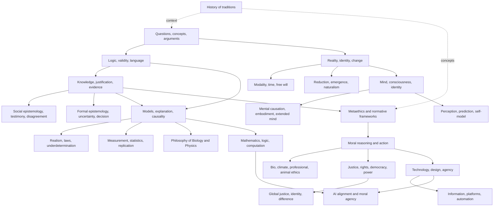

# Philosophy — Conceptual Dependencies

Đây là graph điều hướng, không phải một syllabus cứng. Mũi tên biểu diễn concept nên có trước để đọc một chapter mà không biến premise thành black box.

## Các route chính

### Claim → evidence → model

`00_philosophical_reasoning` → `01_epistemology` → `03_philosophy_of_science` → `90_connections/00`.

### Reality → mind → agency

`02_metaphysics` → `04_philosophy_of_mind` → `05_ethics` → `07_philosophy_of_technology`.

### Value → institution → technology

`05_ethics` → `06_social_political_philosophy` → `07_philosophy_of_technology` → `90_connections/03–04`.

### History as context

`08_history_of_philosophy` không phải prerequisite tuyệt đối; đọc song song để biết mỗi concept xuất hiện nhằm xử lý problem nào và đã bị phản biện ra sao.

## Quy tắc link

Mỗi chapter mới nên có ít nhất một link ngược đến prerequisite, một link sang downstream implication và một link sang domain thực nghiệm hoặc kỹ thuật khi claim cần evidence ngoài Philosophy.
