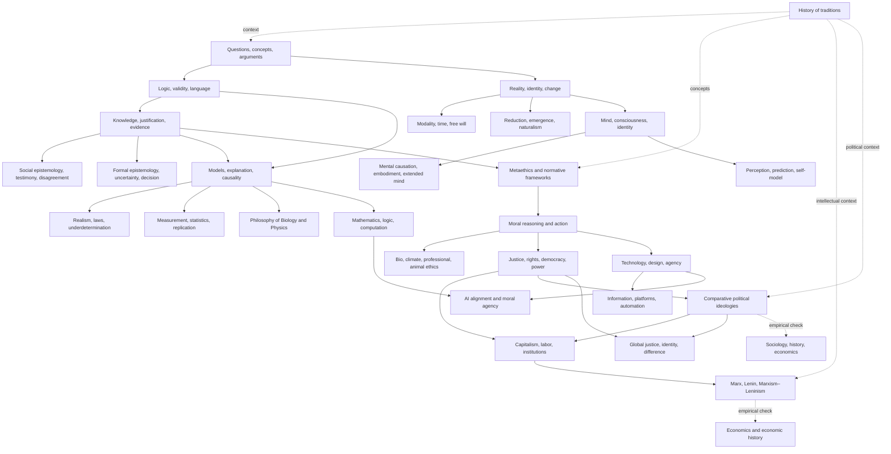

# Philosophy — Conceptual Dependencies

Đây là graph điều hướng, không phải một syllabus cứng. Mũi tên biểu diễn concept nên có trước để đọc một chapter mà không biến premise thành black box.

```mermaid
flowchart TD
    R[Questions, concepts, arguments]
    R --> L[Logic, validity, language]
    L --> E[Knowledge, justification, evidence]
    E --> SE[Social epistemology, testimony, disagreement]
    E --> F[Formal epistemology, uncertainty, decision]
    R --> M[Reality, identity, change]
    M --> MOD[Modality, time, free will]
    M --> RED[Reduction, emergence, naturalism]
    L --> S[Models, explanation, causality]
    E --> S
    S --> SR[Realism, laws, underdetermination]
    S --> MS[Measurement, statistics, replication]
    S --> PB[Philosophy of Biology and Physics]
    M --> Mind[Mind, consciousness, identity]
    Mind --> MC[Mental causation, embodiment, extended mind]
    Mind --> PS[Perception, prediction, self-model]
    E --> Meta[Metaethics and normative frameworks]
    Meta --> Ethics[Moral reasoning and action]
    Ethics --> Applied[Bio, climate, professional, animal ethics]
    Ethics --> Pol[Justice, rights, democracy, power]
    Pol --> EconPol[Capitalism, labor, institutions]
    EconPol --> ML[Marx, Lenin, Marxism–Leninism]
    ML -. empirical check .-> Econ[Economics and economic history]
    Pol --> Ideo[Comparative political ideologies]
    Ideo --> EconPol
    Ideo --> Global[Global justice, identity, difference]
    Ideo -. empirical check .-> Soc[Sociology, history, economics]
    Pol --> Global
    Ethics --> Tech[Technology, design, agency]
    Tech --> Info[Information, platforms, automation]
    Tech --> AI[AI alignment and moral agency]
    S --> Math[Mathematics, logic, computation]
    Math --> AI
    History[History of traditions] -. context .-> R
    History -. concepts .-> Meta
    History -. intellectual context .-> ML
    History -. political context .-> Ideo
```

## Các route chính

### Claim → evidence → model

`00_philosophical_reasoning` → `01_epistemology` → `03_philosophy_of_science` → `90_connections/00`.

### Reality → mind → agency

`02_metaphysics` → `04_philosophy_of_mind` → `05_ethics` → `07_philosophy_of_technology`.

### Value → institution → technology

`05_ethics` → `06_social_political_philosophy` → `07_philosophy_of_technology` → `90_connections/03–04`.

### Political economy → Marx/Lenin → evidence

`06_social_political_philosophy/02_capitalism_labor_and_institutions.md` → `06_social_political_philosophy/04_marxism_leninism/README.md` → `../economics/06_economic_history_institutions/README.md`.

Route này giữ ba layer tách biệt: philosophical argument về property/power, intellectual genealogy của Marx–Lenin–Marxism–Leninism, và empirical evaluation bằng economics/history. Một layer không được dùng làm shortcut thay layer khác.

### Political foundations → ideology comparison → institutions

`06_social_political_philosophy/00_justice_power_and_legitimacy.md` → `06_social_political_philosophy/05_political_ideologies/README.md` → `06_social_political_philosophy/05_political_ideologies/09_comparative_synthesis.md` → `06_social_political_philosophy/02_capitalism_labor_and_institutions.md` / empirical owners.

Route này không dùng ideology label như verdict. Nó phân rã mỗi tradition thành conception of freedom, authority, property, equality, community, voice/exit/contest, institutional mechanism và failure mode; claim về actual outcomes phải chuyển sang Economics, Sociology hoặc History.

### History as context

`08_history_of_philosophy` không phải prerequisite tuyệt đối; đọc song song để biết mỗi concept xuất hiện nhằm xử lý problem nào và đã bị phản biện ra sao. Với political ideology, intellectual history cũng giúp tránh gán một contemporary party position ngược thành definition timeless của cả tradition.

## Quy tắc link

Mỗi chapter mới nên có ít nhất một link ngược đến prerequisite, một link sang downstream implication và một link sang domain thực nghiệm hoặc kỹ thuật khi claim cần evidence ngoài Philosophy.
