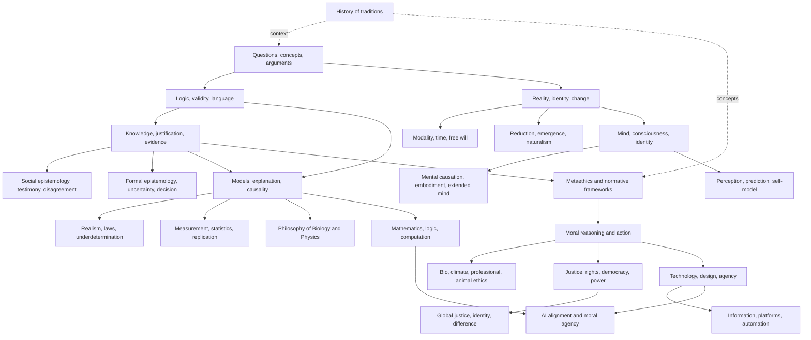

# Philosophy — Conceptual Dependencies

> **Mạch đọc:** Đặt **Philosophy — Conceptual Dependencies** trong bản đồ [README](./README.md) để thấy đơn vị sở hữu (owner / 오너) và vị trí của nó. Nội dung đi từ **Các tuyến (route / 경로) chính** sang **Claim → bằng chứng (evidence / 증거) → mô hình (model / 모델)**; điểm nối này chuẩn bị câu hỏi cho các mục sau thay vì dừng ở định nghĩa đầu tiên.

Đây là đồ thị (graph / 그래프) điều hướng, không phải một syllabus cứng. Mũi tên biểu diễn concept nên có trước để đọc một chapter mà không biến premise thành black box.

```mermaid
flowchart TD
    R[Questions, concepts, arguments]
    R --> L[Logic, validity, language]
    L --> E[Knowledge, justification, evidence]
    E --> SE[Social epistemology, testimony, disagreement]
    E --> F[Formal epistemology, uncertainty, decision]
    R --> M[Reality, identity, change]
    M --> MOD[Modality, time, free will]
    M --> RED[Reduction, emergence, naturalism]
    L --> S[Models, explanation, causality]
    E --> S
    S --> SR[Realism, laws, underdetermination]
    S --> MS[Measurement, statistics, replication]
    S --> PB[Philosophy of Biology and Physics]
    M --> Mind[Mind, consciousness, identity]
    Mind --> MC[Mental causation, embodiment, extended mind]
    Mind --> PS[Perception, prediction, self-model]
    E --> Meta[Metaethics and normative frameworks]
    Meta --> Ethics[Moral reasoning and action]
    Ethics --> Applied[Bio, climate, professional, animal ethics]
    Ethics --> Pol[Justice, rights, democracy, power]
    Pol --> Global[Global justice, identity, difference]
    Ethics --> Tech[Technology, design, agency]
    Tech --> Info[Information, platforms, automation]
    Tech --> AI[AI alignment and moral agency]
    S --> Math[Mathematics, logic, computation]
    Math --> AI
    History[History of traditions] -. context .-> R
    History -. concepts .-> Meta
```

## Các tuyến (route / 경로) chính

### Claim → bằng chứng (evidence / 증거) → mô hình (model / 모델)

`00_philosophical_reasoning` → `01_epistemology` → `03_philosophy_of_science` → `90_connections/00`.

### Reality → mind → agency

`02_metaphysics` → `04_philosophy_of_mind` → `05_ethics` → `07_philosophy_of_technology`.

### Giá trị (value / 값) → institution → technology

`05_ethics` → `06_social_political_philosophy` → `07_philosophy_of_technology` → `90_connections/03–04`.

### Lịch sử (history / 이력) as ngữ cảnh (context / 맥락)

`08_history_of_philosophy` không phải prerequisite tuyệt đối; đọc song song để biết mỗi concept xuất hiện nhằm xử lý bài toán (problem / 문제) nào và đã bị phản biện ra sao.

> **Chuyển mạch:** Từ **Các tuyến (route / 경로) chính**, ta sang **Quy tắc link** để mở rộng cùng câu hỏi và dùng kết quả đó để khép lại mạch giải thích.

## Quy tắc link

Mỗi chapter mới nên có ít nhất một link ngược đến prerequisite, một link sang downstream implication và một link sang lĩnh vực (domain / 도메인) thực nghiệm hoặc kỹ thuật khi claim cần bằng chứng (evidence / 증거) ngoài Philosophy.

> **Bàn giao:** Sau **Quy tắc link**, hãy chốt bất biến (invariant / 불변식) và giới hạn của mục này trước khi nối sang kiến thức kế tiếp. Có thể đọc tiếp [COVERAGE AUDIT](./COVERAGE_AUDIT.md) để đối chiếu ranh giới (boundary / 경계) gần nhất.
