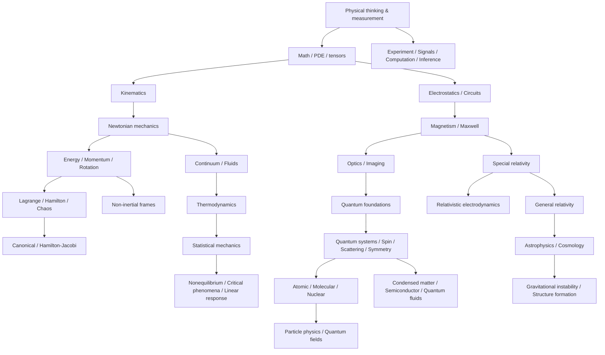

# Thư viện Kiến thức Vật lý

Bộ tài liệu này là một **Knowledge Library về Vật lý**, viết chủ yếu bằng tiếng Việt và tổ chức theo **sự phụ thuộc khái niệm (concept dependency)**. Mục tiêu không phải học thuộc công thức theo cấp độ Beginner → Advanced, mà đi theo chuỗi:

> hiện tượng → đại lượng đo được → mô hình → quan hệ toán học → suy dẫn → giả định → miền áp dụng → giới hạn → liên kết kiến thức.

Thư viện hiện có **88 file Markdown**, bao phủ nền tảng Vật lý đại cương và core undergraduate, kèm các cầu nối có chọn lọc sang advanced undergraduate/graduate topics. Đây không phải một encyclopedia cho mọi specialization.

## Quan hệ phụ thuộc tổng quát

Nếu xây lại nền tảng từ đầu, bắt đầu ở `00_foundations` và đi theo dependency graph. Nếu học một chủ đề cụ thể, có thể vào thẳng chapter và dùng phần **Knowledge Connection** để quay lại prerequisite hoặc đi tiếp.

# Mục lục

## 00 — Nền tảng và ngôn ngữ
- [Tư duy Vật lý và First-Principles Thinking](00_foundations/00_physical_thinking.md)
- [Đại lượng, đơn vị, thứ nguyên và bất định đo lường](00_foundations/01_measurement_units_uncertainty.md)
- [Không gian, thời gian, vector và hệ quy chiếu](00_foundations/02_space_time_vectors_frames.md)
- [Ngôn ngữ Toán học tối thiểu để đọc Vật lý](00_foundations/03_mathematical_language.md)
- [Đối xứng, bảo toàn, xấp xỉ và thang đo](00_foundations/04_symmetry_conservation_scale.md)
- [PDE, boundary conditions, Green function và tensor](00_foundations/05_pde_boundary_green_tensors.md)

## 01 — Cơ học
- [Động học](01_mechanics/00_kinematics.md)
- [Định luật Newton và động lực học](01_mechanics/01_newton_laws_dynamics.md)
- [Các lực thường gặp](01_mechanics/02_common_forces.md)
- [Công, năng lượng, thế năng và công suất](01_mechanics/03_work_energy_power.md)
- [Động lượng, xung lượng, va chạm và tâm khối](01_mechanics/04_momentum_collisions.md)
- [Chuyển động quay và vật rắn](01_mechanics/05_rotation_rigid_body.md)
- [Hấp dẫn và quỹ đạo](01_mechanics/06_gravitation_orbits.md)
- [Cân bằng, đàn hồi và cơ học vật liệu](01_mechanics/07_statics_elasticity_materials.md)
- [Cơ học giải tích: Lagrangian và Hamiltonian](01_mechanics/08_analytical_mechanics.md)
- [Động lực học phi tuyến và chaos](01_mechanics/09_nonlinear_dynamics_chaos.md)
- [Poisson bracket, canonical transformation và Hamilton–Jacobi](01_mechanics/10_canonical_transformations_hamilton_jacobi.md)
- [Hệ quy chiếu phi quán tính, Coriolis và rotating frames](01_mechanics/11_non_inertial_frames_rotating_systems.md)

## 02 — Dao động và sóng
- [Dao động, damping, driven systems và resonance](02_oscillations_waves/00_oscillations_resonance.md)
- [Sóng, wave equation, Fourier và âm thanh](02_oscillations_waves/01_waves_fourier_sound.md)
- [Coupled oscillators và normal modes](02_oscillations_waves/02_coupled_oscillators_normal_modes.md)

## 03 — Môi trường liên tục và transport
- [Cơ học chất lưu](03_continuum/00_fluids.md)
- [Sức căng bề mặt, wetting và mao dẫn](03_continuum/01_surface_tension_capillarity.md)
- [Khuếch tán, dẫn nhiệt và transport](03_continuum/02_transport_diffusion_heat.md)
- [Turbulence, rheology và soft matter](03_continuum/03_turbulence_rheology_soft_matter.md)
- [Continuum mechanics, stress tensor và strain tensor](03_continuum/04_continuum_mechanics_stress_tensor.md)

## 04 — Nhiệt động lực học và Statistical Physics
- [Nhiệt động lực học](04_thermal_statistical/00_thermodynamics.md)
- [Entropy và cơ học thống kê](04_thermal_statistical/01_entropy_statistical_mechanics.md)
- [Chuyển pha và truyền nhiệt](04_thermal_statistical/02_phase_transitions_heat_transfer.md)
- [Ensemble và partition function](04_thermal_statistical/03_ensembles_partition_functions.md)
- [Stochastic dynamics và nonequilibrium statistical physics](04_thermal_statistical/04_stochastic_nonequilibrium.md)
- [Critical phenomena, universality và renormalization](04_thermal_statistical/05_critical_phenomena_renormalization.md)
- [Kinetic theory và Boltzmann equation](04_thermal_statistical/06_kinetic_theory_boltzmann_equation.md)
- [Linear response và fluctuation–dissipation](04_thermal_statistical/07_linear_response_fluctuation_dissipation.md)

## 05 — Điện từ học
- [Điện tĩnh học](05_electromagnetism/00_electrostatics.md)
- [Mạch DC](05_electromagnetism/01_dc_circuits.md)
- [Mạch AC, phasor và RLC](05_electromagnetism/02_ac_rlc_circuits.md)
- [Từ trường và cảm ứng điện từ](05_electromagnetism/03_magnetism_induction.md)
- [Maxwell equations và sóng điện từ](05_electromagnetism/04_maxwell_em_waves.md)
- [Transmission line và waveguide](05_electromagnetism/05_transmission_lines_waveguides.md)
- [Electromagnetic potentials và gauge](05_electromagnetism/06_potentials_gauge.md)
- [Điện từ trường trong vật chất](05_electromagnetism/07_fields_in_matter_dielectrics_magnetism.md)
- [Bức xạ điện từ, scattering và antenna](05_electromagnetism/08_radiation_scattering_antennas.md)
- [Relativistic electrodynamics](05_electromagnetism/09_relativistic_electrodynamics.md)
- [Boundary-value electrostatics, method of images và multipoles](05_electromagnetism/10_boundary_value_image_multipoles.md)

## 06 — Quang học
- [Quang hình học](06_optics/00_geometric_optics.md)
- [Quang học sóng](06_optics/01_wave_optics.md)
- [Photon, laser và coherence](06_optics/02_photons_lasers_coherence.md)
- [Polarization, dispersion và nonlinear optics](06_optics/03_polarization_dispersion_nonlinear_optics.md)
- [Fourier optics và imaging systems](06_optics/04_fourier_imaging_instrumentation.md)

## 07 — Thuyết tương đối
- [Thuyết tương đối hẹp](07_relativity/00_special_relativity.md)
- [Thuyết tương đối rộng](07_relativity/01_general_relativity.md)

## 08 — Vật lý lượng tử
- [Nền tảng lượng tử](08_quantum/00_quantum_foundations.md)
- [Các hệ lượng tử mẫu](08_quantum/01_quantum_systems.md)
- [Angular momentum và spin](08_quantum/02_angular_momentum_spin.md)
- [Measurement, entanglement và decoherence](08_quantum/03_measurement_entanglement_decoherence.md)
- [Perturbation, variational và approximation methods](08_quantum/04_approximation_perturbation.md)
- [Hạt đồng nhất và thống kê lượng tử](08_quantum/05_identical_particles_quantum_statistics.md)
- [Time-dependent quantum dynamics và scattering](08_quantum/06_time_dependent_scattering.md)
- [Symmetry, generators, commutators và path integral](08_quantum/07_symmetry_operator_path_integral.md)

## 09 — Nguyên tử, phân tử, hạt nhân và hạt cơ bản
- [Vật lý nguyên tử](09_atomic_nuclear_particle/00_atomic_physics.md)
- [Vật lý hạt nhân](09_atomic_nuclear_particle/01_nuclear_physics.md)
- [Bức xạ ion hóa và detector](09_atomic_nuclear_particle/02_radiation_detection.md)
- [Hạt cơ bản và Standard Model](09_atomic_nuclear_particle/03_particle_standard_model.md)
- [Vật lý phân tử](09_atomic_nuclear_particle/04_molecular_physics.md)
- [Quantum fields, gauge symmetry và interactions](09_atomic_nuclear_particle/05_quantum_fields_symmetry_interactions.md)

## 10 — Condensed Matter, bán dẫn, plasma và quantum fluids
- [Crystal lattice, bands, Fermi level và phonons](10_condensed_matter_devices/00_crystals_bands.md)
- [Bán dẫn, P–N junction, diode, MOSFET và CMOS](10_condensed_matter_devices/01_semiconductors_devices.md)
- [Transport, Hall effect, magnetism và superconductivity](10_condensed_matter_devices/02_transport_magnetism_superconductivity.md)
- [Plasma physics](10_condensed_matter_devices/03_plasma_physics.md)
- [Phonons, defects, quasiparticles và topological matter](10_condensed_matter_devices/04_phonons_defects_topological_matter.md)
- [Bose–Einstein condensation, superfluidity và quantum fluids](10_condensed_matter_devices/05_bec_superfluid_quantum_fluids.md)
- [Berry phase, Quantum Hall và topology](10_condensed_matter_devices/06_berry_phase_quantum_hall_topology.md)

## 11 — Thiên văn vật lý và vũ trụ học
- [Vật lý sao và compact objects](11_astrophysics_cosmology/00_stars_compact_objects.md)
- [Thiên hà và vũ trụ học](11_astrophysics_cosmology/01_galaxies_cosmology.md)
- [Observational astrophysics và radiative transfer](11_astrophysics_cosmology/02_observational_astrophysics_radiative_transfer.md)
- [Vũ trụ sơ khai, dark matter và dark energy](11_astrophysics_cosmology/03_early_universe_dark_components.md)
- [Gravitational instability và structure formation](11_astrophysics_cosmology/04_gravitational_instability_structure_formation.md)

## 12 — Thực nghiệm, tín hiệu, tính toán và inference
- [Vật lý thực nghiệm, calibration và uncertainty](12_experimental_computational/00_measurement_experiment.md)
- [Signal, noise, sampling, PSD và ADC](12_experimental_computational/01_signals_sampling_noise.md)
- [Vật lý tính toán và numerical methods](12_experimental_computational/02_computational_physics.md)
- [Data inference, model fitting và inverse problems](12_experimental_computational/03_data_inference_inverse_problems.md)

## 13 — Knowledge graph, navigation và quality audit
- [Knowledge Connections](13_connections/00_knowledge_connections.md)
- [Glossary Việt – English – 한국어 và navigation](13_connections/01_glossary_navigation.md)
- [Coverage Audit](13_connections/02_coverage_audit.md)
- [Cẩm nang giải quyết bài toán Vật lý](13_connections/03_problem_solving_playbook.md)
- [Ngộ nhận thường gặp và giới hạn mô hình](13_connections/04_common_misconceptions_and_model_limits.md)

## Quy ước biên soạn

Thuật ngữ quan trọng ưu tiên dạng `Tên tiếng Việt (English term / 한국어 용어)` tại lần xuất hiện có ý nghĩa đầu tiên. English/Korean được dùng để tra textbook, paper, documentation và tài liệu kỹ thuật, không thay phần giải thích tiếng Việt.

Một chapter core nên làm rõ: câu hỏi vật lý, định nghĩa đại lượng, mô hình và giả định, derivation/reasoning, đơn vị và limiting cases, worked reasoning, miền hiệu lực, failure modes, common misconceptions và knowledge connections.

Xem [Coverage Audit](13_connections/02_coverage_audit.md) để theo dõi độ sâu và intentional scope của library.