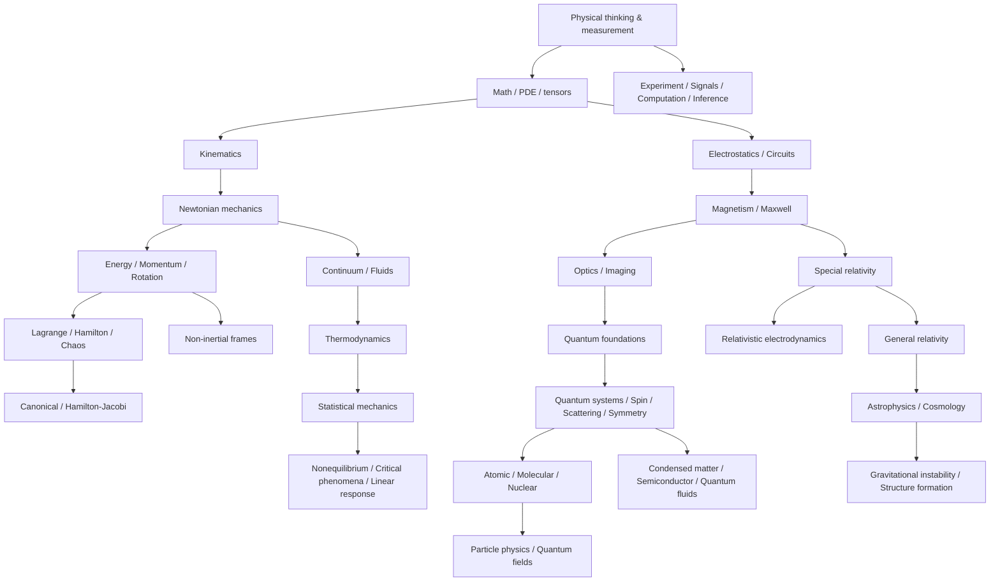

# Thư viện Kiến thức Vật lý

> **Mạch đọc:** Đây là README owner của **Thư viện Kiến thức Vật lý**. Route đọc đi từ foundations/mathematical language → mechanics/fields → thermal/quantum/relativity → matter/astrophysics → experiment/connections, để mỗi nhánh nối mô hình với phép đo và giới hạn áp dụng.

Bộ tài liệu này là một **thư viện kiến thức (knowledge library / 지식 라이브러리) về Vật lý**, viết chủ yếu bằng tiếng Việt và tổ chức theo **sự phụ thuộc khái niệm (concept dependency)**. Mục tiêu không phải học thuộc công thức theo cấp độ Beginner → Advanced, mà đi theo chuỗi:

> hiện tượng → đại lượng đo được → mô hình → quan hệ toán học → suy dẫn → giả định → miền áp dụng → giới hạn → liên kết kiến thức.

Thư viện hiện có **88 tệp (file / 파일) Markdown**, bao phủ nền tảng Vật lý đại cương và cốt lõi (core / 핵심) undergraduate, kèm các cầu nối có chọn lọc sang advanced undergraduate/graduate topics. Đây không phải một encyclopedia cho mọi specialization.

## Quan hệ phụ thuộc tổng quát

Sơ đồ này mô tả cách Physics đi từ measurement và conservation tới các mô hình cơ học, trường, vật chất và vũ trụ. Mỗi nhánh giữ lại câu hỏi về scale, approximation và evidence để công thức không bị tách khỏi hiện tượng.


```mermaid
graph TD
    A[Physical thinking & measurement] --> B[Math / PDE / tensors]
    B --> C[Kinematics]
    C --> D[Newtonian mechanics]
    D --> E[Energy / Momentum / Rotation]
    E --> F[Lagrange / Hamilton / Chaos]
    E --> NI[Non-inertial frames]
    F --> HJ[Canonical / Hamilton-Jacobi]
    D --> G[Continuum / Fluids]
    G --> H[Thermodynamics]
    H --> S[Statistical mechanics]
    S --> NE[Nonequilibrium / Critical phenomena / Linear response]
    B --> EM[Electrostatics / Circuits]
    EM --> MX[Magnetism / Maxwell]
    MX --> OPT[Optics / Imaging]
    MX --> SR[Special relativity]
    SR --> RE[Relativistic electrodynamics]
    SR --> GR[General relativity]
    OPT --> Q[Quantum foundations]
    Q --> QM[Quantum systems / Spin / Scattering / Symmetry]
    QM --> AP[Atomic / Molecular / Nuclear]
    QM --> CM[Condensed matter / Semiconductor / Quantum fluids]
    AP --> QFT[Particle physics / Quantum fields]
    GR --> AST[Astrophysics / Cosmology]
    AST --> SF[Gravitational instability / Structure formation]
    A --> EXP[Experiment / Signals / Computation / Inference]
```

Nếu xây lại nền tảng từ đầu, bắt đầu ở `00_foundations` và đi theo phụ thuộc (dependency / 의존성) đồ thị (graph / 그래프). Nếu học một chủ đề cụ thể, có thể vào thẳng chapter và dùng phần **liên kết kiến thức (knowledge connection / 지식 연결)** để quay lại prerequisite hoặc đi tiếp.

> **Chuyển mạch:** Trong **Thư viện Kiến thức Vật lý**, **Điểm nối sang Electrical kỹ thuật (engineering / 엔지니어링)** tiếp nhận điểm tựa từ **Quan hệ phụ thuộc tổng quát** nhưng đổi góc nhìn sang câu hỏi của chính nó; đọc liền hai mục để thấy mối quan hệ đó. Từ đây, **00 — Nền tảng và ngôn ngữ** sẽ cho biết hệ quả hoặc giới hạn ấy hiện ra ở đâu.

## Điểm nối sang Electrical kỹ thuật (engineering / 엔지니어링)

Physics dừng ở việc mô tả các định luật và giới hạn tự nhiên. Khi câu hỏi chuyển sang **chọn topology, thiết kế mạch, quản lý timing/power, đóng vòng điều khiển hoặc biến peripheral thành software đặc tả hợp đồng (contract / 계약)**, hãy đi tiếp sang [Electrical Engineering Knowledge Library](../electrical_engineering/README.md). tuyến (route / 경로) cầu nối (bridge / 브리지) là:

```text
Maxwell / circuits / semiconductor / signal-noise
→ electronics
→ digital logic
→ computer architecture
→ embedded
→ software
```

# Mục lục

Mục lục dưới đây là một tuyến giảng từ ngôn ngữ vật lý tới các domain chuyên sâu. Hãy chọn chapter theo prerequisite của câu hỏi, rồi quay lại knowledge graph khi cần nối các mô hình ở scale khác.

> **Chuyển mạch:** Ở chặng này của **Thư viện Kiến thức Vật lý**, **00 — Nền tảng và ngôn ngữ** tiếp nhận điểm tựa từ **Điểm nối sang Electrical kỹ thuật (engineering / 엔지니어링)** nhưng đổi góc nhìn sang câu hỏi của chính nó; đọc liền hai mục để thấy mối quan hệ đó. Từ đây, **01 — Cơ học** sẽ cho biết hệ quả hoặc giới hạn ấy hiện ra ở đâu.

## 00 — Nền tảng và ngôn ngữ

Nhóm này dựng measurement, vector, đơn vị và conservation trước khi đi vào mô hình chuyên sâu. Hãy dùng nó như vocabulary chung cho mọi chapter phía sau.
- [Tư duy Vật lý và First-Principles Thinking](00_foundations/00_physical_thinking.md)
- [Đại lượng, đơn vị, thứ nguyên và bất định đo lường](00_foundations/01_measurement_units_uncertainty.md)
- [Không gian, thời gian, vector và hệ quy chiếu](00_foundations/02_space_time_vectors_frames.md)
- [Ngôn ngữ Toán học tối thiểu để đọc Vật lý](00_foundations/03_mathematical_language.md)
- [Đối xứng, bảo toàn, xấp xỉ và thang đo](00_foundations/04_symmetry_conservation_scale.md)
- [PDE, boundary conditions, Green function và tensor](00_foundations/05_pde_boundary_green_tensors.md)

> **Chuyển mạch:** Đặt trong câu hỏi lớn của **Thư viện Kiến thức Vật lý**, **01 — Cơ học** tiếp nhận điểm tựa từ **00 — Nền tảng và ngôn ngữ** nhưng đổi góc nhìn sang câu hỏi của chính nó; đọc liền hai mục để thấy mối quan hệ đó. Từ đây, **02 — Dao động và sóng** sẽ cho biết hệ quả hoặc giới hạn ấy hiện ra ở đâu.

## 01 — Cơ học

Cơ học bắt đầu từ chuyển động và lực rồi mở rộng sang năng lượng, động lượng, quay và hệ nhiều vật. Các chapter nối phương trình với constraint và quan sát được.
- [Động học](01_mechanics/00_kinematics.md)
- [Định luật Newton và động lực học](01_mechanics/01_newton_laws_dynamics.md)
- [Các lực thường gặp](01_mechanics/02_common_forces.md)
- [Công, năng lượng, thế năng và công suất](01_mechanics/03_work_energy_power.md)
- [Động lượng, xung lượng, va chạm và tâm khối](01_mechanics/04_momentum_collisions.md)
- [Chuyển động quay và vật rắn](01_mechanics/05_rotation_rigid_body.md)
- [Hấp dẫn và quỹ đạo](01_mechanics/06_gravitation_orbits.md)
- [Cân bằng, đàn hồi và cơ học vật liệu](01_mechanics/07_statics_elasticity_materials.md)
- [Cơ học giải tích: Lagrangian và Hamiltonian](01_mechanics/08_analytical_mechanics.md)
- [Động lực học phi tuyến và chaos](01_mechanics/09_nonlinear_dynamics_chaos.md)
- [Poisson bracket, canonical transformation và Hamilton–Jacobi](01_mechanics/10_canonical_transformations_hamilton_jacobi.md)
- [Hệ quy chiếu phi quán tính, Coriolis và rotating frames](01_mechanics/11_non_inertial_frames_rotating_systems.md)

> **Chuyển mạch:** Trong **Thư viện Kiến thức Vật lý**, **02 — Dao động và sóng** tiếp nhận điểm tựa từ **01 — Cơ học** nhưng đổi góc nhìn sang câu hỏi của chính nó; đọc liền hai mục để thấy mối quan hệ đó. Từ đây, **03 — Môi trường liên tục và transport** sẽ cho biết hệ quả hoặc giới hạn ấy hiện ra ở đâu.

## 02 — Dao động và sóng

Nhóm này giải thích cách năng lượng và thông tin truyền qua dao động, cộng hưởng và môi trường. Nó là cầu nối tự nhiên tới âm thanh, quang học và hệ liên tục.
- [Dao động, damping, driven systems và resonance](02_oscillations_waves/00_oscillations_resonance.md)
- [Sóng, wave equation, Fourier và âm thanh](02_oscillations_waves/01_waves_fourier_sound.md)
- [Coupled oscillators và normal modes](02_oscillations_waves/02_coupled_oscillators_normal_modes.md)

> **Chuyển mạch:** Ở chặng này của **Thư viện Kiến thức Vật lý**, **03 — Môi trường liên tục và transport** tiếp nhận điểm tựa từ **02 — Dao động và sóng** nhưng đổi góc nhìn sang câu hỏi của chính nó; đọc liền hai mục để thấy mối quan hệ đó. Từ đây, **04 — Nhiệt động lực học và Statistical Physics** sẽ cho biết hệ quả hoặc giới hạn ấy hiện ra ở đâu.

## 03 — Môi trường liên tục và transport

Phần này chuyển từ hạt riêng lẻ sang trường, dòng và gradient. Hãy theo dõi conservation law cùng điều kiện biên để hiểu diffusion, fluid và heat transport.
- [Cơ học chất lưu](03_continuum/00_fluids.md)
- [Sức căng bề mặt, wetting và mao dẫn](03_continuum/01_surface_tension_capillarity.md)
- [Khuếch tán, dẫn nhiệt và transport](03_continuum/02_transport_diffusion_heat.md)
- [Turbulence, rheology và soft matter](03_continuum/03_turbulence_rheology_soft_matter.md)
- [Continuum mechanics, stress tensor và strain tensor](03_continuum/04_continuum_mechanics_stress_tensor.md)

> **Chuyển mạch:** Đặt trong câu hỏi lớn của **Thư viện Kiến thức Vật lý**, **04 — Nhiệt động lực học và Statistical Physics** tiếp nhận điểm tựa từ **03 — Môi trường liên tục và transport** nhưng đổi góc nhìn sang câu hỏi của chính nó; đọc liền hai mục để thấy mối quan hệ đó. Từ đây, **05 — Điện từ học** sẽ cho biết hệ quả hoặc giới hạn ấy hiện ra ở đâu.

## 04 — Nhiệt động lực học và Statistical Physics

Nhiệt động lực học nối vi trạng thái với đại lượng vĩ mô, entropy và mũi tên thời gian. Statistical Physics giải thích vì sao các quy luật trung bình xuất hiện từ nhiều degrees of freedom.
- [Nhiệt động lực học](04_thermal_statistical/00_thermodynamics.md)
- [Entropy và cơ học thống kê](04_thermal_statistical/01_entropy_statistical_mechanics.md)
- [Chuyển pha và truyền nhiệt](04_thermal_statistical/02_phase_transitions_heat_transfer.md)
- [Ensemble và partition function](04_thermal_statistical/03_ensembles_partition_functions.md)
- [Stochastic dynamics và nonequilibrium statistical physics](04_thermal_statistical/04_stochastic_nonequilibrium.md)
- [Critical phenomena, universality và renormalization](04_thermal_statistical/05_critical_phenomena_renormalization.md)
- [Kinetic theory và Boltzmann equation](04_thermal_statistical/06_kinetic_theory_boltzmann_equation.md)
- [Linear response và fluctuation–dissipation](04_thermal_statistical/07_linear_response_fluctuation_dissipation.md)

> **Chuyển mạch:** Trong **Thư viện Kiến thức Vật lý**, **05 — Điện từ học** tiếp nhận điểm tựa từ **04 — Nhiệt động lực học và Statistical Physics** nhưng đổi góc nhìn sang câu hỏi của chính nó; đọc liền hai mục để thấy mối quan hệ đó. Từ đây, **06 — Quang học** sẽ cho biết hệ quả hoặc giới hạn ấy hiện ra ở đâu.

## 05 — Điện từ học

Điện từ học thống nhất điện tích, dòng, trường và sóng. Đọc theo Maxwell giúp thấy mối liên hệ giữa nguồn, boundary và năng lượng truyền trong field.
- [Điện tĩnh học](05_electromagnetism/00_electrostatics.md)
- [Mạch DC](05_electromagnetism/01_dc_circuits.md)
- [Mạch AC, phasor và RLC](05_electromagnetism/02_ac_rlc_circuits.md)
- [Từ trường và cảm ứng điện từ](05_electromagnetism/03_magnetism_induction.md)
- [Maxwell equations và sóng điện từ](05_electromagnetism/04_maxwell_em_waves.md)
- [Transmission line và waveguide](05_electromagnetism/05_transmission_lines_waveguides.md)
- [Electromagnetic potentials và gauge](05_electromagnetism/06_potentials_gauge.md)
- [Điện từ trường trong vật chất](05_electromagnetism/07_fields_in_matter_dielectrics_magnetism.md)
- [Bức xạ điện từ, scattering và antenna](05_electromagnetism/08_radiation_scattering_antennas.md)
- [Relativistic electrodynamics](05_electromagnetism/09_relativistic_electrodynamics.md)
- [Boundary-value electrostatics, method of images và multipoles](05_electromagnetism/10_boundary_value_image_multipoles.md)

> **Chuyển mạch:** Ở chặng này của **Thư viện Kiến thức Vật lý**, **06 — Quang học** tiếp nhận điểm tựa từ **05 — Điện từ học** nhưng đổi góc nhìn sang câu hỏi của chính nó; đọc liền hai mục để thấy mối quan hệ đó. Từ đây, **07 — Thuyết tương đối** sẽ cho biết hệ quả hoặc giới hạn ấy hiện ra ở đâu.

## 06 — Quang học

Quang học đi từ ray và wave tới giao thoa, nhiễu xạ và hệ imaging. Mỗi approximation chỉ đúng trong một scale, nên cần giữ rõ khi nào dùng geometric hay wave optics.
- [Quang hình học](06_optics/00_geometric_optics.md)
- [Quang học sóng](06_optics/01_wave_optics.md)
- [Photon, laser và coherence](06_optics/02_photons_lasers_coherence.md)
- [Polarization, dispersion và nonlinear optics](06_optics/03_polarization_dispersion_nonlinear_optics.md)
- [Fourier optics và imaging systems](06_optics/04_fourier_imaging_instrumentation.md)

> **Chuyển mạch:** Đặt trong câu hỏi lớn của **Thư viện Kiến thức Vật lý**, **07 — Thuyết tương đối** tiếp nhận điểm tựa từ **06 — Quang học** nhưng đổi góc nhìn sang câu hỏi của chính nó; đọc liền hai mục để thấy mối quan hệ đó. Từ đây, **08 — Vật lý lượng tử** sẽ cho biết hệ quả hoặc giới hạn ấy hiện ra ở đâu.

## 07 — Thuyết tương đối

Relativity thay đổi cách hiểu không gian, thời gian và năng lượng khi vận tốc hoặc gravity đáng kể. Hãy bắt đầu từ invariant rồi mới diễn giải các hiệu ứng quan sát được.
- [Thuyết tương đối hẹp](07_relativity/00_special_relativity.md)
- [Thuyết tương đối rộng](07_relativity/01_general_relativity.md)

> **Chuyển mạch:** Trong **Thư viện Kiến thức Vật lý**, **08 — Vật lý lượng tử** tiếp nhận điểm tựa từ **07 — Thuyết tương đối** nhưng đổi góc nhìn sang câu hỏi của chính nó; đọc liền hai mục để thấy mối quan hệ đó. Từ đây, **09 — Nguyên tử, phân tử, hạt nhân và hạt cơ bản** sẽ cho biết hệ quả hoặc giới hạn ấy hiện ra ở đâu.

## 08 — Vật lý lượng tử

Quantum Physics mô tả trạng thái, phép đo và xác suất ở scale vi mô. Các chapter nối formalism với giới hạn đo lường và công nghệ quantum.
- [Nền tảng lượng tử](08_quantum/00_quantum_foundations.md)
- [Các hệ lượng tử mẫu](08_quantum/01_quantum_systems.md)
- [Angular momentum và spin](08_quantum/02_angular_momentum_spin.md)
- [Measurement, entanglement và decoherence](08_quantum/03_measurement_entanglement_decoherence.md)
- [Perturbation, variational và approximation methods](08_quantum/04_approximation_perturbation.md)
- [Hạt đồng nhất và thống kê lượng tử](08_quantum/05_identical_particles_quantum_statistics.md)
- [Time-dependent quantum dynamics và scattering](08_quantum/06_time_dependent_scattering.md)
- [Symmetry, generators, commutators và path integral](08_quantum/07_symmetry_operator_path_integral.md)

> **Chuyển mạch:** Ở chặng này của **Thư viện Kiến thức Vật lý**, **09 — Nguyên tử, phân tử, hạt nhân và hạt cơ bản** tiếp nhận điểm tựa từ **08 — Vật lý lượng tử** nhưng đổi góc nhìn sang câu hỏi của chính nó; đọc liền hai mục để thấy mối quan hệ đó. Từ đây, **10 — Condensed Matter, bán dẫn, plasma và quantum fluids** sẽ cho biết hệ quả hoặc giới hạn ấy hiện ra ở đâu.

## 09 — Nguyên tử, phân tử, hạt nhân và hạt cơ bản

Nhóm này áp dụng quantum và field vào cấu trúc vật chất từ nguyên tử tới hạt nhân và particle. Hãy đọc nó như chuỗi scale, không như danh sách hạt rời.
- [Vật lý nguyên tử](09_atomic_nuclear_particle/00_atomic_physics.md)
- [Vật lý hạt nhân](09_atomic_nuclear_particle/01_nuclear_physics.md)
- [Bức xạ ion hóa và detector](09_atomic_nuclear_particle/02_radiation_detection.md)
- [Hạt cơ bản và Standard Model](09_atomic_nuclear_particle/03_particle_standard_model.md)
- [Vật lý phân tử](09_atomic_nuclear_particle/04_molecular_physics.md)
- [Quantum fields, gauge symmetry và interactions](09_atomic_nuclear_particle/05_quantum_fields_symmetry_interactions.md)

> **Chuyển mạch:** Đặt trong câu hỏi lớn của **Thư viện Kiến thức Vật lý**, **10 — Condensed Matter, bán dẫn, plasma và quantum fluids** tiếp nhận điểm tựa từ **09 — Nguyên tử, phân tử, hạt nhân và hạt cơ bản** nhưng đổi góc nhìn sang câu hỏi của chính nó; đọc liền hai mục để thấy mối quan hệ đó. Từ đây, **11 — Thiên văn vật lý và vũ trụ học** sẽ cho biết hệ quả hoặc giới hạn ấy hiện ra ở đâu.

## 10 — Condensed Matter, bán dẫn, plasma và quantum fluids

Đây là nơi microscopic law trở thành tính chất vật liệu và thiết bị. Các chapter nối symmetry, excitations, transport và phase với công nghệ thực.
- [Crystal lattice, bands, Fermi level và phonons](10_condensed_matter_devices/00_crystals_bands.md)
- [Bán dẫn, P–N junction, diode, MOSFET và CMOS](10_condensed_matter_devices/01_semiconductors_devices.md)
- [Transport, Hall effect, magnetism và superconductivity](10_condensed_matter_devices/02_transport_magnetism_superconductivity.md)
- [Plasma physics](10_condensed_matter_devices/03_plasma_physics.md)
- [Phonons, defects, quasiparticles và topological matter](10_condensed_matter_devices/04_phonons_defects_topological_matter.md)
- [Bose–Einstein condensation, superfluidity và quantum fluids](10_condensed_matter_devices/05_bec_superfluid_quantum_fluids.md)
- [Berry phase, Quantum Hall và topology](10_condensed_matter_devices/06_berry_phase_quantum_hall_topology.md)

> **Chuyển mạch:** Trong **Thư viện Kiến thức Vật lý**, **11 — Thiên văn vật lý và vũ trụ học** tiếp nhận điểm tựa từ **10 — Condensed Matter, bán dẫn, plasma và quantum fluids** nhưng đổi góc nhìn sang câu hỏi của chính nó; đọc liền hai mục để thấy mối quan hệ đó. Từ đây, **12 — Thực nghiệm, tín hiệu, tính toán và inference** sẽ cho biết hệ quả hoặc giới hạn ấy hiện ra ở đâu.

## 11 — Thiên văn vật lý và vũ trụ học

Astrophysics dùng các mô hình Physics để suy luận từ tín hiệu xa về cấu trúc, tiến hóa sao và vũ trụ. Evidence và uncertainty đặc biệt quan trọng vì không thể thí nghiệm trực tiếp trên đối tượng.
- [Vật lý sao và compact objects](11_astrophysics_cosmology/00_stars_compact_objects.md)
- [Thiên hà và vũ trụ học](11_astrophysics_cosmology/01_galaxies_cosmology.md)
- [Observational astrophysics và radiative transfer](11_astrophysics_cosmology/02_observational_astrophysics_radiative_transfer.md)
- [Vũ trụ sơ khai, dark matter và dark energy](11_astrophysics_cosmology/03_early_universe_dark_components.md)
- [Gravitational instability và structure formation](11_astrophysics_cosmology/04_gravitational_instability_structure_formation.md)

> **Chuyển mạch:** Ở chặng này của **Thư viện Kiến thức Vật lý**, **12 — Thực nghiệm, tín hiệu, tính toán và inference** tiếp nhận điểm tựa từ **11 — Thiên văn vật lý và vũ trụ học** nhưng đổi góc nhìn sang câu hỏi của chính nó; đọc liền hai mục để thấy mối quan hệ đó. Từ đây, **13 — Knowledge graph, navigation và quality audit** sẽ cho biết hệ quả hoặc giới hạn ấy hiện ra ở đâu.

## 12 — Thực nghiệm, tín hiệu, tính toán và inference

Nhóm này dạy cách biến phép đo nhiễu thành kết luận có kiểm định. Nó nối thiết kế thí nghiệm, signal processing, numerical methods và uncertainty quantification.
- [Vật lý thực nghiệm, calibration và uncertainty](12_experimental_computational/00_measurement_experiment.md)
- [Signal, noise, sampling, PSD và ADC](12_experimental_computational/01_signals_sampling_noise.md)
- [Vật lý tính toán và numerical methods](12_experimental_computational/02_computational_physics.md)
- [Data inference, model fitting và inverse problems](12_experimental_computational/03_data_inference_inverse_problems.md)

> **Chuyển mạch:** Đặt trong câu hỏi lớn của **Thư viện Kiến thức Vật lý**, **13 — Knowledge graph, navigation và quality audit** tiếp nhận điểm tựa từ **12 — Thực nghiệm, tín hiệu, tính toán và inference** nhưng đổi góc nhìn sang câu hỏi của chính nó; đọc liền hai mục để thấy mối quan hệ đó. Từ đây, **Quy ước biên soạn** sẽ cho biết hệ quả hoặc giới hạn ấy hiện ra ở đâu.

## 13 — Knowledge graph, navigation và quality audit

Phần cuối giúp kiểm tra dependency, đường đọc và chất lượng giải thích của toàn thư viện. Hãy dùng nó sau mỗi depth pass để phát hiện gap thay vì chỉ tăng số file.
- [Knowledge Connections](13_connections/00_knowledge_connections.md)
- [Glossary Việt – English – 한국어 và navigation](13_connections/01_glossary_navigation.md)
- [Coverage Audit](13_connections/02_coverage_audit.md)
- [Cẩm nang giải quyết bài toán Vật lý](13_connections/03_problem_solving_playbook.md)
- [Ngộ nhận thường gặp và giới hạn mô hình](13_connections/04_common_misconceptions_and_model_limits.md)

> **Chuyển mạch:** Trong **Thư viện Kiến thức Vật lý**, **Quy ước biên soạn** tiếp nhận điểm tựa từ **13 — Knowledge graph, navigation và quality audit** nhưng đổi góc nhìn sang câu hỏi của chính nó; đọc liền hai mục để thấy mối quan hệ đó. Phần còn lại của file dùng kết quả này để khép lại mạch giải thích.

## Quy ước biên soạn

Thuật ngữ quan trọng ưu tiên dạng `Tên tiếng Việt (English term / 한국어 용어)` tại lần xuất hiện có ý nghĩa đầu tiên. English/Korean được dùng để tra textbook, paper, documentation và tài liệu kỹ thuật, không thay phần giải thích tiếng Việt.

Một chapter cốt lõi (core / 핵심) nên làm rõ: câu hỏi vật lý, định nghĩa đại lượng, mô hình và giả định, derivation/lập luận (reasoning / 추론), đơn vị và limiting cases, worked lập luận (reasoning / 추론), miền hiệu lực, thất bại (failure / 실패) modes, dùng chung (common / 공통) misconceptions và kiến thức (knowledge / 지식) connections.

Xem [Coverage Audit](13_connections/02_coverage_audit.md) để theo dõi độ sâu và intentional scope của library.

> **Bàn giao:** Sau **Quy ước biên soạn**, hãy giữ lại kết luận và ranh giới của mục này; quay về [README](./README.md) khi cần định vị owner hoặc chọn nhánh học tiếp theo.
