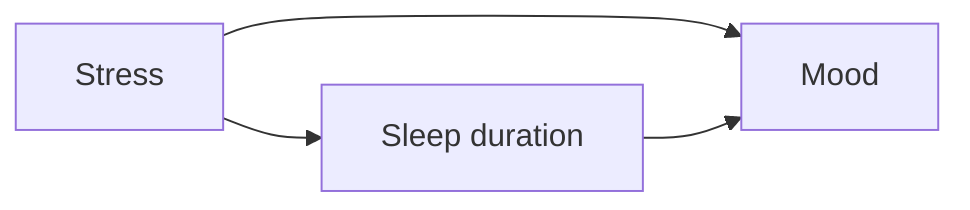

# Phương pháp nghiên cứu — Research Methods / 연구방법론

Một claim tâm lý chỉ có giá trị khoa học khi ta biết nó được tạo ra từ thiết kế nào. Cùng một con số “nhóm A có lo âu (anxiety) cao hơn nhóm B” có thể mang ý nghĩa rất khác nếu dữ liệu đến từ survey tự chọn, longitudinal cohort hay randomized experiment.

## Câu hỏi nghiên cứu quyết định thiết kế

**Descriptive research** mô tả distribution hoặc pattern. Observation, survey và case study hữu ích khi chưa biết phenomenon rõ. **Correlational research** đo covariation giữa variables mà không can thiệp. **Experimental research** chủ động manipulate independent variable và cố giữ các yếu tố khác ổn định để kiểm tra causal effect.

Không có thiết kế nào “cao cấp hơn” trong mọi tình huống. Ta không thể ngẫu nhiên phân người vào nhóm “bị childhood trauma” để thử causal effect; observational design với careful controls và natural experiments khi đó phù hợp hơn. Ngược lại, nếu muốn biết một intervention ngắn có làm tăng recall hay không, randomized experiment thường mạnh.

## Correlation không phải causation — nhưng correlation vẫn quan trọng

Nếu X và Y tương quan, ít nhất có ba hướng giải thích: X→Y, Y→X hoặc Z→{X,Y}. Ngoài ra còn có sai lệch đo lường, hiệu ứng chọn mẫu hoặc ngẫu nhiên. Tương quan có thể rất hữu ích cho dự đoán mà chưa giải quyết quan hệ nhân quả. Trong dự đoán rủi ro lâm sàng, dự đoán chính xác đôi khi vẫn có giá trị thực dụng; nhưng nếu mục tiêu là can thiệp, cấu trúc nhân quả trở nên quan trọng vì thay đổi một biến dự đoán không mang tính nhân quả có thể không làm kết quả thay đổi.

## Randomization, control và confounding

**Random assignment (phân nhóm ngẫu nhiên / 무선할당)** nhằm làm các nhóm tương đương trung bình trước intervention. **Control group** cung cấp counterfactual gần đúng: chuyện gì có thể xảy ra nếu không nhận treatment. **yếu tố gây nhiễu (confounder) (biến nhiễu / 교란변수)** là biến liên quan cả phơi nhiễm (exposure) lẫn outcome, làm ta gán nhầm effect.

Blinding, giả dược (placebo), standardized procedure và đăng ký trước (preregistration) đều là cách giảm những đường mà expectation hoặc researcher degrees of freedom có thể tạo pattern giả. Không một biện pháp nào làm nghiên cứu “hoàn hảo”; mục tiêu là giảm alternative explanations.

## Sampling và generalization

Một result đúng trong sample không tự động đúng cho population khác. **Sampling bias** xảy ra khi sample khác có hệ thống với population ta muốn suy luận. tâm lý học (psychology) từng phụ thuộc nhiều vào WEIRD populations — Western, Educated, Industrialized, Rich, Democratic — nên nhiều hiện tượng cần được kiểm tra xuyên văn hóa (cross-cultural) trước khi gọi là universal.

khả năng khái quát hóa (generalizability) còn phụ thuộc setting. Hành vi trong lab có thể khác workplace, gia đình hay online platform. Field study tăng tính hiệu lực sinh thái (ecological validity) nhưng mất một phần control. Đây là trade-off, không phải lỗi tuyệt đối.

## Longitudinal, cross-sectional và developmental inference

**Cross-sectional** so sánh nhóm ở một thời điểm; nhanh nhưng age effect dễ lẫn cohort effect. **Longitudinal** theo cùng người qua thời gian; mạnh để nghiên cứu change nhưng gặp attrition và practice effects. **Cross-sequential** kết hợp nhiều cohort để tách bớt age và cohort. Xem [Lifespan Development](../03_human_development_and_person/00_lifespan_development.md).

## Qualitative methods có phải “không khoa học”?

Không. Interview, thematic analysis và ethnography trả lời các câu hỏi mà score trung bình không thể trả lời tốt, đặc biệt về meaning, process và context. Chất lượng qualitative research phụ thuộc tính minh bạch (transparency), sampling logic, reflexivity và analytic rigor. Quantitative và qualitative methods giải quyết các loại uncertainty khác nhau và có thể bổ sung nhau trong mixed-method design.

## Causal diagram như một công cụ tư duy



Nếu chỉ đo sleep và mood, ta có thể quan sát correlation. Nhưng stress là plausible yếu tố gây nhiễu. Diagram không chứng minh graph đúng; nó buộc ta nói rõ assumption để biết cần đo gì và điều gì không thể suy ra từ data hiện có.

## mô hình tư duy (mental model)

Hãy hỏi một nghiên cứu bằng ba câu: **Ai được đo? Điều gì thực sự được thao tác hoặc quan sát? Counterfactual nào đang được dùng để suy luận?** Chỉ ba câu này đã loại bỏ phần lớn cách đọc quá mức các headline “study proves…”.


## Từ câu hỏi đời thường tới research question

A useful research question specifies population, variables and relation/intervention. `Social media có hại không?` quá rộng. `Trong adults 18–30, reducing social-media use to ≤30 minutes/day for four weeks có làm depressive symptoms trung bình giảm so với usual use không?` bắt đầu testable hơn.

Cách thao tác hóa (operationalization) rất quan trọng: `sử dụng mạng xã hội` được đo bằng tự báo cáo hay nhật ký thiết bị? `trầm cảm` là chẩn đoán lâm sàng hay điểm bảng hỏi? Những lựa chọn khác nhau thực chất trả lời những câu hỏi khác nhau.

## Descriptive, correlational và experimental designs

**Nghiên cứu mô tả (descriptive research)** mô tả điều đang xảy ra như tỷ lệ phổ biến, hành vi trung bình hoặc mô thức ca. **Nghiên cứu tương quan (correlational research)** đo các biến mà không thao tác phân nhóm, hữu ích cho dự đoán và hình thành giả thuyết. **Thí nghiệm (experiment)** chủ động thay đổi biến độc lập và, khi có thể, dùng phân nhóm ngẫu nhiên để ước lượng tác động nhân quả.

Correlation `r` cannot identify direction or confounding by itself. But “correlation is useless” is also wrong; many important questions cannot ethically randomize, and strong suy luận nhân quả (causal inference) can combine longitudinal, quasi-experimental and natural-experiment evidence.

## Random assignment khác random sampling

**Phân nhóm ngẫu nhiên (random assignment)** phân người tham gia vào các điều kiện nhằm cân bằng biến gây nhiễu về trung bình, qua đó hỗ trợ độ giá trị nội tại. **Lấy mẫu ngẫu nhiên (random sampling)** chọn người từ quần thể nhằm tăng tính đại diện và độ giá trị ngoại tại. Một thí nghiệm trong phòng lab có thể phân nhóm hoàn toàn ngẫu nhiên nhưng vẫn dùng mẫu sinh viên thuận tiện; khi đó ước lượng nhân quả trong mẫu có thể tốt nhưng khả năng khái quát sang quần thể khác vẫn chưa chắc chắn.

## Between-subject và within-subject

Thiết kế giữa các đối tượng (between-subject) so sánh những người khác nhau ở mỗi điều kiện, tránh hiệu ứng mang sang nhưng cần mẫu lớn hơn để vượt qua biến thiên cá nhân. Thiết kế trong cùng đối tượng (within-subject) cho cùng một người trải qua nhiều điều kiện, giúp tăng công suất thống kê nhưng tạo hiệu ứng thứ tự và mang sang; đối trọng thứ tự (counterbalancing) giúp giảm vấn đề này.

## Confound và control

**Biến gây nhiễu (confound)** cùng biến thiên với thao tác và có thể giải thích kết quả. Ví dụ, nếu nhóm trị liệu gặp nhà trị liệu mỗi tuần còn nhóm chứng không nhận gì, cải thiện có thể bao gồm tác động của sự chú ý và kỳ vọng; nhóm chứng chủ động (active control) có thể giúp cô lập cơ chế cụ thể tốt hơn.

Kiểm soát quá mức (overcontrol) cũng là vấn đề: nếu đưa biến trung gian (mediator) vào như biến kiểm soát, ta có thể vô tình loại bỏ một phần tác động nhân quả đang muốn ước lượng. Sơ đồ nhân quả giúp xác định vai trò của từng biến.

## Longitudinal and cross-sectional

Nghiên cứu cắt ngang (cross-sectional) so sánh nhóm tại một thời điểm nên nhanh, nhưng khác biệt tuổi có thể bị lẫn với khác biệt thế hệ. Nghiên cứu dọc (longitudinal) theo cùng một người qua thời gian và cho thấy thay đổi, nhưng dễ gặp mất mẫu và hiệu ứng làm bài lặp lại.

Nghiên cứu phát triển thường dùng thiết kế dọc tăng tốc (accelerated longitudinal design) để cân bằng thời gian theo dõi với độ phủ nhiều thế hệ.

## Quasi-experiments and natural experiments

Khi không thể phân nhóm ngẫu nhiên, nhà nghiên cứu có thể tận dụng thay đổi chính sách, điểm cắt, cú sốc hoặc ghép cặp. Các phương pháp như sai biệt-trong-sai biệt, hồi quy gián đoạn và biến công cụ có thể hỗ trợ suy luận nhân quả dưới những giả định cụ thể. Chúng đòi hỏi nói rõ giả định, chứ không phải “biến phép” dữ liệu quan sát thành thí nghiệm.

## Experience sampling and kiểu hình số (digital phenotyping)

Smartphones allow **đánh giá tức thời trong môi trường tự nhiên (ecological momentary assessment) — EMA**: repeated reports close to real events, reducing retrospective memory bias. Passive sensors produce behavioral traces, but privacy and độ giá trị cấu trúc (construct validity) issues are large. GPS mobility không phải same construct as trầm cảm (depression) even if correlated.

## Qualitative methods

Interview, focus group and thematic analysis answer meaning/process questions that numeric scales may miss. Qualitative research không phải “unscientific because no p-value”; rigor uses transparent sampling, coding, reflexivity and triangulation appropriate to question.

Nghiên cứu phương pháp hỗn hợp (mixed-method) có thể kết hợp mô thức ở cấp quần thể với hiểu biết cơ chế giàu bối cảnh.

## đăng ký trước

đăng ký trước records hypotheses, outcomes and analysis plan before seeing results, helping distinguish confirmatory from exploratory analyses. Exploratory work remains valuable; issue is presenting post-hoc discovery as if predicted in advance.

## Replication

**Tái lập trực tiếp (direct replication)** lặp lại phương pháp càng gần nghiên cứu gốc càng tốt; **tái lập khái niệm (conceptual replication)** kiểm tra cùng khẳng định lý thuyết bằng cách thao tác hóa khác. Tái lập thất bại có thể cho thấy dương tính giả, biến điều tiết ẩn hoặc khác biệt phương pháp. Tiến bộ khoa học đến từ việc giải thích mô thức qua nhiều nghiên cứu, không phải đếm thắng–thua một cách máy móc.

## External độ giá trị

Một hiệu ứng có khái quát qua con người, bối cảnh, kích thích và thời điểm khác nhau hay không? Một hiện tượng ổn định trong mẫu sinh viên đại học Mỹ có thể khác ở môi trường công sở Hàn Quốc; khả năng khái quát là câu hỏi thực nghiệm, không phải giả định mặc định.

## mô hình tư duy

Thiết kế nghiên cứu là cây cầu nối từ câu hỏi đến suy luận:

```text
Question → construct → operationalization → sampling/design
→ measurement → analysis → inference → generalization
```

Mỗi mũi tên trong chuỗi suy luận đều chứa giả định. Khoa học tốt làm những giả định đó trở nên nhìn thấy và có thể kiểm tra.

---

## Từ research design tới causal estimand

Research method không chỉ là chọn `experiment`, `survey` hay `interview`. Với causal question, cần định nghĩa **estimand**: effect nào của intervention nào trên outcome nào, trong population và time horizon nào. Sau đó mới hỏi design có identify được estimand đó không.

Một regression nhiều covariates không tự tạo causal độ giá trị. Việc adjust variable cần dựa trên causal role: yếu tố gây nhiễu, biến trung gian hay biến va chạm (collider). Đây là lý do causal diagrams và counterfactual framework ngày càng quan trọng khi tâm lý học phân tích longitudinal, digital-trace và observational data.

Xem thêm: [[08_causal_inference_and_psychological_evidence]].
