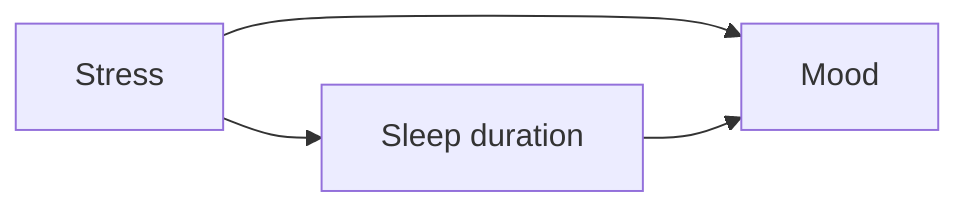

# Phương pháp nghiên cứu — Research Methods / 연구방법론

> **Mạch đọc:** [README](../README.md) là bản đồ owner của **Phương pháp nghiên cứu — Research Methods / 연구방법론**; nhìn vào vị trí đó trước để biết file này đang phục vụ nhánh kiến thức nào. **Câu hỏi nghiên cứu quyết định thiết kế** đặt câu hỏi trung tâm và tiêu chí dùng để đọc các phần sau; sau đó sang **Correlation không phải causation — nhưng correlation vẫn quan trọng** để mở rộng đối tượng sang phạm vi kế cận. Mạch này nối research methods với question, design, measurement và inference, để phương pháp được chọn theo điều cần biết.

Một claim tâm lý chỉ có giá trị khoa học khi ta biết nó được tạo ra từ thiết kế nào. Cùng một con số “nhóm A có lo âu (anxiety) cao hơn nhóm B” có thể mang ý nghĩa rất khác nếu dữ liệu đến từ survey tự chọn, longitudinal cohort hay randomized experiment.

## Câu hỏi nghiên cứu quyết định thiết kế

**Descriptive research** mô tả phân phối (distribution / 분포) hoặc mẫu (pattern / 패턴). Observation, survey và trường hợp (case / 사례) study hữu ích khi chưa biết phenomenon rõ. **Correlational research** đo covariation giữa variables mà không can thiệp. **Experimental research** chủ động manipulate independent variable và cố giữ các yếu tố khác ổn định để kiểm tra nhân quả (causal / 인과적) tác động (effect / 효과).

Không có thiết kế nào “cao cấp hơn” trong mọi tình huống. Ta không thể ngẫu nhiên phân người vào nhóm “bị childhood trauma” để thử nhân quả (causal / 인과적) tác động (effect / 효과); observational thiết kế (design / 설계) với careful controls và natural experiments khi đó phù hợp hơn. Ngược lại, nếu muốn biết một intervention ngắn có làm tăng recall hay không, randomized experiment thường mạnh.

> **Nối mạch:** Trong **Phương pháp nghiên cứu — Research Methods / 연구방법론**, **Correlation không phải causation — nhưng correlation vẫn quan trọng** nối từ **Câu hỏi nghiên cứu quyết định thiết kế** sang **Randomization, điều khiển (control / 제어) và confounding**, vì cơ chế trước tạo đầu vào cho bước sau.

## Correlation không phải causation — nhưng correlation vẫn quan trọng

Nếu X và Y tương quan, ít nhất có ba hướng giải thích: X→Y, Y→X hoặc Z→{X,Y}. Ngoài ra còn có sai lệch đo lường, hiệu ứng chọn mẫu hoặc ngẫu nhiên. Tương quan có thể rất hữu ích cho dự đoán mà chưa giải quyết quan hệ nhân quả. Trong dự đoán rủi ro lâm sàng, dự đoán chính xác đôi khi vẫn có giá trị thực dụng; nhưng nếu mục tiêu là can thiệp, cấu trúc nhân quả trở nên quan trọng vì thay đổi một biến dự đoán không mang tính nhân quả có thể không làm kết quả thay đổi.

> **Nối mạch:** Ở chặng này của **Phương pháp nghiên cứu — Research Methods / 연구방법론**, **Randomization, điều khiển (control / 제어) và confounding** nối từ **Correlation không phải causation — nhưng correlation vẫn quan trọng** sang **Sampling và generalization**, vì cơ chế trước tạo đầu vào cho bước sau.

## Randomization, điều khiển (control / 제어) và confounding

**Random assignment (phân nhóm ngẫu nhiên / 무선할당)** nhằm làm các nhóm tương đương trung bình trước intervention. **điều khiển (control / 제어) group** cung cấp counterfactual gần đúng: chuyện gì có thể xảy ra nếu không nhận treatment. **yếu tố gây nhiễu (confounder) (biến nhiễu / 교란변수)** là biến liên quan cả phơi nhiễm (exposure) lẫn kết quả (outcome / 결과), làm ta gán nhầm tác động (effect / 효과).

Blinding, giả dược (placebo), standardized procedure và đăng ký trước (preregistration) đều là cách giảm những đường mà expectation hoặc researcher degrees of freedom có thể tạo mẫu (pattern / 패턴) giả. Không một biện pháp nào làm nghiên cứu “hoàn hảo”; mục tiêu là giảm alternative explanations.

> **Nối mạch:** Đặt trong câu hỏi lớn của **Phương pháp nghiên cứu — Research Methods / 연구방법론**, **Sampling và generalization** nối từ **Randomization, điều khiển (control / 제어) và confounding** sang **Longitudinal, cross-sectional và developmental suy luận (inference / 추론)**, vì cơ chế trước tạo đầu vào cho bước sau.

## Sampling và generalization

Một kết quả (result / 결과) đúng trong mẫu (sample / 표본) không tự động đúng cho population khác. **Sampling độ lệch (bias / 편향)** xảy ra khi mẫu (sample / 표본) khác có hệ thống với population ta muốn suy luận. tâm lý học (psychology) từng phụ thuộc nhiều vào WEIRD populations — Western, Educated, Industrialized, Rich, Democratic — nên nhiều hiện tượng cần được kiểm tra xuyên văn hóa (cross-cultural) trước khi gọi là universal.

khả năng khái quát hóa (generalizability) còn phụ thuộc setting. Hành vi trong lab có thể khác workplace, gia đình hay online nền tảng (platform / 플랫폼). trường dữ liệu (field / 필드) study tăng tính hiệu lực sinh thái (ecological validity) nhưng mất một phần điều khiển (control / 제어). Đây là sự đánh đổi (trade-off / 트레이드오프), không phải lỗi tuyệt đối.

> **Nối mạch:** Trong **Phương pháp nghiên cứu — Research Methods / 연구방법론**, **Longitudinal, cross-sectional và developmental suy luận (inference / 추론)** nối từ **Sampling và generalization** sang **Qualitative methods có phải “không khoa học”?**, vì cơ chế trước tạo đầu vào cho bước sau.

## Longitudinal, cross-sectional và developmental suy luận (inference / 추론)

**Cross-sectional** so sánh nhóm ở một thời điểm; nhanh nhưng age tác động (effect / 효과) dễ lẫn cohort tác động (effect / 효과). **Longitudinal** theo cùng người qua thời gian; mạnh để nghiên cứu thay đổi (change / 변경) nhưng gặp attrition và practice effects. **Cross-sequential** kết hợp nhiều cohort để tách bớt age và cohort. Xem [Lifespan Development](../03_human_development_and_person/00_lifespan_development.md).

> **Nối mạch:** Ở chặng này của **Phương pháp nghiên cứu — Research Methods / 연구방법론**, **Qualitative methods có phải “không khoa học”?** nối từ **Longitudinal, cross-sectional và developmental suy luận (inference / 추론)** sang **Nhân quả (causal / 인과적) diagram như một công cụ tư duy**, vì cơ chế trước tạo đầu vào cho bước sau.

## Qualitative methods có phải “không khoa học”?

Không. Interview, thematic phân tích (analysis / 분석) và ethnography trả lời các câu hỏi mà score trung bình không thể trả lời tốt, đặc biệt về meaning, tiến trình (process / 프로세스) và ngữ cảnh (context / 맥락). Chất lượng qualitative research phụ thuộc tính minh bạch (transparency), sampling lô-gic (logic / 논리), reflexivity và analytic rigor. Quantitative và qualitative methods giải quyết các loại bất định (uncertainty / 불확실성) khác nhau và có thể bổ sung nhau trong mixed-method thiết kế (design / 설계).

> **Nối mạch:** Đặt trong câu hỏi lớn của **Phương pháp nghiên cứu — Research Methods / 연구방법론**, **Nhân quả (causal / 인과적) diagram như một công cụ tư duy** nối từ **Qualitative methods có phải “không khoa học”?** sang **Mô hình tư duy (mental model / 사고 모델)**, vì cơ chế trước tạo đầu vào cho bước sau.

## Nhân quả (causal / 인과적) diagram như một công cụ tư duy

Phần này chốt mental model thành một chuỗi có thể dùng lại: bối cảnh → cơ chế → bằng chứng → giới hạn → ứng dụng. Hãy đọc sơ đồ như công cụ suy luận, không như một nhãn kết luận tự động.


```mermaid
flowchart LR
    Z[Stress] --> X[Sleep duration]
    Z --> Y[Mood]
    X --> Y
```

Nếu chỉ đo sleep và mood, ta có thể quan sát correlation. Nhưng stress là plausible yếu tố gây nhiễu. Diagram không chứng minh đồ thị (graph / 그래프) đúng; nó buộc ta nói rõ giả định (assumption / 가정) để biết cần đo gì và điều gì không thể suy ra từ dữ liệu (data / 데이터) hiện có.

> **Nối mạch:** Trong **Phương pháp nghiên cứu — Research Methods / 연구방법론**, **Mô hình tư duy (mental model / 사고 모델)** tổng hợp từ **Nhân quả (causal / 인과적) diagram như một công cụ tư duy** thành một kết luận có thể mang sang phần kế tiếp. Từ đây, **Từ câu hỏi đời thường tới research question** mở rộng hệ quả hoặc giới hạn liên quan.

## Mô hình tư duy (mental model / 사고 모델)

Hãy hỏi một nghiên cứu bằng ba câu: **Ai được đo? Điều gì thực sự được thao tác hoặc quan sát? Counterfactual nào đang được dùng để suy luận?** Chỉ ba câu này đã loại bỏ phần lớn cách đọc quá mức các headline “study proves…”.

> **Nối mạch:** Ở chặng này của **Phương pháp nghiên cứu — Research Methods / 연구방법론**, **Từ câu hỏi đời thường tới research question** tổng hợp từ **Mô hình tư duy (mental model / 사고 모델)** thành một kết luận có thể mang sang phần kế tiếp. Từ đây, **Descriptive, correlational và experimental designs** mở rộng hệ quả hoặc giới hạn liên quan.

## Từ câu hỏi đời thường tới research question

A useful research question specifies population, variables and quan hệ (relation / 관계)/intervention. `Social media có hại không?` quá rộng. `Trong adults 18–30, reducing social-media use to ≤30 minutes/day for four weeks có làm depressive symptoms trung bình giảm so với usual use không?` bắt đầu testable hơn.

Cách thao tác hóa (operationalization) rất quan trọng: `sử dụng mạng xã hội` được đo bằng tự báo cáo hay nhật ký thiết bị? `trầm cảm` là chẩn đoán lâm sàng hay điểm bảng hỏi? Những lựa chọn khác nhau thực chất trả lời những câu hỏi khác nhau.

> **Nối mạch:** Đặt trong câu hỏi lớn của **Phương pháp nghiên cứu — Research Methods / 연구방법론**, **Descriptive, correlational và experimental designs** nối từ **Từ câu hỏi đời thường tới research question** sang **Random assignment khác random sampling**, vì cơ chế trước tạo đầu vào cho bước sau.

## Descriptive, correlational và experimental designs

**Nghiên cứu mô tả (descriptive research)** mô tả điều đang xảy ra như tỷ lệ phổ biến, hành vi trung bình hoặc mô thức ca. **Nghiên cứu tương quan (correlational research)** đo các biến mà không thao tác phân nhóm, hữu ích cho dự đoán và hình thành giả thuyết. **Thí nghiệm (experiment)** chủ động thay đổi biến độc lập và, khi có thể, dùng phân nhóm ngẫu nhiên để ước lượng tác động nhân quả.

Correlation `r` cannot identify direction or confounding by itself. But “correlation is useless” is also wrong; many important questions cannot ethically randomize, and strong suy luận nhân quả (causal inference) can combine longitudinal, quasi-experimental and natural-experiment bằng chứng (evidence / 증거).

> **Nối mạch:** Trong **Phương pháp nghiên cứu — Research Methods / 연구방법론**, **Random assignment khác random sampling** nối từ **Descriptive, correlational và experimental designs** sang **Between-subject và within-subject**, vì cơ chế trước tạo đầu vào cho bước sau.

## Random assignment khác random sampling

**Phân nhóm ngẫu nhiên (random assignment)** phân người tham gia vào các điều kiện nhằm cân bằng biến gây nhiễu về trung bình, qua đó hỗ trợ độ giá trị nội tại. **Lấy mẫu ngẫu nhiên (random sampling)** chọn người từ quần thể nhằm tăng tính đại diện và độ giá trị ngoại tại. Một thí nghiệm trong phòng lab có thể phân nhóm hoàn toàn ngẫu nhiên nhưng vẫn dùng mẫu sinh viên thuận tiện; khi đó ước lượng nhân quả trong mẫu có thể tốt nhưng khả năng khái quát sang quần thể khác vẫn chưa chắc chắn.

> **Nối mạch:** Ở chặng này của **Phương pháp nghiên cứu — Research Methods / 연구방법론**, **Between-subject và within-subject** nối từ **Random assignment khác random sampling** sang **Confound và điều khiển (control / 제어)**, vì cơ chế trước tạo đầu vào cho bước sau.

## Between-subject và within-subject

Thiết kế giữa các đối tượng (between-subject) so sánh những người khác nhau ở mỗi điều kiện, tránh hiệu ứng mang sang nhưng cần mẫu lớn hơn để vượt qua biến thiên cá nhân. Thiết kế trong cùng đối tượng (within-subject) cho cùng một người trải qua nhiều điều kiện, giúp tăng công suất thống kê nhưng tạo hiệu ứng thứ tự và mang sang; đối trọng thứ tự (counterbalancing) giúp giảm vấn đề này.

> **Nối mạch:** Đặt trong câu hỏi lớn của **Phương pháp nghiên cứu — Research Methods / 연구방법론**, **Confound và điều khiển (control / 제어)** nối từ **Between-subject và within-subject** sang **Longitudinal and cross-sectional**, vì cơ chế trước tạo đầu vào cho bước sau.

## Confound và điều khiển (control / 제어)

**Biến gây nhiễu (confound)** cùng biến thiên với thao tác và có thể giải thích kết quả. Ví dụ, nếu nhóm trị liệu gặp nhà trị liệu mỗi tuần còn nhóm chứng không nhận gì, cải thiện có thể bao gồm tác động của sự chú ý và kỳ vọng; nhóm chứng chủ động (active control) có thể giúp cô lập cơ chế cụ thể tốt hơn.

Kiểm soát quá mức (overcontrol) cũng là vấn đề: nếu đưa biến trung gian (mediator) vào như biến kiểm soát, ta có thể vô tình loại bỏ một phần tác động nhân quả đang muốn ước lượng. Sơ đồ nhân quả giúp xác định vai trò của từng biến.

> **Nối mạch:** Trong **Phương pháp nghiên cứu — Research Methods / 연구방법론**, **Longitudinal and cross-sectional** nối từ **Confound và điều khiển (control / 제어)** sang **Quasi-experiments and natural experiments**, vì cơ chế trước tạo đầu vào cho bước sau.

## Longitudinal and cross-sectional

Nghiên cứu cắt ngang (cross-sectional) so sánh nhóm tại một thời điểm nên nhanh, nhưng khác biệt tuổi có thể bị lẫn với khác biệt thế hệ. Nghiên cứu dọc (longitudinal) theo cùng một người qua thời gian và cho thấy thay đổi, nhưng dễ gặp mất mẫu và hiệu ứng làm bài lặp lại.

Nghiên cứu phát triển thường dùng thiết kế dọc tăng tốc (accelerated longitudinal design) để cân bằng thời gian theo dõi với độ phủ nhiều thế hệ.

> **Nối mạch:** Ở chặng này của **Phương pháp nghiên cứu — Research Methods / 연구방법론**, **Quasi-experiments and natural experiments** nối từ **Longitudinal and cross-sectional** sang **Experience sampling and kiểu hình số (digital phenotyping)**, vì cơ chế trước tạo đầu vào cho bước sau.

## Quasi-experiments and natural experiments

Khi không thể phân nhóm ngẫu nhiên, nhà nghiên cứu có thể tận dụng thay đổi chính sách, điểm cắt, cú sốc hoặc ghép cặp. Các phương pháp như sai biệt-trong-sai biệt, hồi quy gián đoạn và biến công cụ có thể hỗ trợ suy luận nhân quả dưới những giả định cụ thể. Chúng đòi hỏi nói rõ giả định, chứ không phải “biến phép” dữ liệu quan sát thành thí nghiệm.

> **Nối mạch:** Đặt trong câu hỏi lớn của **Phương pháp nghiên cứu — Research Methods / 연구방법론**, **Experience sampling and kiểu hình số (digital phenotyping)** nối từ **Quasi-experiments and natural experiments** sang **Qualitative methods**, vì cơ chế trước tạo đầu vào cho bước sau.

## Experience sampling and kiểu hình số (digital phenotyping)

Smartphones allow **đánh giá tức thời trong môi trường tự nhiên (ecological momentary assessment) — EMA**: repeated reports close to real events, reducing retrospective bộ nhớ (memory / 메모리) độ lệch (bias / 편향). Passive sensors produce behavioral traces, but privacy and độ giá trị cấu trúc (construct validity) issues are large. GPS mobility không phải same construct as trầm cảm (depression) even if correlated.

> **Nối mạch:** Trong **Phương pháp nghiên cứu — Research Methods / 연구방법론**, **Qualitative methods** nối từ **Experience sampling and kiểu hình số (digital phenotyping)** sang **đăng ký trước**, vì cơ chế trước tạo đầu vào cho bước sau.

## Qualitative methods

Interview, focus group and thematic phân tích (analysis / 분석) answer meaning/tiến trình (process / 프로세스) questions that numeric scales may miss. Qualitative research không phải “unscientific because no p-value”; rigor uses transparent sampling, coding, reflexivity and triangulation appropriate to question.

Nghiên cứu phương pháp hỗn hợp (mixed-method) có thể kết hợp mô thức ở cấp quần thể với hiểu biết cơ chế giàu bối cảnh.

> **Nối mạch:** Ở chặng này của **Phương pháp nghiên cứu — Research Methods / 연구방법론**, **đăng ký trước** nối từ **Qualitative methods** sang **Replication**, vì cơ chế trước tạo đầu vào cho bước sau.

## đăng ký trước

đăng ký trước records hypotheses, outcomes and phân tích (analysis / 분석) plan before seeing results, helping distinguish confirmatory from exploratory analyses. Exploratory công việc (work / 작업) remains valuable; issue is presenting post-hoc discovery as if predicted in advance.

> **Nối mạch:** Đặt trong câu hỏi lớn của **Phương pháp nghiên cứu — Research Methods / 연구방법론**, **Replication** nối từ **đăng ký trước** sang **Bên ngoài (external / 외부) độ giá trị**, vì cơ chế trước tạo đầu vào cho bước sau.

## Replication

**Tái lập trực tiếp (direct replication)** lặp lại phương pháp càng gần nghiên cứu gốc càng tốt; **tái lập khái niệm (conceptual replication)** kiểm tra cùng khẳng định lý thuyết bằng cách thao tác hóa khác. Tái lập thất bại có thể cho thấy dương tính giả, biến điều tiết ẩn hoặc khác biệt phương pháp. Tiến bộ khoa học đến từ việc giải thích mô thức qua nhiều nghiên cứu, không phải đếm thắng–thua một cách máy móc.

> **Nối mạch:** Trong **Phương pháp nghiên cứu — Research Methods / 연구방법론**, **Bên ngoài (external / 외부) độ giá trị** nối từ **Replication** sang **mô hình tư duy**, vì cơ chế trước tạo đầu vào cho bước sau.

## Bên ngoài (external / 외부) độ giá trị

Một hiệu ứng có khái quát qua con người, bối cảnh, kích thích và thời điểm khác nhau hay không? Một hiện tượng ổn định trong mẫu sinh viên đại học Mỹ có thể khác ở môi trường công sở Hàn Quốc; khả năng khái quát là câu hỏi thực nghiệm, không phải giả định mặc định.

> **Nối mạch:** Ở chặng này của **Phương pháp nghiên cứu — Research Methods / 연구방법론**, **mô hình tư duy** tổng hợp từ **Bên ngoài (external / 외부) độ giá trị** thành một kết luận có thể mang sang phần kế tiếp. Từ đây, **Từ research thiết kế (design / 설계) tới nhân quả (causal / 인과적) estimand** mở rộng hệ quả hoặc giới hạn liên quan.

## mô hình tư duy

Thiết kế nghiên cứu là cây cầu nối từ câu hỏi đến suy luận:

```text
Question → construct → operationalization → sampling/design
→ measurement → analysis → inference → generalization
```

Mỗi mũi tên trong chuỗi suy luận đều chứa giả định. Khoa học tốt làm những giả định đó trở nên nhìn thấy và có thể kiểm tra.

---

> **Nối mạch:** Đặt trong câu hỏi lớn của **Phương pháp nghiên cứu — Research Methods / 연구방법론**, **Từ research thiết kế (design / 설계) tới nhân quả (causal / 인과적) estimand** tổng hợp từ **mô hình tư duy** thành một kết luận có thể mang sang phần kế tiếp. Mục này khép mạch bằng cách nối kết quả với phạm vi của chapter.

## Từ research thiết kế (design / 설계) tới nhân quả (causal / 인과적) estimand

Research phương thức (method / 메서드) không chỉ là chọn `experiment`, `survey` hay `interview`. Với nhân quả (causal / 인과적) question, cần định nghĩa **estimand**: tác động (effect / 효과) nào của intervention nào trên kết quả (outcome / 결과) nào, trong population và thời gian (time / 시간) horizon nào. Sau đó mới hỏi thiết kế (design / 설계) có identify được estimand đó không.

Một regression nhiều covariates không tự tạo nhân quả (causal / 인과적) độ giá trị. Việc adjust variable cần dựa trên nhân quả (causal / 인과적) role: yếu tố gây nhiễu, biến trung gian hay biến va chạm (collider). Đây là lý do nhân quả (causal / 인과적) diagrams và counterfactual khung phần mềm (framework / 프레임워크) ngày càng quan trọng khi tâm lý học phân tích longitudinal, digital-trace và observational dữ liệu (data / 데이터).

Xem thêm: [[08_causal_inference_and_psychological_evidence]].

> **Bàn giao:** Sau **Từ research thiết kế (design / 설계) tới nhân quả (causal / 인과적) estimand**, hãy giữ lại kết luận và ranh giới của mục này; quay về [README](../README.md) khi cần định vị owner hoặc chọn nhánh học tiếp theo.
