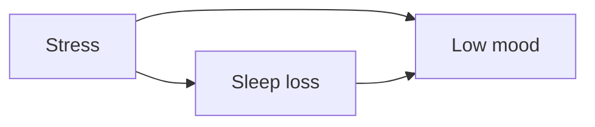

# suy luận nhân quả (causal inference) và cách đọc bằng chứng tâm lý học

Trong tâm lý học, câu hỏi khó nhất thường không phải “hai biến có liên quan không?” mà là **“nếu ta thay đổi X, điều gì sẽ xảy ra với Y?”**. Đó là câu hỏi về **suy luận nhân quả (suy luận nhân quả / 인과추론)**. Một correlation có thể hữu ích để dự đoán, nhưng nếu mục tiêu là can thiệp — thay đổi cách học, giảm stress, thiết kế workplace, điều trị triệu chứng hay đánh giá tác động của mạng xã hội (social media) — thì association đơn thuần chưa đủ.

Ví dụ, người ngủ ít thường báo cáo mood xấu hơn. Nhưng từ association đó ta chưa biết toàn bộ effect của sleep loss lên mood, vì stress có thể vừa làm giảm sleep vừa làm xấu mood; trầm cảm (depression) có thể làm thay đổi sleep; medication hoặc shift work có thể ảnh hưởng cả hai. Causal reasoning bắt buộc ta chuyển từ câu “X đi cùng Y” sang một model rõ hơn về **thời gian, cơ chế và những nguyên nhân chung**.

Xem thêm: [[02_research_methods]], [[03_measurement_statistics]], [[06_open_science_and_evidence_evaluation]], [[../02_learning_and_cognition/08_decision_under_risk_uncertainty_and_ambiguity]].

---

## 1. Causal question khác prediction question như thế nào?

Một model dự đoán tốt không nhất thiết là một model nhân quả tốt. Nếu ta muốn dự đoán ai có khả năng bỏ học, attendance, prior grades và commuting distance có thể đủ hữu ích. Nhưng nếu muốn biết **“tăng attendance bằng policy có làm grades tăng không?”**, ta cần biết attendance là cause, biến trung gian (mediator), proxy hay chỉ marker cho một cấu trúc khác như motivation, illness hoặc socioeconomic constraint.

Prediction hỏi:

> Khi thấy X, Y thường là gì?

suy luận nhân quả hỏi:

> Nếu cùng một hệ thống có thể tồn tại ở hai trạng thái khác nhau — có intervention X và không có intervention X — outcome sẽ khác bao nhiêu?

Đây là ý tưởng **counterfactual (phản thực / 반사실)**. Với cùng một người, ta không thể đồng thời quan sát “đã nhận intervention” và “không nhận intervention” tại cùng thời điểm. Vì vậy mọi causal estimate đều dựa trên design và assumption để tái tạo comparison hợp lý.

---

## 2. Potential outcomes: effect là một contrast, không phải property cố định

Giả sử `Y(1)` là outcome nếu một người nhận intervention, còn `Y(0)` là outcome nếu người đó không nhận. Individual causal effect về lý thuyết là:

\[
Y(1)-Y(0)
\]

Nhưng ta chỉ quan sát một trong hai. Vì vậy research thường ước lượng **average treatment effect (ATE)** trên population:

\[
ATE = E[Y(1)-Y(0)]
\]

Điểm quan trọng là effect luôn phụ thuộc population, intervention definition, timing và context. “CBT có kích thước hiệu ứng (effect size) X”, “sleep có effect Y” hay “phong cách nuôi dạy con (parenting style) có effect Z” không phải hằng số phổ quát. Treatment version, baseline severity, measurement và follow-up có thể đổi estimate.

---

## 3. Randomization giải quyết điều gì?

Trong một **thử nghiệm đối chứng ngẫu nhiên (randomized controlled trial) (RCT / 무작위 대조시험)**, assignment ngẫu nhiên làm cho treatment group và control group, về kỳ vọng, cân bằng ở cả measured và unmeasured pre-treatment causes. Nhờ đó difference sau intervention có thể được gán cho treatment với ít assumption hơn observational design.

Randomization không tự giải quyết mọi vấn đề. Attrition, nonadherence, treatment contamination, measurement bias và selective reporting vẫn có thể làm estimate lệch. Một RCT nhỏ trên population đặc thù cũng có thể có **internal độ giá trị (validity)** tốt nhưng **external độ giá trị** hạn chế.

Vì vậy “RCT > mọi loại evidence” là mô hình tư duy (mental model) quá thô. Cần hỏi RCT đang trả lời causal contrast nào, population nào và outcome nào.

---

## 4. DAG: biến một câu chuyện nhân quả thành sơ đồ có thể kiểm tra

**Directed Acyclic Graph (DAG / 방향성 비순환 그래프)** là cách biểu diễn causal assumptions bằng node và arrow. Arrow `A → B` có nghĩa model giả định A có causal effect lên B.

Ví dụ:



Nếu muốn estimate effect của sleep loss lên mood, stress là **yếu tố gây nhiễu (confounder) (yếu tố nhiễu / 교란변수)** vì nó là common cause của cả phơi nhiễm (exposure) và outcome. Không xử lý stress có thể khiến association giữa sleep và mood trộn effect của sleep với effect của stress.

DAG không “khám phá sự thật” chỉ bằng việc vẽ. Nó là một **bản khai assumptions**. Hai researchers có thể vẽ hai DAG khác nhau; disagreement trở nên hữu ích vì assumption được lộ ra thay vì ẩn trong regression model.

---

## 5. yếu tố gây nhiễu, biến trung gian và biến va chạm (collider) không thể phân biệt chỉ bằng correlation

Ba loại variable này thường bị trộn lẫn vì đều có thể liên quan thống kê với X và Y.

### yếu tố gây nhiễu

```text
C → X
C → Y
```

`C` là common cause. Ta thường cần block backdoor path do C tạo ra để estimate causal effect của X lên Y.

### biến trung gian

```text
X → M → Y
```

`M` là một phần của mechanism. Nếu mục tiêu là **total effect** của X lên Y, control M có thể loại bỏ chính phần effect ta muốn đo. Nếu mục tiêu là direct effect, câu hỏi lại khác và cần assumptions bổ sung.

### biến va chạm

```text
X → C ← Y
```

biến va chạm là common consequence. Khi không condition lên C, path này bị block. Nhưng nếu ta select sample theo C hoặc đưa C vào model, ta có thể tạo association giả giữa X và Y.

Đây là lý do rule “hãy control càng nhiều variables càng tốt” là sai. Adjustment phải dựa trên causal structure, không dựa trên số lượng biến có sẵn.

---

## 6. biến va chạm bias trong đời sống: ví dụ tuyển chọn

Giả sử performance trong một chương trình tuyển dụng phụ thuộc cả cognitive skill lẫn networking skill. Nếu chỉ quan sát những người đã được tuyển, ta đã condition lên một biến va chạm: selection. Trong selected sample, người có cognitive skill thấp có thể chỉ vào được vì networking skill rất cao và ngược lại. Điều này có thể tạo correlation âm giữa hai skill dù trong population hai skill không đối nghịch.

Tương tự, clinical samples, elite schools, online communities và “chỉ những người còn dùng app sau 6 tháng” đều là selection mechanisms có thể tạo association không tồn tại trong population gốc.

---

## 7. nhân quả ngược (reverse causation): thời gian không chỉ là chi tiết kỹ thuật

Nếu mạng xã hội use liên quan trầm cảm, có ít nhất ba possibility:

```text
Social media use → depressive symptoms
Depressive symptoms → social media use
Third causes → both
```

Cross-sectional survey đo cả hai cùng lúc thường không tách được ba đường này. Longitudinal data tốt hơn cho temporal ordering nhưng vẫn không tự động giải quyết confounding. Repeated measures cũng có thể bị time-varying confounders và feedback loops.

Trong tâm lý học (psychology), rất nhiều constructs tương tác theo vòng lặp: stress làm mất ngủ, mất ngủ làm điều chỉnh cảm xúc (emotion regulation) kém, regulation kém làm conflict tăng, conflict lại tăng stress. DAG có thể biểu diễn vòng lặp bằng cách tách variable theo thời điểm `t1`, `t2`, `t3` thay vì dùng một node duy nhất.

---

## 8. Mediation: “cơ chế” là một causal claim mạnh

Research thường viết rằng niềm tin vào năng lực bản thân (self-efficacy) “mediates” effect của intervention lên performance. Nhưng một regression mediation `X → M → Y` không tự chứng minh mechanism. Nếu có unmeasured causes của M và Y, mediation estimate có thể bias.

Một causal mediation analysis cần assumptions rõ về confounding giữa treatment–biến trung gian, biến trung gian–outcome và treatment–outcome. Khi treatment randomized nhưng biến trung gian không randomized, phần biến trung gian vẫn có thể chịu confounding.

Vì vậy cách diễn đạt thận trọng hơn là phân biệt:

- **statistical mediation:** pattern dữ liệu phù hợp với indirect pathway;
- **causal mediation:** evidence và assumptions đủ mạnh để diễn giải pathway như mechanism.

---

## 9. Moderation không giống mediation

**Moderator (biến điều tiết / 조절변수)** trả lời “effect khác nhau ở ai hoặc trong context nào?”. Ví dụ intervention có thể hiệu quả hơn khi baseline severity cao. **biến trung gian (매개변수)** hỏi “effect đi qua cơ chế nào?”.

Một variable có thể là moderator trong một question và biến trung gian trong question khác. Labels không phải bản chất cố định của variable; chúng phụ thuộc causal question.

---

## 10. Natural experiments và quasi-experiments

Không phải causal question nào cũng có thể randomized. Ta không thể randomize childhood adversity, poverty hay natural disaster. Khi đó researchers dùng **quasi-experimental designs** như regression discontinuity, interrupted time series, difference-in-differences, instrumental variables hoặc policy shocks.

Điểm chung là chúng cố tạo một comparison có logic counterfactual mạnh hơn simple observation. Mỗi design có assumption riêng; ví dụ difference-in-differences cần một dạng **parallel trends assumption**, còn instrumental variable cần instrument ảnh hưởng outcome chủ yếu qua phơi nhiễm theo cách model quy định.

Không có magic method “biến observational data thành RCT”. suy luận nhân quả là quá trình làm assumptions explicit và kiểm tra sensitivity của conclusion với assumptions đó.

---

## 11. Measurement error cũng là causal problem

Nếu stress được đo bằng questionnaire kém độ tin cậy (reliability) hoặc sleep được đo bằng self-report rất thô, causal estimate có thể attenuation hoặc bias theo hướng khó dự đoán. Nếu measurement error khác nhau giữa groups, bias còn phức tạp hơn.

Điều này nối suy luận nhân quả với tâm trắc học (psychometrics): **không thể suy luận causal tốt hơn chất lượng measurement của variables cốt lõi**.

Xem thêm: [[05_psychometrics_and_test_interpretation]], [[07_ecological_momentary_assessment_and_real_world_measurement]].

---

## 12. Prediction model có thể dùng biến “sai nhân quả” nhưng causal model thì không

Một machine-learning model dự đoán tái diễn kéo dài (relapse) có thể dùng bất kỳ feature nào cải thiện out-of-sample prediction, kể cả variable là hậu quả của tái diễn kéo dài risk. Nhưng nếu muốn can thiệp vào feature đó để giảm tái diễn kéo dài, ta cần biết feature có causal leverage hay chỉ là marker.

Ví dụ số lần mở mental-health app có thể dự đoán symptom severity. Giảm số lần mở app bằng cách khóa app không nhất thiết giảm symptoms, vì app use có thể là response đối với symptoms.

Đây là distinction quan trọng khi AI/ML được dùng trong behavioral science: **predictive importance ≠ causal importance**.

---

## 13. Một workflow thực tế cho causal reasoning

Trước một claim “X gây Y”, hãy thực hiện theo thứ tự:

1. Viết causal question cụ thể: intervention nào, outcome nào, population nào, time horizon nào.
2. Xác định temporal order.
3. Vẽ DAG từ domain knowledge.
4. Tìm common causes, mediators, colliders và selection mechanisms.
5. Chọn design phù hợp trước khi chọn statistical model.
6. Chỉ adjust variables cần thiết cho estimand.
7. Kiểm tra measurement quality, missingness và attrition.
8. Thực hiện robustness/sensitivity analysis nếu có unmeasured confounding hợp lý.
9. Phân biệt estimate từ interpretation.
10. Hỏi external độ giá trị: effect có thể thay đổi ở population khác không?

Workflow này quan trọng hơn việc thuộc tên một phương pháp statistical cụ thể.

---

## 14. Ví dụ: “dùng điện thoại trước ngủ làm ngủ kém”

Một analysis đơn giản có thể thấy screen use trước ngủ liên quan short sleep. Nhưng causal model cần hỏi thêm:

- Người insomnia có cầm điện thoại nhiều hơn vì không ngủ được không?
- căng thẳng công việc (work stress) có vừa tăng late-night phone use vừa làm khó ngủ không?
- Bright light, stimulating content và time displacement có phải các biến trung gian khác nhau không?
- Chronotype có modify effect không?
- “Phone use” được đo bằng self-report hay device log?

Nếu intervention là “không dùng phone 60 phút trước ngủ”, causal contrast khác với “giảm blue light” hay “không xem mạng xã hội”. Causal question càng mơ hồ thì effect estimate càng khó diễn giải.

---

## mô hình tư duy: association là dấu vết, causation là mô hình về can thiệp

Hãy coi correlation như một **dấu vết** cho thấy hai phần của system đi cùng nhau. suy luận nhân quả hỏi: **nếu ta chạm vào một phần của system, phần khác sẽ đổi thế nào?**. Để trả lời, cần biết structure của system, không chỉ pattern trong dataset.

---

## những hiểu lầm phổ biến (common misconceptions)

**“Correlation không bao giờ hữu ích.”** Sai. Correlation rất hữu ích cho description, prediction, screening và hypothesis generation. Vấn đề là dùng nó để trả lời causal question mà không có causal design.

**“Control nhiều biến hơn luôn tốt hơn.”** Sai. Control biến trung gian có thể loại bỏ effect thật; control biến va chạm có thể tạo bias mới.

**“Longitudinal study chứng minh causation.”** Không. Temporal order giúp nhưng confounding và selection vẫn tồn tại.

**“Randomized trial luôn generalize.”** Không. Randomization tăng internal độ giá trị cho sample/design cụ thể, không tự đảm bảo external độ giá trị.

**“DAG là bằng chứng.”** Không. DAG là formalized assumption structure; evidence vẫn cần design, data và subject-matter knowledge.

---

## Research anchors

- Bulbulia, J. A. (2024). *Methods in suy luận nhân quả. Part 1: causal diagrams and confounding*. Evolutionary Human Sciences, 6, e40. DOI: `10.1017/ehs.2024.35`.
- Hernán, M. A., & Robins, J. M. suy luận nhân quả framework và target-trial thinking.
- Pearl, J. Causal diagrams, d-separation và structural causal models.
- Potential-outcomes tradition từ Neyman–Rubin, cùng các extensions cho longitudinal treatments.

Các framework này không thay domain knowledge. Chúng buộc researcher nói rõ assumption nào đang biến association thành causal interpretation.
